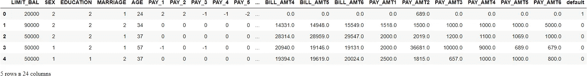

# 🚀PyCaret 二元分类简介

> 原文：<https://towardsdatascience.com/introduction-to-binary-classification-with-pycaret-a37b3e89ad8d?source=collection_archive---------4----------------------->

## 使用 PyCaret 的 Python 二进制分类的循序渐进的初学者友好教程


在 [Unsplash](https://unsplash.com?utm_source=medium&utm_medium=referral) 上由[麦克 U](https://unsplash.com/@roguewild?utm_source=medium&utm_medium=referral) 拍摄的照片

# 1.0 简介

[PyCaret](https://www.pycaret.org) 是一个用 Python 编写的开源、低代码的机器学习库，可以自动化机器学习工作流。这是一个端到端的机器学习和模型管理工具，可以成倍地加快实验周期，提高您的工作效率。

与其他开源机器学习库相比，PyCaret 是一个替代的低代码库，可以用来用几行代码替换数百行代码。这使得实验快速有效。PyCaret 本质上是几个机器学习库和框架的 Python 包装器，比如 scikit-learn、XGBoost、LightGBM、CatBoost、spaCy、Optuna、Hyperopt、Ray 等等。

PyCaret 的设计和简单性受到了公民数据科学家这一新兴角色的启发，这是 Gartner 首先使用的术语。公民数据科学家是超级用户，他们可以执行简单和中等复杂的分析任务，这些任务在以前需要更多的技术专业知识。

想了解更多关于 PyCaret 的信息，可以查看官方[网站](https://www.pycaret.org/)或者 [GitHub](https://www.github.com/pycaret/pycaret) 。

# 2.0 教程目标

在本教程中，我们将学习:

*   **获取数据:**如何从 PyCaret 存储库中导入数据
*   **设置环境:**如何在 PyCaret 中设置实验并开始构建分类模型
*   **创建模型:**如何创建模型、执行分层交叉验证和评估分类指标
*   **调整模型:**如何自动调整分类模型的超参数
*   **绘图模型:**如何使用各种绘图分析模型性能
*   **敲定模型:**如何在实验结束时敲定最佳模型
*   **预测模型:**如何对看不见的数据进行预测
*   **保存/加载模型:**如何保存/加载模型以备将来使用

# 3.0 安装 PyCaret

安装很容易，只需几分钟。PyCaret 从 pip 的默认安装只安装在 [requirements.txt](https://github.com/pycaret/pycaret/blob/master/requirements.txt) 文件中列出的硬依赖项。

```
pip install pycaret
```

要安装完整版:

```
pip install pycaret[full] 
```

# 4.0 什么是二进制分类？

二元分类是一种受监督的机器学习技术，其目标是预测离散且无序的分类标签，例如通过/失败、肯定/否定、默认/非默认等。下面列出了一些分类的真实使用案例:

*   确定患者是否患有某种疾病的医学测试——分类属性是疾病的存在。
*   工厂中的“通过或失败”测试方法或质量控制，即决定是否符合规格——通过/不通过分类。
*   信息检索，即决定一个页面或一篇文章是否应该出现在搜索结果集中——分类属性是文章的相关性或对用户的有用性。

# 5.0 py caret 中分类模块的概述

PyCaret 的[分类模块](https://pycaret.readthedocs.io/en/latest/api/classification.html) ( `pycaret.classification`)是一个受监督的机器学习模块，用于根据各种技术和算法将元素分类到二进制组中。分类问题的一些常见用例包括预测客户违约(是或否)、客户流失(客户将离开或留下)、发现疾病(阳性或阴性)。

PyCaret 分类模块可用于二进制或多类分类问题。它有超过 18 个算法和 14 个图来分析模型的性能。无论是超参数调整、集成，还是堆叠等高级技术，PyCaret 的分类模块都具备。

# 教程的 6.0 数据集

对于本教程，我们将使用一个来自 UCI 的数据集，名为 [**信用卡客户数据集**](https://archive.ics.uci.edu/ml/datasets/default+of+credit+card+clients) 的默认值。此数据集包含从 2005 年 4 月到 2005 年 9 月台湾信用卡客户的违约付款、人口统计因素、信用数据、付款历史和账单等信息。有 24，000 个样本和 25 个特征。每列的简短描述如下:

*   **ID:** 每个客户端的 ID
*   **LIMIT_BAL:** 以新台币为单位的给定额度(包括个人和家庭/补充额度)
*   **性别:**性别(1 =男性，2 =女性)
*   **学历:**(1 =研究生院，2 =大学，3 =高中，4 =其他，5 =未知，6 =未知)
*   **婚姻:**婚姻状况(1 =已婚，2 =单身，3 =其他)
*   **年龄:**以年为单位的年龄
*   **PAY_0 至 PAY _ 6:**n 个月前的还款状态(PAY_0 =上月… PAY_6 = 6 个月前)(标签:-1 =按时还款，1 =延迟一个月还款，2 =延迟两个月还款，…8 =延迟八个月还款，9 =延迟九个月及以上还款)
*   **BILL_AMT1 至 BILL _ AMT 6:**n 个月前的对账单金额(BILL_AMT1 = last_month..BILL_AMT6 = 6 个月前)
*   **PAY _ am t1 to PAY _ AMT 6:**n 个月前的付款金额(BILL_AMT1 = last_month..BILL_AMT6 = 6 个月前)
*   **违约:**违约付款(1 =是，0 =否)`Target Column`

## 数据集确认:

利奇曼(2013 年)。UCI 机器学习知识库。加州欧文:加州大学信息与计算机科学学院。

# 7.0 获取数据

您可以从这里找到的原始数据源<https://archive.ics.uci.edu/ml/datasets/default+of+credit+card+clients>**下载数据，并使用 pandas [**(了解如何使用)**](https://pandas.pydata.org/pandas-docs/stable/reference/api/pandas.read_csv.html) 加载数据，或者您可以使用 PyCaret 的数据存储库，使用`get_data()`函数加载数据(这将需要互联网连接)。**

```
**# loading the dataset** from pycaret.datasets import get_data
dataset = get_data('credit')
```

****

```
**# check the shape of data** dataset.shape>>> (24000, 24)
```

**为了演示对看不见的数据使用`predict_model`函数，从原始数据集中保留了 1200 条记录的样本(约 5%)，用于最终的预测。这不应该与训练-测试-分割相混淆，因为这种特定的分割是为了模拟真实场景而执行的。另一种思考方式是，在训练机器学习模型时，这 1200 个客户是不可用的。**

```
**# sample 5% of data to be used as unseen data**
data = dataset.sample(frac=0.95, random_state=786)
data_unseen = dataset.drop(data.index)
data.reset_index(inplace=True, drop=True)
data_unseen.reset_index(inplace=True, drop=True)**# print the revised shape** print('Data for Modeling: ' + str(data.shape))
print('Unseen Data For Predictions: ' + str(data_unseen.shape))>>> Data for Modeling: (22800, 24)
>>> Unseen Data For Predictions: (1200, 24)
```

# **8.0 在 PyCaret 中设置环境**

**PyCaret 中的`setup`函数初始化环境，并为建模和部署创建转换管道。在 pycaret 中执行任何其他函数之前，必须调用`setup`。它有两个强制参数:一个 pandas dataframe 和目标列的名称。所有其他参数都是可选的，可用于定制预处理管道。**

**当执行`setup`时，PyCaret 的推理算法会根据某些属性自动推断出所有特性的数据类型。应该可以正确推断出数据类型，但情况并非总是如此。为了处理这个问题，一旦执行了`setup`，PyCaret 就会显示一个提示，要求确认数据类型。如果所有数据类型都正确，您可以按 enter 键，或者键入`quit`退出设置。**

**确保数据类型正确在 PyCaret 中非常重要，因为它会自动执行多个特定于类型的预处理任务，这些任务对于机器学习模型来说是必不可少的。**

**或者，您也可以使用`setup`中的`numeric_features`和`categorical_features`参数来预定义数据类型。**

```
**# init setup** from pycaret.classification import *
s = setup(data = data, target = 'default', session_id=123)
```

****

**成功执行设置后，它会显示信息网格，其中包含一些关于实验的重要信息。大部分信息与执行`setup`时构建的预处理流水线有关。这些特性的大部分超出了本教程的范围，但是，有一些重要的事情需要注意:**

*   ****session_id:** 在所有函数中作为种子分发的伪随机数，用于以后的可再现性。如果没有通过`session_id`，则自动生成一个随机数，分配给所有函数。在本实验中，为了以后的再现性，将`session_id`设置为`123`。**
*   ****目标类型:**二进制或多类。自动检测并显示目标类型。二元或多类问题的实验方式没有区别。所有功能都是相同的。**
*   ****标签编码:**当目标变量为字符串类型(即“是”或“否”)而不是 1 或 0 时，自动将标签编码为 1 和 0，并显示映射(0:否，1:是)以供参考。在这个实验中，不需要标签编码，因为目标变量是 numeric 类型。**
*   ****原始数据:**显示数据集的原始形状。在这个实验中(22800，24)意味着包括目标列在内的 22800 个样本和 24 个特征。**
*   ****缺失值:**当原始数据中存在缺失值时，将显示为真。对于这个实验，数据集中没有缺失值。**
*   ****数字特征:**推断为数字的特征数量。在该数据集中，24 个要素中有 14 个被推断为数字。**
*   ****分类特征:**被推断为分类的特征的数量。在该数据集中，24 个特征中有 9 个被推断为分类特征。**
*   ****变换后的训练集:**显示变换后的训练集的形状。注意，对于变换后的训练集,( 22800，24)的原始形状被变换为(15959，91 ),并且由于一次热编码，特征的数量从 24 增加到 91。**
*   ****转换后的测试集:**显示转换后的测试/保持集的形状。测试/保留组中有 6841 个样本。该分割基于默认值 70/30，可使用设置中的`train_size`参数进行更改。**

**请注意，执行建模所必需的一些任务是如何自动处理的，例如缺失值插补(在这种情况下，训练数据中没有缺失值，但我们仍然需要用于未知数据的插补器)、分类编码等。`setup`中的大多数参数是可选的，用于定制预处理流水线。这些参数超出了本教程的范围，但是我们将在以后的教程中介绍它们。**

# **9.0 比较所有模型**

**一旦设置完成，比较所有模型以评估性能是建模的推荐起点(除非您确切地知道您需要哪种模型，而事实往往并非如此)。该函数训练模型库中的所有模型，并使用分层交叉验证对它们进行评分以进行指标评估。输出打印一个评分网格，显示平均准确度、AUC、召回率、精确度、F1、Kappa 和 MCC(默认为 10)以及训练时间。**

```
best_model = compare_models()
```

****

**上面打印的评分网格突出显示了最高绩效指标，仅供比较之用。默认情况下，网格使用`Accuracy` (从最高到最低)排序，这可以通过传递`sort`参数来更改。例如,`compare_models(sort = 'Recall')`将通过回忆而不是准确性来对网格进行排序。**

**如果您想将折叠参数从默认值`10`更改为不同的值，那么您可以使用`fold`参数。例如`compare_models(fold = 5)`将对所有模型进行 5 重交叉验证比较。减少折叠次数将改善训练时间。默认情况下，`compare_models`根据默认的排序顺序返回性能最好的模型，但也可以通过使用`n_select`参数返回前 N 个模型的列表。**

```
print(best_model)**>>> OUTPUT**RidgeClassifier(alpha=1.0, class_weight=None, copy_X=True, fit_intercept=True,
                max_iter=None, normalize=False, random_state=123, solver='auto',
                tol=0.001)
```

# **10.0 创建模型**

**`create_model`是 PyCaret 中粒度最细的函数，通常是大多数 PyCaret 功能的基础。顾名思义，该函数使用交叉验证来训练和评估模型，交叉验证可以用`fold`参数来设置。输出打印出一个得分网格，按倍数显示准确性、AUC、召回率、精确度、F1、Kappa 和 MCC。**

**对于本教程的剩余部分，我们将使用下面的模型作为我们的候选模型。这些选择仅用于说明目的，并不意味着它们是此类数据的最佳选择或理想选择。**

*   **决策树分类器**
*   **k 邻居分类器(“knn”)**
*   **随机森林分类器(“rf”)**

**PyCaret 的模型库中有 18 个可用的分类器。要查看所有分类器的列表，要么查看文档，要么使用`models`功能查看库。**

```
**# check available models** models()
```

****

## **10.1 决策树分类器**

```
dt = create_model('dt')
```

****

```
**# trained model object is stored in the variable 'dt'.** 
print(dt)**>>> OUTPUT**DecisionTreeClassifier(ccp_alpha=0.0, class_weight=None, criterion='gini',
                       max_depth=None, max_features=None, max_leaf_nodes=None,
                       min_impurity_decrease=0.0, min_impurity_split=None,
                       min_samples_leaf=1, min_samples_split=2,
                       min_weight_fraction_leaf=0.0, presort='deprecated',
                       random_state=123, splitter='best')
```

## **10.2 K 邻居分类器**

```
knn = create_model('knn')
```

****

## **10.3 随机森林分类器**

```
rf = create_model('rf')
```

****

**请注意，所有型号的平均分数与`compare_models`中打印的分数相匹配。这是因为打印在`compare_models`分数网格中的指标是所有简历折叠的平均分数。与`compare_models`类似，如果您想将折叠参数从默认值 10 更改为不同的值，那么您可以使用`fold`参数。例如:`create_model('dt', fold = 5)`将使用 5 重分层 CV 创建一个决策树分类器。**

# **11.0 调整模型**

**当使用`create_model`功能创建模型时，它使用默认超参数来训练模型。为了调整超参数，使用`tune_model`功能。该功能使用预定义搜索空间上的随机网格搜索自动调整模型的超参数。输出打印一个得分网格，显示最佳模型的准确度、AUC、召回率、精确度、F1、Kappa 和 MCC。要使用自定义搜索网格，您可以在`tune_model`函数中传递`custom_grid`参数(参见下面的 11.2 KNN 调谐)。**

## **11.1 决策树分类器**

```
tuned_dt = tune_model(dt)
```

****

```
**# tuned model object is stored in the variable 'tuned_dt'.** print(tuned_dt)**>>> OUTPUT**DecisionTreeClassifier(ccp_alpha=0.0, class_weight=None, criterion='entropy',
                       max_depth=6, max_features=1.0, max_leaf_nodes=None,
                       min_impurity_decrease=0.002, min_impurity_split=None,
                       min_samples_leaf=5, min_samples_split=5,
                       min_weight_fraction_leaf=0.0, presort='deprecated',
                       random_state=123, splitter='best')
```

## **11.2 K 邻居分类器**

```
import numpy as np
tuned_knn = tune_model(knn, custom_grid = {'n_neighbors' : np.arange(0,50,1)})
```

****

```
print(tuned_knn)**>>> OUTPUT**KNeighborsClassifier(algorithm='auto', leaf_size=30, metric='minkowski',
                     metric_params=None, n_jobs=-1, n_neighbors=42, p=2,
                     weights='uniform')
```

## **11.3 随机森林分类器**

```
tuned_rf = tune_model(rf)
```

****

**默认情况下，`tune_model`会优化`Accuracy`，但这可以使用`optimize`参数进行更改。例如:`tune_model(dt, optimize = 'AUC')`将搜索产生最高`AUC`而不是`Accuracy`的决策树分类器的超参数。出于本例的目的，我们使用默认指标`Accuracy`只是为了简单起见。一般来说，当数据集不平衡时(比如我们正在处理的信用数据集)，`Accuracy`不是一个值得考虑的好指标。选择正确的度量来评估分类器的方法超出了本教程的范围，但是如果您想了解更多，您可以 [**单击此处**](https://medium.com/@MohammedS/performance-metrics-for-classification-problems-in-machine-learning-part-i-b085d432082b) 阅读关于如何选择正确的评估度量的文章。**

**在最终确定生产的最佳模型时，度量并不是您应该考虑的唯一标准。其他要考虑的因素包括训练时间、kfolds 的标准偏差等。随着教程系列的进展，我们将在中级和专家级别详细讨论这些因素。现在，让我们继续考虑调优的随机森林分类器`tuned_rf`，作为本教程剩余部分的最佳模型。**

# **12.0 绘制模型**

**在模型最终确定之前，`plot_model`函数可用于分析不同方面的性能，如 AUC、混淆矩阵、决策边界等。该函数接受一个经过训练的模型对象，并根据测试集返回一个图。**

**有 15 种不同的图可用，请参见`plot_model`文档中的可用图列表。**

## **12.1 AUC 图**

```
plot_model(tuned_rf, plot = 'auc')
```

****

## **12.2 精确召回曲线**

```
plot_model(tuned_rf, plot = 'pr')
```

****

## **12.3 特征重要性图**

```
plot_model(tuned_rf, plot='feature')
```

****

## **12.4 混淆矩阵**

```
plot_model(tuned_rf, plot = 'confusion_matrix')
```

****

***分析模型性能的另一种*方法是使用`evaluate_model()`功能，该功能显示给定模型所有可用图的用户界面。它在内部使用`plot_model()`功能。**

```
evaluate_model(tuned_rf)
```

****

# **13.0 预测测试/保留样品**

**在最终确定模型之前，建议通过预测测试/坚持集和审查评估指标来执行最后的检查。如果您查看上面第 8 节中的信息网格，您将会看到 30% (6，841 个样本)的数据被分离出来作为测试/保留样本。我们上面看到的所有评估指标都是基于训练集(70%)的交叉验证结果。现在，使用我们存储在`tuned_rf`中的最终训练模型，我们将预测测试/保留样本并评估指标，以查看它们是否与 CV 结果有实质性差异。**

```
predict_model(tuned_rf);
```

****

**与在`tuned_rf` CV 结果(见上文第 11.3 节)上获得的`**0.8203**`相比，测试/保持设置的精度为`**0.8116**`。这不是一个显著的差异。如果测试/保持和 CV 结果之间存在较大差异，则这通常表明过度拟合，但也可能是由于其他几个因素，需要进一步调查。在这种情况下，我们将继续最终确定模型，并根据看不见的数据进行预测(我们在开始时已经分离出来的、从未向 PyCaret 公开的 5%)。**

**(提示:使用`create_model`时，看看 CV 结果的标准差总是好的)**

# **14.0 最终确定部署模型**

**模型定型是实验的最后一步。PyCaret 中正常的机器学习工作流程从`setup`开始，然后使用`compare_models`比较所有模型，并列出几个候选模型(基于感兴趣的度量)来执行几种建模技术，如超参数调整、集成、堆叠等。这一工作流程最终将引导您找到用于对新的和未知的数据进行预测的最佳模型。`finalize_model`函数将模型拟合到完整的数据集上，包括测试/保留样本(本例中为 30%)。此函数的目的是在将最终模型部署到生产中之前，在完整的数据集上对其进行训练。(这是可选的，您可以使用 finalize_model，也可以不使用)。**

```
**# finalize rf model**
final_rf = finalize_model(tuned_rf)**# print final model parameters**
print(final_rf)**>>> OUTPUT**RandomForestClassifier(bootstrap=False, ccp_alpha=0.0, class_weight={},
                       criterion='entropy', max_depth=5, max_features=1.0,
                       max_leaf_nodes=None, max_samples=None,
                       min_impurity_decrease=0.0002, min_impurity_split=None,
                       min_samples_leaf=5, min_samples_split=10,
                       min_weight_fraction_leaf=0.0, n_estimators=150,
                       n_jobs=-1, oob_score=False, random_state=123, verbose=0,
                       warm_start=False)
```

**警告:最后一句警告。一旦模型最终确定，包括测试/拒绝集的整个数据集用于训练。因此，如果在使用`finalize_model`后，该模型用于对拒绝集进行预测，打印的信息网格将会产生误导，因为您正试图对用于建模的相同数据进行预测。为了证明这一点，我们将使用`predict_model`下的`final_rf`来比较信息网格和上面第 13 节中的信息网格。**

```
predict_model(final_rf);
```

****

**请注意`final_rf`中的 AUC 是如何从`**0.7407**`增加到`**0.7526**`的，尽管模型是相同的。这是因为`final_rf`变量已经在包括测试/拒绝集的完整数据集上进行了训练。**

# **15.0 根据看不见的数据进行预测**

**`predict_model`函数也用于对未知数据集进行预测。与上面第 13 节唯一不同的是，这次我们将通过`data_unseen`。它是在本教程开始时创建的变量，包含原始数据集的 5% (1200 个样本)，该数据集从未暴露给 PyCaret。(参见第 7 节的解释)**

```
unseen_predictions = predict_model(final_rf, data=data_unseen)
unseen_predictions.head()
```

****

**`Label`和`Score`列被添加到`data_unseen`组中。标签是预测，分数是预测的概率。请注意，当所有转换都在后台自动执行时，预测结果会连接到原始数据集。您还可以检查这方面的指标，因为您有一个实际的目标列`default`可用。为此，我们将使用`pycaret.utils`模块。请参见下面的示例:**

```
**# check metric on unseen data** from pycaret.utils import check_metric
check_metric(unseen_predictions['default'], unseen_predictions['Label'], metric = 'Accuracy')**>>> OUTPUT** 0.8167
```

# **16.0 保存模型**

**我们现在已经通过最终确定`tuned_rf`模型完成了实验，该模型现在存储在`final_rf`变量中。我们还使用存储在`final_rf`中的模型来预测`data_unseen`。这使我们的实验接近尾声，但仍有一个问题要问:当你有更多的新数据要预测时，会发生什么？你必须再次经历整个实验吗？答案是否定的，PyCaret 的内置函数`save_model()`允许您保存模型和整个转换管道以备后用。**

```
**# saving the final model** save_model(final_rf,'Final RF Model 11Nov2020')>>> Transformation Pipeline and Model Successfully Saved
```

# **17.0 加载保存的模型**

**为了在将来的某一天在相同或不同的环境中加载已保存的模型，我们将使用 PyCaret 的`load_model()`函数，然后轻松地将已保存的模型应用于新的未知数据进行预测。**

```
**# loading the saved model**
saved_final_rf = load_model('Final RF Model 11Nov2020')>>> Transformation Pipeline and Model Successfully Loaded
```

**一旦模型加载到环境中，您就可以使用相同的`predict_model()`函数简单地使用它来预测任何新数据。下面我们应用加载模型来预测我们在上面第 13 节中使用的相同的`data_unseen`。**

```
**# predict on new data** new_prediction = predict_model(saved_final_rf, data=data_unseen)
new_prediction.head()
```

****

**注意`unseen_predictions`和`new_prediction`的结果是相同的。**

```
from pycaret.utils import check_metric
check_metric(new_prediction['default'], new_prediction['Label'], metric = 'Accuracy')>>> 0.8167
```

# **18.0 总结/后续步骤？**

**本教程涵盖了从数据摄取、预处理、训练模型、超参数调整、预测和保存模型以备后用的整个机器学习管道。我们已经在不到 10 个命令中完成了所有这些步骤，这些命令是自然构建的，记忆起来非常直观，例如`create_model()`、`tune_model()`、`compare_models()`。在没有 PyCaret 的情况下，重新创建整个实验在大多数库中需要 100 多行代码。**

**我们只讲述了`pycaret.classification`的基础知识。在未来的教程中，我们将更深入地研究高级预处理、集成、广义堆叠和其他技术，这些技术允许您完全定制您的机器学习管道，并且是任何数据科学家都必须知道的。**

**感谢您阅读[🙏](https://emojipedia.org/folded-hands/)**

# **重要链接**

**⭐ [教程](https://github.com/pycaret/pycaret/tree/master/tutorials)py caret 新手？查看我们的官方笔记本！
📋[社区创建的示例笔记本](https://github.com/pycaret/pycaret/tree/master/examples)。
📙[博客](https://github.com/pycaret/pycaret/tree/master/resources)投稿人的教程和文章。
📚[文档](https://pycaret.readthedocs.io/en/latest/index.html)py caret 的详细 API 文档
📺[视频教程](https://www.youtube.com/channel/UCxA1YTYJ9BEeo50lxyI_B3g)我们的视频教程来自各种赛事。
📢[讨论](https://github.com/pycaret/pycaret/discussions)有疑问？与社区和贡献者互动。
🛠️ [变更日志](https://github.com/pycaret/pycaret/blob/master/CHANGELOG.md)变更和版本历史。
🌳[路线图](https://github.com/pycaret/pycaret/issues/1756) PyCaret 的软件和社区开发计划。**

# **作者:**

**我写的是 PyCaret 及其在现实世界中的用例，如果你想自动得到通知，你可以在[媒体](https://medium.com/@moez-62905)、 [LinkedIn](https://www.linkedin.com/in/profile-moez/) 和 [Twitter](https://twitter.com/moezpycaretorg1) 上关注我。**