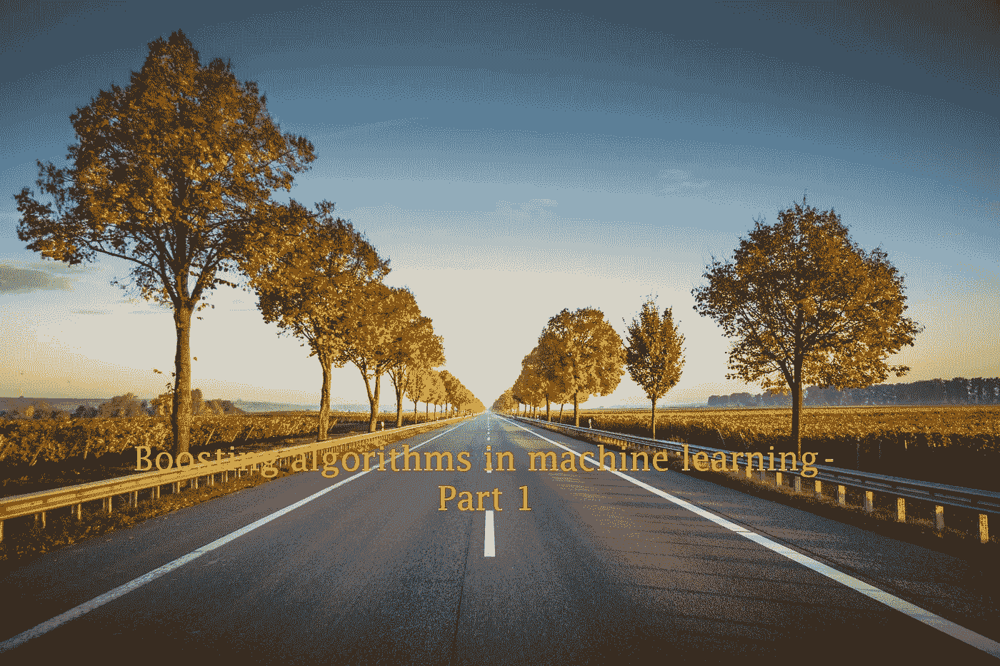

# 助推树木简介

> 原文：<https://towardsdatascience.com/introduction-to-boosted-trees-2692b6653b53?source=collection_archive---------9----------------------->

## 助推技术

## 机器学习中的助推算法——第一部分

照片由[卡斯登·沃斯(➡️@卡斯登.沃斯)](https://unsplash.com/@karsten_wuerth?utm_source=unsplash&utm_medium=referral&utm_content=creditCopyText)在 [Unsplash](https://unsplash.com/?utm_source=unsplash&utm_medium=referral&utm_content=creditCopyText) 上拍摄

欢迎来到我的新文章系列:**机器学习中的助推算法**！这是本系列的第 1 部分。在这里，我会给你一个简短的介绍升压，它的目标，一些关键的定义和一个升压算法列表，我们打算涵盖在未来的职位。

## 先决条件

你应该熟悉初级的基于树的机器学习模型，比如**决策树**和 [**随机森林**](/random-forests-an-ensemble-of-decision-trees-37a003084c6c) 。除此之外，建议好好了解一下 **Python** 及其 [**Scikit-learn**](/9-guidelines-to-master-scikit-learn-without-giving-up-in-the-middle-5102863d89d7) 库。

# 创造助推树木的目的

当我们想要创建非线性模型时，我们可以尝试创建基于树的模型。首先，我们可以从决策树开始。决策树的主要缺点是过度拟合训练数据。决策树的一个很好的替代品是随机森林。我们可以通过一种叫做*Bagging*(bootstrap aggregating)的技术组合多个决策树来创建一个随机森林。随机森林比决策树有更好的性能。

随机森林也有一个缺点。他们不能处理由他们个人的决策树产生的错误(如果有的话)。由于并行学习，如果一个决策树出错，整个随机森林模型都会出错。随机森林的一个很好的替代方案是提升树模型。这种模型的主要目标是通过避免上述缺点来超越决策树和随机森林。

# 什么是助推？

像 bagging 一样，boosting 是一种集成方法，其中用一组决策树创建 boosted 树。区分装袋和助推是有用的。

> **装袋**是自举聚集的简称。当算法进行样本替换时，称为**自举**。随机森林通过聚合自举决策树样本的预测来做出最终预测。因此，随机森林是一种 bagging 系综方法。随机森林中的树是相互独立的。

相比之下，

> **Boosting** 处理之前决策树产生的错误。在 boosting 中，通过考虑前几轮树的错误来形成新的树。因此，新的树一棵接一棵地被创造出来。每棵树都依赖于前一棵树。这种类型的学习被称为**顺序学习**，其中并行计算并不理想。

升压的一些关键考虑因素是:

*   Boosting 将弱决策树(称为弱学习器)转换为强学习器。
*   每个新树的建立都考虑了先前树的错误。
*   在 bagging 和 boosting 中，算法都使用一组(总体)决策树。打包和提升被称为集成元算法。
*   升压是一个迭代过程。每棵树都依赖于前一棵树。因此，很难并行化 boosting 算法的训练过程。培训时间会高一些。这是 boosting 算法的主要缺点。
*   从增强过程中修改的树被称为**增强树**。

# 基础学习者

基础学习者是任何集成技术的基本组成部分。它是一个单独的模型，更常见的是一个决策树。在增压中，一个基本的稀薄器被称为**弱稀薄器**。当弱学习器是决策树时，专门称为**决策树树桩**、**决策树桩**、**浅决策树**或**只有一个内部节点(根)连接两个叶节点( **max_depth=1** )的 1-分裂决策树**。

# 助推算法

这里列出了机器学习中使用的一些流行的 boosting 算法。我们将在接下来的文章中详细介绍每个算法及其 Python 实现。

*   [AdaBoost(自适应增强)](/how-do-you-implement-adaboost-with-python-a76427b0fa7a)
*   [梯度推进](/under-the-hood-of-gradient-boosting-and-its-python-implementation-99cc63efd24d)
*   [XGBoost(极限梯度提升)](https://rukshanpramoditha.medium.com/unlock-the-power-of-xgboost-738536b9f36f)
*   [LightGBM(光梯度推进机)](/can-lightgbm-outperform-xgboost-d05a94102a55)
*   [催化增强(分类增强)](/how-do-you-use-categorical-features-directly-with-catboost-947b211c2923)

# 摘要

我们刚刚开始我们的新文章系列:**机器学习中的助推算法**。除了讨论以上算法，我还会增加一些专题。

Boosting 算法是基于树的算法，对于在非线性数据上构建模型非常重要。因为大多数真实世界的数据是非线性的，所以学习这些算法将是有用的。在本系列文章结束时，您将对 boosting 算法及其 Python 实现有一个清晰的了解。

今天的帖子到此结束。我的读者可以通过下面的链接注册成为会员，以获得我写的每个故事的全部信息，我将收到你的一部分会员费。

 [## 通过我的推荐链接加入 Medium

### 作为一个媒体会员，你的会员费的一部分会给你阅读的作家，你可以完全接触到每一个故事…

rukshanpramoditha.medium.com](https://rukshanpramoditha.medium.com/membership) 

非常感谢你一直以来的支持！下一个故事再见。祝大家学习愉快！

特别要感谢 Unsplash 网站上的 **Karsten Würth** 、**T3，他为我提供了这篇文章的封面图片。**

[鲁克山·普拉莫迪塔](https://medium.com/u/f90a3bb1d400?source=post_page-----2692b6653b53--------------------------------)
**2021–10–21**