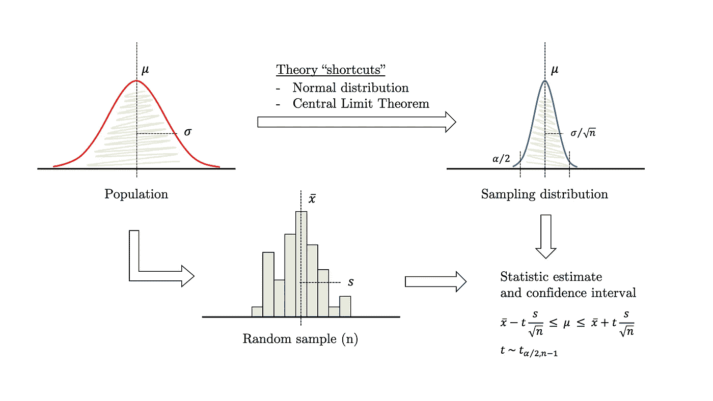
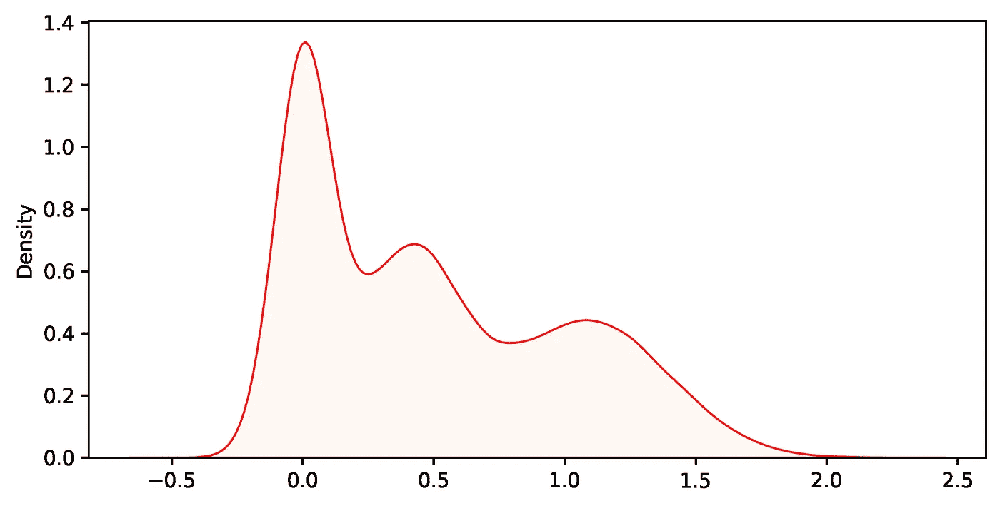
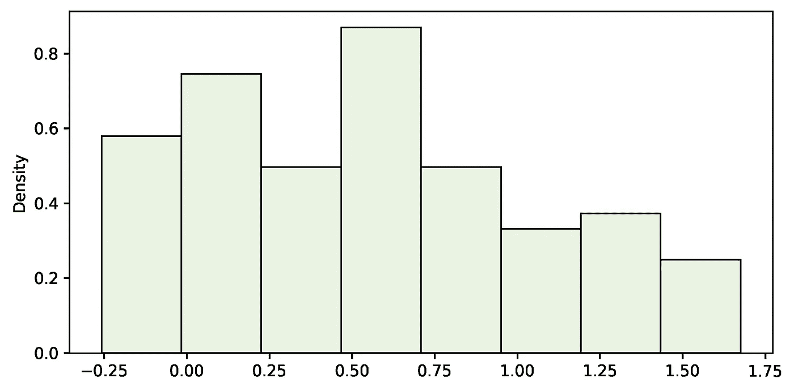
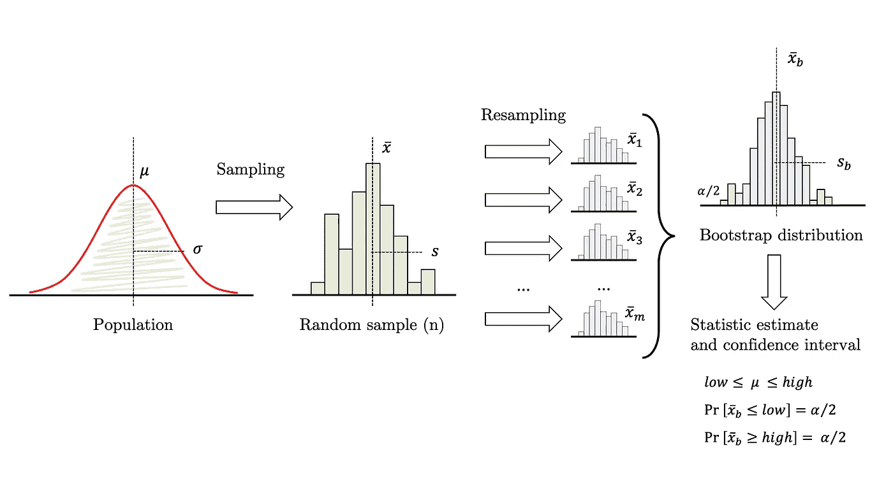
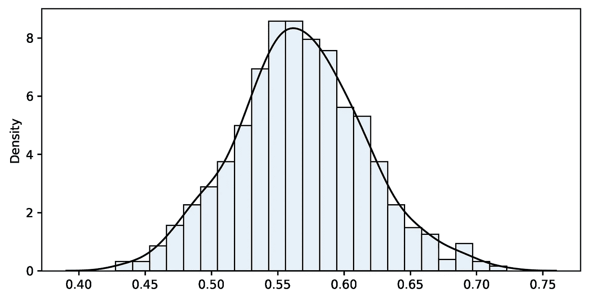
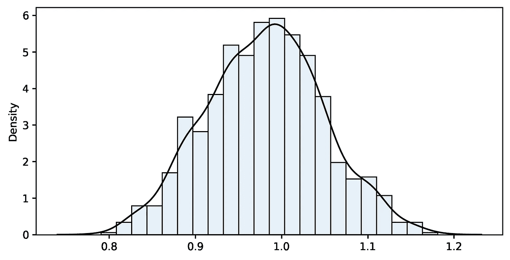

# 数据科学中的引导介绍—第 1 部分

> 原文：<https://towardsdatascience.com/introduction-to-bootstrapping-in-data-science-part-1-6e3483636f67?source=collection_archive---------12----------------------->

## [入门](https://towardsdatascience.com/tagged/getting-started)

## 大胆探索理论从未涉足的领域。


由[乔舒亚·科尔曼](https://unsplash.com/@joshstyle?utm_source=unsplash&utm_medium=referral&utm_content=creditCopyText)在 [Unsplash](/s/photos/choice?utm_source=unsplash&utm_medium=referral&utm_content=creditCopyText) 上拍摄的照片

你知道程序:有一个总体，你想估计一个特征，例如，平均值。不幸的是，你不能测量群体中的每一个人，所以你抽取一个样本。遵循你最喜欢的统计学书籍中的指导方针，你通过假设参数分布是正态的并且样本大小足够大以至于[中心极限定理](https://en.wikipedia.org/wiki/Central_limit_theorem)开始生效来简化问题。在这些假设下，您注意到手头的任务类似于“方差未知的正态分布均值的*置信区间*”，因此您查找相应的数学方程，填入数值，然后…工作完成！



图 1:理论框架。图片作者。

传统的统计方法依赖于大样本、一些众所周知的理论分布和*中心极限定理*的安全网来工作。这些快捷方式让研究人员在大多数情况下都可以解决问题，尽管在某些情况下这是不可能的。作为数据科学家，我们经常面临挑战性的问题，这些问题超出了传统统计学的安全范围，仅限于有限数量的熟悉场景。可悲的是，现实是顽固的，数据以各种扭曲的形式出现，有时你只需要估计比简单平均值更复杂的参数。

但还是有希望的。由于计算技术不可阻挡的发展，对大型复杂数据集的研究现在是可行的。几年前禁止进行的模拟也是如此。目前，有一些方法可以放松传统推理的一些必要条件，并使数据科学家的工作变得更容易。在没有任何理论认可的方法的挑战性场景中，你仍然可以茁壮成长。

本文温和地介绍了 [bootstrapping 方法](https://en.wikipedia.org/wiki/Bootstrapping_(statistics))，它可以应用于单变量数据样本的几乎任何统计。第一部分解决了一个众所周知的问题，为证明自举和理论方法的一致性奠定了基础。然后，我们进入一个更复杂的场景，在那里理论没有什么帮助，随后，我们用 bootstrapping 解决这个问题。

## 引导限制

在我们继续之前，让我们解决一些误解:bootstrap 不创建数据。它实际上做的是估计统计数据、置信区间，并在广泛的情况下进行假设检验，即使它们没有被现存的统计理论所涵盖。仍然有一些完全不可避免的限制:

*   **输入必须是人口的随机样本。**对此没有变通办法。如果样本不是随机的，那么它就不具有代表性，因此该方法将失败。
*   **非常小的样本仍然是个问题**。我们不能无中生有，凭空创造数据。引导引入了该方法固有的一定量的变化。大部分来自原始样本的选择，只有一小部分来自重采样过程。因此，样本越大越好。小样本将严重损害自举结果的可靠性。
*   一些统计数据本来就比其他的更难。例如，自举中位数或其他分位数是有问题的，除非样本量非常大。



图二。示例中考虑的人口(平均值正好为 0.5)。图片作者。

## **示例 1.1:传统均值估计**

在本例中，我们通过应用传统方法和引导方法来解决一个常见问题。对于图 2 中**所示的总体，让我们通过随机样本来估计均值。如**图 1** 所述，这是一个典型的推理问题，我们可以安全地应用该理论。在某些假设下，我们可以使用右下角熟悉的表达式来计算置信区间。所以过程如下:**

1.  随机抽取人口样本(见**图 3** )。
2.  应用带有 t 统计量的公式来计算间隔。



图 3。样本(n=100，平均值=0.566)。图片作者。

```
sample_mean=0.566 sample_std=0.502
(0.46606681302580744, 0.6661796676261962)
```

样本均值为 0.566，标准差为 0.502，总体均值的 95%置信区间为[0.466，0.666]，其中包含实际值(0.500)。

## **示例 1.2:自举均值**

自举的优势之一是其惊人的简单性(参见图 4 ):

1.  随机抽取人群样本(同上)。
2.  用完全相同的尺寸，从原始样本中画出替换的重新样本。
3.  计算重新取样的统计量(在这种情况下是平均值),并将结果存储在一个列表中。
4.  转到 2，重复几百次甚至几千次。



图 4。自举算法。图片作者。

这些值的分布就是 **bootstrap 分布**，其中应该模仿**理论抽样分布**。一般来说，它以样本(而不是总体)中的统计值为中心，允许有小的**偏差**。绘制它并检查它是否近似正常总是一个好主意。如果是这样，你可以回到传统的 t 统计，这种方法被称为 **bootstrap-t** 。否则，只需计算非参数 **bootstrap 百分位置信区间**，也就是说，选择 bootstrap 分布下包含您的置信水平所需区域的两个分位数。第二种方法不受偏斜度的影响，所以只要偏斜度小，它通常更准确。

自举是一种非常有效的技术。然而，如果您得到一个相对较大的偏差或 bootstrap 分布明显偏离正常，这两个明显的症状表明该过程可能不会按预期工作。在那种情况下，你应该小心行事。

```
Bootstrap results:
 n=100 m=1000 sample_fn=0.566 bootstrap_mean=0.567 bias=-0.001 bootstrap_se=0.049
Confidence interval 95%:
 [0.471 .. 0.566 .. 0.670]
```



图 5。均值的自助分布。图片作者。

如果我们与传统方法比较，两种结果都非常接近。再次强调，自举不会创建数据。这是一种没有抽样分布理论支持的前进方式。我们使用 bootstrapping 结果有两个目的:估计参数及其可变性。我们不需要做出诸如人口正态性的理论假设，也不需要依赖*中心极限定理*。即使理论不能解释我们的统计数据的抽样分布，这种方法也是有效的(下一个例子中会详细介绍)。bootstrap 分布(见**图 5** )填补了这一空白，并允许我们直接从中估计置信区间。

## **例 2:前 50%的平均值**

我们想计算人口中前 50%的个人的平均值。换句话说，高于中值的平均值。这个自定义参数不像平均值那样常见，因此，您在教科书中找不到任何估计它的提示。没有理论方法，我们不得不求助于自举。

多亏了*插件原理*，我们可以通过计算从中抽取的样本上的相同属性来估计群体的几乎任何属性。Bootstrapping 会处理剩下的事情，为我们提供适当的 bootstrap 分布来近似其他的一切。

这个过程和以前完全一样，只是有一点小小的变化:我们必须用新的统计量代替平均值。因此，我们编写一个新的函数，并重用其余的代码。

```
Bootstrap results:
 n=100 m=1000 sample_fn=0.979 bootstrap_mean=0.981 bias=-0.002 bootstrap_se=0.067
Confidence interval 95%:
 [0.850 .. 0.983 .. 1.112]
```



图 6。自定义统计的 Bootstrap 分布。图片作者。

结果相当好，因为前 50%的平均值的实际值是 0.902，正好在提供的区间内。一眨眼的功夫，计算机已经运行了一千次迭代来构建 bootstrap 分布，并计算了一个在我们的教科书中没有的新颖统计的置信区间。这是一个很好的例子，说明了这种方法的强大和方便。

**最后的话**

“bootstrapping”一词的所谓来源是《孟乔森男爵奇异历险记》[](https://en.wikipedia.org/wiki/Baron_Munchausen)*(1786)的一个版本中的一段话，当主角通过拉自己靴子的带子从一个洞里出来时。*

*这一比喻在一定程度上适用:虽然自举并不创造数据，但这一简单的计算技术让我们可以利用手头的数据更进一步，即使在理论不可用或无法安全做出假设的情况下，这一方法也能奏效。*

*我将在后续文章中介绍各种各样的引导应用程序(见下文)。如果你对这个话题感兴趣，我强烈建议你看看参考资料。感谢您的阅读！*

*[](/introduction-to-bootstrapping-in-data-science-part-2-ef7236e464a7) [## 数据科学中的引导介绍—第 2 部分

### 使用您选择的任何自定义统计数据比较两个样本

towardsdatascience.com](/introduction-to-bootstrapping-in-data-science-part-2-ef7236e464a7)* 

***参考文献***

*[1]埃夫龙，B. (1979 年)。[自举方法:再看折刀](https://projecteuclid.org/journals/annals-of-statistics/volume-7/issue-1/Bootstrap-Methods-Another-Look-at-the-Jackknife/10.1214/aos/1176344552.full)。*统计年鉴*，1–26。*

*[2]埃夫龙，b .，蒂布拉尼，r .，，蒂布拉尼，R. J. (1994 年)。*自举简介*。查普曼&霍尔/CRC。*

*[3]戴维森和欣克利(1997 年)。 *Bootstrap 方法及其应用*(剑桥统计与概率数学丛书)。剑桥:剑桥大学出版社。*

*[4]哥伦比亚特区蒙哥马利和佐治亚州龙格(2013 年)。*工程师应用统计与概率*。约翰·威利&的儿子们。*

*[5]摩尔博士、麦凯布博士和克雷格学士(2014 年)。*统计学实践入门。*第八版。纽约:麦克米伦高等教育公司 W.H. Freeman and Company。*