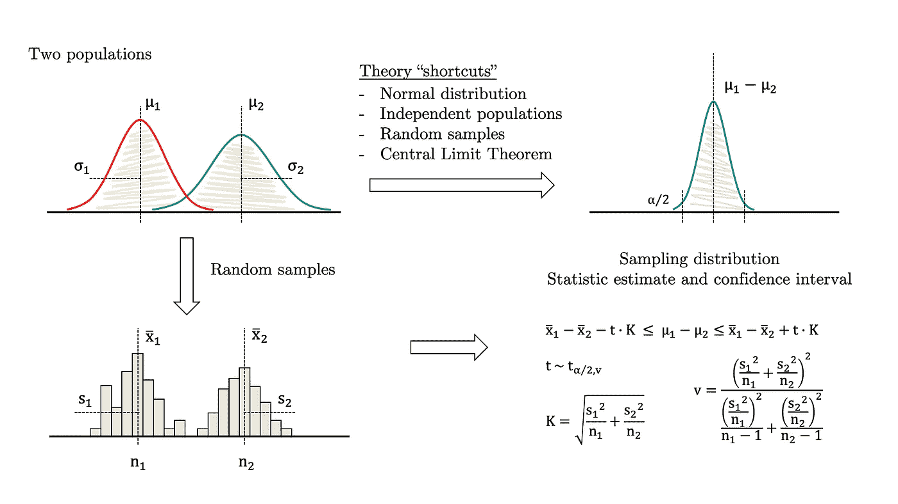
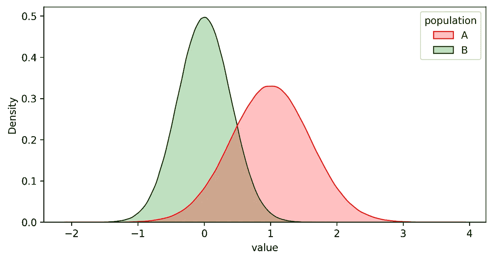
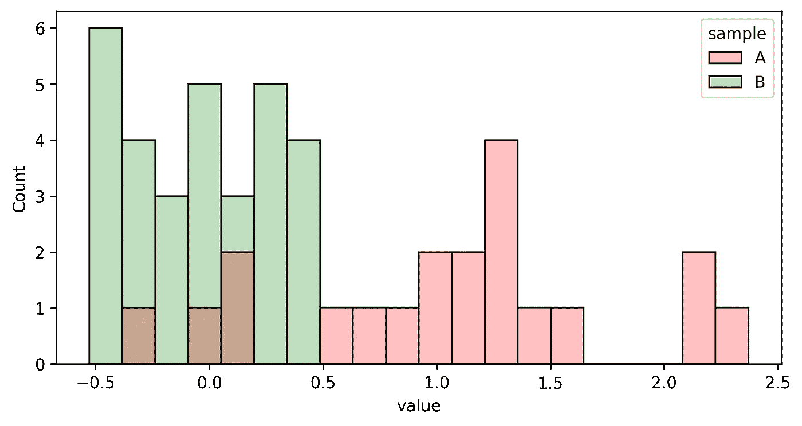
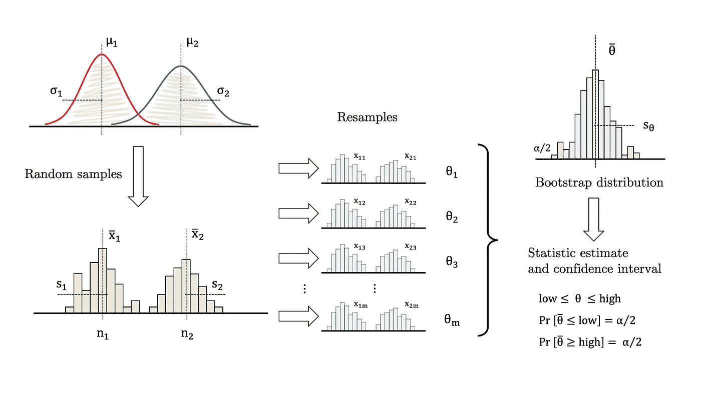
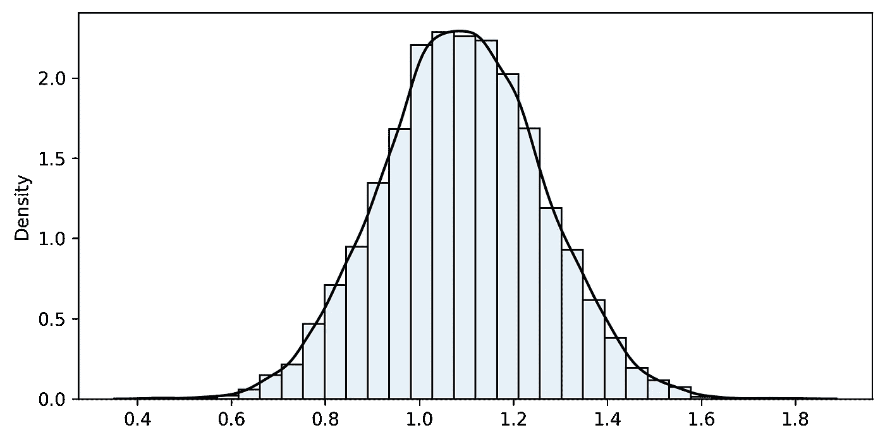
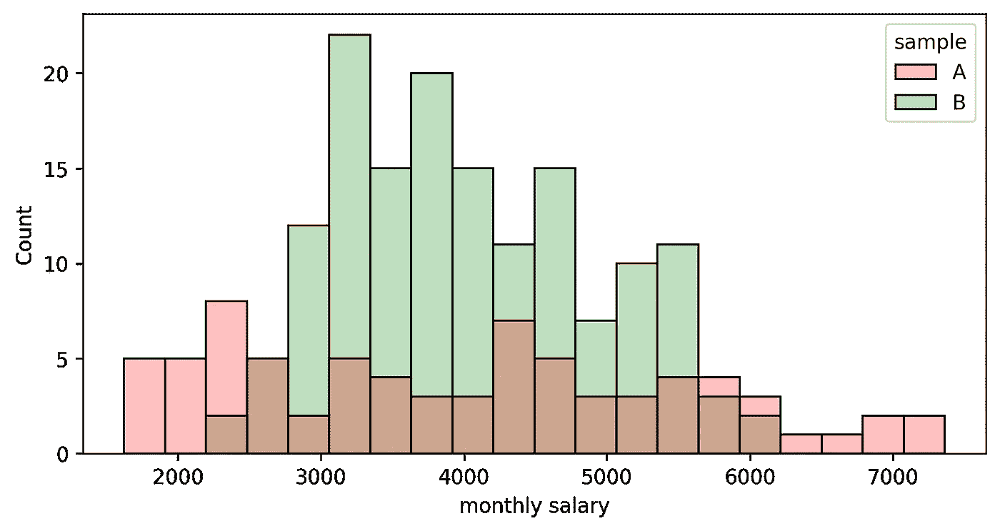
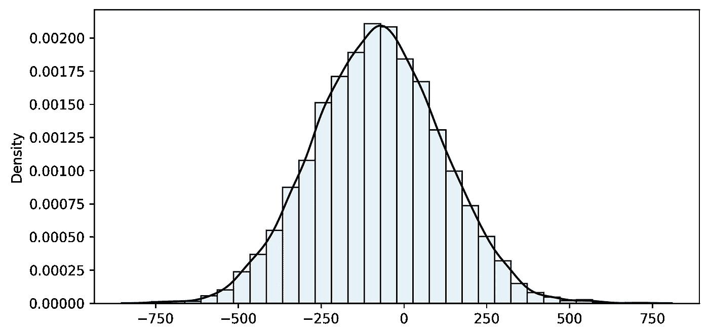
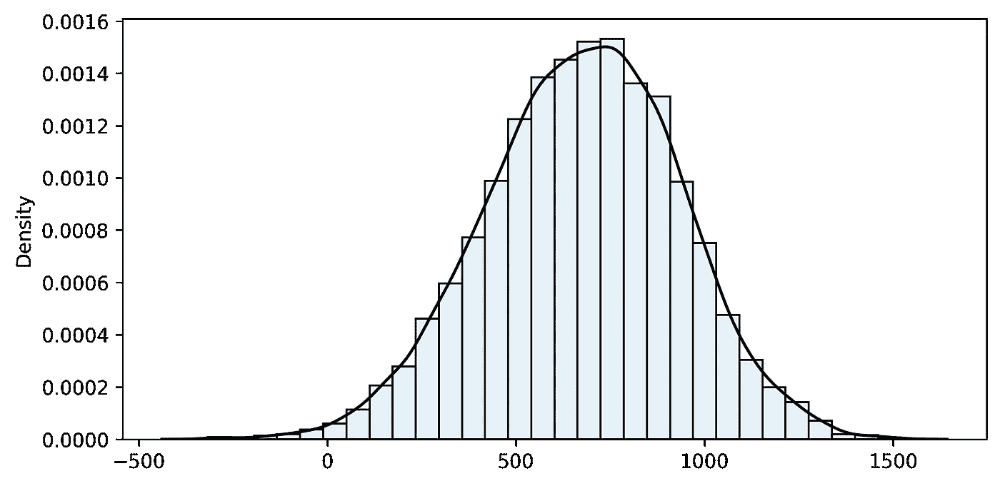
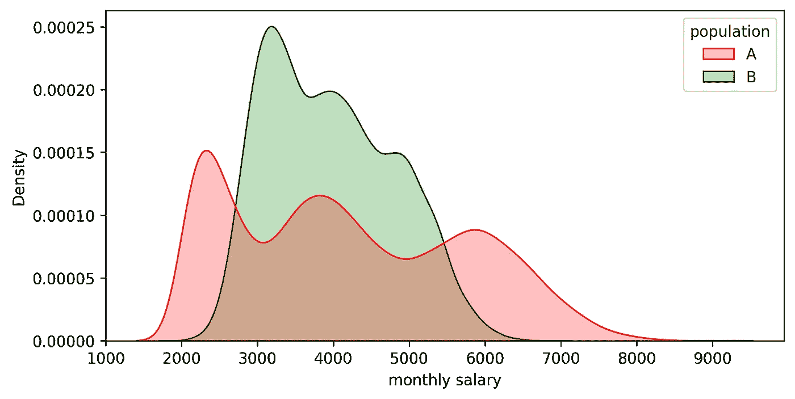

# 数据科学中的引导介绍—第 2 部分

> 原文：<https://towardsdatascience.com/introduction-to-bootstrapping-in-data-science-part-2-ef7236e464a7?source=collection_archive---------34----------------------->

## **使用您选择的任何自定义统计数据比较两个样本**


由[艾米·珊布伦](https://unsplash.com/@amyshamblen?utm_source=unsplash&utm_medium=referral&utm_content=creditCopyText)在 [Unsplash](https://unsplash.com/collections/34290889/many-of-the-same-thing?utm_source=unsplash&utm_medium=referral&utm_content=creditCopyText) 上拍摄的照片

在本系列的第一部分中，我们描述了如何使用随机样本和简单的迭代算法 **bootstrapping** 来估计更广泛人群中几乎任何特征的置信区间。这种方法比传统的统计方法有决定性的优势:它是一种通用的方法，允许我们用几行代码来面对挑战性的问题。有趣的是，它也将我们从理论框架中解放出来，这些框架通常受到假设的约束，而这些假设可能并不适用于所有可能的情况。说实话，在很多情况下，我们不能依赖那些众所周知的教科书解决方案。

[](/introduction-to-bootstrapping-in-data-science-part-1-6e3483636f67) [## 数据科学中的引导介绍—第 1 部分

### 大胆探索理论从未涉足的领域。

towardsdatascience.com](/introduction-to-bootstrapping-in-data-science-part-1-6e3483636f67) 

好消息是，bootstrapping 可以很容易地应用于其他设置，如**双样本问题**和**假设检验**。我们将在本文中讨论前者，并将后者留给本系列的第三部分也是最后一部分(敬请关注！).在本文的第一部分，我们将使用参数法和自举法来估计两个正态分布的*差异，其中方差未知且不等于*，作为两种方法一致的证明。然后，我们将提出一个更具挑战性的问题，这个问题没有简单的参数解，而 bootstrapping 可以毫不费力地解决它。

## **例 1.1:方差未知且不相等的传统均值差**

假设我们有两个服从正态分布的总体(这是一个很大的假设),均值和方差未知。我们也知道方差互不相同。在这种情况下，我们需要估计均值的差异，并提供一个合理的置信区间。尽管这是一个有些不利的样本比较案例，但这也是一个众所周知的问题，你可以在你最喜欢的统计学教科书中查找(**图 1** ):



图 1:理论框架。图片作者。

上面的一些等式相对来说比较密集，但是没有什么是我们不能用 Python 处理的。此外，如果样本量足够大，你可以简化问题，切换到一个 *z 统计量*而不是一个 *t 统计量*(并摆脱复杂的自由度计算)。在任何情况下，让我们坚持完整的公式，并遵循以下程序:

1.  从每个群体中随机抽取一个样本(参见**图 2** 和**图 3** )。
2.  使用**图 1** 中所示的理论近似值计算统计值和置信区间。



图 2:两个种群 A 和 B 的分布，均值分别为 1.0 和 0.0。图片作者。



图 3:样品取自 A 和 B，尺码分别为 20 和 30。图片作者。

这是一个估计置信区间的 Python 函数:

```
Difference=1.092
Confidence interval (95%): [0.741, 1.444]
```

在 95%的置信度下，我们可以保证均值差异大于 0.741 且小于 1.444。这个结果已经足够好了，因为实际值是 1。

## **示例 1.2:自举解决了相同的问题**

自举函数来了。该算法非常类似于本系列第篇文章[中详细描述的单样本版本:](/introduction-to-bootstrapping-in-data-science-part-1-6e3483636f67)



**图 4:** 两个样本的自举算法。图片作者。

1.  从两个群体中抽取样本 A 和 B(参见**图 2** 和 **3** )。
2.  用完全相同的尺寸，从原始样品 A 中画出替换的重新样品。
3.  用完全相同的尺寸，从原始样品 B 画一个替换的重样品。
4.  计算两次重采样的统计值(在这种情况下，平均值的差异)。
5.  将统计数据存储在列表中。
6.  转到 2。重复几千遍。



图 5:均值差异的 Bootstrap 分布。图片作者。

```
n1=20 n2=30 iterations=10000
sample_fn=1.092 **bootstrap_mean=1.091** bias=0.002 bootstrap_se=0.169
**Confidence interval (95%): [0.762 ... 1.090 ... 1.418]**
```

列表中数值的分布为 **bootstrap 分布**，其近似于理论抽样分布。一般来说，它以样本(而不是总体)中的统计值为中心，允许有小的**偏差**。绘制它并检查它是否近似正常总是一个好主意。接下来，我们计算非参数 **bootstrap 百分位置信区间。也就是说，选择在 bootstrap 分布下包含您的置信水平所需区域的两个分位数。**

参数结果和自举结果都非常接近。但是，请注意，参数化方法是专门为这个问题定制的，而自举完全是通用的。例如，如果我们需要估计方差或任何其他自定义度量的差异，会发生什么？对于参数方法，我们必须寻找一组不同的方程(如果它们存在的话)。相反，引导只需要对代码进行少量更新。下一节将通过另一个例子精确地描述这些变化。

## **例 2:两家公司的工资比较**

假设我们想比较两家竞争公司的薪酬分配。为他们中的任何一个工作都很有吸引力，作为一个工作前景，除了报酬之外，没有任何明显的区别。不幸的是，他们没有透露这类信息，但是我们设法弄到了两个**随机**样品:



图 6:从公司 A 和公司 b 中随机抽取的月薪样本。

第一个问题是:“两种方法如何相互比较？”传统和自举方法都可以解决这一步，结果是:

```
Difference=-77.982
Confidence interval (95%): [-460.342, 304.377]
```

通过自举:



图 7:均值差异的 Bootstrap 分布。图片作者。

```
n1=75 n2=150 iterations=10000
sample_fn=-77.982 **bootstrap_mean=-78.844** bias=0.862 bootstrap_se=191.647
**Confidence interval (95%): [-454.325 ... -78.545 ... 296.170]**
```

请注意，置信区间从-454.325 到+296.170，因此它包含 0。因此，我们不能忽视手段之间没有区别的可能性。这个事实引出了一个有趣的话题:如何在假设检验中使用 bootstrapping，我们将在本系列的最后一篇文章中讨论。

现在我们想更进一步。作为经验丰富的数据科学家，我们有充分的信心在公司阶梯的前 30%找到一个位置。因此，我们想把我们的分析范围缩小到收入最高的四分之一人群。在这一点上，没有“传统的”参数化方法可以求助，所以我们应用 bootstrapping。如上所述，除了计算统计数据的函数之外，我们可以方便地重用所有代码。在这种情况下，我们写一个新的来得到高于第 70 个百分位数的平均工资的差异:



图 8:第 70 百分位以上均值差异的 Bootstrap 分布。图片作者。

```
n1=75 n2=150 iterations=10000
sample_fn=680.252 **bootstrap_mean=676.566** bias=3.686 bootstrap_se=256.013
**Confidence interval (95%): [161.172 ... 683.415 ... 1164.408]**
```

所以我们有理由确信(95%的信心)T4 公司 A 支付给他们前 30%的员工比 B 多。对于给定的样本，该差异估计为每月 683。

为了仔细检查，让我在下面包括我用来生成样本的实际分布。两者都刻意远离正常，均值相等(差正好为 0)。然而，30%以上(约 1，000)的工资差别很大。所以置信区间足够好了！



图 9:A 公司和 b 公司的月工资分布，均值差为 0，30%以上的工资均值差约为 1000。图片作者。

## 最后的话

Bootstrapping 是一种优雅的方法，它允许我们在没有任何理论框架(如果存在的话)的先验知识的情况下，轻松地构建自定义指标并比较总体。我们评估一个特征(或在这种情况下的特征比较),并以置信区间的形式评估它的可靠性。当问题变得越来越复杂时，参数方程通常会变得更加复杂，并且需要更多的假设。然而，自举算法保持不变，只需要针对特定问题进行微小的调整。这就是这种方法的优雅和方便之处。

感谢您的阅读，敬请期待第三部分！

## 参考

[1]埃夫龙，B. (1979 年)。[自举方法:再看折刀](https://projecteuclid.org/journals/annals-of-statistics/volume-7/issue-1/Bootstrap-Methods-Another-Look-at-the-Jackknife/10.1214/aos/1176344552.full)。*统计年鉴*，1–26。

[2]埃夫龙，b .，蒂布拉尼，r .，，蒂布拉尼，R. J. (1994 年)。*自举简介*。查普曼&霍尔/CRC。

[3]戴维森和欣克利(1997 年)。 *Bootstrap 方法及其应用*(统计与概率数学中的剑桥系列)。剑桥:剑桥大学出版社。

[4]哥伦比亚特区蒙哥马利和佐治亚州龙格(2013 年)。*工程师应用统计与概率*。约翰·威利的儿子们。

[5]摩尔博士、麦凯布博士和克雷格学士(2014 年)。*统计学实践入门。*第八版。纽约:麦克米伦高等教育公司 W.H. Freeman and Company。