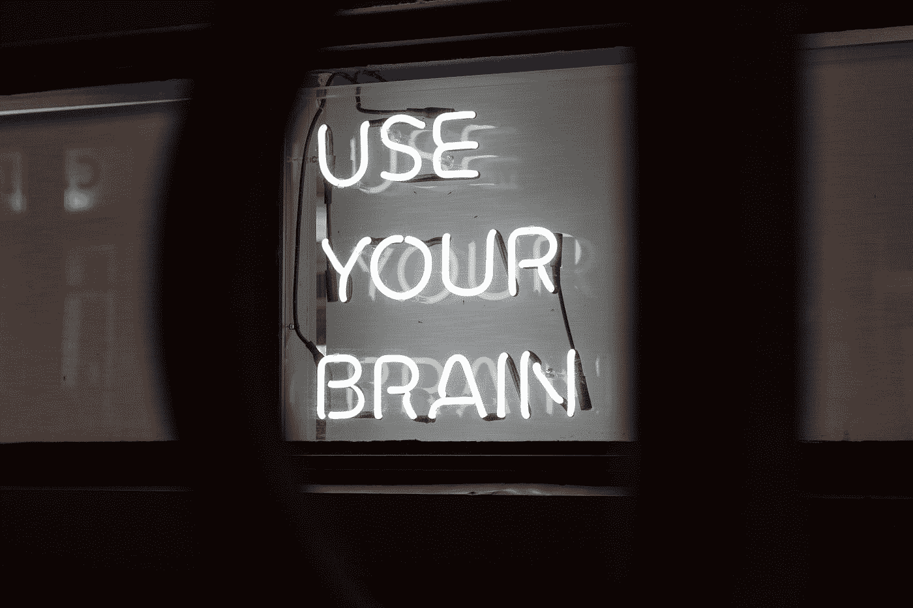

# 脑-机接口导论

> 原文：<https://towardsdatascience.com/introduction-to-brain-computer-interfaces-d05d533e3543?source=collection_archive---------29----------------------->

## 当科幻电影中的技术变成现实

杰西·马丁尼在 [Unsplash](https://unsplash.com?utm_source=medium&utm_medium=referral) 上的照片

人脑和计算机(或一般机器)的连接听起来像科幻小说——像来自乌托邦(或反乌托邦)未来的技术。然而，现代脑机接口(或 BCI)的发展始于大约 100 年前，当时汉斯·伯杰发现了人类大脑的电活动，并通过一种后来被称为脑电图(简称 EEG)的方法测量了这些信号。如今，脑机接口已经有了许多不同的应用，但我们才刚刚起步，在不久的将来可能会看到一些令人印象深刻的进步。

在讨论脑机接口的当前应用以及对其未来用途的一些猜测之前，我们将首先介绍不同的“读心术”，或者更科学地说，测量大脑活动的方法。最后，我们将讨论与 BCIs 相关的伦理问题。

# 脑机接口

首先:不，目前不可能读懂人们的想法——至少不能直接读懂。然而，我们能做的，是测量人们的大脑活动。我们可以从收集的数据中获得信息，例如对环境中事件的反应或意图，如有计划的运动。数据的分析取决于所收集的大脑活动的类型。

脑-机接口可以分为三类:侵入式、部分侵入式和非侵入式脑-机接口。虽然侵入性和部分侵入性 BCI 需要某种手术，但我们将重点关注非侵入性 BCI，因为它们更容易建立，更便宜，并且具有不需要手术的明显优势。(尽管也有令人震惊的侵入性 BCI 的例子——比如埃隆·马斯克的 Neuralink 训练一只猴子玩 pong)。

量化大脑活动最常见的方法是测量头皮上由大脑神经活动产生的电信号。这被称为 [*脑电图*](https://en.wikipedia.org/wiki/Electroencephalography) 或*脑电图*，更具体地说是测量电极和参考之间的电压。

与脑电图类似的是 EOG ( [眼电描记术](https://en.wikipedia.org/wiki/Electrooculography))，它使用放置在眼睛周围的电极来测量不同点之间的电压。由于眼睛前后之间的电势，测量电压的变化可以用来计算和跟踪眼睛的运动。

其他测量大脑活动的方法是所谓的 fNIRS ( [功能近红外光谱](https://en.wikipedia.org/wiki/Functional_near-infrared_spectroscopy))和 fMRI ( [功能磁共振成像](https://en.wikipedia.org/wiki/Functional_magnetic_resonance_imaging))，它们分别测量血液动力学活动和血流量，这两种方法都源于神经活动。

不同的技术有不同的优缺点。虽然 fMRI 具有高空间分辨率，但是记录单个样本需要几秒钟，并且 MRI 扫描仪(非常)大并且(非常)昂贵。相比之下，EEG、EOG 和 fNIRS 设备的空间分辨率较低(取决于电极/光极的数量),仅测量头皮上的活动，但采样频率较高，便于携带且便宜得多。

大多数现代脑机接口是基于脑电图的，但也可以找到脑电图和 EOG 或脑电图和 fNIRS 的组合。

归根结底，上述两种方法都不是在测量神经活动，而是某种(嘈杂的)代理，如电极之间的电位，这种电位受到环境背景噪声的影响。

# 脑机接口系统的应用

尽管记录脑电图已有很长的历史，但对它们的有效分析却远非简单明了。分析 EEG 数据的一种常见方法是调查特定大脑区域中某些频带的功率谱密度。然而，这只能在相当低的水平上解释大脑活动。从技术上来说，这意味着更容易测量注意力的水平，但很难(如果不是不可能的话)区分某人是否在想颜色*红色*或*蓝色*。(脑电图分析的基础，如事件相关电位、频带或常见空间模式将是未来文章的主题)。我们目前从脑电图记录中获得的这种水平的见解指出了应用的方向。

## 在医学上的应用

脑电图的一个可能的应用是基于我们可以测量人类大脑中意识状态变化的想法。这允许**在外科手术过程中监控镇静/麻醉**的水平。

癫痫发作、睡眠障碍、帕金森病或其他疾病的诊断通常基于对 EEG 的分析(通过专家或基于人工智能的系统)。

此外，脑电图经常用于**康复**(特别是与虚拟现实或假体相关)，目的是通过神经可塑性恢复运动功能。

除了诊断和康复，脑电图在医学上的用途是多方面的，甚至通过*听觉诱发电位*来评估听觉系统的功能。

## 其他应用

在实验室和诊所之外，脑机接口越来越受欢迎，但消费级脑机接口的应用目前相当有限。

测量意识状态不仅与医学相关。有一些脑机接口可以通过监控用户的注意力来促进冥想。类似的系统可能会在交通和教育等领域引起人们的兴趣，因为司机和学生也需要集中注意力。

在未来，消费级 BCI 可以成为各个领域的游戏改变者。在市场营销中，营销人员将获得消费者的直接反应，并据此调整他们的策略和产品。通过与物联网设备连接，BCIs 可以创建下一代智能环境，包括家庭、工作和交通。与 VR 结合，电脑游戏会更加身临其境，更加直观。BCI 有可能实现无缝身份认证，并改变我们对安全性的理解。最后，BCIs 将彻底改变人类和机器之间的连接，更具体地说是 cobots(协作机器人)。

从负面来看，技术发展可能会允许反乌托邦小说中的(军事)用例。

# 伦理问题

上面我们专门解决了记录大脑活动的非侵入式单向脑机接口。然而，从中长期来看，我们可能会看到脑机接口允许信号以相反的方式传播——从计算机到人脑。在这一点上，精神控制成为一个需要考虑的紧迫的伦理问题。虽然还不清楚自由意志是什么意思，也不知道它是否存在于物理层面，但在人类的情感和运动被计算机控制后，这个概念需要重新思考。通过脑深部刺激，BCI 使用者的大脑以及随后的个性可能会发生变化。

但是，即使在这两种方式都有可能实现之前，在某种程度上，从远处测量大脑活动是可能的，这将有效地允许读心术和一些严重侵犯隐私的行为。一首著名的德国歌曲说“思想是自由的”——让我们希望这在未来依然如此。

# 结论

尽管我们还远远没有普及消费级脑机接口，并且存在一些严重的社会问题(正如每一项新技术一样)，但我们可能会在不久的将来看到一些令人惊叹的、有益的和积极的发明，这些发明可以改善许多人的生活。

脑机接口是一个活跃的研究领域，有着惊人的发展和对社会的严重机遇和威胁。我们正处在一个十字路口，需要确保技术被用于好的方面(无论这对你意味着什么)。

与 AGI 类似，我个人认为，分散的研发是避免滥用 BCIs 的关键。意识到这一点后，我转行开发脑机接口。你会怎么做？