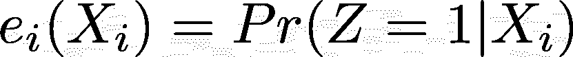

# 因果推理导论(二)

> 原文：<https://towardsdatascience.com/introduction-to-causal-inference-part-2-13dc0fe2eb90?source=collection_archive---------10----------------------->

## 我们继续讨论因果推理的基本概念。在这一部分中，我们涵盖了随机研究设计、因果推断中回归的使用以及观察性研究。

照片由 [Lucas Santos](https://unsplash.com/@_staticvoid?utm_source=medium&utm_medium=referral) 在 [Unsplash](https://unsplash.com?utm_source=medium&utm_medium=referral) 上拍摄

这是文章的第二部分。如果你还没有读过《T4》的第一部分，我强烈推荐你去读一读，因为它们彼此紧密相连。在这一部分中，我将基于我们在第一部分中讨论的概念。

随机设计在因果推断中是一个非常有用的研究设计，它给我们一些假设的自由，从而使计算更容易。此外，当我们将讨论观察性研究时，我们会看到我们的目标是试图将它们框定为随机实验。因此，我们将暂时关注它们。通常，随机实验的设计由*分配机制*定义:

一级方程式赛车。随机实验中的分配机制

有几种随机研究设计:

1.  伯努利试验。根据伯努利分布分配治疗。
2.  完全随机实验，当所有单位的治疗概率相同，且治疗单位的数量固定时
3.  成组和成对设计，本质上是通过“类型”分割单元的相同概念——减少了潜在结果推断的变化。

前两种分配机制不依赖于潜在的结果(这意味着它们是*可忽略的*或*不成立的*)和单位特征。这给我们带来了*无知*的假设:

方程式 2。可忽略性假设

可忽略性为我们提供了各治疗组之间平衡的潜在结果，因此，通过比较治疗组和对照组的平均结果，我们得到了 SATE 和 PATE 的无偏估计。然而，由于它是随机化，我们有可能得到一个“不幸的分配”:

表 1。“不幸的任务”的例子

在这里，我们可以计算 SATE(平均治疗效果),我们将看到我们得到的估计是完全错误的。因为这是一个玩具示例，我们可以看到两种可能的结果，所以我们知道真实状态= 7.5。然而，在现实生活中，我们只会看到观察到的结果(表 1 中的 Yobs)。在此基础上，我们将计算出治疗组和对照组的平均观察结果之间的差异，等于 state =-5。这种估计状态与真实状态的巨大偏差来自“不幸的分配”，在这种情况下，这意味着我们通常将年轻的单元分配给治疗组，而将年长的单元分配给对照组，实际上我们可以看到年龄越大，潜在结果的数量越多。这给我们的估计带来了很大的偏差。

这个问题通过第三种类型的设计——模块化设计解决了。这种分配机制的关键思想是在已知的组(块)中随机化(可能不同)——在我们的例子中是不同年龄的组。这样的设计给我们提供了更少的“不吉利的任务”,并且在每个街区内仍然没有发现。对于每个区块，我们测量条件平均治疗效果(CATE)。

为了计算 SATE，我们基本上可以使用以下方法之一:

*   计算 CATEs 的加权(单位数)平均值
*   使用针对块调整的回归(我们将在本文后面讨论这种方法)。

最后，配对设计是封闭设计的夸张版本。这里我们有与*处理中的单元数量一样多的块(！)*组。这是很有代表性的，因为我们基本上试图重现每个单元的未观察到的潜在结果。然而，很明显，要为每个单位找到一个完全匹配的配对是不太可能的，除非它们中有几个(甚至全部)在协变量方面是相同的。

也有一些现实生活中的困难可以“打破”随机设计。其中最讨厌的就是单位的不服从。有一些技术可以消除不遵从的后果，例如*意向治疗分析、治疗分析、符合方案分析*。为了节省时间，我们不会在这里介绍它们，但是你可以自己阅读它们——它们非常简单。

现实生活中的另一个困难是缺少数据。它可以是缺失的治疗前变量值(协变量)或治疗后变量值(取决于治疗应用)或两者。通常，解决这个困难的简单方法是删除缺少变量值的单元。问题是它会“取消”随机化的好处。

# 因果推理中的回归

是时候把回归分析作为因果推理的重要工具之一了。在因果推断中，回归可用于以下目的:

*   估计样本或总体的治疗效果
*   调整背景变量(治疗前协变量)
*   估算未观察到的潜在结果(并以不同的方式计算治疗效果)

在所有情况下，我们可以使用简单的最小二乘回归模型或贝叶斯回归。这种回归模型的最简单视图如公式 3 所示。

方程式 3。因果推理回归模型的一般观点

这里我们可以看到所有熟悉的变量:

*   Y_i —是我们试图预测的潜在结果
*   Z_i —是治疗值
*   X_i —是协变量(也可以有一个协变量矩阵)

> 有趣的是:在随机研究中，我们可以在给定数据上拟合回归模型后，将 tau 的估计值解释为治疗效果。字面上这么简单！

这里有一个特点我们应该记住。像在任何统计推断问题中一样，我们担心我们估计的不确定性。这就是为什么我们需要在这里使用其中一种方法:我们可以使用经典推理或贝叶斯推理(这也意味着使用适当的回归类型)。

1.  经典推断依赖于抽样分布。如果我们有一些数据总体，我们可以从总体中抽取*一些(甚至无限)样本。然后，我们对每个样本进行回归拟合，找到相应的*τ*估计值，并计算所有样本的平均τ估计值。这是我们的最新估计。这种方法的缺点是，当给定的人口非常少时，它不是非常有效，因为它基本上没有捕捉到组合的可能变化，因此也将偏差归因于我们的估计。*
2.  贝叶斯推理通过使用先验信息(分布)将其与样本数据相结合来解决小样本问题。当然，这产生了另一个问题——我们并不总是有先验分布。

在实践中，这两种类型通常是结合在一起的:我们试图利用先验信息和模拟额外样本的能力。

> 有趣的事实是，当我们使用随机治疗分配时，我们并不关心线性回归是否正确。随机化保证了 ate 的无偏估计，即使模型被错误地指定。

回归用法的另一个巨大好处是，将 X 包含到回归中基本上起到了调整各组单元之间不平衡的作用。也就是说，我们不需要像前面讨论的那样明确使用不同的设计作为阻塞或匹配对。

> 这里需要重点关注的一个重要方面是，我们在回归中仅包括治疗前的变量(即仅包括那些不受所应用治疗影响的变量)！

围绕选择最佳方法估计平均治疗效果的问题存在一些争论。将 ate 估计为回归系数 *tau* 的替代方法更简单:我们可以使用拟合的模型来预测未观察到的潜在结果，然后使用标准公式来计算 ATE(我们在文章的第一部分中讨论了它[)。我们也可以应用贝叶斯方法来预测未观察到的结果几次(比如 1000 次)并计算 1000 个状态。对它们进行平均将为我们提供对 PATE 的估计。](https://medium.com/p/d65f2e1ab89)

# 观察研究

好了，现在我们已经讨论了随机实验的因果推断的基础。没那么难吧。因果推断部分的简单性是基于我们已经讨论过的所有假设和随机治疗分配的事实。然而，在现实世界中，如果我们仅仅局限于随机设计的实验，我们将无法研究来自观察的大量数据。事实上，许多发现，至少在它们的起源中，来自于对“自然地”(意思是没有特别的意图)出现的情况的观察。

因此，现在有了一些来自舒适的随机设计领域的讨论工具，我们将走出去到现实世界，并试图使用它们来估计一些对观察数据的因果影响。这可能是因果推理中最令人兴奋的部分，许多科学文章正是基于观察数据。

因此，现在，当我们不知道分配机制时，可忽略性假设不再有效，因此我们不能保证在治疗组之间实现平衡，我们也不能直接估计治疗效果。现在很难确定两组单位之间观察到的差异是由于某种“处理”还是由于某种系统差异(不平衡)。

所有这些问题的解决方案是试图组织观察性研究的数据，以模仿近似的随机研究，然后用我们现有的仪器进行正常的分析。

观察性研究的主要假设是，本研究中的分配机制是有条件忽略的:

方程式 4。观察性研究的分配机制公式

方程式 5。观察性研究的条件忽略性

换句话说，假设说，如果我们有定义观察结果(满足公式 4)的所有协变量，并且我们以它们为条件，那么我们可以假设一些正确的指定模型可以正确地预测未观察到的结果并估计治疗效果。

违反条件可忽略性假设意味着以下问题:

*   隐藏的偏见
*   省略变量偏差
*   不可测混杂

因此，这里有一个很好的工具来计算满足条件忽略的观察数据——倾向得分(由 Rosenbaum 和 Rubin (1983a，1984，1985)引入)。

> P 平衡分数——是所谓平衡分数的变体。这个分数估计了一个单元在所有可用协变量 x 上被处理的概率。

方程式 6。倾向得分

这个想法是使用单位的倾向分数来调整观察数据的混淆。这就产生了一个平衡的数据集，我们可以用一个近似随机的设计来分析它。所以使用倾向分数的策略是:

1.  将它们用作“阻塞”因素。这个想法是将那些具有最接近倾向分数的单元集合在一起。然后对每块 *i* 的单元计算 CATE*I*= Y*I*(1)-Y*I*(0)。对它们求平均值会给我们带来满足感。
2.  我们还可以使用它们来检查数据在治疗组之间是否平衡。当来自治疗组的单位在所有方面都与来自对照组的单位非常不同时，可能会出现棘手的情况(这可以通过两个问题来表达:来自治疗组的单位在其倾向分数方面的分布缺乏重叠，以及它们在重叠部分中的分布不平衡)。在这种情况下，从这些数据中得出的任何推论都是不充分的。

情节一。数据问题的例子:不平衡和缺乏重叠

所以，现在简单来说，有一个很好的算法来处理观察研究，包括 5 个步骤:

1.  设置设计。明智地选择潜在的结果、治疗、*混杂因素*(与治疗和结果相关的协变量)和*预测因素*(仅与结果相关的协变量)。了解你要估计什么样的治疗效果。(尽可能)深入了解分配机制是什么。
2.  计算倾向得分。使用简单的逻辑回归来估计倾向得分，其中预测值是治疗值(Z ),预测值是混杂因素(X)。
3.  使用从倾向得分中获得的信息预处理和设计数据:您可以在缺少重叠的地方使用分块或修剪数据等。我们还没有讨论使用倾向分数对设计的所有可能的调整，所以我鼓励你自己研究这个话题。
4.  检查平衡和重叠，并检查从上一步获得的数据集总体上是否是随机实验的良好近似。如果您仍然发现数据集不平衡，或者缺少单位混杂分布的重叠，那么您应该再次执行步骤 3。
5.  像随机设计一样评估治疗效果。

这些是因果推理的基本概念和机制。我们没有涵盖本文中的所有内容，但我试图涵盖阅读和理解科学出版物甚至建立自己的研究所必需的基础知识。我希望，现在当你在媒体上听到科学家发现吃某种东西会产生一些无意义的影响，或者当人们在讨论新疫苗试验的有效性时，你会带着相当程度的怀疑，并能够亲自检查最初的研究。这应该有助于你自己做决定。