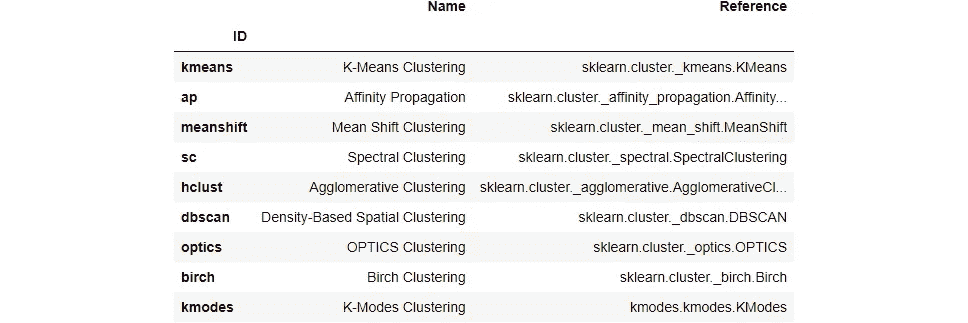
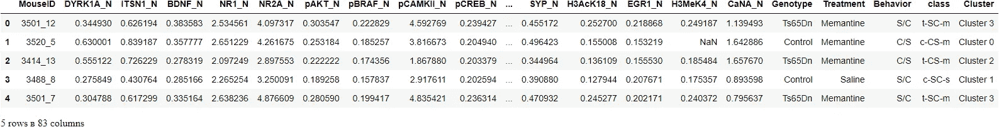
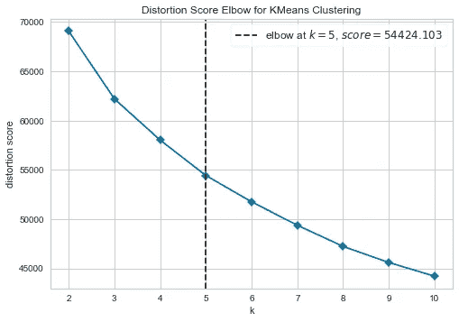
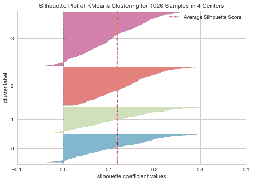
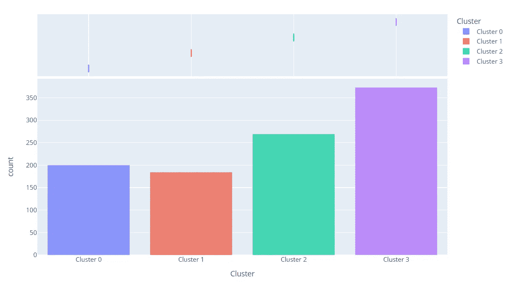
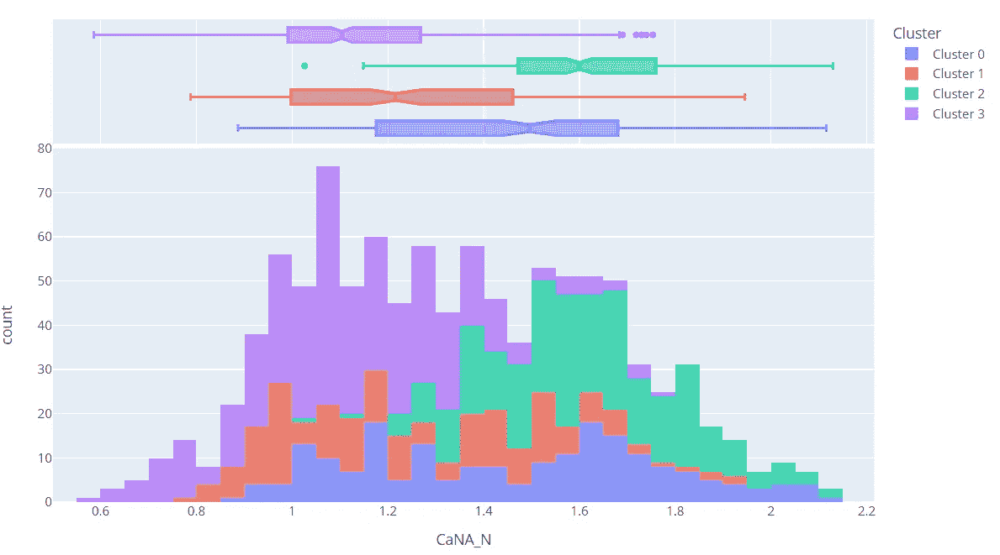
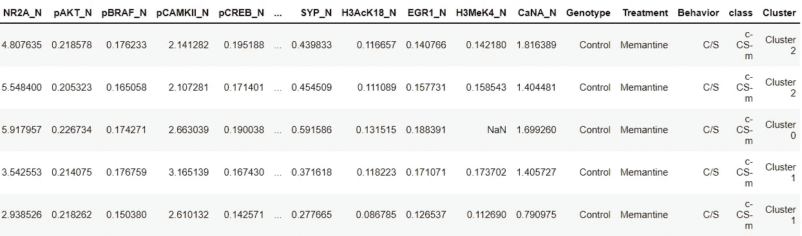

# 使用 PyCaret 介绍 Python 中的集群

> 原文：<https://towardsdatascience.com/introduction-to-clustering-in-python-with-pycaret-5d869b9714a3?source=collection_archive---------4----------------------->

## 一步一步，初学者友好的教程，使用 PyCaret 在 Python 中进行无监督聚类任务


Paola Galimberti 在 [Unsplash](https://unsplash.com?utm_source=medium&utm_medium=referral) 上拍摄的照片

# 1.介绍

[PyCaret](https://www.pycaret.org/) 是一个用 Python 编写的开源、低代码的机器学习库，可以自动化机器学习工作流。这是一个端到端的机器学习和模型管理工具，可以成倍地加快实验周期，提高您的工作效率。

与其他开源机器学习库相比，PyCaret 是一个替代的低代码库，可以用来用几行代码替换数百行代码。这使得实验快速有效。PyCaret 本质上是几个机器学习库和框架的 Python 包装器，比如 scikit-learn、XGBoost、LightGBM、CatBoost、spaCy、Optuna、Hyperopt、Ray 等等。

PyCaret 的设计和简单性受到了公民数据科学家这一新兴角色的启发，这是 Gartner 首先使用的术语。公民数据科学家是超级用户，他们可以执行简单和中等复杂的分析任务，这些任务在以前需要更多的技术专业知识。

想了解更多关于 PyCaret 的信息，可以查看官方[网站](https://www.pycaret.org/)或者 [GitHub](https://www.github.com/pycaret/pycaret) 。

# 2.教程目标

在本教程中，我们将学习:

*   **获取数据:**如何从 PyCaret 资源库导入数据。
*   **设置环境:**如何在 PyCaret 的无监督[聚类模块](https://pycaret.readthedocs.io/en/latest/api/clustering.html)中设置实验。
*   **创建模型:**如何训练无监督聚类模型，并为训练数据集分配聚类标签以供进一步分析。
*   **出图模型:**如何利用各种出图(肘、剪影、分布等)分析模型表现。).
*   **预测模型:**如何根据训练好的模型，给新的、看不见的数据集分配聚类标签。
*   **保存/加载模型:**如何保存/加载模型以备将来使用。

# 3.正在安装 PyCaret

安装很容易，只需几分钟。PyCaret 从 pip 的默认安装只安装在 [requirements.txt](https://github.com/pycaret/pycaret/blob/master/requirements.txt) 文件中列出的硬依赖项。

```
pip install pycaret
```

要安装完整版:

```
pip install pycaret[full]
```

# 4.什么是集群？

聚类是对一组对象进行分组的任务，使同一组(称为簇)中的对象彼此之间比其他组中的对象更相似。它是一种探索性的数据挖掘活动，是统计数据分析的常用技术，用于许多领域，包括机器学习、模式识别、图像分析、信息检索、生物信息学、数据压缩和计算机图形学。集群的一些常见实际使用案例有:

*   根据购买历史或兴趣进行客户细分，以设计有针对性的营销活动。
*   根据标签、主题和文档内容将文档分为多个类别。
*   分析社会/生命科学实验的结果，以发现数据中的自然分组和模式。

# 5.PyCaret 中的聚类模块概述

[PyCaret 的聚类模块](https://pycaret.readthedocs.io/en/latest/api/clustering.html) ( `pycaret.clustering`)是一个无监督的机器学习模块，它执行的任务是以这样一种方式对一组对象进行分组，即同一组(称为一个聚类)中的对象彼此之间比其他组中的对象更相似。

PyCaret 的集群模块提供了几个预处理特性，可以在通过`setup`函数初始化设置时进行配置。它有超过 8 个算法和几个图来分析结果。PyCaret 的聚类模块还实现了一个名为`tune_model`的独特功能，允许您调整聚类模型的超参数，以优化监督学习目标，如用于分类的`AUC`或用于回归的`R2`。

# 6.教程的数据集

在本教程中，我们将使用来自 UCI 的名为 [**小鼠蛋白质表达**](https://archive.ics.uci.edu/ml/datasets/Mice+Protein+Expression) 的数据集。数据集由 77 种蛋白质的表达水平组成，这些蛋白质在皮质的细胞核部分产生可检测的信号。该数据集包含每种蛋白质总共 1080 次测量。每次测量可以被认为是一个独立的样本(鼠标)。

## 数据集引用:

Higuera C，Gardiner KJ，CIO KJ(2015)自组织特征图确定了唐氏综合征小鼠模型中对学习至关重要的蛋白质。PLoS ONE 10(6): e0129126。[网页链接] journal.pone.0129126

您可以从这里找到的原始数据源[](https://archive.ics.uci.edu/ml/datasets/Mice+Protein+Expression)**下载数据，并使用 pandas [**(了解如何使用)**](https://pandas.pydata.org/pandas-docs/stable/reference/api/pandas.read_csv.html) 加载数据，或者您可以使用 PyCaret 的数据存储库使用`get_data()`函数加载数据(这将需要互联网连接)。**

```
from pycaret.datasets import get_data
dataset = get_data('mice')
```

****

```
**# check the shape of data**
dataset.shape>>> (1080, 82)
```

**为了演示对看不见的数据使用`predict_model`函数，从原始数据集中保留了 5% (54 条记录)的样本，用于实验结束时的预测。**

```
data = dataset.sample(frac=0.95, random_state=786)
data_unseen = dataset.drop(data.index)

data.reset_index(drop=True, inplace=True)
data_unseen.reset_index(drop=True, inplace=True)

print('Data for Modeling: ' + str(data.shape))
print('Unseen Data For Predictions: ' + str(data_unseen.shape))**>>> Data for Modeling: (1026, 82)
>>> Unseen Data For Predictions: (54, 82)**
```

# **8.在 PyCaret 中设置环境**

**PyCaret 中的`setup`函数初始化环境，并为建模和部署创建转换管道。在 pycaret 中执行任何其他函数之前，必须调用`setup`。它只需要一个强制参数:熊猫数据帧。所有其他参数都是可选的，可用于定制预处理管道。**

**当执行`setup`时，PyCaret 的推理算法将根据某些属性自动推断出所有特征的数据类型。应该可以正确推断出数据类型，但情况并非总是如此。为了处理这个问题，一旦执行了`setup`，PyCaret 就会显示一个提示，要求确认数据类型。如果所有数据类型都正确，您可以按 enter 键或键入`quit`退出设置。**

**确保数据类型正确在 PyCaret 中非常重要，因为它会自动执行多个特定于类型的预处理任务，这些任务对于机器学习模型来说是必不可少的。**

**或者，您也可以使用`setup`中的`numeric_features`和`categorical_features`参数来预定义数据类型。**

```
from pycaret.clustering import *

exp_clu101 = setup(data, normalize = True, 
                   ignore_features = ['MouseID'],
                   session_id = 123)
```

****

**成功执行设置后，它会显示信息网格，其中包含一些关于实验的重要信息。大部分信息与执行`setup`时构建的预处理流水线有关。这些特性的大部分超出了本教程的范围，但是，有一些重要的事情需要注意:**

*   ****session_id:** 一个伪随机数，作为种子分布在所有函数中，以便以后再现。如果没有通过`session_id`，则自动生成一个随机数，分配给所有函数。在本实验中，为了以后的再现性，将`session_id`设置为`123`。**
*   ****缺失值:**当原始数据中存在缺失值时，显示为真。请注意，上面信息网格中的`Missing Values`是`True`，因为数据中包含缺失值，对于数据集中的数字特征，使用`mean`自动估算，对于分类特征，使用`constant`自动估算。可使用`setup`功能中的`numeric_imputation`和`categorical_imputation`参数改变插补方法。**
*   ****原始数据:**显示数据集的原始形状。在这个实验中,( 1026，82)意味着 1026 个样本和 82 个特征。**
*   ****转换数据:**显示转换数据集的形状。请注意，原始数据集的形状(1026，82)被转换为(1026，91)。由于数据集中分类要素的编码，要素的数量有所增加。**
*   ****数字特征:**推断为数字的特征数量。在该数据集中，82 个要素中有 77 个被推断为数值型。**
*   ****分类特征:**被推断为分类的特征的数量。在该数据集中，82 个要素中有 5 个被推断为分类要素。还要注意，我们使用`ignore_feature`参数忽略了一个分类特征`MouseID`，因为它是每个样本的唯一标识符，我们不希望在模型训练期间考虑它。**

**请注意执行建模所必需的一些任务是如何自动处理的，例如缺失值插补、分类编码等。`setup`功能中的大多数参数是可选的，用于定制预处理流水线。这些参数超出了本教程的范围，但是我将在后面写更多关于它们的内容。**

# **9.创建模型**

**在 PyCaret 中训练聚类模型很简单，类似于在 PyCaret 的监督学习模块中创建模型。使用`create_model`函数创建聚类模型。该函数返回一个经过训练的模型对象和一些非监督的指标。请参见下面的示例:**

```
kmeans = create_model('kmeans')
```

****

```
print(kmeans)**>>> OUTPUT** KMeans(algorithm='auto', copy_x=True, init='k-means++', max_iter=300,
       n_clusters=4, n_init=10, n_jobs=-1, precompute_distances='deprecated',
       random_state=123, tol=0.0001, verbose=0)
```

**我们已经使用`create_model`训练了一个无监督的 K-Means 模型。请注意，`n_clusters`参数被设置为`4`，这是您不向`num_clusters`参数传递值时的默认值。在下面的例子中，我们将创建一个有 6 个集群的`kmodes`模型。**

```
kmodes = create_model('kmodes', num_clusters = 6)
```

****

```
print(kmodes)**>>> OUTPUT** KModes(cat_dissim=<function matching_dissim at 0x00000168B0B403A0>, init='Cao',
       max_iter=100, n_clusters=6, n_init=1, n_jobs=-1, random_state=123,
       verbose=0)
```

**要查看模型库中可用模型的完整列表，请查阅文档或使用`models`功能。**

```
models()
```

****

# **10.指定模型**

**现在我们已经训练了一个模型，我们可以通过使用`assign_model`函数将分类标签分配给我们的训练数据集(1026 个样本)。**

```
kmean_results = assign_model(kmeans)
kmean_results.head()
```

****

**注意，一个名为`Cluster`的新列被添加到原始数据集中。**

**请注意，结果还包括我们在`setup`期间实际删除的`MouseID`列。不要担心，它不用于模型训练，而是仅在调用`assign_model`时追加到数据集。**

# **11.绘制模型**

**`plot_model`函数用于分析聚类模型。此函数接受一个经过训练的模型对象并返回一个绘图。**

## **11.1 聚类 PCA 图**

```
plot_model(kmeans)
```

****

**分类标签会自动着色并显示在图例中。当您将鼠标悬停在数据点上时，您将看到默认情况下使用数据集第一列(在本例中为 MouseID)的附加要素。您可以通过传递参数`feature`来改变这一点，如果您想在图上打印标签，您也可以将`label`设置为`True`。**

## **11.2 弯管图**

```
plot_model(kmeans, plot = 'elbow')
```

****

**肘方法是一种解释和验证聚类内一致性分析的启发式方法，旨在帮助在数据集中找到适当数量的聚类。在本例中，上面的肘形图表明`5`是最佳的聚类数。**

**[**了解更多关于肘击剧情**](https://blog.cambridgespark.com/how-to-determine-the-optimal-number-of-clusters-for-k-means-clustering-14f27070048f)**

## **11.3 轮廓图**

```
plot_model(kmeans, plot = 'silhouette')
```

****

**剪影是一种解释和验证数据簇一致性的方法。该技术提供了一个简洁的图形表示，显示每个对象的分类情况。换句话说，轮廓值是一个对象与其自己的簇(内聚)相比与其他簇(分离)有多相似的度量。**

**[**了解更多剪影剧情**](https://scikit-learn.org/stable/auto_examples/cluster/plot_kmeans_silhouette_analysis.html)**

## **11.4 分布图**

```
plot_model(kmeans, plot = 'distribution')
```

****

**分布图显示了每个簇的大小。将鼠标悬停在条形上方时，您将看到分配给每个聚类的样本数。从上面的例子中，我们可以观察到聚类 3 具有最高数量的样本。我们还可以使用`distribution`图来查看与任何其他数字或分类特征相关的聚类标签的分布。**

```
plot_model(kmeans, plot = 'distribution', feature = 'class')
```

****

**在上面的例子中，我们使用了`class`作为一个特征，所以每个条代表一个`class`，它用一个分类标签(右边的图例)着色。我们可以观察到`t-SC-m`类和`c-SC-m`类大多以`Cluster 3`类为主。我们也可以用同样的图来看任何连续特征的分布。**

```
plot_model(kmeans, plot = 'distribution', feature = 'CaNA_N')
```

****

# **12.根据看不见的数据预测**

**`predict_model`函数用于将聚类标签分配给一个新的看不见的数据集。我们现在将使用我们训练好的`kmeans`模型来预测存储在`data_unseen`中的数据。该变量是在本教程开始时创建的，包含来自原始数据集的 54 个样本，这些样本从未暴露给 PyCaret。**

```
unseen_predictions = predict_model(kmeans, data=data_unseen)
unseen_predictions.head()
```

****

# **13.保存模型**

**我们现在已经完成了实验，使用我们的`kmeans`模型来预测看不见的数据上的标签。**

**这使我们的实验接近尾声，但仍有一个问题要问:当你有更多的新数据要预测时，会发生什么？你必须再次经历整个实验吗？答案是否定的，PyCaret 的内置函数`save_model`允许您保存模型和整个转换管道以备后用。**

```
save_model(kmeans,’Final KMeans Model 25Nov2020')
```

****

**为了在将来的某一天在相同或不同的环境中加载已保存的模型，我们将使用 PyCaret 的`load_model`函数，然后轻松地将已保存的模型应用于新的未知数据进行预测。**

```
saved_kmeans = load_model('Final KMeans Model 25Nov2020')
new_prediction = predict_model(saved_kmeans, data=data_unseen)
new_prediction.head()
```

****

# **14.总结/后续步骤？**

**我们只介绍了 [PyCaret 的集群模块](https://pycaret.readthedocs.io/en/latest/api/clustering.html)的基础知识。在下面的教程中，我们将更深入地探讨高级预处理技术，这些技术允许您完全定制您的机器学习管道，并且是任何数据科学家的必备知识。**

**感谢您阅读[🙏](https://emojipedia.org/folded-hands/)**

# **重要链接**

**⭐ [教程](https://github.com/pycaret/pycaret/tree/master/tutorials)py caret 新手？查看我们的官方笔记本！
📋[社区创建的示例笔记本](https://github.com/pycaret/pycaret/tree/master/examples)。
📙[博客](https://github.com/pycaret/pycaret/tree/master/resources)投稿人的教程和文章。
📚[文档](https://pycaret.readthedocs.io/en/latest/index.html)py caret 的详细 API 文档
📺[视频教程](https://www.youtube.com/channel/UCxA1YTYJ9BEeo50lxyI_B3g)我们的视频教程来自各种赛事。
📢[讨论](https://github.com/pycaret/pycaret/discussions)有疑问？与社区和贡献者互动。
🛠️ [变更日志](https://github.com/pycaret/pycaret/blob/master/CHANGELOG.md)变更和版本历史。
🌳[路线图](https://github.com/pycaret/pycaret/issues/1756) PyCaret 的软件和社区开发计划。**

# **作者:**

**我写的是 PyCaret 及其在现实世界中的用例，如果你想自动得到通知，你可以在[媒体](https://medium.com/@moez-62905)、 [LinkedIn](https://www.linkedin.com/in/profile-moez/) 和 [Twitter](https://twitter.com/moezpycaretorg1) 上关注我。**