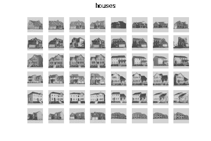
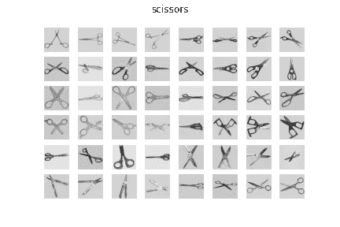
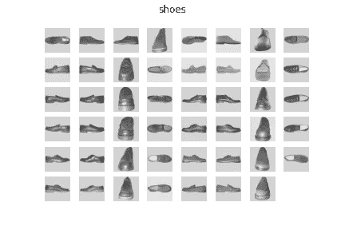
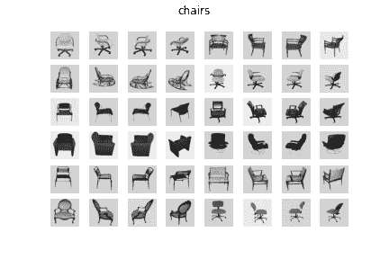
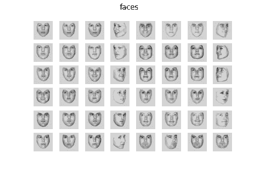
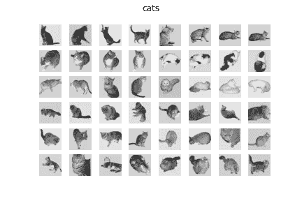

# 人脑认知计算模型导论(上)

> 原文：<https://towardsdatascience.com/introduction-to-cognitive-computational-modelling-of-human-brain-part-i-90c61e0e24c9?source=collection_archive---------25----------------------->

## [思想和理论](https://towardsdatascience.com/tagged/thoughts-and-theory)

## 机器学习和认知任务

解剖功能磁共振成像的可视化(图片由作者提供)

## 材料

这是该系列的第一篇文章，即“腹侧颞叶皮层时空功能磁共振成像的认知计算模型”。如果你想了解整个系列，请点击下面的链接。

  

我将介绍认知计算建模的话题及其在大脑解码研究中的用例。让我们开始吧。

所有相关资料都放在我的 Github 页面上。别忘了去看看。如果你是一个纸质爱好者，你可以阅读这一系列文章的纸质版，也可以在我的回购中找到。

<https://github.com/cankocagil/Cognitive-Computational-Modelling-for-Spatio-Temporal-fMRI-in-Ventral-Temporal-Cortex>  

人类大脑中的腹侧颞叶皮层对来自自然的视觉刺激的不同表示具有选择性，腹侧物体视觉通路产生分布式和重叠的神经反应[21]。进行单细胞研究以证明非人灵长类动物腹侧颞叶皮层中单个神经元的差异调谐对不同种类的对象具有选择性，并形成代表性特征[6，21]。然而，它们的选择性顺序对于更高程度的对象表示是不可概括和可扩展的[8]。为了模拟腹侧皮层的神经结构，开发了统计算法，但是通路中的不确定性仍然存在。关于神经成像的最新进展表明，人类感知、记忆和思维的时空解码可以通过功能性磁共振成像(fMRI)方法进行解码[11]。然而，由于时空分辨率的神经能力，fMRI 数据的复杂性和分布需要复杂的科学工具。随着机器学习的进步，神经科学家在大规模 fMRI 数据集中发现统计和结构模式，以解决神经科学背景下的各种任务。此外，深度学习的最新进展使研究人员能够解决未解决的神经科学任务[12]，并具体展示了深度学习的重要性。在这项研究中，我们建立了端到端的发现机器学习管道，以解码人类受试者基于 fMRI 数据观看的视觉刺激的类别。我们利用最先进的解释性神经成像技术，如回波平面、感兴趣区域(RoI)、统计图、解剖和玻璃脑方法，来可视化和预分析 fMRI 样本的视觉结构。

我的实验是基于区块设计的 4-D 时间序列 fMRI 数据集，即 Haxby 数据集[7，15，8]，来自对人脸和物体表征的研究。它由 6 名受试者组成，每名受试者 12 次[8]。在每一轮实验中，受试者被动地观看八个物体类别的灰度图像，这些物体被分成由休息时间分隔的 24s 块[8，7]。每个图像显示 500 毫秒，然后是 1500 毫秒的刺激间隔[7]。全脑 fMRI 数据以 2.5s 的体积重复时间记录，因此，刺激块被大约 9 个体积覆盖[8]。它由每个受试者的高分辨率解剖图像组成，除了第六个 4D fMRI 时间序列图像数据，其形状为 1452 个体积，具有 40×64×64 体素(对应于 3.5×3.75×3.75mm 的体素尺寸和 2.5 秒的体积重复时间)[8]。我们有 8 个不同的刺激类别，分别是剪刀、脸、猫、乱码、瓶子、椅子、鞋子和房子。静止状态的组块被消除，因为它不提供解码视觉刺激的额外信息[8]。

视觉刺激的例子(图片由作者提供)

在深入研究获取 Haxby 数据集及其探索性 fMRI 分析的 Python 代码之前，让我们先来看看整体分析的鸟瞰图，以及如何在神经解码的上下文中执行认知计算建模。

## 1.发现神经成像分析

作为发现神经成像分析，我们执行了最先进的解释性神经成像技术，如**回波平面、感兴趣区域(RoI)、统计地图、解剖和玻璃脑**方法，以可视化和预分析 fMRI 样本的视觉结构。我们将在本系列文章的第二部分进行深入讨论。

## 2.腹侧颞叶皮层的功能连接和相似性分析

我们执行了基于**相关性、精确度和部分相关性**的功能连接性分析，以及基于**余弦、闵可夫斯基和欧几里德**距离的相似性分析，以发现腹侧颞叶皮层中的重叠表示。

这在解释性 fMRI 分析中非常有用，因为它从统计和数学角度显示了人脑中分布的区域如何共享相似的特征。我们将在本系列文章的第三部分进行深入讨论。

## 3.人脑分布区域的流形学习与降维

对每个对象的腹侧时间掩模执行流形学习和维数减少方法，以提取时空掩模的潜在变量，这将有助于人脑的进一步解码。作为降维方法，我们应用了**主成分分析(PCA)、线性判别分析(LDA)、独立成分分析(ICA)、非负矩阵分解(NNMF)和多维标度(MDS)** 然后通过它们的 3D 可视化来比较这些获得的子空间。此外，我们执行流形学习算法提取掩盖腹侧颞区的潜在流形分布。我们执行了**t-随机邻居嵌入(t-SNE)、一致流形近似和投影(UMAP)、ISOMAP、局部线性嵌入(LLE)和谱嵌入(SE)** ，然后通过它们的 3D 可视化比较它们的低维流形，进一步帮助解码过程。

这将全面介绍理解人脑腹侧颞叶皮层的测地线关系。从人工智能的角度来看，这将是对无监督学习和人脑的交叉的深度回顾。我们将在本系列文章的第四部分进行深入讨论。

此时，我们只执行了发现分析来了解 fMRI 数据样本及其分布。接下来，我们将深入解码过程。

## 4.时空 fMRI 解码:ML 和 DL 算法

开发了端到端的机器学习算法，以根据腹侧颞叶皮层中的分布和重叠区域对刺激进行分类。准确地说，我们执行了以下机器学习算法:**线性支持向量分类器(LinearSVC)、随机梯度下降分类器(SGDClassifier)、多层感知器(MLP)、感知器、逻辑回归、逻辑回归交叉验证、支持向量分类器(SVC)、校准分类器(用保序回归进行概率校准)、被动攻击分类器、标签传播分类器、随机森林分类器、梯度增强分类器、二次判别分类器、脊分类器交叉验证、脊分类器、AdaBoost 分类器、额外树分类器、K-邻居分类器、伯努利朴素贝叶斯分类器、高斯朴素贝叶斯分类器、Nu-支持向量分类器、最近质心分类器和 Bagging 分类器**。作为稳健的集成解码，我们应用了正则化模型的新集成；**FREM:L2 正则化 SVCs 的交叉验证集合，FREM:L2 正则化 Logistic 回归的交叉验证集合**。我们通过利用不同视觉表示流之间的交互作用，进一步构建了认知神经网络，确切地说是具有 GELU 非线性的**MLPs【10】、2D 和 3D 卷积神经网络**。我们将在本系列文章的第五部分深入讨论，这将是本系列的最后一篇文章。

是的，那是巨大的。我知道，但是进行许多解码实验并比较它们的结果是至关重要的。不用担心，我们将在仅仅“两行”代码中实现几乎所有的 ML 算法。是的，我是认真的。我们将用两行代码实现几乎所有的算法。ML 工具的力量！

开始编码吧。在本文中，我们将只使用“nilearn”框架从 web 下载 Haxby 数据集，其中只有一行代码，该框架将在后面的系列文章中介绍，并探索数据集的结构。

首先，我们需要安装必要的 Python 包。打开您最喜欢的 Jupyter 笔记本，复制并粘贴以下代码进行必要的安装。

安装必要的 Python 包

然后，让我们导入我们将在这个过程中使用的所有必需的包。如果你想保存你的结果，创建一个名为“图像”和“结果”的文件夹，或者你可以删除下面的 66-67 行。

导入所有必需的 Python 包

我们准备开始了！请阅读下面的 docstring 以了解 Haxby 数据集，乍一看可能不容易理解，但不用担心。我们稍后会讨论更多。请注意，从网上下载数据大约需要 30 分钟，这取决于您的下载速度等。

感谢 Nilearn 从网络上获取 fMRI 数据

是的，我们下载了 fMRI 数据集。当你打印 *haxby_dataset 时，你会看到这样一个屏幕。*

我们简单讨论一下输出。上面有详细的描述，你也可以去参考 Haxby 数据集。还有*、*

*   *anat:fMRI 数据的解剖结构*
*   *func: Nifti 图像的 fMRI 数据(将被转换成 NumPy 矩阵)*
*   *session_target: Files 对应我们的目标变量(后面会讨论)*
*   *mask，mask_vt，mask_faces，…(提取腹侧颞叶皮层激活区域的不同空间掩模)*

让我们潜入更深的地方。这里，我们打印受试者的 fMRI 数据的文件名。不要担心“*nii.gz*”格式。它只是 fMRI 数据的有效表示。我们将使用“ *Nilearn* ”库轻松解码这个扩展，并将其转换为 NumPy 数组。

本文到此为止。我们讲述了我们如何以及为什么构建时空计算技术来理解人脑。我们从网上下载了哈克斯比数据集。讨论了数据集。最后，简要回顾了数据集。恭喜你！你完成了第一篇文章，并通过认知计算方法对人脑解码迈出了一步。

在下一篇文章中，我们将使用最先进的神经成像方法来分析和可视化 fMRI 数据集。

## 文章链接

1.  **发表文章**

<https://cankocagil.medium.com/introduction-to-cognitive-computational-modelling-of-human-brain-part-i-90c61e0e24c9>  

2.

<https://cankocagil.medium.com/discovery-neuroimaging-analysis-part-ii-b2cdbdc6e6c3>  

3.

<https://cankocagil.medium.com/functional-connectivity-and-similarity-analysis-of-human-brain-part-iii-c427c88ca5bb>  

4.

<https://cankocagil.medium.com/unsupervised-representation-learning-on-distributed-regions-in-the-human-brain-part-iv-55fecf4e1b6f>  

2.**在路上(即将推出…)**

1.  第五部分的占位符

## 进一步阅读

*   [https://www.hindawi.com/journals/cmmm/2012/961257/](https://www.hindawi.com/journals/cmmm/2012/961257/)

我在机器学习和神经科学方面的研究中使用了以下参考文献列表。我强烈建议复制粘贴参考资料，并简要回顾一下。

# 参考

[1]巴、基罗斯和辛顿。图层归一化，2016。

[2] L. Buitinck，G. Louppe，M. Blondel，F. Pedregosa，A. Mueller，O. Grisel，V. Niculae，P. Prettenhofer，A. Gramfort，J. Grobler，R. Layton，J. VanderPlas，a .乔利，B. Holt，10 和 G. Varoquaux。机器学习软件的 API 设计:scikit-learn 项目的经验。在 ECML PKDD 研讨会:数据挖掘和机器学习的语言，第 108–122 页，2013。

[3]褚，田，王，张，任，魏，夏，沈。双胞胎:重新审视《视觉变形金刚》中空间注意力的设计，2021。

[4] K .克拉默、o .德克、j .凯舍特、s .沙莱夫-施瓦兹和 y .辛格。在线被动攻击算法。2006.

[5] K. J .弗里斯顿。统计参数映射。1994.

[6]格罗斯、罗查-米兰达和本德。猕猴下颞皮质神经元的视觉特性。神经生理学杂志，35(1):96–111，1972。

[7] S. J .汉森、t .松坂和 J. V .哈克斯比。用于物体识别的腹侧颞叶组合编码。

[8]哈克斯比、戈比尼、富里、伊沙伊、斯豪滕和彼得里尼。《视觉物体识别》，2018。

[9]赫克曼、哈伊纳尔、贾巴尔、吕克特和哈默斯。结合标记传播和决策融合的自动解剖脑 mri 分割。神经影像，33(1):115–126，2006。

10d .亨德里克斯和 k .金佩尔。高斯误差线性单位(gelus)，2020。

[11]黄少华，邵文伟，王明林，张德庆.人脑活动视觉信息的功能解码:简要综述。国际自动化和计算杂志，第 1-15 页，2021。

[12] R. Koster、M. J. Chadwick、Y. Chen、D. Berron、A. Banino、E. Duzel、D. Hassabis 和 D. Kumaran。海马系统内的大循环复发支持跨发作的信息整合。神经元，99(6):1342–1354，2018。

[13]马奥尔。勾股定理:4000 年的历史。普林斯顿大学出版社，2019。

[14] K. A. Norman、S. M. Polyn、G. J. Detre 和 J. V. Haxby 超越读心术:功能磁共振成像数据的多体素模式分析。认知科学趋势，10(9):424–430，2006。

[15]奥图尔、江、阿卜迪和哈克斯比。腹侧颞叶皮层中物体和面孔的部分分布表征。认知神经科学杂志，17(4):580–590，2005。

[16] F .佩德雷戈萨、g .瓦洛夸、a .格拉姆福特、v .米歇尔、b .蒂里翁、o .格里塞尔、m .布隆德尔、p .普雷登霍弗、r .魏斯、v .杜伯格、j .范德普拉斯、a .帕索斯、d .库尔纳波、m .布鲁彻、m .佩罗特和 e .杜切斯内。sci kit-learn:Python 中的机器学习。机器学习研究杂志，12:2825–2830，2011。

17 r . a .波尔德拉克。功能磁共振成像的感兴趣区域分析。社会认知和情感神经科学，2(1):67–70，2007。

[18] M. Poustchi-Amin、S. A. Mirowitz、J. J. Brown、R. C. McKinstry 和 T. Li。回波平面成像的原理和应用:普通放射科医师回顾。放射学，21(3):767–779，2001。

[19] R. P. Reddy，A. R. Mathulla 和 J. Rajeswaran。心理健康专家的观点采择和情绪传染的初步研究:移情的玻璃脑观点。印度心理医学杂志，0253717620973380，2021 页。

[20]史密斯、米勒、萨利米-科尔希迪、韦伯斯特、贝克曼、尼科尔斯、拉姆齐和伍尔利奇。功能磁共振成像的网络建模方法。神经影像，54(2):875–891，2011。

21 田中先生。下颞叶皮层和物体视觉。神经科学年度评论，19(1):109–139，1996。

[22] M. S .特雷德。Mvpa-light:一个多维数据的分类和回归工具箱。神经科学前沿，14:289，2020。

[23] M. P .范登赫维尔和 H. E .波尔。探索大脑网络:静息态功能磁共振成像功能连接综述。欧洲神经精神药理学，20(8):519–534，2010。

[24] G. Varoquaux，A. Gramfort，J. B. Poline 和 B. Thirion。大脑协方差选择:使用群体先验的更好的个体功能连接模型。arXiv 预印本 arXiv:1008.5071，2010。

[25] Y. Wang，J. Kang，P. B. Kemmer 和 Y. Guo。一种利用偏相关估计大规模脑网络功能连接的有效可靠的统计方法。神经科学前沿，10:123，2016。

26s . Wold、K. Esbensen 和 P. Geladi。主成分分析。化学计量学和智能实验室系统，2(1–3):37–52，1987。

27s . Wold、K. Esbensen 和 P. Geladi。主成分分析。化学计量学和智能实验室系统，2(1–3):37–52，1987。