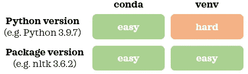
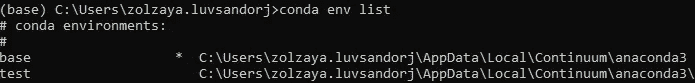
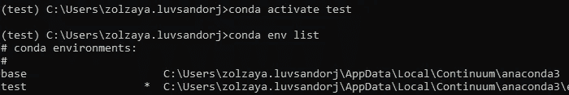
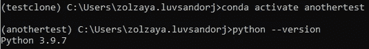
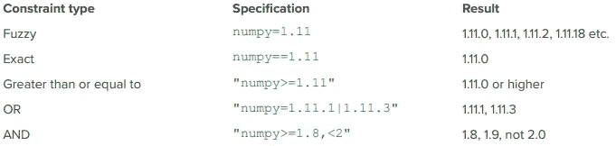
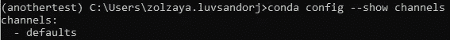
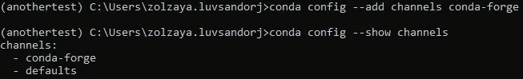
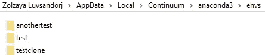

# 康达虚拟环境简介

> 原文：<https://towardsdatascience.com/introduction-to-conda-virtual-environments-eaea4ac84e28?source=collection_archive---------5----------------------->


照片由[张秀坤·兰格](https://unsplash.com/@the_real_napster?utm_source=medium&utm_medium=referral)在 [Unsplash](https://unsplash.com?utm_source=medium&utm_medium=referral) 拍摄

## 数据科学基础

## Python 中的可再现数据科学项目

再现性是一个好的数据科学项目的重要特征。从设置随机种子、数据版本控制到使用虚拟环境，许多因素都有助于提高数据科学项目的可重复性。在这篇文章中，我们将看看用 Conda 管理 Python 虚拟环境的基础。


照片由[迪帕克·纳特](https://unsplash.com/@deepakhnath?utm_source=medium&utm_medium=referral)在 [Unsplash](https://unsplash.com?utm_source=medium&utm_medium=referral) 拍摄

# 1.稍微了解一下康达及其相关术语📖

在我们开始学习管理虚拟环境的命令之前，熟悉一些关于 Conda 的常用术语可能会有所帮助。

## 📍 1.1.康达 vs 迷你康达 vs 蟒蛇

> [**Conda** 是一个独立于语言的工具，用于**包管理**和**环境管理**。](https://conda.io/en/latest/)作为软件包管理器，康达可以安装、更新和删除软件包。作为环境管理员，it 可以管理虚拟环境。
> 
> **Anaconda** [是最流行的 Python 发行版](https://www.anaconda.com/products/individual)(即将 Python 分发给像你我这样的最终用户的方式)。通过安装 Anaconda，你可以安装 Miniconda、 [Anaconda Navigator](https://docs.anaconda.com/anaconda/navigator/) (即一个图形用户界面)和精选软件包。
> 
> 迷你巨蟒是巨蟒的迷你版本。它也是一个 Python 发行版。通过安装 Miniconda，你得到了 conda，Python 和少量的安装包。

正如我们所见， [Conda 包含在 Anaconda 和 Miniconda 中。](https://conda.io/en/latest/)

## 📍 1.2.康达 vs Pip vs Venv

> Pip 是 Python 的一个包管理器。

这意味着 Conda 和 Pip 都可以用来安装、更新和删除 Python 中的包。Pip 提供了在[Python 包索引(PyPI)](https://pypi.org/) 上可用的更大范围的包，而 Conda 提供了在 [its 频道](https://docs.conda.io/projects/conda/en/latest/user-guide/concepts/channels.html)上可用的相对较小范围的包。因此，有时某个包只能通过 Pip 安装。

> **Venv** 是 Python 的环境管理器。

Conda 和 Venv 都擅长使用不同版本的包管理虚拟环境(即隔离和独立的环境)。然而，与 Venv 相比，Conda 的一个明显优势是易于管理多个 Python 版本。换句话说，Conda 使得使用不同版本的 Python 创建虚拟环境变得无缝。使用 Venv，我们将需要使用额外的工具来管理 Python 版本，或者在创建虚拟环境之前安装多个 Python 版本。



作者图片

# 2.使用 Conda 的虚拟环境💻

现在，让我们学习使用 Conda 管理虚拟环境的基础知识。我鼓励你在阅读的时候跟着电脑走，获得实践经验。


布鲁斯·杰斯特罗在 [Unsplash](https://unsplash.com?utm_source=medium&utm_medium=referral) 上拍摄的照片

## 📍 2.1.做好准备

*如果您按照部分中的命令进行操作，请确保您的计算机通过 Anaconda 或 Miniconda 安装了 Conda(版本 4.6+)。*

我们可以通过 Windows 上的 Anaconda 提示符和 Mac 上的终端访问 Conda。让我们首先按照以下说明为您的操作系统打开相关的命令行界面:

**Windows:** 按 Windows 键➡️键入 Anaconda 提示符➡️回车
MAC:按 cmd +空格键➡️键入终端➡️回车

现在，是时候创建虚拟环境了！

## 📍 2.2.创建虚拟环境

首先，让我们看看现有虚拟环境的列表:

```
$ conda env list # Option 1
$ conda info --envs # Option 2
```


我们有一个名为 *base* 的虚拟环境。当我们安装 Miniconda 或 Anaconda 时，它会创建一个名为 *base* 的默认环境。这就是我们在输出中看到的。

我们现在将学习创建虚拟环境的三种常用方法。

## 📍2.2.A .从 [YAML](https://en.wikipedia.org/wiki/YAML) 文件创建虚拟环境

创建虚拟环境的一种常见方式是从 YAML 文件:`environment.yml`或`environment.yaml`中创建。该文件包含虚拟环境的规范(例如，环境名称、包、它们的版本和 Python 版本)。你可以从[这里](https://github.com/ageron/handson-ml/blob/master/environment.yml)和[这里](https://github.com/fastai/fastai/blob/master/environment.yml)看到一些 YAML 文件的例子。如果我们在当前工作目录中有这样的 YAML 文件，我们可以使用下面的命令之一从它创建一个虚拟环境:

```
$ conda env create -f environment.yml # Short form
$ conda env create --file environment.yml # Long form
```

现在，让我们再次查看虚拟环境列表:

```
$ conda env list
```



截断输出

我们现在有了一个新的 Conda 环境，称为*测试*。带有星号的环境表示我们所处的活动环境。这意味着我们仍然处于基础环境中。让我们激活新环境，并再次检查虚拟环境列表:

```
$ conda activate test
$ conda env list
```



截断输出

我们可以看到新虚拟环境旁边的星号: *test* 。我们还可以在命令行的开头看到`()`中的活动环境名称，如上面截图的左上角所示。

## 📍2.2.B .通过克隆创建虚拟环境

创建虚拟环境的另一种方法是克隆现有环境。使用以下命令，我们克隆了一个名为 *test* 的环境，并将该克隆命名为 *testclone* :

```
$ conda create -n testclone --clone test # Short form
$ conda create --name testclone --clone test # Long form
```

一旦创建了环境，我们就可以像以前一样激活新创建的环境。

## 📍2.2.C .使用命令构建虚拟环境

有时候我们需要自己营造环境。让我们使用 Python 版本 3.9.7 创建一个环境，并将其命名为*另一个测试*:

```
$ conda create -n anothertest python=3.9.7
```

出现提示时，键入`y`并按 enter 键继续创建。如果我们不想被提示，我们可以在命令中添加`-y`:

```
$ conda create -n anothertest python=3.9.7 -y
```

让我们激活环境并检查 Python 版本:

```
$ conda activate anothertest
$ python --version
```



我们可以确认新环境使用的是 Python 3.9.7。在创建 Conda 环境时，我们可以上下 Python 版本。例如，如果我的基本 Python 是 3.7.1，我可以用 Python 3.5.3 或 3.9.7 创建一个环境。如果我们没有指定 Python 版本:`conda create -n anothertest -y`，新环境将使用与基本 Python 相同的 Python 版本。

[一次安装一个软件包会导致依赖冲突。Conda 的官方文档建议同时安装所有软件包，以便解决依赖冲突。](https://conda.io/projects/conda/en/latest/user-guide/tasks/manage-environments.html#creating-an-environment-with-commands)因此，我们现在将一次安装多个软件包，而不是逐个安装。这里有一个例子:

```
$ conda install "numpy>=1.11" nltk==3.6.2 jupyter -y
```

下面是我们在安装软件包时指定版本的不同方法:



来源:[康达备忘单](https://docs.conda.io/projects/conda/en/4.6.0/_downloads/52a95608c49671267e40c689e0bc00ca/conda-cheatsheet.pdf)(第 2 页)

如果我们不指定软件包的版本:`conda install numpy nltk jupyter -y`，Conda 将安装这些软件包的最新版本。

## 📍 2.3.康达频道

默认情况下，`conda install`会从它的`defaults`通道安装软件包。有时，某个包在此频道上不可用，但可能在其他 Conda 频道上可用，如由社区维护的热门频道`conda-forge`。我们可以使用以下命令检查当前通道:

```
$ conda config --show channels
```



要添加`conda-forge`频道并再次检查当前频道:

```
$ conda config --add channels conda-forge
$ conda config --show channels
```



我们可以看到一个额外的通道:`conda-forge`。这些频道的显示顺序显示了频道优先级。在这个例子中，`conda-forge`是高优先级信道。这意味着当我们运行`conda install package_name`时，Conda 将尝试从`conda-forge`通道安装一个包，如果它在`conda-forge`中不可用，它将尝试从`defaults`通道安装一个包。信道的这种变化不是特定于环境的，相反，它影响 Conda 的一般配置方式。如果你想删除一个`conda-forge`通道，你可以使用下面的命令:

```
$ conda config --remove channels conda-forge
```

如果我们不想添加一个通道，但仍想安装在另一个通道中可用但在`defaults`通道中不可用的软件包，我们可以使用以下替代命令从其他通道安装软件包:

```
$ conda install package_name -c conda-forge -y # Short form
$ conda install package_name --channel conda-forge -y # Long form
```

这不会改变通道配置，但会从该场合所需的通道(如本例中的`conda-forge`)安装软件包。

如果在 Conda 通道中没有可用的软件包，您可以使用`pip install`命令从活动环境中的 Pip 安装该软件包:

```
$ pip install package_name
```

现在是时候学习一些其他有用的命令来管理虚拟环境了。

## 📍 2.4.停用虚拟环境

使用完虚拟环境后，如果想要切换回基本环境，可以使用以下方法之一停用环境:

```
$ conda activate # Option 1
$ conda deactivate test # Option 2
```

## 📍 2.5.将环境规格导出到 YAML 文件

我们可以通过以下方式检查当前环境的规格:

```
$ conda list
```

这将显示环境细节，如使用的 Python 版本、安装的包名及其版本。要将当前环境的规范导出到当前目录下的 YAML 文件中，我们可以使用以下命令之一:

```
$ conda env export > environment.yml # Option 1
$ conda env export -f environment.yml # Option 2
```

## 📍 2.6.正在删除虚拟环境

现在让我们删除我们在本教程中创建的所有测试环境:

```
$ conda activate # Need to deactivate the environment first
$ conda env remove -n test
$ conda env remove -n testclone
$ conda env remove -n anothertest
$ conda env list
```

如果你用的是 Windows，我也建议你删除环境文件夹。如果你不确定在哪里可以找到这些文件夹，`conda env list`会显示位置。例如，文件夹在我电脑上的这个位置:



删除它之后，所有的测试环境都将被完全删除。现在轮到你为你的项目创建一个虚拟环境了！


照片由 [AARN GIRI](https://unsplash.com/@_giri_?utm_source=medium&utm_medium=referral) 在 [Unsplash](https://unsplash.com?utm_source=medium&utm_medium=referral) 上拍摄

在这篇文章中，我们介绍了使用命令行的 Conda 虚拟环境的基础知识。如果您想探索，也可以使用 Anaconda Navigator 管理虚拟环境。如果你想了解更多关于康达的信息，[这里](https://jakevdp.github.io/blog/2016/08/25/conda-myths-and-misconceptions/)有一篇由[杰克·范德普拉斯](https://github.com/jakevdp)撰写的关于*“康达神话和误解”*的深刻文章。

*您想访问更多这样的内容吗？媒体会员可以无限制地访问媒体上的任何文章。如果您使用* [*我的推荐链接*](https://zluvsand.medium.com/membership)*成为会员，您的一部分会费将直接用于支持我。*

感谢您阅读我的文章。如果你感兴趣，这里有我其他一些帖子的链接:

◼️️ [面向数据科学的 Python 虚拟环境简介](/introduction-to-python-virtual-environment-for-data-science-3c216929f1a7?source=your_stories_page-------------------------------------)
◼️️ [面向数据科学的 Git 简介](/introduction-to-git-for-data-science-ca5ffd1cebbe?source=your_stories_page-------------------------------------)
◼️️ [贝叶斯定理讲解](/bayes-theorem-explained-1b501d52ae37)
◼️️ [比较随机森林与梯度推进](/comparing-random-forest-and-gradient-boosting-d7236b429c15)
◼️️ [决策树是如何构建的？](/how-are-decision-trees-built-a8e5af57ce8?source=your_stories_page-------------------------------------)
◼️️ [管道、ColumnTransformer 和 FeatureUnion 说明](/pipeline-columntransformer-and-featureunion-explained-f5491f815f?source=your_stories_page-------------------------------------)
◼️️ [FeatureUnion、ColumnTransformer &管道用于预处理文本数据](/featureunion-columntransformer-pipeline-for-preprocessing-text-data-9dcb233dbcb6)

再见🏃 💨