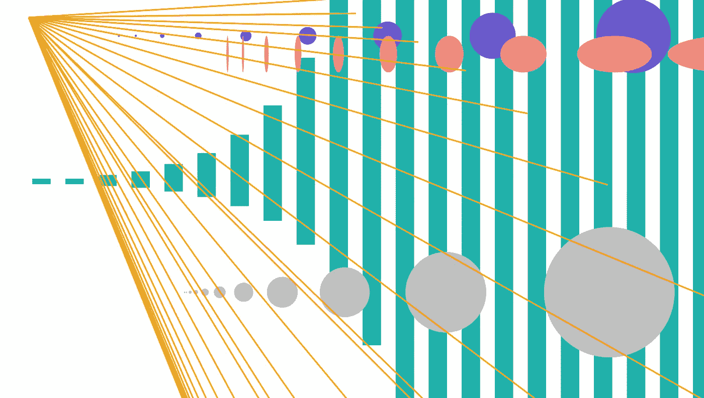

# D3.js 中的数据驱动形状简介

> 原文：<https://towardsdatascience.com/introduction-to-data-driven-shapes-in-d3-js-8c169a3477b3?source=collection_archive---------21----------------------->

在 [Unsplash](https://unsplash.com/s/photos/fibonacci?utm_source=unsplash&utm_medium=referral&utm_content=creditCopyText) 上由 [Ira Mint](https://unsplash.com/@iramint?utm_source=unsplash&utm_medium=referral&utm_content=creditCopyText) 拍摄的照片

## 使用**斐波纳契数列**

作为一个虔诚的 python 爱好者，我很遗憾地避开了探索许多超出 Matplotlib、Seaborn 和 Plotly 等库范围的数据可视化工具。然而，当在这个[可视化图库](https://observablehq.com/@d3/gallery)中仔细阅读 D3.js 的各种功能时，我非常兴奋能够尝试一下。

D3 是一个 JavaScript 库，支持高度可定制和交互式的基于 web 的数据可视化。它是“数据驱动文档”的缩写，它允许开发者基于数据创建和操作 web 文档。之前熟悉 HTML、CSS 和 JavaScript 会让 D3 更容易上手，但是只需要最基本的东西就可以制作简单的形状。本文将介绍 D3 的一些常见形状——包括矩形、圆形、椭圆形、线条和文本——它们的大小将基于[斐波那契数列](https://en.wikipedia.org/wiki/Fibonacci_number)中的数字。这些仅仅是可以用 D3 代码轻松生成的[多种类型](https://www.d3-graph-gallery.com/graph/shape.html)形状的一个例子。

# 你需要什么

要开始在 D3 中进行可视化，您需要一个文本编辑器，比如 [Atom](https://atom.io/) ，来编辑您的代码。您还需要复制 D3.js 最新版本的[内容](https://d3js.org/d3.v6.js)，并将其粘贴到您的文本编辑器中的一个. js 文件中。除了 D3 文件，您还需要以下内容:

*   一个 **HTML 文件**用于引用 CSS 和 JavaScript 文档并格式化网页的结构
*   一个 **CSS 文件**用于格式化网页内容
*   D3 代码的一个 JavaScript 文件

我们现在将仔细看看这些文件的内容。

# HTML 文件

HTML 文件允许您在浏览器中呈现在 D3 中创建的可视化效果。我们将使用的 HTML 代码非常简单:

第一行声明这是一个 HTML 文档，第二行指定文档的内容将使用英语。head 标签标记文档的 head 元素，其中包含元数据。当您在浏览器中打开 HTML 文档时，title 标签中的文本会呈现在浏览器选项卡中。

head 标签中接下来的两行分别引用 CSS 文件和 D3 版本 6 的内容。如果您选择对您引用的文件使用不同的名称，这些行中的名称需要更新。这同样适用于在文档主体中引用的“shapes.js”文件，该文件包含其所有可见的内容。最后，结束 html 标记标志着文档的结束。

# CSS 文件

CSS 是一种样式表语言，处理网页中的颜色、字体和间距等功能。在这个简单的文件中，我们将页面的边距设置为零像素(元素周围没有空白)，高度设置为 100%(较大的元素将填充页面，但不会超出其边界来呈现滚动条):

# JavaScript 文件

“shapes.js”文件是我们放 D3 代码的地方，用来创建基于斐波那契数列的形状。这个数字序列从 0 和 1 开始，后面的每个数字都是前面两个数字的和。下面，我们定义一个变量“dataArray ”,该变量包含形状将基于的数据:

我们还将使用以下代码创建一个“svg”变量:

svg 代表“可缩放矢量图形”，这个 SVG 元素可以被认为是 D3 形状的空白画布。我们选择 HTML 文档的主体部分，并向其追加(即添加)一个 svg 元素。高度和宽度属性都设置为 100%，因此附加到该元素的形状将填充整个页面。

## 长方形

接下来，我们将添加一些矩形:

在这里，我们选择将被追加到 svg 元素的所有矩形，随后的属性控制它们的尺寸、颜色和在页面上的位置。将`**.data(dataArray)**` 链接到选区会将我们的斐波那契数据绑定到矩形。请注意，矩形的静态宽度为 50 像素，但其高度是动态的:

作者图片

这是因为高度是基于使用绑定到选择的“dataArray”的函数。函数定义中的“d”和“I”分别表示单个数据点及其在数组中的位置(索引)。您可以给这些参数起任何您喜欢的名字，函数仍然会有相同的输出。

该函数按顺序遍历数据数组。在上面你看到的最短、最左边的矩形中，高度是 1*15 或 15 像素。第二个矩形也是 15 像素高，第三个矩形是 30 像素，依此类推。数据数组还用于动态改变“x”和“y”属性，使矩形垂直居中，水平间隔均匀。您可以更改这些属性函数中的值，以观察矩形的位置如何变化。

## 环

接下来，我们将在页面上添加一些圆圈:

我们首先定义一个新变量“newX”，供以后在设置圆的水平位置的函数中使用。请注意，我们选择了页面上所有的“circle.first”元素。我们将“first”分配给 circles 的“class”属性，因为我们将向页面添加多组圆圈。创建类并指定特定类的元素可以消除对要选择的形状的任何混淆。圆的半径由“r”属性决定，是 3 和数组中每个数据点的乘积。

我们现在将添加第二组圆:

请注意，在下图中，银色圆圈的间距比紫色圆圈更近，序列中最初的圆圈半径略小，并且在页面上的垂直位置较低。这些差异由分配给“第一”和“第二”类圆属性的单独值(静态和动态)决定:

作者图片

## 椭圆

椭圆类似于圆，但它们没有单一的“r”属性，而是同时具有“rx”和“ry”属性:

这些属性允许您分别调整椭圆的水平和垂直半径。以下椭圆的静态垂直半径为 50 像素，动态水平半径为其在数据数组中对应值的三倍:

作者图片

尽管被分配了一个静态值，但在序列的后面的点上，垂直半径可能会减小。随着 x:y 比率的变化，水平半径的稳定增加产生了这种外观。

## 线

现在让我们来看一些添加行的代码:

下图显示了每个新属性的含义:

*   **x1:** 直线右端的水平位置
*   **x2:** 直线左端的水平位置
*   **y1:** 直线右端的垂直位置
*   **y2:** 直线左端的垂直位置
*   **笔画:**线条的颜色
*   **线条宽度:**线条的宽度

作者图片

因为 x2 和 y2 是静态的，你会注意到所有的线都是从一个点开始的，但是它们的长度和位置会根据它们被赋予的斐波那契值而改变。

## 文本

最后，我们来补充一些文字！

与其他形状一样，描边和描边宽度是指形状的轮廓颜色和宽度。“文本锚”属性允许您调整文本对齐方式，这里是页面的开始或左侧。的’。' text '行将数据数组中的每个数据点添加到文本中。下面，这段代码被重新使用，以包括页面上不同颜色和不同 y 位置的多行斐波纳契数列:

作者图片

# 结论

斐波纳契数列不是有意义的数据，但它有助于说明 D3 形状的大小、间距和其他属性如何根据数组中的数据动态更新。这篇文章甚至还没有触及 D3 所有可能的形状的表面，但是我希望它鼓励其他初学者和我一起探索这个强大的可视化库！