# Datasette 简介:在一行代码中探索和发布您的数据

> 原文：<https://towardsdatascience.com/introduction-to-datasette-explore-and-publish-your-data-in-one-line-of-code-cbdc40cb4583?source=collection_archive---------24----------------------->

## 现在，您可以与他人分享探索数据的乐趣了！

# 动机

您是否曾经想要在浏览器中浏览数据集或发布您的数据集，以便其他人可以浏览和下载您的数据？如果有，试试 Datasette。

下面是您的数据在使用 Datasette 发布后的网站外观。

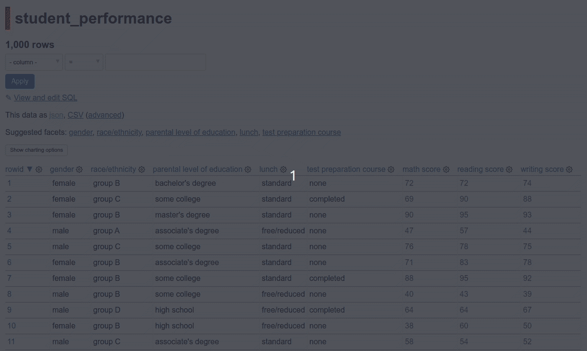

作者 GIF

在深入研究这篇文章之前，您可以先尝试使用 Datasette】探索一下[FiveThirtyEight 的仇恨犯罪数据集。](https://fivethirtyeight.datasettes.com/fivethirtyeight/hate-crimes%2Fhate_crimes)

# 什么是 Datasette？

Datasette】是一个在网络浏览器中浏览数据并将其发布为交互式网站的工具。

要安装 Datasette，请键入:

```
pip install datasette
```

如果这对您不起作用，请在这里找到安装 Datasette】的其他方法。

要使用 Vega 可视化网站中的数据，请键入:

```
pip install datasette-vega
```

由于 Datasette 使用 sqlite，我们也将安装 [sqlite-utils](https://github.com/simonw/sqlite-utils) 来操作 SQLite 数据库。

```
pip install sqlite-utils
```

# 创建数据库和表

什么是数据库和表？数据库是表格形式的多条信息的集合。表格是行和列中特定数据记录的集合。

比如下图中，`fivethirtyeight`数据库可以有`ahca_polls`、`airline-safety`等多个表。

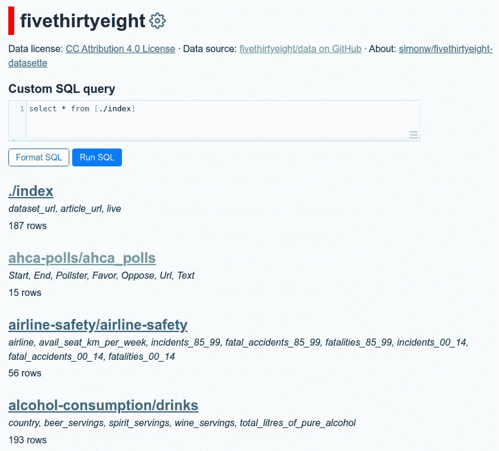

作者图片

让我们试着创建我们自己的数据库和表。我们将从创建一个名为`test.db`的空数据库开始:

```
$ touch test.db
```

举例来说，我们将从 Kaggle 下载[学生考试成绩数据](https://www.kaggle.com/spscientist/students-performance-in-exams):

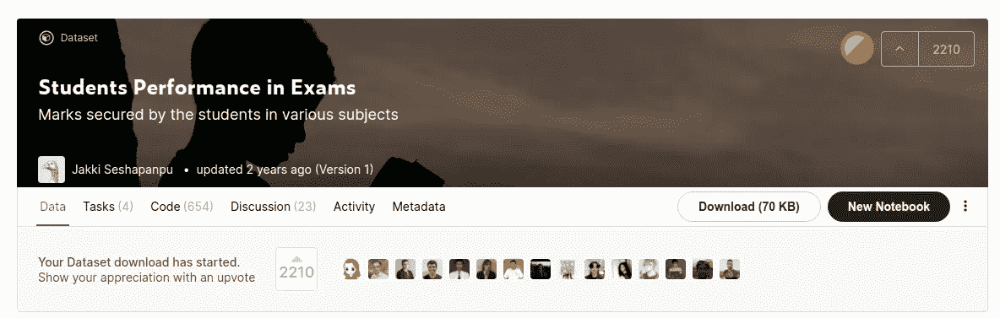

作者图片

然后将下载的 CSV 文件中的记录插入到`student_performance`表中。

```
$ sqlite-utils insert test.db student_performance \ StudentsPerformance.csv --csv
```

不错！现在，我们应该可以在输入时看到我们刚刚创建的表

```
$ sqlite-utils tables test.db --schema --table
```

输出:

```
table                schema
-------------------  --------------------------------------
student_performance  CREATE TABLE [student_performance] (
                        [gender] TEXT,
                        [race/ethnicity] TEXT,
                        [parental level of education] TEXT,
                        [lunch] TEXT,
                        [test preparation course] TEXT,
                        [math score] TEXT,
                        [reading score] TEXT,
                        [writing score] TEXT
                     )
```

# 在浏览器中浏览数据

现在，我们已经准备好对刚刚创建的数据库运行 Datasette 来研究数据了！类型:

```
$ datasette test.db
```

在 [http://localhost:8001](http://localhost:8001/) 上启动 web 服务器。单击该链接，您应该会看到如下内容:

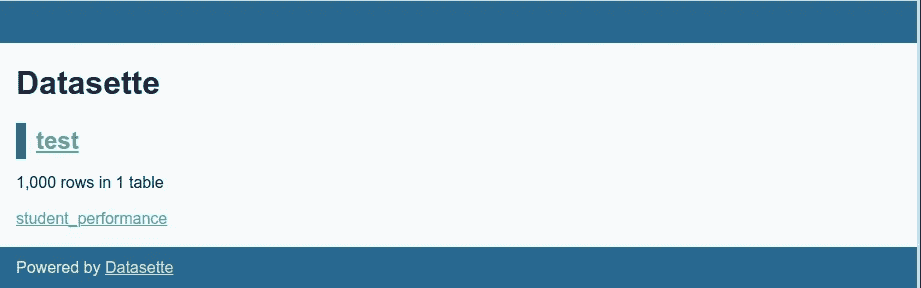

作者图片

点击`sudent_performance`浏览`student_performance`表:


作者 GIF

在这个 web 服务器中，我们可以:

*   浏览数据内容，包括排序和过滤。下面是使用 Facet 仅显示性别为女性的行的示例:

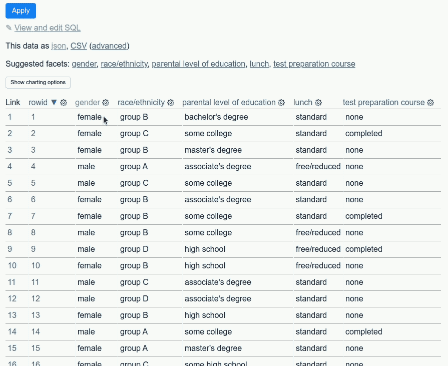

作者 GIF

*   使用 Vega 可视化数据

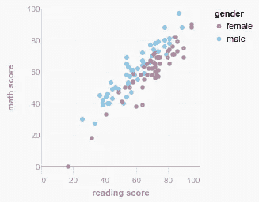

作者图片

*   编写自定义 SQL 查询

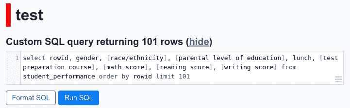

作者图片

*   将数据保存为 CSV 或 JSON 文件:

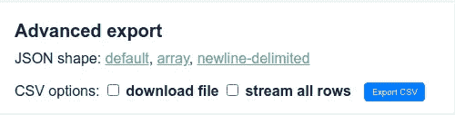

作者图片

# 发布到 Heroku

Datasette 最好的特性之一是能够将本地数据发布到互联网上。你需要一个 Heroku 或谷歌云的托管账户。

由于 Heroku 使我们能够在云中免费运行应用程序，我们将使用 Heroku 来发布我们的数据。

从在 [Heroku](https://www.heroku.com/) 创建账户开始。然后单击右上角的“新建”创建一个新应用程序:

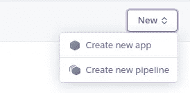

作者图片

创建一个名为`performance-in-exam`的新应用:

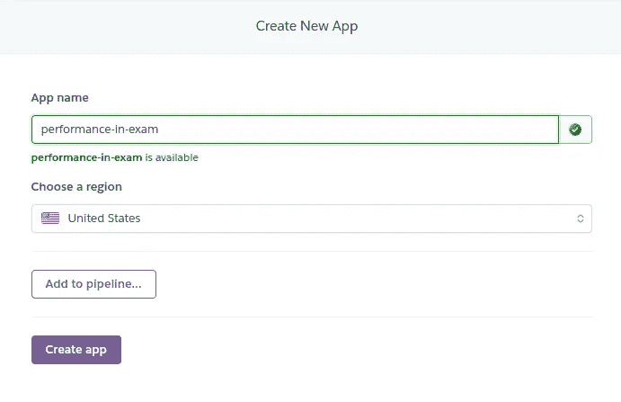

作者图片

然后通过键入以下命令登录:

```
$ heroku login
```

我们准备使用 Datasette 将我们的数据发布到 Heroku！

```
$ datasette publish heroku test.db -n performance-in-exam \
--install datasette-vega
```

在上面的代码中:

*   `-n`指定部署时要使用的应用程序名称
*   `--install`指定要安装的附加软件包。我们添加了`datasette-vega`来在部署应用程序时安装`datasette-vega`包。

您应该会看到类似这样的内容:

```
[https://performance-in-exam.herokuapp.com/](https://performance-in-exam.herokuapp.com/) deployed to Heroku
```

现在你可以点击[https://performance-in-exam . heroku app . com/test/student _ performance](https://performance-in-exam.herokuapp.com/test/student_performance)在你的浏览器中浏览数据！

# 定制您的网站

您还可以为网站上的元数据添加标题和“关于”标签。要添加标题和 about，请在命令中添加`—-title`和`--about`:

```
$ datasette publish heroku test.db -n performance-in-exam \
--install datasette-vega \
--title "Students Performance in Exams" \
--about "This data set consists of the marks secured by the students in various subjects."
```

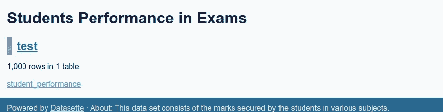

作者图片

应该有一个标题和描述被添加到您的网站！

如果我们想在数据库或表格中添加描述，我们可以将这些信息添加到`metadata.json`文件中:

然后将`--metadata`添加到命令中:

```
$ datasette publish heroku test.db -n performance-in-exam \
--install datasette-vega \
--metadata metadata.json
```

您的表将有一个新的标题、描述、许可和到数据源的链接！

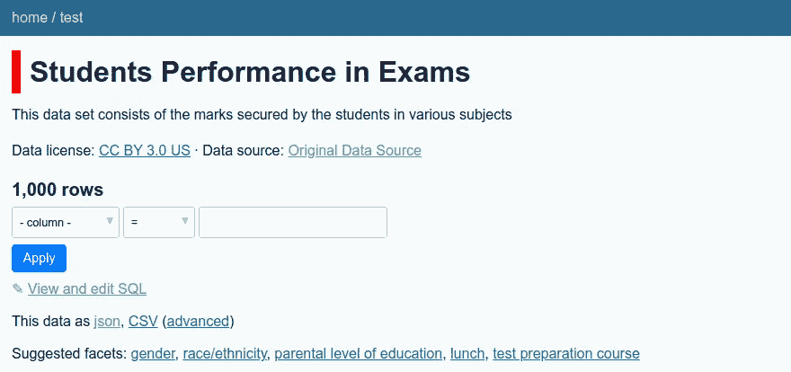

作者图片

在这里找到你的`metadata.json`文件[的更多选项。](https://docs.datasette.io/en/latest/metadata.html)

# 我还可以用 Datasette 做什么？

Datasette 还允许通过使用插件来实现附加功能。以下是一些你可以尝试的很酷的插件:

## 使用地图浏览您的数据

[dataset-cluster-map](https://datasette.io/plugins/datasette-cluster-map)是一个[dataset 插件](https://docs.datasette.io/en/stable/plugins.html)，它检测具有`latitude`和`longitude`列的表格，并将其绘制在如下所示的地图上:

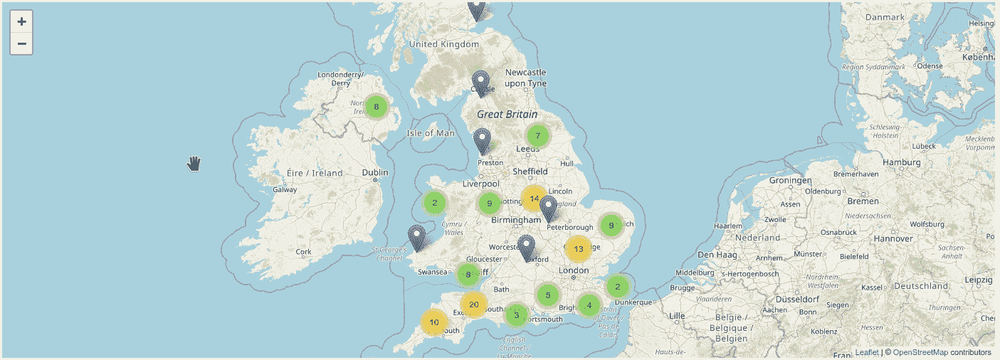

作者 GIF

试试 global-power-plants.datasettes.com 的[插件](https://global-power-plants.datasettes.com/global-power-plants/global-power-plants)

## 为您的页面添加安全性

[datasete-auth-passwords](https://datasette.io/plugins/datasette-auth-passwords)是一个 datasete 插件，允许您使用如下密码进行身份验证。当你只希望某些用户访问私人数据时，这个插件是理想的。

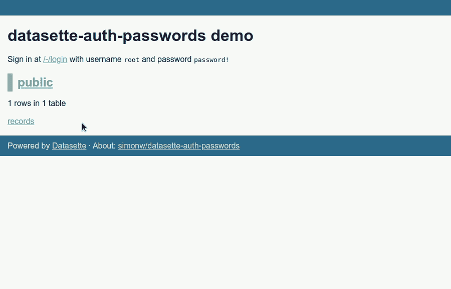

作者 GIF

试试[https://dataset-auth-passwords-demo . dataset . io](https://datasette-auth-passwords-demo.datasette.io/)上的插件

## 一次搜索所有可搜索的表格。

[datasete-search-all](https://datasette.io/plugins/datasette-search-all)是一个 datasete 插件，允许您一次搜索所有表格，如下所示:

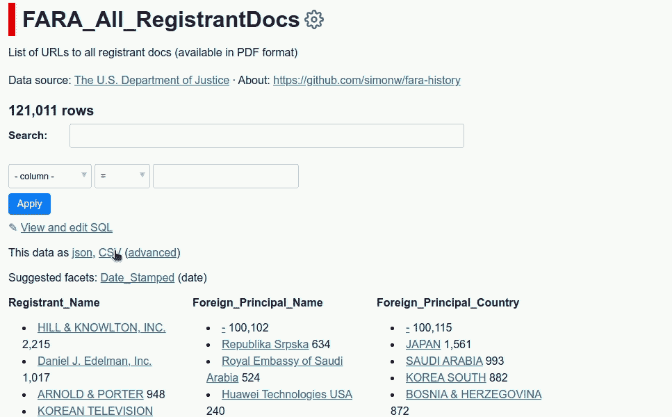

作者 GIF

在 https://datasette.io/plugins/datasette-search-all 试用这个插件。

在这里找到其他 Datasette 插件[。](https://datasette.io/plugins)

# 结论

恭喜你！您刚刚学习了如何在一行代码中使用 Datasette 来探索和发布数据。我鼓励你用自己的数据来尝试 Datasette。想象一下，如果你能与你的队友或关系分享探索你的数据的快乐，那该有多有趣！

我喜欢写一些基本的数据科学概念，并尝试不同的算法和数据科学工具。你可以在 LinkedIn 和 Twitter 上与我联系。

如果你想查看我写的所有文章的代码，请点击这里。在 Medium 上关注我，了解我的最新数据科学文章，例如:

</introduction-to-dvc-data-version-control-tool-for-machine-learning-projects-7cb49c229fe0>  </introduction-to-schema-a-python-libary-to-validate-your-data-c6d99e06d56a>  </top-4-code-viewers-for-data-scientist-in-vscode-e275e492350d>  </streamlit-and-spacy-create-an-app-to-predict-sentiment-and-word-similarities-with-minimal-domain-14085085a5d4> 