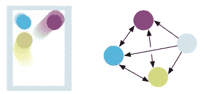

# DeepMind 的图形网络介绍

> 原文：<https://towardsdatascience.com/introduction-to-deepminds-graph-nets-b389430476fd?source=collection_archive---------21----------------------->

## 图网核心组件的简要概述


Iza Gawrych 在 [Unsplash](https://unsplash.com/s/photos/russian-dolls?utm_source=unsplash&utm_medium=referral&utm_content=creditCopyText) 上拍摄的照片

2018 年 10 月，来自 DeepMind/Google、麻省理工学院和爱丁堡大学的 27 名研究人员组成的团队发表了一篇论文，题为: [*“关系归纳偏差、深度学习和图网络”*](https://arxiv.org/abs/1806.01261) *。*

[](https://deepmind.com/research/open-source/graph-nets-library) [## 图形网络库

### Graph Nets 是 DeepMind 的库，用于在 TensorFlow 和 Sonnet 中构建图形网络。

deepmind.com](https://deepmind.com/research/open-source/graph-nets-library)  [## 关系归纳偏差、深度学习和图形网络

### 人工智能(AI)最近经历了一次复兴，在视觉等关键领域取得了重大进展

arxiv.org](https://arxiv.org/abs/1806.01261) 

本文的关键部分是“立场文件”和实际实现，因为它包括一个用于在 TensorFlow 和 Sonnet 中构建图形神经网络的库(Sonnet 是 DeepMind 在 TensorFlow 之上的神经网络库)。到目前为止，这篇论文已经被引用了近 1000 次，因此值得进一步研究。

[](https://github.com/deepmind/graph_nets) [## 深度思维/图形网

### Graph Nets 是 DeepMind 的库，用于在 Tensorflow 和 Sonnet 中构建图形网络。联系 graph-nets@google.com…

github.com](https://github.com/deepmind/graph_nets) 

在本说明中，Mark Needham 和我将首先总结论文提出的关键理论论点，然后通过一个玩具示例来说明图形网络库。

> **TLDR** : Graph-Nets 是 DeepMind 的低级**图形神经网络模型**和库，它提供了如此大的灵活性，几乎任何现有的 GNN 都可以使用 6 个核心函数来实现，并且可以扩展到时态图。

## 理论上…

该论文的前提如下:为了使 AI 获得类似人类的能力，它必须应用*(CG)，并且为了实现这一目标，它必须将其学习偏向于 ***结构化的*** 表示和计算。*

*组合概括的定义是:*

> **从已知的构建模块中构建新的推理、预测和行为。**

*非正式地:一小组元素，比如单词，可以以无限的方式有效地组合，比如句子和一本书。人类有能力“无限使用有限的手段”。*

**那么，如何才能提高 AI 对于 CG 的能力呢？*
我们通过前面提到的“将学习偏向结构化表示和计算……特别是在 ***图*** 上操作的系统”来做到这一点。或者更简洁地说:这篇论文的主题是，为了推进人工智能，我们需要转向对图形的学习。*

*本文通过定义“*关系推理*和“*归纳偏差*”将这种方法形式化如下:*

> *"关系推理被定义为使用规则操纵实体和关系的结构化表示."*

*实体是具有属性的元素，因此*节点*，关系是它们之间的*关系*，而一个“*规则*是将实体和关系映射到其他实体和关系的函数。*

**归纳偏差*(或学习偏差)是一组*假设*，学习算法使用这些假设来预测它没有遇到的给定输入的输出。*

*一个例子是***K-最近邻居*** :假设/偏差是彼此靠近的事件倾向于属于同一类，并且在一开始就被确定。*

**

*懒惰的程序员*

*然后，*“关系归纳偏差”*是指在学习过程中对实体之间的关系和交互施加约束(即假设/偏差)的归纳偏差。一个例子是多层感知器(MLP ),其中分级处理是一种关系归纳偏差。*

*是的，这听起来太棒了，但是我怎样才能把它用在实际的图表上呢？*

*好吧，这篇论文抱怨说, ***缺少一个模型*** ，该模型具有实体和关系的显式表示，以及找到计算它们的交互的规则的学习算法。
然后指出一般来说 ***图*** *是一种支持任意(成对)关系结构*的表示，在图上的计算确实提供了很强的关系归纳偏向，比 RNN、CNN 等更优越。*

*就这样作者引入了“ ***图网络***【GN】的概念，定义为:*

> *“GN 框架定义了一类用于关系推理和图形结构表示的函数”*

*总之，GN 框架有效地概括和扩展了现有的图形神经网络。GN 框架提供的关键扩展是它能够**处理和预测图形序列**，从而预测动态系统随时间的轨迹。理论上，打台球可以被建模为:*

**

*台球桌等刚体系统——图片摘自[巴塔格利亚等人](https://arxiv.org/abs/1806.01261)*

*GN 框架中的主要计算单元是“GN 块”，它是一个*图到图* *模型*，它将一个图作为输入，执行结构的计算，并返回一个图作为输出。*

**

*GN 块——从[巴塔格利亚等人](https://arxiv.org/abs/1806.01261)中提取的图像*

*在代码中，这样的块由“ *GraphsTuple* ”表示。一个 GN 块由 **6 个核心功能**组成:*

*   ***3 个“更新”功能**:每个节点、边和全局属性一个*
*   ***3 个“聚合”功能**:聚合每个节点的边属性，聚合全局的边和节点属性*

*这种方法具有很大的灵活性，因此 GN 框架可以用来实现各种各样的架构。*

## *实际上…*

*表示图结构数据的核心构件是 *GraphsTuple* 类。该对象代表一个或多个图 的 ***批次，所有网络模块将 GraphsTuple 的实例作为输入，并返回 GraphsTuple 作为输出。****

*这些图表是…*

*   **有向*(单向边)，*
*   **属性化*(允许节点级、边级和图级特征)，*
*   **多图*(多条边可以连接任意两个节点，允许有自边)。*

*为了创建一个 GraphsTuple，从而创建一个图，我们需要创建一个字典列表，其中包含关键字:`globals`、`nodes`和`edges`，这些关键字代表各自的浮点值特征向量。*

****边列表*** 由`senders`表示，`receivers`由整数值节点索引表示。*

*我们也可以通过简单地从字典中省略关键字来加载没有特征的图。同样，简单集合可以表示为一个图，其中节点特征是集合的元素。在这种情况下，字典只包含一个键值对。*

## *如何在图形网络中创建图形的示例:*

*[](https://colab.research.google.com/drive/1J4a7ngAK744svL4_pYTZqln8nGmIkLJb?usp=sharing) [## 谷歌联合实验室

### 图表结构

colab.research.google.com](https://colab.research.google.com/drive/1J4a7ngAK744svL4_pYTZqln8nGmIkLJb?usp=sharing) 

图表中的这个图形可以显示如下:


GraphTuples 渲染，用 [https://arrows.app](https://arrows.app) 制作

## 图网库及应用

重申一下，GN 框架定义了一类函数，因此，Graph-Nets 库列出了 51 类函数。

这些可以分成*三个*主要部分。

*   首先，*核心模块*由`graph-nets.modules`给出，由 7 个[类](https://github.com/deepmind/graph_nets/tree/master/graph_nets)组成。
*   其次，为了构建定制的图形网络模块，需要部署`[graph_nets.blocks](https://github.com/deepmind/graph_nets/blob/master/docs/contents.md)`中的类
*   最后，剩下的函数是效用函数。

我们将简要描述和说明两个模块的构造:`GraphNetwork`和`InteractionNetwork`。

## **如何实例化一个图形网络模块？**

图形网络的实现基本上是使用`[modules.GraphNetwork](https://github.com/deepmind/graph_nets/blob/master/docs/graph_nets.md)`类完成的，它构造了核心 GN 块。
该配置可以为*边缘*、*节点*和*全局*获取三个可学习的子功能，并且是对 Sonnet 库和模块的调用。
这些可以是线性模块(`[snt.Linear](https://sonnet.readthedocs.io/en/latest/api.html#linear-modules)`)或多层感知器(`[snt.nets.MLP](https://sonnet.readthedocs.io/en/latest/api.html#mlp)`)，或者是十四行诗的[循环模块中的 14 个类中的任何一个。](https://sonnet.readthedocs.io/en/latest/api.html#recurrent-modules)

 [## 基本十四行诗文档

### 执行 RNN 的动态展开。展开对应于在输入序列的每个元素上调用核心…

十四行诗](https://sonnet.readthedocs.io/en/latest/api.html#recurrent-modules) 

Sonnet 在后端提供的功能看起来确实很强大，为任何 GNN 的设计提供了很大的灵活性。

一旦创建了一个 GraphsTuple，正如我们前面所做的，剩下的工作就是创建一个 GraphNetwork 来指定这些函数，下面是一个例子:

```
OUTPUT_EDGE_SIZE = 6
OUTPUT_NODE_SIZE = 5
OUTPUT_GLOBAL_SIZE = 3graph_network = modules.GraphNetwork(
 edge_model_fn=lambda: snt.Linear(output_size=OUTPUT_EDGE_SIZE),
 node_model_fn=lambda: snt.Linear(output_size=OUTPUT_NODE_SIZE),
 global_model_fn=lambda: snt.Linear(output_size=OUTPUT_GLOBAL_SIZE))output_graphs = graph_network(graphs_tuple)
```

## **互动网络**

*“消息传递神经网络”*的一个例子由`[modules.InteractionNetwork](https://github.com/deepmind/graph_nets/blob/master/graph_nets/modules.py?q=class:InteractionNetwork)`给出，它实现了巴塔格利亚等人的论文的工作:[“用于学习关于对象、关系和物理的交互网络”](https://arxiv.org/pdf/1612.00222.pdf)。在这里，作者开发了一个模型，“它可以推理复杂系统中的对象如何交互”，对于这个模型，消息传递组件是至关重要的一部分。

 [## 学习物体、关系和物理的互动网络

### 对物体、关系和物理的推理是人类智能的核心，也是人工智能的关键目标

arxiv.org](https://arxiv.org/abs/1612.00222) 

同样，一旦构建了 GraphsTuple，它只需要指定十四行诗函数并传递 GraphsTuple，如下所示:

```
interact = modules.InteractionNetwork(
 edge_model_fn=lambda: snt.Linear(output_size=OUTPUT_EDGE_SIZE),
 node_model_fn=lambda: snt.Linear(output_size=OUTPUT_NODE_SIZE)
)interact_graph = interact(graphs_tuple)
```

这将返回一个带有更新的边和节点的 GraphsTuple，如下所示:


可以看出，节点和边特征得到了实质性的转化和扩展，为 ***交互网络模型*** 提供了基础。

作者还提供了许多可运行的例子作为笔记本

[](https://colab.research.google.com/github/deepmind/graph_nets/blob/master/graph_nets/demos/graph_nets_basics.ipynb) [## 谷歌联合实验室

colab.research.google.com](https://colab.research.google.com/github/deepmind/graph_nets/blob/master/graph_nets/demos/graph_nets_basics.ipynb) 

# 结论

Graph-Nets 是一个低级库，用于在 TensorFlow/Sonnet 中构建 GNN，它提供了很大的灵活性，允许实现大多数(如果不是所有)现有的 GNN 架构。

组成“GN 块”的能力允许动态系统上的图形序列和计算。

至于未来的工作，我们打算探索如何将 Graph-Nets 与 Neo4j 集成，并探索其他 GNN 库，如[【jraph】](https://github.com/deepmind/jraph)和 [Deep Graph Library](https://www.dgl.ai/) 。*