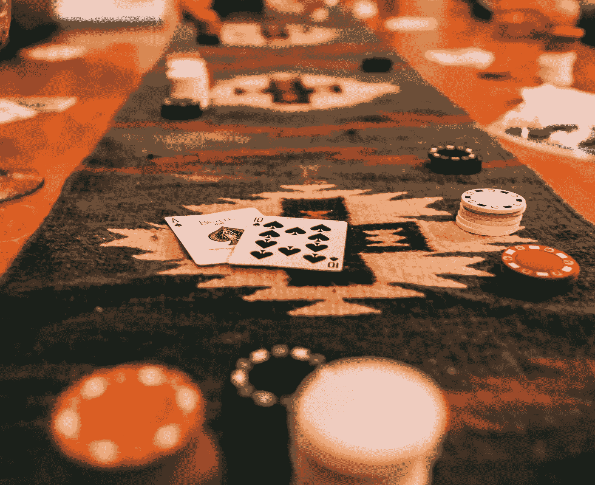
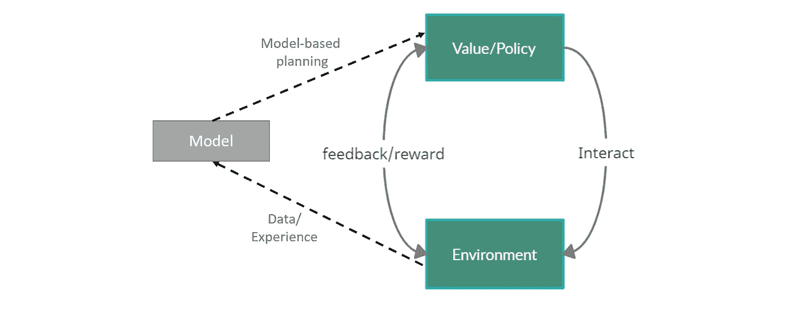
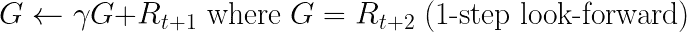
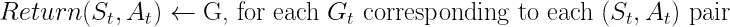
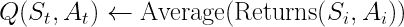
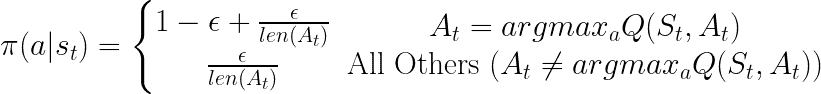
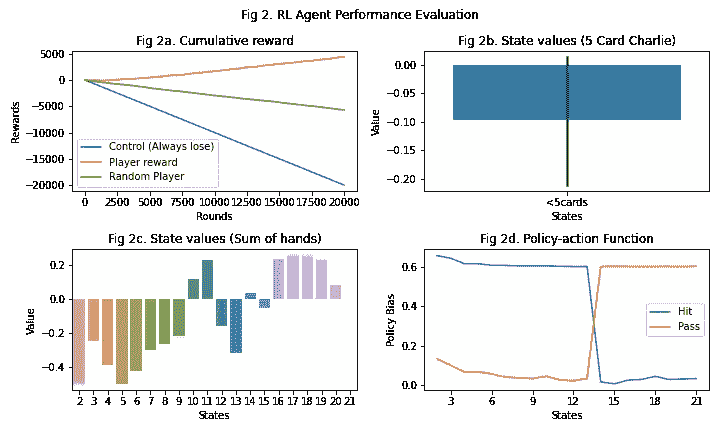

# 表格 MC 强化学习简介—21 点示例

> 原文：<https://towardsdatascience.com/introduction-to-direct-reinforcement-learning-by-example-3f69af9353b2?source=collection_archive---------19----------------------->

## 在经典的赌徒游戏中寻找最优策略

二十一点是一种受欢迎的赌博游戏，在世界各地被广泛玩。历史上被称为黑杰克和 Vingt-U，或 20 是一种游戏，据信起源于 17 世纪的欧洲。

强化学习是一门学科的高级术语，它寻求在不向学习者或代理人提供明确信息的情况下最大化某种回报，学习者或代理人必须与环境进行交互，以学习并产生可以推广到环境的规则或政策。

执行强化学习任务的方法之一是使用蒙特卡罗方法，在编程中，蒙特卡罗方法泛指在寻找最优解时需要随机化的任何方法。通俗地说，这意味着您正在创建一个相当于新生婴儿的代理，他们在开始时大多不知道它在做什么，他们的行为也可能是随机的。这些代理完全通过反复试验来学习。随着他们成功或失败，他们正在建立这个“经验法则”，或政策，他们将最终获得在每种情况下必须采取的行动的知识。在本文中，我们将使用最基本版本的 21 点来执行这种学习任务的最简单形式，而不使用许多赌场都有的规则变体。

(图 1)通过直接 RL 的强化学习，没有基于模型的规划(以虚线示出)

基于策略(基于策略的决策)的直接 RL 循环要求代理(学习者)知道它自己的状态和可用的动作。一个值可以绑定到状态或操作，也可以绑定到两者，如下例所示。学习者从一张白纸开始，并开始与环境互动，环境通常以奖励的形式提供体验。政策更新以反映奖励好坏的变化为标志，因此它将在未来制定更好的行动。为了简化示例，我们将不使用模型。

强化学习的一个重要步骤是找到一种方法来表示环境，这通常是说起来容易做起来难。然而，对于像 21 点这样的游戏来说，这是非常简单的。为了避免冗余，**只显示了 Python 代码的关键部分**。([完整代码](https://github.com/supermomo668/ReinforcementLearning-MonteCarlo/blob/main/MC-Blackjack/MC-BlackJack.ipynb)此处提供)

首先，定义卡片的分布。为了使规则更简单，我们会草率地假设游戏实际上没有可用的 a(a 为 11)，这在今天的大多数赌场中是不正确的。此外，从经验上讲，每次卡片用完时，都会装载一副牌，因此，这里的卡片数量假定是有限的，并且一直玩到结束。

第二，我们定义庄家，我们假设庄家严格按照自己手里的牌出牌，保持最少 15 张，足够短:

最后，这里的玩家(代理)必须定义有更多允许学习的组件:

这里的关键输入参数是:

*   ϵ:探索因素。范围从 0 到 1，决定其决策中随机成分的数量。
*   γ，γ:贴现因子。我们将使用一个 n 步(n=1)前瞻来添加比当前状态超前 1 步的状态的预期回报，乘以贴现因子。

播放器的重要初始化是:

*   操作—代理可用的操作:点击或不予处理
*   states —所有精确的状态(总数= 380):(玩家的手牌总数)x(是否有 5 张牌)x(庄家的顶牌)，这是我们希望代理考虑的每种状态的组合
*   奖励、价值和政策——它们的数据层次结构包含所有状态下每个状态的一些行动数值(即 s∈S，a∈A(s))。初始值对启动学习很重要。

当然，玩家必须根据自己的政策决定每一轮做什么:

当您看到这种类型的数据列表时，它可能会让您想起来自动态编程的概念，这些概念需要我们“记住”。玩家作为代理人的核心部分在于其学习能力:

此处按顺序显示了用于更新的伪代码:

在一集(一场游戏)中对国家行为回报的一步前瞻预期

通过将 G 附加到退货来更新退货

通过平均状态-动作对的回报来更新值

针对最优与非最优动作的每个状态的ε-贪婪策略的更新

执行上述更新将导致以下收敛。更多详情请参见*广义策略迭代***(GPI)*。*

**

*最后，我们将**游戏**放在一起，其中代理人将反复玩尽可能多的次数来训练代理人的策略，游戏规则定义如下:*

*在玩了 20，000 场游戏后，下面显示了代理人感知的状态-价值函数及其在不同牌局采取特定行动的政策偏向。其他因素(如庄家的顶牌或手中可以满足 5 张牌的查理的牌数)也可以类似地以这种形式查看。*

*在结果中首先要指出的是，与随机游戏相比，代理人在遵守这些规则方面明显损失更少(图 2a)。如果你真的随机玩，预计你会输掉超过 40%的钱。然而，玩最优游戏实际上能让你获利 10%左右！这可能是赌场收取赌金或要求玩家维持最低赌金的原因。*

*我们可以清楚地看到状态-值函数中的预期趋势，其中随着获胜几率的增加，值向 21 增加(图 2c)。在 10 到 11 之间有一个重要的峰值范围，其中状态值较高，这是因为有更高的机会用面牌得到 19 到 21，并且在 11 之后突然转向负值。不幸的是，在 20，000 次试验中，没有一个代理人有 5 张查理牌(图 2b)，这表明这种情况发生的可能性有多大。对于行动策略，当手牌总数小于 13 时，代理通常选择击中，当总数变大时，代理选择不打(图 2b)。*

**

*(图 2)在 n= 20000 次试验后对 RL 代理人表现的评估，对于发牌者顶牌= 5(图 2a)的情况，RL 参与者(橙色)的回报明显优于随机参与者(绿色)和阴性对照(蓝色)。(图 2b)在有/没有 5 张查理牌的状态中的代理的平均状态值，以及(图 2c)在手牌总和的每个状态中的代理的平均状态值。(图 2d)给定手数总和的每种状态下采取行动的概率。*

*如果你是 21 点的新手，可以考虑在这个没有可用 a 的模拟真实游戏中从代理那里学习一些规则。如果您想要高级或情境洞察力，考虑通过添加来自赌场的真实规则来改进此模拟，并让代理学习战胜困难。*

*总之，这展示了强化学习最幼稚的实现之一，即通过记录经验并直接根据经验做出判断来学习。在这个系统中有很多东西你可以调整，比如探测超参数。如果您想将强化学习提升到下一个级别，您可以添加一个监督学习模型，如神经网络或时间序列预测模型，该模型试图在这些经验中找到模式，以提前规划政策。这样做可以大大提高性能和收敛速度，实现我们的目标。*

*作为一个有趣的后续问题，如果你想让一个代理知道它是否愿意选择赌博，你会如何实现它？*