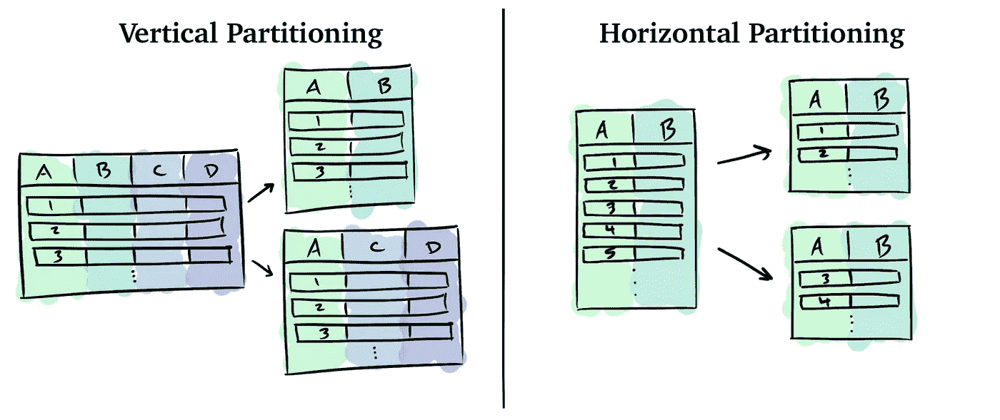
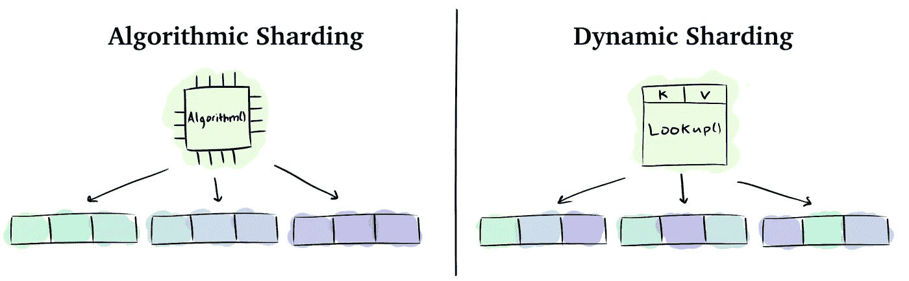

# 分布式数据存储简介

> 原文：<https://towardsdatascience.com/introduction-to-distributed-data-storage-2ee03e02a11d?source=collection_archive---------5----------------------->

## 有效使用分布式数据存储需要知道的一切！

存储在 quartz 上的数据—经微软许可使用。

D ata 是今天的基础！它支持从您最喜爱的猫视频到每天发生的数十亿次金融交易的所有内容。所有这些的核心是分布式数据存储。

在本文中，我们将学习 ***什么是*** 分布式数据存储， ***为什么*** 我们需要它，以及*如何有效地使用它。本文旨在帮助您开发应用程序，因此我们将只讨论应用程序开发人员需要了解的内容。这包括基本的基础、开发人员遇到的常见陷阱，以及不同分布式数据存储之间的差异。*

*本文不需要任何分布式系统知识！编程和数据库经验会有所帮助，但是你也可以在我们遇到主题时查找它们。开始吧！*

# *什么是分布式数据存储？*

> *分布式数据存储是在多台机器上存储和处理数据的系统。*

*作为一名开发人员，您可以将分布式数据存储想象成存储和检索应用程序数据、指标、日志等的方式。您可能熟悉的一些流行的分布式数据存储有 MongoDB、亚马逊网络服务的 S3 和谷歌云平台的 Spanner。*

*实际上，有很多种分布式数据存储。它们通常是由云提供商管理的服务或您自己部署的产品。您也可以从头开始或在其他数据存储的基础上构建自己的数据库。*

# *我们为什么需要它？*

*为什么不直接使用单机数据存储呢？要真正理解，我们首先需要认识到当今数据的规模和无处不在。让我们来看一些具体的数字:*

*   *[Steam](https://store.steampowered.com/) 峰值 1850 万并发用户，部署了 2.7 Pb SSD 的服务器，2018 年向用户交付了 15。*
*   *2020 年，纳斯达克在一天之内就消化了 1130 亿条记录，比两年前的平均 300 亿条有所增加。*
*   *谷物公司凯洛格的 2014 年模拟促销活动每周处理 16tb 的数据。*

*老实说，我们使用的数据之多令人难以置信。这些位中的每一位都在某个地方被小心地存储和处理。某处是我们的分布式数据存储。*

*单机数据存储根本无法支持这些需求。因此，我们使用分布式数据存储，它在**和 ***可靠性*** 方面提供关键优势。让我们来理解一下这些优势在实践中真正意味着什么。***

## **性能、可扩展性和可靠性**

> ****性能**是一台机器工作的好坏。**

**性能至关重要。有无数的研究量化并显示了像 100ms⁴.这样短暂的延迟对业务的影响缓慢的响应时间不仅让人们感到沮丧，还会损失流量、销售额，最终还会损失 revenue⁵.**

**幸运的是，我们确实可以控制应用程序的性能。在单机数据存储的情况下，简单地升级到更快的机器通常就足够了。如果这还不够，或者您依赖于分布式数据存储，那么其他形式的可伸缩性就发挥作用了。**

> **可伸缩性是增加或减少基础设施资源的能力。**

**当今的应用程序经常经历快速增长和循环使用模式。为了满足这些负载需求，我们“扩展”了我们的分布式数据存储。这意味着我们根据需要按需提供或多或少的资源。可伸缩性有两种形式。**

*   *****水平缩放*** 表示添加或删除计算机(也称机器或节点)。**
*   *****垂直缩放*** 是指改变机器的 CPU、RAM、存储容量或其他硬件。**

**水平扩展是分布式数据存储能够超越单机数据存储的原因。通过将工作分散到数百台计算机上，聚合系统具有更高的性能和可靠性。虽然分布式数据存储主要依赖于水平扩展，但垂直扩展也可用于优化整体性能和 cost⁶.**

**从手动到完全管理的范围内都存在扩展。有些产品具有 ***手动扩展*** 功能，您可以自行调配额外容量。其他 ***自动缩放*** 基于剩余存储容量等指标。最后，一些服务处理所有的伸缩问题，开发者甚至不用考虑，比如亚马逊网络服务的 S3。**

**不管采用哪种方法，所有服务都有一些不能增加的限制，比如最大对象大小。您可以查看文档中的配额来了解这些硬限制。您可以查看在线基准测试，看看实际上可以达到什么样的性能。**

> **可靠性是成为 failure-free⁷.的概率**

**有些应用程序对我们的生活至关重要，甚至几秒钟的故障都是不可接受的。这些应用程序不能使用单机数据存储，因为不可避免的硬件和网络故障会危及整个服务。相反，我们使用分布式数据存储，因为它们可以适应个别计算机或网络路径故障。**

**为了高度可靠，系统必须同时是 available⁸和 fault-tolerant⁹.**

*   *****可用性*** 是服务可达并正常响应请求的时间百分比。**
*   *****容错*** 是容忍硬件和软件故障的能力。完全容错是不可能的，⁰.**

**虽然可用性和容错性初看起来很相似，但实际上它们是完全不同的。让我们看看如果你有一个而没有另一个会发生什么。**

*   ****可用但不容错:**考虑一个系统，每分钟发生一次故障，但在毫秒内恢复。用户可以访问该服务，但长时间运行的作业永远没有足够的时间来完成。**
*   ****容错但不可用:**考虑一个系统，其中一半节点永久重启，其他节点稳定。如果稳定节点的容量不足，那么一些请求将不得不被拒绝。**

## **外卖食品**

**对于应用程序开发人员来说，关键是分布式数据存储可以扩展性能和可靠性，远远超过单台机器。问题在于，他们在工作方式上有一些限制其潜力的限制。**

# **它是如何工作的？**

**让我们来看看应用程序开发人员需要了解分布式数据存储是如何工作的——分区、查询路由和复制。这些基础知识将让您深入了解分布式数据存储的行为和特征。它将帮助您理解警告、权衡，以及为什么我们没有一个擅长所有事情的分布式数据存储。**

## **分割**

**我们的数据集通常太大，无法存储在一台机器上。为了克服这一点，我们 ***将我们的数据*** 划分成更小的子集，以便各个机器可以存储和处理。有许多方法可以对数据进行分区，每种方法都有各自的优缺点。两种主要的方法是垂直和水平分区。**

****

**作者图片**

*****垂直分割*** 是指按照相关字段分割数据。字段可能因为许多原因而相关。它们可能是某个公共对象的属性。它们可能是查询经常一起访问的字段。它们甚至可能是以相似频率访问的字段，或者是由具有相似权限的用户访问的字段。跨机器垂直划分数据的确切方式最终取决于您的数据存储的属性和您正在优化的使用模式。**

***(也称为 ***分片*** )是指我们将数据分割成具有相同模式的子集。例如，我们可以通过将行分组为存储在不同机器上的碎片来对关系数据库表进行水平分区。当一台机器无法处理数据量或数据的查询负载时，我们就对数据进行分片。分片策略分为两类，算法和动态，但混合存在⁰.***

****

**作者图片**

*****算法分片*** 根据数据键的函数决定将数据分配给哪个分片。例如，当存储将 URL 映射到 HTML 的键值数据时，我们可以通过根据 URL 的第一个字母拆分键值来 ***范围划分*** 我们的数据。例如，所有以“A”开头的 URL 将出现在第一台机器上，“B”出现在第二台机器上，依此类推。有无数的策略都有不同的权衡。**

*****动态分片*** 明确选择数据的位置，并将该位置存储在查找表中。为了访问数据，我们使用查找表查询服务或检查本地缓存。查找表可能非常大，因此它们可能有指向子查找表的查找表，像[B+-树](https://en.wikipedia.org/wiki/B%2B_tree)。动态分片比算法分片更加灵活。**

**实际上，分区是相当棘手的，会产生许多需要注意的问题。幸运的是，一些分布式数据存储将为您处理所有这些复杂性。其他人处理一些或不处理。**

*   **碎片可能有 ***不均匀的数据*** 大小。这在算法分片中很常见，因为函数很难得到正确的结果。我们通过围绕数据定制分片策略来缓解这一问题。**
*   **碎片可能有 ***热点*** ，其中某些数据比其他数据更频繁地被查询。例如，考虑一下你在社交网络中查询名人的频率会比普通人高多少。谨慎的模式设计、缓存和副本在这里会有所帮助。**
*   *****在维护高可用性时，重新分发*** 数据以处理向系统添加或从系统中删除节点是很困难的。**
*   *****索引*** 可能也需要分区。索引可以索引存储它的碎片(本地索引)，或者它可以索引整个数据集并被分区(全局索引)。每个都有[权衡](https://docs.aws.amazon.com/amazondynamodb/latest/developerguide/SecondaryIndexes.html)。**
*   *****跨分区的事务*** 可能工作，也可能被禁用、变慢，或者以令人困惑的方式不一致。当从单机数据存储构建您自己的分布式数据存储时，这尤其困难。**

## **查询路由**

**对数据进行分区只是故事的一部分。我们仍然需要将查询从客户端路由到正确的后端机器。查询路由可以发生在软件栈的不同级别。我们来看三种基本情况。**

*   *****客户端分区*** 是指客户端持有查询哪个后端节点的决策逻辑。优点是概念简单，缺点是每个客户端都必须实现查询路由逻辑。**
*   *****基于代理的分区*** 是客户端将所有查询发送给一个代理。这个代理然后确定查询哪个后端节点。这有助于减少后端服务器上的并发连接数，并将应用程序逻辑与路由逻辑分开。**
*   *****基于服务器的分区*** 是当客户端连接到任何后端节点时，该节点将处理、重定向或转发请求。**

**实际上，大多数分布式数据存储都处理查询路由。通常，您配置一个客户端，然后使用该客户端进行查询。但是，如果您正在构建自己的分布式数据存储，或者使用像 Redis 这样的不支持分布式数据存储的产品，您就需要考虑到这一点，⁴.**

## **分身术**

**我们要讨论的最后一个概念是复制。复制意味着存储相同数据的多个副本。这有很多好处。**

*   *****数据冗余:*** 当硬件不可避免地出现故障时，数据并没有因为有另一份拷贝而丢失。**
*   *****数据可访问性:*** 客户端可以从任何副本访问数据。这提高了针对数据中心中断和网络分区的恢复能力。**
*   *****增加读取吞吐量:*** 可以处理数据的机器越多，整体容量就越高。**
*   *****降低网络延迟:*** 客户端可以访问离自己最近的副本，降低网络延迟。**

**实施复制需要令人难以置信的共识协议和对故障场景的详尽分析。幸运的是，应用程序开发人员通常只需要知道数据在何时何地被复制。**

***数据复制的范围从一个数据中心内到跨区域、地区，甚至是大洲。通过紧密地复制数据，我们最大限度地减少了在机器之间更新数据时的网络延迟。但是，通过将数据复制到更远的地方，我们可以针对数据中心故障、网络分区提供保护，并可能降低读取的网络延迟。***

******当*** 数据被复制时可以同步也可以异步。***

*   *****同步*** 复制是指在响应请求之前将数据复制到所有副本。这样做的好处是，以更高的写入延迟为代价，确保副本之间的数据完全相同。**
*   *****异步*** 复制是指在响应请求之前，数据仅存储在一个副本上。这样做的优点是写入速度更快，缺点是数据一致性较弱，可能会丢失数据。**

## **外卖食品**

**分区、查询路由和复制是分布式数据存储的构造块。不同的实现表现为不同的特性和属性，您需要在它们之间进行权衡。**

# **有什么区别？**

**分布式数据存储都是特殊的雪花，每个都有其独特的特性。我们将通过将它们的不同之处分成几类并涵盖每一类的基础知识来对它们进行比较。这将有助于你知道要问什么问题，以及将来要深入阅读什么。**

## **数据模型**

**要考虑的第一个区别是数据模型。数据模型是数据的类型以及如何查询数据。常见类型包括**

*   *****文档:***JSON 文档的嵌套集合。使用关键字或过滤器进行查询。**
*   *****键值:*** 键值对。用键查询。**
*   *****关系:*** 具有显式模式的行表。用 SQL 查询。**
*   *****二元物体:*** 任意二元斑点。用键查询。**
*   *****文件系统:*** 文件的目录。使用文件路径进行查询。**
*   *****图形:*** 带边的节点。使用图形查询语言进行查询。**
*   *****消息:*** 一组键值对，就像 JSON 或 python 的 dict。来自队列、主题或发件人的查询。**
*   *****时序:*** 按时间戳排序的数据。使用 SQL 或其他查询语言进行查询。**
*   *****文本:*** 自由格式文本或日志。使用查询语言进行查询。**

**不同的数据模型适用于不同的情况。虽然您可以将所有内容都存储为二进制对象，但这在查询数据和开发应用程序时会很不方便。相反，使用最适合您的查询类型的数据模型。例如，如果您需要快速、简单地查找少量数据，请使用键值。我们将在下面的图表中提供更多关于预期用途的详细信息。**

**请注意，一些数据存储是多模型的，这意味着它们可以有效地操作多个数据模型。**

## **担保**

**不同的数据存储提供不同的行为“保证”。虽然您在技术上不需要保证来开发健壮的应用程序，但是强保证极大地简化了设计和实现。您将遇到的常见保证如下:**

*   *****一致性*** 就是数据对所有读者看起来是否一样，是否是最新的。请注意，具有讽刺意味的是,“一致性”一词严重超载——请确定⁵.指的是哪种类型的一致性**
*   *****可用性*** 就是你是否可以访问你的数据。**
*   *****持久性*** 是存储的数据是否保持安全和不被破坏。**

**一些服务提供商甚至会通过服务水平协议(SLA)来保证服务水平，例如 99.99%的可用性。如果他们不遵守协议，你通常会得到一些补偿。**

## **生态系统**

**生态系统(集成、工具、支持软件等。)对于分布式数据存储的成功至关重要。需要检查一些简单的问题，比如什么 SDK 可用，支持什么类型的测试。如果你需要数据库连接器、移动同步、 [ORMs](https://en.wikipedia.org/wiki/Object%E2%80%93relational_mapping) 、[协议缓冲区](https://developers.google.com/protocol-buffers)、地理空间库等功能。，您需要确认它们是否受支持。文档和博客会有这些信息。**

## **安全性**

**安全责任由您和您的产品/服务提供商共同承担。您的职责将与您管理的堆栈数量相关联。**

**如果您使用分布式数据存储作为服务，您可能只需要配置一些身份和访问策略、审计和应用程序安全性。但是，如果您构建并部署了所有这些，您将需要处理一切，包括基础架构安全性、网络安全性、静态/传输中的加密、密钥管理、修补等。检查您的数据存储的“共享责任模型”来解决这个问题。**

## **服从**

**合规性可能是一个关键的优势。许多应用程序需要遵守关于如何处理数据的法律法规。如果您需要遵守安全策略，如 FEDRAMP、PCI-DSS、HIPAA 或任何其他策略，那么您的分布式数据存储也需要遵守。**

**此外，如果您对客户做出了有关数据保留、数据驻留或数据隔离的承诺，您可能需要一个具有内置功能的分布式数据存储。**

## **价格**

**不同的数据存储定价不同。一些数据存储仅根据存储容量收费，而另一些则计入服务器和许可证费用。文档中通常会有一个价格计算器，您可以用它来估算账单。请注意，虽然一些数据存储一开始可能看起来成本较高，但它们可能会在工程和操作时间节省方面弥补这一点。**

## **外卖食品**

**分布式数据存储都是唯一的。我们可以通过文档、博客、基准、价格计算器，或者通过与专业支持人员交谈和构建原型来了解和比较它们的不同特性。**

# **有哪些选择？**

**我们现在对分布式数据存储有了很多抽象的了解。让我们绑在一起，看看真正的工具！**

**有[貌似](https://db-engines.com/en/ranking) - [无限](https://aws.amazon.com/products/) [选项](https://cloud.google.com/products)，可惜没有最好的。每个分布式数据存储都有不同的用途，需要适合您的特定用例。要了解不同的类型，请查看下表。慢慢来，关注一般类型和用例。**

**最后，请注意，真正的应用程序和公司有各种各样的工作要做，因此它们依赖于多个分布式数据存储。这些系统协同工作，为最终用户以及开发人员和分析人员服务。**

# **关闭**

**数据已经存在，而分布式数据存储正是实现这一点的基础。**

**在本文中，我们了解到分布式数据存储的性能和可靠性可以远远超越单机数据存储。分布式数据存储依赖于具有许多机器的体系结构来分区和复制数据。应用程序开发人员不需要知道所有的细节，他们只需要知道足够多的信息来理解实践中出现的问题，如数据热点、事务支持、数据复制的价格等。**

**像其他任何东西一样，分布式数据存储有各种各样的特性。起初，可能很难将其概念化，但希望我们的分解有助于定位你的思维过程，并指导你未来的学习。**

**希望现在你知道什么是大局，以及应该深入了解什么。请考虑查阅参考资料。很高兴听到你的任何评论！:)**

## **常见问题解答**

**问:我在谷歌上搜索了“容错”、“分片”等术语。不是你说的那样。**

**a)是的，术语在不断发展，而且已经超载。在实践中，解决这个问题的方法是澄清所指的是哪个定义。**

## **参考**

**[1] [汽— 2018 年回顾](https://steamcommunity.com/groups/steamworks/announcements/detail/1697194621363928453) (2018)，汽**

**[2] [纳斯达克使用 AWS 开创了在云中存储证券交易所数据的先河](https://aws.amazon.com/solutions/case-studies/nasdaq-case-study/) (2020)，AWS**

**[3] [凯洛格公司案例研究](https://aws.amazon.com/solutions/case-studies/kellogg-company/) (2014)，AWS**

**[4] B .帕维奇，c .安特西，j .瓦格纳，[为什么速度很重要？](https://web.dev/why-speed-matters/) (2020)，网络开发**

**[5] G .林登，[玛丽莎·梅耶尔在 Web 2.0](http://glinden.blogspot.com/2006/11/marissa-mayer-at-web-20.html) (2006)**

**[6] [第一章。可扩展性初级读本](https://www.oreilly.com/library/view/cloud-architecture-patterns/9781449357979/ch01.html) (2012)，奥赖利**

**[7] J .潘，[软件可靠性](https://users.ece.cmu.edu/~koopman/des_s99/sw_reliability/) (1999)，卡内基梅隆大学**

**[8] A. Somani，N. Vaidya，[了解容错和可靠性](https://ieeexplore.ieee.org/document/585153) (1997)，IEEE**

**[9] [容错](https://www.imperva.com/learn/availability/fault-tolerance/)，Imperva**

**[10] M. Kleppmann，[设计数据密集型应用](https://www.oreilly.com/library/view/designing-data-intensive-applications/9781491903063/) (2017)，O'Reilly**

**[11] [水平、垂直和功能数据分区](https://docs.microsoft.com/en-us/azure/architecture/best-practices/data-partitioning) (2017)，微软**

**[12] F. Chang 等著 [Bigtable](https://static.googleusercontent.com/media/research.google.com/en//archive/bigtable-osdi06.pdf) (2006)，谷歌**

**[13] G. Guo，T. Kooburat，[使用分片管理器扩展服务](https://engineering.fb.com/2020/08/24/production-engineering/scaling-services-with-shard-manager/) (2020)，**

**[14] [分区](https://redis.io/topics/partitioning)，Redis**

**[15] I .张，[一致性应该更一致！](https://irenezhang.net/blog/2015/02/01/consistency.html)**