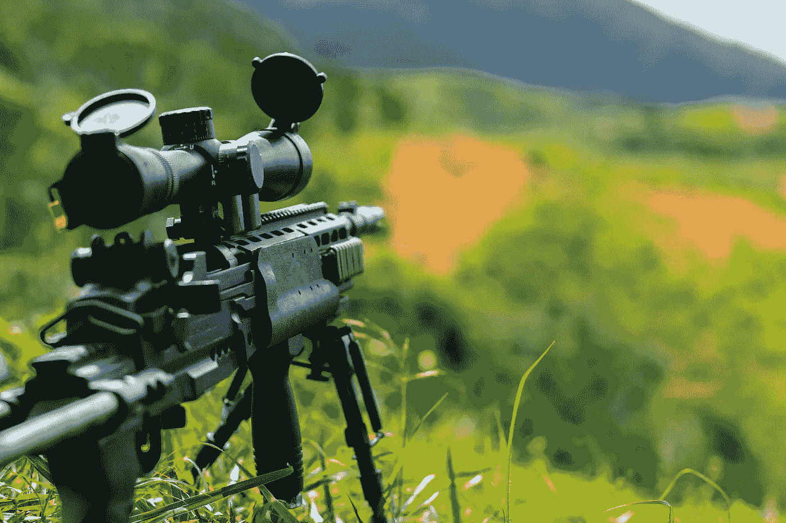

# 人工智能在战争中应用的伦理学导论

> 原文：<https://towardsdatascience.com/introduction-to-ethics-in-the-use-of-ai-in-war-9e9bf8ba71ba?source=collection_archive---------25----------------------->

## 快速浏览道德和治理问题

# 第 1 部分:快速基础知识、优势和成本

伯明翰博物馆信托基金会在 [Unsplash](https://unsplash.com/s/photos/war?utm_source=unsplash&utm_medium=referral&utm_content=creditCopyText) 上拍摄的照片

人工智能的进步已经扩展到国防应用中，这引发了许多伦理问题。虽然有许多详细的文档讨论了在作战应用中使用人工智能的特定领域，但我想在这里对这些问题进行概述，并讨论一些基本想法，这些想法将有助于您以更明智的方式讨论和解决该领域的问题。

让我们通过以下项目来建立对为什么在战争中使用人工智能会引起如此多的伦理问题的理解:

1.  快速基础
2.  优势与成本
3.  当前伦理原则的局限性
4.  关键问题
5.  开放式问题

在第 1 部分(本文)中，我们将讨论第 1 和第 2 部分，并将在第 2 和第 3 部分中讨论第 3–5 部分。

在我们开始之前，这里的一个简短的帖子不可能是全面的，所以如果你发现了一些遗漏的和可以扩展的东西，请不要犹豫，留下评论并分享资源，以便我们可以一起积累知识！

# 1.快速基础

让我们了解一些基本的定义，以便我们对术语有一个共同的理解，并可以提出和解决问题，同时牢记这些界限。

# 什么是自主武器系统(AWS)？

本质上，AWS 指的是以下功能:

> *在没有人类控制的情况下识别、选择和攻击目标。*

识别是指在构成视频帧的图像中挑选出一部分“对象”，这些图像将被传递到管道的下一阶段，例如将军事目标与民用资产分开。

选择指的是将对象列表缩小到符合某些标准的对象，例如高价值的军事目标。

交战是指发动攻击，例如对前一阶段选定的目标发射弹药。

在这种情况下，有意义的人工控制是指由自动化系统承担这些管道的所有方面，而不需要人工干预来识别、选择或参与目标。此外，这还指能够在战场上遇到的不确定性中具有一定程度的自力更生能力，并且即使在与人类控制中心失去联系的情况下也能够继续运作。

# 什么是半自治？

基本上半自治指的是以下概念:

> *系统中的部分自治程度，通过与人的联系进行监督和控制*

对于我们在上一节中确定的每个阶段，即识别、选择和参与，半自主通常在以下情况下对人类有延迟:对目标的识别、所做的选择和参与目标的策略的不确定性。这通常也被称为人在回路(HITL)。

# 什么是完全自主？

完全自治指的是以下两个概念:

*   执行其所有功能，无需任何有意义的人工控制和链接
*   独立应对不断变化的环境，以实现预先设定的目标

上面第一点的第二部分需要进行一些检查，因为这意味着我们并不总是依赖人工智能的能力。这可以通过一种方式来体现，当失去人类控制和联系时，我们有一套预编程的规则来继续发挥作用，或者安全地脱离进入休眠状态，等待重新获得与指挥中心的联系。

# 什么是致命使用？

尽管根据法律规定，致命使用可能有细微差别和细微变化，但它指的是以下情况:

> *对人的生命造成重大威胁，包括有意和无意的生命损失。*

# 什么是非致命使用？

这些通常是人工智能的后台或其他用途，不涉及造成直接伤害:支持功能，实现系统的基本操作，如起飞和着陆辅助，避免地面碰撞和炸弹处理等。

> *不过有一点要注意，一些非致命的用途可能会有导致致命后果的下游用途。*

# 2.优势与成本

正如任何双重或多用途技术一样，在战场上使用人工智能有优势也有成本。我将在介绍系列之后的后续文章中探讨一个警告，即拥有 HITL 本身并不总是一个积极的结果，这种参与可能会产生更多的相关成本，而不是由此产生的潜在优势。

# 潜在优势

请注意在标题中故意使用了“潜力”这个词，因为我相信在战场上使用人工智能所带来的好处确实比成本更确定。

当我们谈论在战争中使用人工智能时，这些是我们最常遇到的一些潜在优势:

*   减少平民伤亡
*   减少对军事人员的需求
*   通过更精确的定位减少整体伤害

更好的识别和选择可以减少平民伤亡。通过远程操作，对军事人员的需求(或至少具有更高的安全性)是可能的，这可能降低在战场上受伤的风险，包括身体和精神上的损失。然而，如果他们看到令人不安的图像，例如，他们在无人机远程操作中遇到的图像，情绪上的损失仍然可能发生。如果攻击目标的方式和目标本身更加精确，净伤害也可以减少，这可能会减少战争中不可避免的附带伤害。

# 费用

请注意，我故意在章节标题中省略了潜在一词的使用，因为可能发生的成本有更高程度的确定性。一个额外的考虑是，人工智能在战争中的应用如何带来一种内在的敌对动态，这种动态鼓励“人工智能军备竞赛”，导致系统能力和限制方面的合作和开放减少，这将损害生态系统的健康。

这些是我们在战争中使用人工智能时可能会遇到的一些最常见的成本:

*   不同代理之间的紧急互动导致意外升级，这些代理具有潜在冲突的预编程目标。
*   甚至在小型非国家行为者的手中也能扩大伤害
*   从机器学习安全的角度来看，军事基础设施的其余部分暴露了新的攻击面。

第一个成本是一个非常现实的问题，值得那些为作战应用开发和部署人工智能系统的人充分关注。具体而言，随着自动化系统可以采取的行动的快速步伐，如果存在需要在对其采取行动之前与多方商议和协商的信息，这可能会成为一个问题，除非明确的延迟被编程来考虑这些情况。也有许多人强烈支持在战场上以任何身份使用人工智能，因为会出现许多误用和伤害。

正如我们已经看到的信息生态系统面临机器人充斥社交媒体平台的危害一样，通过使用自动化武器来扩大负面影响的影响甚至更严重。

最后，正如我们在[人工智能道德简报](https://brief.montrealethics.ai/)中多次指出的，机器学习安全是一个非常现实的问题，当将 ML 组件集成到传统网络安全措施不足以解决问题的现有软件基础设施中时，需要考虑这一点。

# 第一部分的结论

希望这部分已经为你提供了一些我们在讨论战争中人工智能伦理时经常遇到的基本术语。我们还探索了在战争中使用人工智能的潜在优势和成本。

在此之后，我们将探索以下领域:

*   当前伦理原则的局限性
*   关键问题—第 1 部分

# 第二部分:当前伦理原则的局限性和关键问题

迈克尔·阿丰索在 [Unsplash](https://unsplash.com/s/photos/aircraft-carrier?utm_source=unsplash&utm_medium=referral&utm_content=creditCopyText) 上的照片

在这篇文章的第一部分的基础上，让我们深入一些关于在战争中使用人工智能的伦理讨论。

在第 1 部分中，我介绍了:

*   快速基础知识，谈到了自主武器系统，半自主，全自主，致命的使用，和非致命的使用
*   潜在的优势和成本

如果您还没有机会阅读第一部分，我强烈建议您阅读，因为我们将在那一部分解释的定义的基础上讨论这一部分的问题。

让我们深入了解:

*   当前伦理原则的局限性
*   关键问题—第 1 部分

# 1.当前伦理原则的局限性

今天，围绕在战争中使用人工智能的伦理问题的讨论虽然不断发展，但仍然有一些关键的考虑因素，如果没有这些考虑因素，我们就有可能以一种可能造成重大伤害的方式利用这些系统，并且前一篇文章中概述的成本将开始远远超过潜在的好处。

# A.对人工智能安全性和可靠性的不同程度的重视

目前，这个子域中的问题的措辞方式，对人工智能的安全性和可靠性有不同程度的强调。这是一个问题，因为在战场上使用人工智能会产生许多意想不到的和紧急的行为，特别是当你在一个动荡的环境中有编程实体相互交互时，由于对意图和目的的误解而导致意外升级。

这还不包括这样一个事实，即我们在战场上也有对人工智能系统的敌对操纵，通过混淆的例子，明确的目的是从系统中引出边界情况破坏行为，这些行为可以触发一连串的其他行动，导致升级和不必要的伤害。

# B.长期人工智能安全研究资金不足

这一领域的某些问题仍需进一步研究。这些包括:在其他长期安全影响中的对抗性鲁棒性，如自主程度对战争中人机交互动力学的影响。由于更直接地关注人工智能的使用所带来的一些伦理挑战，这些问题没有得到充分的探索、资金不足和重视。

这并不是说这些不重要——它们肯定很重要，但这也意味着，如果在这一至关重要的长期安全研究方面投资不足，那么我们保护自己的能力将会有限。当那些不相信人工智能系统不能在战争中使用的人选择部署它们时，这尤其如此，这增加了其他国家行为者的风险，他们没有准备好应对这些系统在战场上的影响。

# C.软法律是不够的

目前围绕这一主题的大多数讨论都在推动在我们达成更具强制性的法律文书之前的过渡时期采用软法律方法，核安全领域的先例表明，这可能需要很长时间才能取得成果。虽然倡导这种软法律和自我监管方法没有任何害处，但首先不相信这些理念的国家和非国家行为者遵守这些方法的可能性非常低，只会削弱那些首先遵守这些道德原则并随后可能在国际舞台上遵守这些原则的国家的能力。

# D.在关键主题上趋于一致，但仍脱离具体实施

正如更大的人工智能伦理领域的情况一样，自 2017 年以来，在对该领域问题的理论分析方面做了大量工作——以至于它可能已经变得不利于实际从原则转向实践。

考虑人工智能在战争中使用的伦理问题的工作在某种程度上是相似的，在关键思想上有很多高水平的趋同，但在应用于战争中时，仍然与人工智能系统的一些实际、当前的能力和限制有很多分离。也就是说，我们遇到了一个经典的问题，即在如何治理这类系统的问题上，要么寻求监管不足，要么寻求监管过度。我们也可能因为对核心问题缺乏了解，或者对系统的实际能力了解有限，从而陷入高估短期能力和低估长期能力的经典困境，而最终关注错误的领域。

# E.缺乏稳固的治理结构

在治理方法方面也存在碎片化，这确实将处理战场上人工智能存在的整个*工作方式*置于风险之中。也就是说，我们支持建立不同的治理机制，因为人工智能的存在及其带来的独特挑战，而其他人则主张将这种治理纳入现有的结构，并授权当前指挥链中的人了解和解决使用人工智能带来的挑战。

我强烈主张利用现有的指挥结构链作为治理机制，因为这使我们能够利用一些经过几十年形成并经过多年战斗考验和磨练的最佳做法。这也具有将责任和控制的中心保持在受过战争环境下操作训练的人身上的优势，并保持我们对现有法律机制的支配，这些法律机制可以利用法院和法律来裁定由于机器、人或两者的结合而发生的侵权行为。

# F.潜在不正确的政策先例

由于这种系统被匆忙用于战场，潜在的原因是害怕错过或被对手的机动击败，我们冒着为未来的使用设定不正确的政策先例的风险，甚至这些系统更先进的版本也可能以意想不到的方式失败。

政策先例问题有可能不仅仅局限于作战，还会延伸到其他关键任务领域，在这些领域，我们可能会将对人类生活有重大影响的系统匆忙投入生产和使用的过程正常化，同时推迟对收益是否大于成本的判断。

# 2.关键问题—第 1 部分

谈到战争自动化，有一大堆问题，其中一些是技术性的，另一些是组织性和社会性的。所有这些都值得进一步研究，以确保我们正在建立的系统可能有助于首先避免使用它们，或至少有助于使战争更加人道，最大限度地减少不必要的伤害。

# A.缺乏召回系统的能力

当给系统注入足够的自主性以独立做出决策时(比如当与控制断开连接时)，在没有故障保护机制和不断发展的不确定性的情况下，当这样的系统在战场上遇到挑战时(包括物理和虚拟挑战)，可能会出现意外行为的风险很高。

基于意外升级的主题，这是我们无法召回系统的能力可能导致额外伤害的情况的完美候选，特别是考虑到自动化系统与人类相比的决策和执行速度。这可能会导致与其他自动化系统的反馈回路失控，无论是友好的还是敌对的，这进一步加剧了该领域的问题。

# B.刚性目标

受过训练的人类军官拥有的关键技能之一是他们吸收新信息并在新信息出现时重新调整目标和战略决策的能力。对于没有经过充分实战测试的自动化系统来说，这可能是一件具有挑战性的事情，这些系统的能力随后被约束(有时是理所当然的)到它在人工智能开发生命周期的训练阶段所学习的目标。

但是，当战场上的紧急情况(通过外交或其他变化)需要重新评估，并且系统无法更新其内部表示以允许其纳入新信息时，这种僵化可能会成为不利因素，从而导致潜在的不必要的伤亡。

# C.使造成伤害的能力民主化

最后，或许也是最重要的，自动化系统使造成伤害的能力民主化(以一种不好的方式)。我们已经看到了这种动态在信息生态系统中的表现，机器人能够操纵对话并推动话语的方向，通过进一步分化社区并向他们展示信息生态系统的一小部分实际状态，从而对社区造成伤害。基本上，少数行为者已经能够在自动化的帮助下扩大他们的造谣努力。

自动化武器有可能(在现实世界中)造成巨大破坏，通过赋予一小群人以工具，使他们有能力与较小的民族国家(也许不是世界上最大的军队，因为他们拥有庞大的基础设施和资源)同等行动，自动化武器也可以做到这一点。这是一个很大的问题，因为它可能会更加破坏世界的稳定，并把我们带到一个我们可能会遇到意想不到的威胁的地方，这些威胁来自那些设法获得这些自动化武器的小角色。

# 第二部分的结论

现在让我们进入本文的第 3 部分，它将涵盖以下内容:

*   关键问题—第 2 部分
*   开放式问题

# 第 3 部分:关键问题(续)和开放式问题

托马斯·塔克在 [Unsplash](https://unsplash.com/@tents_and_tread?utm_source=unsplash&utm_medium=referral&utm_content=creditCopyText) 上拍摄的照片

在文章的第 1 部分和第 2 部分的基础上，让我们深入一些关于人工智能在战争中使用的伦理问题的讨论。

在第 1 部分中，我介绍了:

*   快速基础知识，谈到了自主武器系统，半自主，全自主，致命的使用，和非致命的使用
*   潜在的优势和成本

在第 2 部分中，我介绍了:

*   当前伦理原则的局限性
*   关键问题—第 1 部分

如果你还没有机会阅读第一部分和第二部分，我强烈建议你这样做，因为我们将在那些部分解释的定义的基础上讨论这一部分的问题。

让我们深入了解:

*   关键问题—第 2 部分
*   开放式问题

# 1.关键问题—第 2 部分

随着我们更多地考虑这种系统是否应该在实践中使用，还有一些更关键的问题需要进一步研究。通过深入研究下面提出的一些要点，我们可以对潜在的优势和成本有更细致的了解。这种方法将使决策更加稳健，特别是在面对紧急和突发情况时，我们可能会被迫做出快速决策。拥有之前已经充分讨论过的强大方法和推理将使我们能够做出更好的决策。

# A.系统的不可靠性

人工智能系统本质上具有内在的概率性。结合战场上的不确定性和快速变化的环境，我们最终会从系统中获得导致不可靠性的紧急行为。至少从我们试图更好地掌握这些系统可能做出反应的潜在途径的角度来看是这样的。

我们面临着“人工智能的迷雾”,这使得我们很难保证系统会可靠地运行，即使它受到有意(敌对的例子)或无意的意外输入的轰炸。

# B.对国际条约缺乏共识

目前的气氛充满了怀疑和不同的观点。各国通过《特定常规武器公约》(CCW)等论坛举行会议，但在涉及法律时，对国际条约的发展方向很少或没有共识的审议已经进行了多年。

在美国国家安全委员会(NSCAI)最近发布的人工智能指南中，这种缺乏共识的情况体现在一些论点上，即为什么美国应该继续在这一领域进行投资，因为缺乏全球能力来监测和验证对开发和使用这种武器系统的禁令的遵守情况。

# C.对法律的谴责缺乏一致性

如果没有学术和行业实验室的努力，所有的开发和部署都是不可能的，这些实验室致力于人工智能的各个子领域，最终为这些系统提供动力。由于人工智能在各行各业的广泛应用，像物体检测这样的技术可以帮助识别手机上所有有你的狗的照片，但也可以重新用于(当然是改变)识别战场上的目标。

也许，研究人员和实践者发出的拒绝从事很可能在战争中被重用的应用程序的响亮号召可以给我们更多的时间，同时我们可以找出允许安全使用的治理和技术措施(如果我们曾经决定在这种情况下使用这样的系统是有意义的)。

# 2.开放式问题

虽然本文和上一篇文章中强调的关键问题也为要考虑的事情提供了一些启示，但在我们能够应用我们试图从之前的关键问题讨论中得出的一些细微差别之前，有一些首要问题需要进行经验和理论研究。这些开放性问题的目标是为我们的社区提供一些潜在的研究方向，不仅仅是在战争中使用人工智能，还包括随着时间的推移可能出现类似问题的相邻领域。

# A.什么是有意义的人类控制？

当谈到有意义的人类控制时，有如此多的分级标记，这仍然是一个开放的问题。特别是，需要进一步研究的是有意义的人类控制意味着什么的共同进化方面。具体来说，随着新技术在世界范围内扩散，基本的能力和理解水平以及对系统能力和局限性的期望也在发展。随着新一批操作员进入该领域并与该领域的资深操作员一起工作，这将变得相关，从而导致不同技能水平的操作员并肩工作。在这种情况下，需要定制培训计划以满足所有这些需求，并且可能还需要采用评估协议以适应性方式进行认证，从而解决这些差异。

为了避免“人的令牌”问题，我们还需要考虑动态环境中人和机器之间的交互，在这种环境中，每个组件都以一种利用彼此独特优势的方式服从另一个组件。

最后，有意义是指应该以一致的方式在可能在现场使用这些系统的不同机构之间进行阐述。统一的认识将有助于发展上述一些机制，从而帮助不同机构的所有行为者同步前进，而不是落在后面，因为后者可能会损害早期采用者在该领域所做工作的效力。

# B.如何设定致命和非致命用途的界限？

对于法律专家和军事行动者来说，明确区分这两个国家对于为法律制定过程提供适当的指导以及帮助不同民族国家和其他行动者达成共识至关重要。

正如我们在第一部分和第二部分中所谈到的，目前的灰色地带不仅是这种系统所造成的道德难题的巨大恐慌来源，而且也是适用于这些系统的采购和操作的标准和实践的巨大恐慌来源。

此外，这也将对有意义的人类控制方面产生影响，因为它将要求一种有区别的方法，这种方法使我们在允许系统自主运行的方法中清楚地知道何时我们必须更严格或更不严格。

# C.如果自治在这里正常化，对其他领域有哪些溢出影响？

这是一个更大的问题，可能需要任何认真考虑使用自治系统的领域来解决。考虑溢出影响的原因是因为人工智能天生是多用途的，子域通常通过开放访问和开源发布模型进行大量混合。此外，随着治理框架发展的初期阶段，我们正在进入一个时代，在这个时代，条约、法律、法规和标准将被编纂成文，并为我们设定特定的道路。

如果我们开始将某些用途正常化，并认为为了“更大的利益”(一种非常功利的观点)而使用此类系统可能产生的一些附带损害是理所当然的，那么我们将更容易证明为了遵循相同的逻辑而使用风险越来越大的系统是合理的，而无需在开发和部署这些系统之前同意其他制衡措施，如社区咨询和跨学科审议。

# 结论

我将保持这个相对简短的结束语，因为我们已经有机会走过许多与 AI 在战争中的使用相关的细微差别。这样做的决定，就像在任何高风险场景中使用人工智能的情况一样，归结为拥有关于系统能力和限制的足够信息，然后以审慎的方式利用这些信息来为我们的决策提供信息。建立可以提前管理我们行为的护栏，而不是在面对紧急和突发情况时做出反应，也将有助于充分考虑在战争中使用人工智能的潜在优势和成本。本系列文章中提出的观点只是一个起点，我鼓励我所有的同行花时间深入研究本系列文章中的观点，以便我们能够以负责任的方式部署这些技术。

希望这一系列介绍在战争中使用人工智能的伦理的文章是有用的。请在这里的评论区留下您的评论和任何您认为有用的资源。期待一次富有成效的谈话！

## 我正在撰写《可操作的人工智能伦理》(Actionable AI Ethics)，这本书将于 2021 年发布(曼宁)，将帮助人工智能设计师和开发者从人工智能伦理的原则转向实践。

## 你可以在这里找到更多:[https://actionableaiethics.substack.com](https://actionableaiethics.substack.com/)