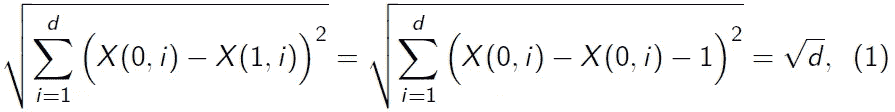
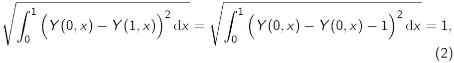
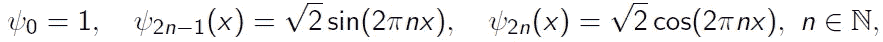
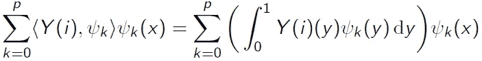
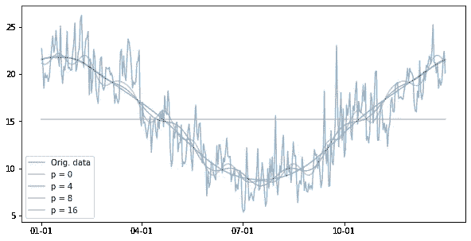

# 功能数据分析(FDA)

> 原文：<https://towardsdatascience.com/introduction-to-functional-data-analysis-fda-c9d298e8fcf5?source=collection_archive---------16----------------------->

## [*小窍门*](https://towardsdatascience.com/tagged/tips-and-tricks)

照片由[罗斯蒂斯拉夫·萨维钦](https://unsplash.com/@ross_savchyn?utm_source=medium&utm_medium=referral)在 [Unsplash](https://unsplash.com?utm_source=medium&utm_medium=referral) 拍摄

维度的诅咒是真实的。这听起来像是某种巫术，在处理高维数据时会引起实质性的问题。有不同的解决方案来减轻与高维度相关的问题，例如像主成分分析(PCA)或线性判别分析(LDA)这样的降维技术。降维的一个缺点是信息可能会丢失，新的变量可能更难解释。

在某些情况下，范式转换有助于保持可解释性并防止信息丢失。

在这篇博文中，我们将看到从高维空间转移到无限维空间如何简化数据分析。

## 介绍

好吧，我知道，“功能性数据”听起来很可怕，所以我们在进入细节之前先从一个例子开始。

图 1:2013-2017 年悉尼日最低气温；x 轴:时间，y 轴:摄氏温度；作者图片

假设我们对澳大利亚的气候感兴趣，观测了 2013 年到 2017 年的每日气温(见图 1)。对于每一年，我们有 365 次观察(不考虑闰年)。换句话说，我们可以把每一年看作一个 365 维的观察。现在，我们有 5 个 365 维的观测值，这是高维数据的经典设置。我们可以简单地继续处理这种类型的数据，但会遇到与维数灾难相关的问题。

这种方法听起来可能很合理，我们觉得自己像巫医(你知道——因为我们试图打破维度的诅咒)，但这不是最有希望的方法。事实上，我们会忽略重要的信息。随着天气变暖，每日最低温度会平稳变化，因此将温度视为随时间变化的连续函数更有意义。

直觉上，将平滑变化的数据建模为连续函数是有意义的，但是这在数学上是如何工作的呢？和高维数据相比有什么区别？

假设我们有维度 *d* 的 *n* 个观测值 *X(1)，…，X(n)* ，那么每一个观测值 *X(i)* 都是一个*d*-维度向量 *( X(i，1)，…，X(i，d) )* 。在上例中， *n = 5* 和 *d = 365* 。被认为是在 *d* 维欧几里得空间中的向量，观测值具有 *d* 自由度。如果 d 增长到无穷大，那么维度和自由度也趋向于无穷大。这是有问题的，因为这些功能存在的空间在增长。

在上面的例子中，假设我们每年测量连续两年的温度 *d* 次，并且第二年的温度在任何时候**正好比第一年的温度高**一度，那么 *( X(0，1) + 1，…，X(0，d) + 1 ) = ( X(1，1)，…，X(1，d) )* ，或者简单地使用 vector*X(0)+1 = X(1)*这两年之间的欧几里得距离是

其随着每年的观察次数(即维度 *d* )增长到无穷大，这可能不是所期望的，因为温差保持恒定。转向函数数据范式有助于解决高维数据的这种(以及其他)不良行为。

## 走向功能数据

代替在 *d* 维欧几里德空间中的向量，我们可以考虑将 *X(i)* 的坐标作为一个底层函数*Y(I)【X】*的求值，对于 *x* 在*【0，1】*中，其中*Y(I)【j/d)= X(I，j)* 。例如，如果我们测量 1 月 1 日、4 月 1 日、7 月 1 日和 10 月 1 日的温度，我们将重新调整时间(1 月 1 日→0；4 月 1 日→1/4；7 月 1 日→ 1/2 和 10 月 1 日→ 3/4)，并且对于年份 *i* ， *X(i，“1 月 1 日”)= Y(i，0)；X(i，“1 Apr”)= Y(I，1/4)；X(i，“17 月 1 日”)= Y(i，1/2)* 和 *X(i，“10 月 1 日”)= Y(i，3/4)* 。

在许多设置中，假设函数 *Y(i)* 是连续的是合理的。在其他设置中，我们甚至可以假设函数是光滑的，即一次或多次可微。这些假设降低了函数的自由度。如果我们测量连续两年的温度，第二年的温度又比第一年的温度高一度，即 *Y(0，x) + 1 = Y(1，x)* ，那么这些函数的 *L* 距离为

这不依赖于每年的观察次数 *d* 。相同的数据，不同的计算，更好的解释结果。这就是功能数据分析的力量。

**注:***L*-函数的范数和*L*-向量的范数有联系。如果我们把等式(1)两边分开，让 *d* 收敛到无穷，我们确实得到等式(2)。

另一个经常使用的范数是上确界范数，它不计算平方和，而是计算两点的最大距离。在上面的例子中，函数设置中的上确界范数与高维设置中的上确界范数一致，因为在两种情况下它都等于 1。

## 降维与变量选择

现在，如果我们有功能性数据，就有一些降维技术，它们执行起来很简单，也很容易解释，比如投影和变量选择。

给定一组函数 *Y(i)，i=1，…，n* ，变量选择的目的是找到点 *t(1)，…，t(p)* ，使得 *Y(i)* 在这些点的评估包含与函数 *Y(i)* 基本相同的信息【更多信息参见 [Berrendero et al. (2016)](https://www.jstor.org/stable/24721291) 】。

通过投影减少维度与傅立叶分析有关。函数空间 *L ([0，1])* ，即区间 *[0，1]* 上的平方可积函数空间，是一个希尔伯特空间，因此有一个正交基。这个空间中一个众所周知的基是傅立叶基

我们可以用它来估计函数 Y(i) 。更具体地说，我们可以计算阶为 *p* 的傅立叶级数

其对于足够大的 *p* 任意好地逼近 *Y(i)* 。例如，我们可以通过不同阶次的傅立叶级数来近似计算图 1 中的日温度，见图 2。

图 2:2017 年悉尼日最低气温，不同阶次的傅里叶近似(p=0，4，8，16)；x 轴:时间，y 轴:摄氏温度；作者图片

变量选择和傅立叶基础上的投影都是高度可解释的。

## 函数空间中的数据科学和统计学

数据科学和统计学中的一些概念在功能空间和传统环境中是一样的。例如，k-最近邻算法可用于函数数据，唯一的区别是度量距离的选择( *l* vs. *L* )。

此外，函数时间序列的分析与单变量或多变量时间序列的传统分析非常相似:

 [## 功能时间序列

### 当我们更频繁地测量数据时，我们如何才能最好地分析它？功能数据分析(FDA)可以简化…

towardsdatascience.com](/functional-time-series-83b717cca12) 

其他概念也可用于功能数据，但它们的适应稍微复杂一些。比如，不清楚如何定义和解释随机函数的期望值:对于一个函数 *Y(x)* ， *E[Y](x)* 是什么意思？好消息是，在最重要的连续或平方可积函数的情况下，期望值可以逐点解释: *E[Y](x) = E[Y(x)]* ，即 *Y(x)* 的平均值等于 *Y* 在 *x* 处计算的平均值，详见 [Bücher et al. (2019)](https://link.springer.com/article/10.1007%2Fs10463-019-00721-7) 。

基于函数数据的期望值，也可以推广两个样本的 *t* 检验和方差分析来比较各组观察值的均值函数，参见[张等(2010)](https://www.tandfonline.com/doi/full/10.1080/03610920902755839) 和 [Cuevas 等(2004)](https://www.sciencedirect.com/science/article/pii/S016794730300269X) 。

## 结论

功能数据在不同的环境中自然出现，例如股票的当天价格、年度温度曲线或脑电图数据。我们已经看到了一些例子并且有点(或者太多了？)功能数据理论。如果您想了解更多关于函数数据分析的信息，那太好了！确保签出链接的引用。如果你对功能数据不太感兴趣，那也没关系(是吗？)，但在某些时候，FDA 可能也会对你有用。在这种情况下，只要记住:相同的数据，不同的计算，更好的解释结果。

*如果你对时间序列感兴趣，这个可能适合你:*

 [## 时间序列分析—第一部分

### 从独立同分布到相依非平稳数据

towardsdatascience.com](/time-series-analysis-part-i-3be41995d9ad)  [## 时间序列分析—第二部分

### 可能非平稳、相关时间序列的独立性和平稳性检验。

towardsdatascience.com](/time-series-analysis-part-ii-ii-bece7ecc9647) 

*如果你一直想了解核密度估计或核回归:*

 [## 核密度估计和非参数回归

### 核回归和 KDE 是什么意思？通过示例和 Python 获得对概念的直观理解…

towardsdatascience.com](/kernel-density-estimation-and-non-parametric-regression-ecebebc75277) 

*如果您想查看时间序列分析在生产中监控 ML 模型的应用，请点击此处:*

 [## 监控生产中的 ML 模型

### 适时检测生产中模型的质量偏差——不要太早也不要太晚

towardsdatascience.com](/monitoring-ml-models-in-production-768b6a74ee51)