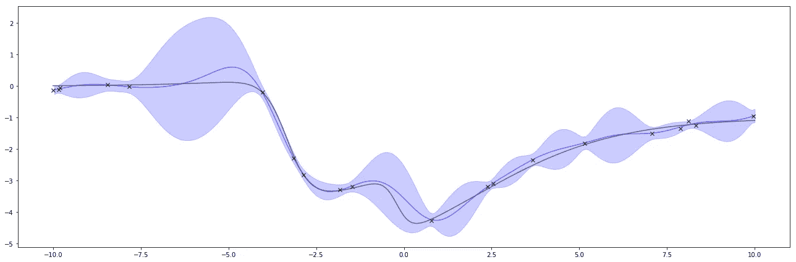
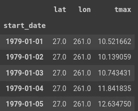
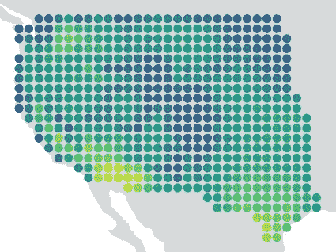
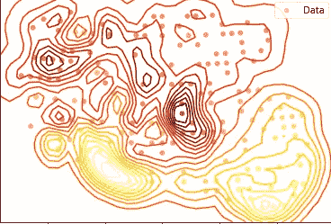

# 高斯过程编程介绍

> 原文：<https://towardsdatascience.com/introduction-to-gaussian-process-programming-in-plain-english-8dd7a94cb18d?source=collection_archive---------33----------------------->

## 什么是高斯过程(GP)，它为什么有用，以及如何实现它

我在网上找到的许多高斯过程(GP)的定义和解释很难阅读和理解。在这篇文章中，我将在梳理了许多资料后，尝试用尽可能简单的语言来解释 GP。此外，我将通过实现一个简单的 GP 程序来宣传为什么 GP 可以成为一个有用且强大的统计工具。


[M. B. M.](https://unsplash.com/@m_b_m?utm_source=medium&utm_medium=referral) 在 [Unsplash](https://unsplash.com?utm_source=medium&utm_medium=referral) 上拍摄的照片

**注:**在试图用更简单的语言解释 GP 时，我将不可避免地失去一些准确性。这篇文章不是用来作为正式的参考，而是作为一篇介绍性的文章。在这篇文章的最后，我会提供适当的资源让你了解更多。

## 目录:

1.  为什么是高斯过程(GP)？
2.  GP 是什么？
3.  如何实施自己的 GP 计划？

# 为什么是高斯过程(GP)？

假设你是一名气象员，收集了美国各地的一系列每日温度测量数据。你对气温的年度趋势有一个粗略的概念:夏季气温上升，冬季气温下降，其间偶尔会有一些波动。什么函数最能捕捉温度的季节性？二次方程足以估计这种趋势吗？或者其他多项式方程？

想到的直接解决方案是执行回归分析并插入最佳拟合线。是的，这肯定是可行的:有了这个最佳拟合方程，你现在可以预测一年中某一天的温度。


最佳拟合回归模型

但是，你的经理可能会问你以下问题:你对自己的预测有多少信心？手里拿着最佳拟合线，很难评估自己预测的不确定性程度，也很难准确评估自己的估计有多可能。

这就是高斯过程(GP)的用武之地。

> GP 不仅给你**精确的**预测值，还给你其不确定度的**范围**。

现在一个大问题来了，GP 到底是如何做到这一点的？为此，我们需要首先回答一个类似的相关问题:什么是 GP？

# GP 是什么？

如前所述，GP 是点之间相似性的*度量，用于从训练数据中预测未知点的值。然而，预测不仅仅是对该点的估计，而是由不确定性信息组成。*

> 这种不确定性信息具有一维正态(**高斯**)分布，随着更多的点被输入并被模型学习，该分布不断更新(**过程**)；因此有了术语**高斯**过程。

考虑下图。蓝色阴影区域是遵循高斯分布的不确定性范围。注意在有两个彼此靠近的点的区域中，蓝色阴影区域是如何缩小的？还有，在两个相邻点相距较远的区域，蓝色阴影区域是如何突然扩大的？

> 解释很直观:数据越少，不确定性越大，反之亦然。



图示了简单的高斯过程(GP)

这使得 GP 成为统计编程中一个极其强大的工具，在这种编程中，数据通常是稀疏的，预测很少是准确的。因为现在我们可以解释每一个预测的不确定性了！

现在我们对 GP 如何工作有了一些直觉，让我们使用我们在开始时介绍的类似温度案例研究来实现一个简单的 GP！

# 如何实施自己的 GP 计划？

> 对于这项研究，[请点击此处](https://drive.google.com/file/d/10JLuU4-c0GQo-YmPJG-ovjYhD5ena1bO/view?usp=sharing)下载温度数据集。

## 1.安装和导入软件包

首先，确保您的机器中安装了以下软件包。如果您还没有这样做，请在您的终端中运行这些命令。

```
$ pip install GPy
$ pip install shapely
$ pip install numpy
$ pip install pandas
$ pip install navpy
$ pip install geopandas
```

通过导入必要的包来完成这一步。

```
# Common libraries
import numpy as np
import pandas as pd
from matplotlib import pyplot as plt
import geopandas as gpd
from shapely.geometry import Point, Polygon# Utilities
import copy# Gaussian Process library
import GPy
```

## 2.数据预处理

现在，让我们将温度数据集加载到 dataframe 对象中。

```
tmax_filename = './gt-contest_tmax-14d-1979-2018.h5'
sf_tmax = pd.read_hdf(tmax_filename)
df_tmax = sf_tmax.to_frame()
df_tmax = df_tmax.reset_index(level=[0, 1])df_tmax.head()
```

您将能够看到数据集的结构:对于每个唯一的温度记录，都有一个相应的时间( *start_date* )和空间( *lat 和 lon* )属性。



数据帧统计

不幸的是，我们有 750 万次测量！！

```
print("Full dataset shape:", df_tmax.shape)
>>> Full dataset shape: (7502858, 3)
```

对于我们当前的用例，让我们将分析限制在 2014 年 7 月 25 日的一个晴天。

```
analysis_date = pd.Timestamp('2014-07-25')df_full = copy.copy(df_tmax.loc[analysis_date, :])
df_full['date'] = df_tmax_date.index 
```

我们现在有了一个更容易管理的 514 记录！

```
print("Maximum tempreature:", df_full.shape)
>>> Maximum temperature: (514, 4)
```

**3。数据可视化**

在定义或拟合任何 ML 模型之前，一个好的实践是了解我们的数据是如何分布的。为此，让我们做一个快速的可视化程序。

首先，我们需要使用 geopandas 将数据框架转换为地理数据框架实例。

```
gdf = gpd.GeoDataFrame(copy.copy(df_full))
```

接下来，我们必须初始化要放置数据点的底图。

```
world = gpd.read_file(gpd.datasets.get_path('naturalearth_lowres'))
world = world.to_crs({'init':'epsg:4326'})
```

最后，我们将定义绘图(plt)对象。

```
ax = gdf.plot(ax=world.plot(figsize=(10, 6), color='grey'), marker='o', c=gdf["tmax"])
```



美国最高温度测量

到目前为止看起来很漂亮！

## 4.训练/测试数据分割

建模步骤之前的最后一步是将数据分为训练集和测试集。

```
df_shuffle = df_all.sample(frac=1.0, replace=False, axis=0)# Split the data with 33% training and 67% testing
df_split = np.array_split(df_shuffle, [df_shuffle.shape[0] // 3])df_train = df_split[0]
df_test = df_split[1]
```

## 5.培训全科医生

一个 GP 需要一个**内核**来评估不同的点对在数学上是如何的。虽然**内核**不在本文讨论范围之内，但是你可以在这里找到更多关于[的信息。现在，我们将使用流行的径向基函数(RBF)核。](https://gpy.readthedocs.io/en/deploy/GPy.kern.src.html#)

不要忘记定义我们的 X 属性(“坐标”)和 y 响应变量(“tmax”)。然后，我们可以简单地通过调用 GPy 包中的 GPRegression 函数来拟合模型，并将 X、y 和我们选择的内核作为属性传递。

```
X = np.array([df_train['lat'], df_train['lon']]).T
y = np.atleast_2d(np.array(df_train["tmax"])).Tkernel = GPy.kern.RBF(input_dim=2)m = GPy.models.GPRegression(X, y, kernel)# Plot the trained GP model
fig = m.plot()
```



高斯过程预测

在上图中，您有代表不确定性值的径向水平曲线。可用的训练数据越少，预测变得越不确定，颜色变得越浅。

# **结论**

我们已经成功地介绍了 GP 的基础知识以及如何实现一个简单的 GP。我建议您尝试不同的可用内核，以便获得一些实践。此外，您可以执行一些内核优化(类似于超参数优化)来使您的模型性能更好。现在，你对 GP 有什么看法？

***做订阅我的邮件简讯:***[*https://tinyurl.com/2npw2fnz*](https://tinyurl.com/2npw2fnz)****在这里我定期用通俗易懂的语言和漂亮的可视化方式总结 AI 研究论文。****

# ***进一步阅读***

*[1][https://peterroelants . github . io/posts/Gaussian-process-tutorial/](https://peterroelants.github.io/posts/gaussian-process-tutorial/)*

*[2][http://Newton . CX/~ Peter/2014/03/elementary-Gaussian-processes-in-python/](http://newton.cx/~peter/2014/03/elementary-gaussian-processes-in-python/)*

*[3][http://www . cs . Cornell . edu/courses/cs 4780/2018 fa/lectures/lectures note 15 . html](http://www.cs.cornell.edu/courses/cs4780/2018fa/lectures/lecturenote15.html)*