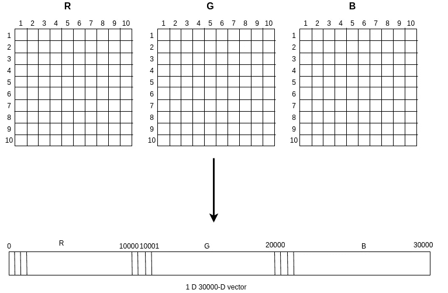
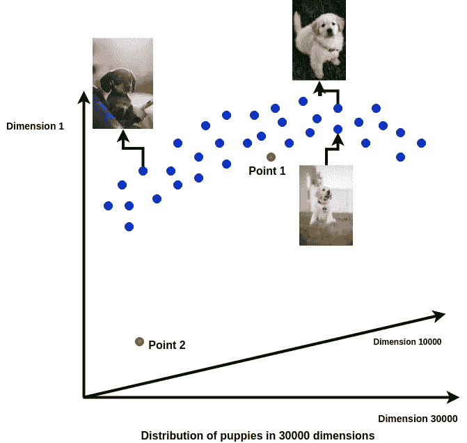
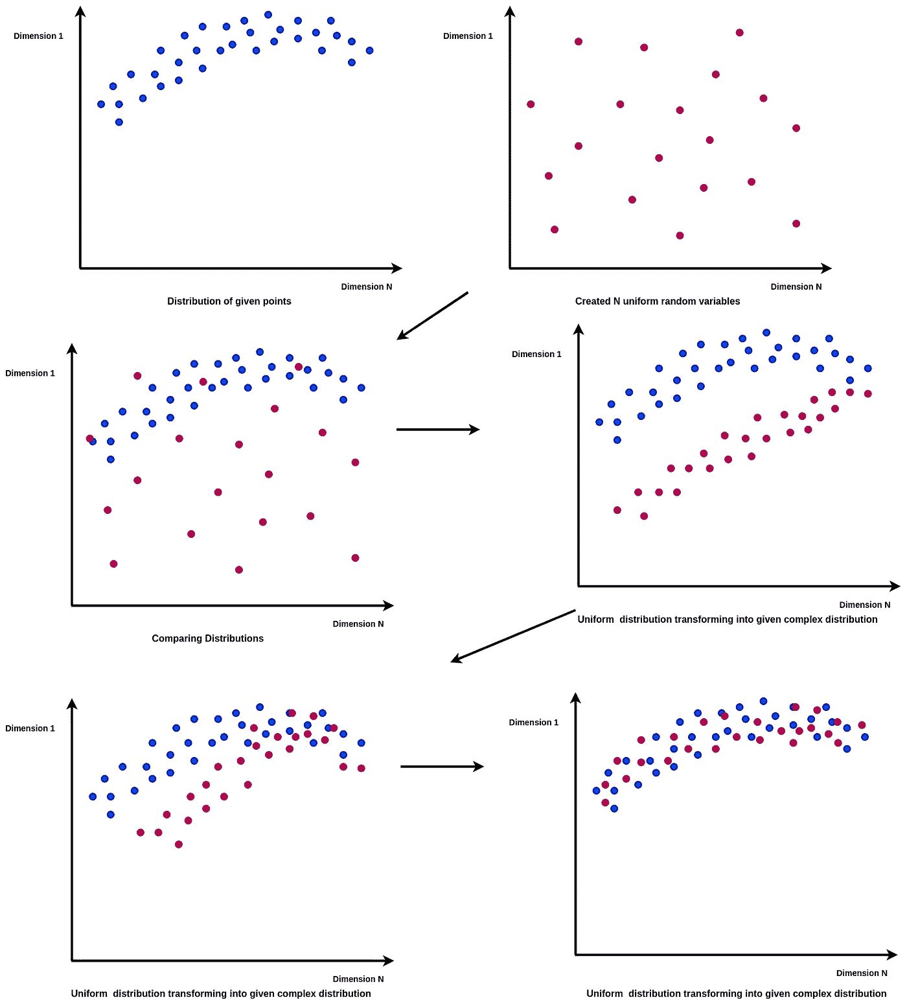
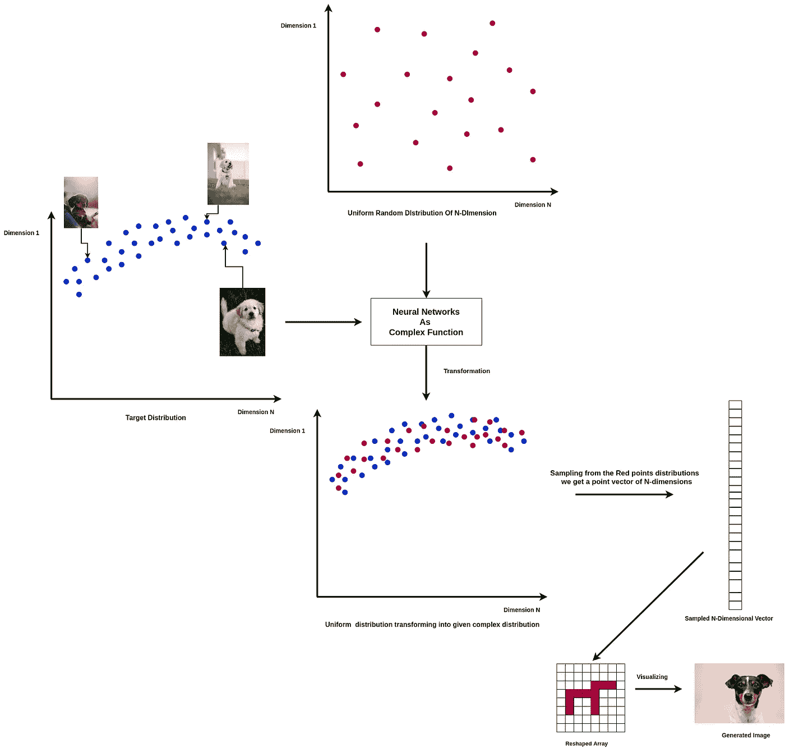
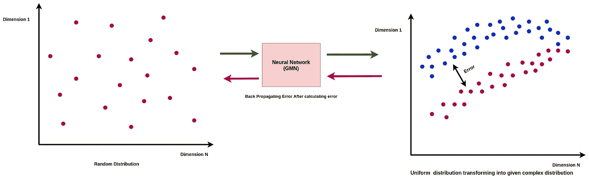
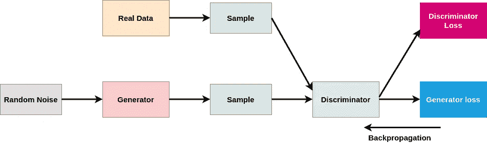
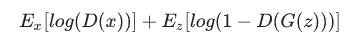

# 生成网络简介

> 原文：<https://towardsdatascience.com/introduction-to-generative-networks-e33c18a660dd?source=collection_archive---------29----------------------->

由 [Unsplash](https://unsplash.com/s/photos/deep-learning?utm_source=unsplash&utm_medium=referral&utm_content=creditCopyText) 上的 [Pietro Jeng](https://unsplash.com/@pietrozj?utm_source=unsplash&utm_medium=referral&utm_content=creditCopyText) 拍摄

## 什么是 GANs，它们是如何工作的？

根据该领域几位著名专家的说法，GANs 是过去十年中机器学习领域最令人兴奋的发现。2014 年，Ian J Goodfellow 的一篇文章首次提出了 GANs 的想法，自发现以来，该想法一直非常受欢迎。

gan 是生成网络领域的一大进步。以前，生成工作是使用变分自动编码器完成的，变分自动编码器采用重新参数化策略，并基于从特征分布中随机生成的数字。这导致 VAEs 创建非现实的图像。GANs 在这方面做得更好。

在这篇文章中，我们将看到生成网络背后的思想，生成网络的类型，以及它们的工作方式

## 生成网络背后的思想

让我们用一个简单的例子来理解这个想法。假设我们有尺寸为 100 x 100 的小狗的 RGB 图像。因此，我们将有 100×100×3 = 30000 个不同的像素。我们乘以 3，因为 RGB 在图像中有 3 个通道。现在，如果我们展平图像，我们将得到一个 30000 维的向量。

图像可以表示为 30000 维向量空间中的点向量。类似地，如果我们将小狗图像数据集中的所有图像绘制成向量空间上的点向量，我们将得到图像的整个分布。所以，从分布中，我们可以得到一个清晰的思路，3 万维向量空间中的哪些点可以代表一只小狗。

从上图我们可以得出一个想法，蓝点分布就是数据集小狗图像的分布。现在，如果我们可以从这个向量空间中选择任何一个点向量，我们将能够使用给定的分布获得这个点成为小狗图像的概率。由于蓝点代表数据集中用于创建分布的所有点，所以代表小狗的所有点的概率之和必须等于 1。简而言之，我们正在使用数据集中的样本创建一个概率密度分布。

现在，如果我们考虑点 1 和点 2，与点 2 相比，点 1 更有可能代表一只小狗，这在图表中非常明显。因此，要生成原始数据集中没有的图像，我们只需从给定数据集创建的概率分布中随机抽取一个向量点。

上述方法的问题是给定的分布太复杂，无法从中取样。上面的图像是一个简化的表示，但在实际情况下，我们有大量的维度，分布变得过于复杂。无法采样的原因是我们无法真正获得给定分布的分布函数，也不可能生成如此复杂的随机变量。

为了解决这个问题，我们使用转换。在这种方法中，我们生成一个随机变量来创建一个简单的均匀随机分布。然后，我们使用一个复函数来转换这个简单分布，将我们的简单分布转换成我们需要的复杂分布。这里我们知道分布函数，可以从中随机抽样。

我们已经找到了一种方法来创建数据集给出的复杂分布，现在实现的挑战来了。为了转换信号，我们实际上需要复杂的分布函数，当然我们没有。我们所拥有的是数据样本，我们可以绘制这些样本来获得分布。因此，我们使用两种分布，一种是通过绘制样本获得的 N 维复数分布，另一种是通过生成 N 个均匀随机变量(每个维度一个)创建的。我们现在有两个分布，都是 N 维的。

我们可以使用伪随机数发生器生成简单的随机均匀变量。它生成一个近似于 0 到 1 之间的随机分布的数字序列。

正如我们在上面看到的，我们创建了 N 变量均匀分布，并使用复变函数将其转换为类似于给定的复变分布。因此，我们可以将数据集中的点绘制为样本，以获得分布，并将两个分布拉近，使它们相似，如上图所示。因此，我们可以创建一个分布，并将其转换为给定的复杂分布，并从中进行采样，以生成所需的输出。需要注意的一点是，在创建新的均匀随机分布后，我们进行上采样，以便我们可以比较和转换，用新创建的分布来逼近原始的复杂分布。

## 实施

因此，到目前为止，我们已经知道，我们的实际任务是制定一个复杂的函数，我们可以使用它将我们创建的简单正态均匀分布转换为给定的复杂分布。我们知道我们可以用神经网络来表达转换的函数。神经网络使用一定程度的非线性，这使得神经网络可以设计任何所需的复杂函数。因此，神经网络充当转换功能。

现在，根据它们用来执行任务的程序，有两种类型的生成网络架构是可能的。

1.  生成匹配网络
2.  生成对抗网络

所以，让我们来看看他们的工作方式。

## 生成匹配网络

生成匹配网络是解决这一问题的直接方法。它只是试图最小化生成的分布和实际复杂分布之间的距离。它选取一些随机样本，生成分布，并在每次迭代后计算生成的分布与实际分布之间的差异。该差作为误差，通过模型反向传播，并且使用梯度下降来更新模型参数。我们再次获得生成的分布，并继续上述过程。

上图代表 GMN。现在，在每次迭代中，我们将真实分布与每个阶段生成的分布进行匹配以生成误差，我们称之为生成匹配网络。对于每一个神经网络的工作，我们需要一个损失函数，网络最小化。从上面的讨论中，很明显，在这种情况下，损失函数是生成的分布和真实分布之间的差异或距离。

现在，出于这个目的，我们可能已经使用了任何损失函数，例如计算两个给定分布之间差异的 KL 散度，但是最大平均差异(MMD)被用作 GMT 情况下的损失函数。MMD 定义了两个概率分布之间的距离，可以基于这些分布的样本来计算(估计)该距离。关于 MMD 的细节可以在她的文章中找到。我们的神经网络的主要目标是最小化 MMD 误差或损失函数。需要注意的一点是，网络的输入是随机生成的 N 维点向量，在这些情况下被视为噪声。

我们很少使用 gmn，因为它们很难建立和训练。

让我们揭开最常用的生成网络 gan，并深入了解其概念。

## 生成对抗网络

一般敌对网络被认为是一种解决问题的间接方法。gan 训练发电机网络来完成一项任务，从而减少原始分布和生成分布之间的差异。这里的任务是增加鉴别器模型的误差。因此，由于我们没有直接研究真正的动机，我们称之为“敌对”网络。

现在，让我们详细说明 GANs 的工作原理。GANs 有两个神经网络，一个生成器和一个鉴别器。生成器生成矢量点，鉴别器的功能是在生成的点和真实数据点之间进行鉴别。因此，鉴别器试图通过正确识别生成的数据来减少分类误差，而生成器试图通过生成更好的数据点来增加分类误差。

这个网络背后的想法是基于博弈论中的均衡概念。这被称为纳什均衡。

> 在博弈论中，以数学家小约翰·福布斯·纳什命名的纳什均衡是定义涉及两个或更多玩家的非合作游戏的解决方案的最常见方式。在纳什均衡中，每个参与者都知道其他参与者的均衡策略，没有人会因为只改变自己的策略而获益。维基百科。

两个模型，鉴别器和生成器，同时被训练以在两人游戏中击败对方并达到纳什均衡。我们可以理解，在现实世界的双人游戏中，一个玩家的行动会影响另一个玩家的行动。类似地，这里发生器的目标根据鉴频器产生的误差而移动。如果目标或鉴别器误差在变化或移动，发生器将很难工作。因此，为了避免这种情况，在生成器训练期间不训练鉴别器，反之亦然。但重要的是，这两种模式一起学习，以使它们趋同。所以，首先，我们训练鉴别器，然后我们继续训练发生器。

GAN 模型

上图显示的是 GAN 模型。这是谷歌开发者基于原始设计的一个设计。正如我们所看到的，生成器依赖于鉴别器。

现在，鉴频器损耗只是反向传播到鉴频器网络。发电机损耗通过鉴别器反向传播到发电机。鉴别器的权重在生成器训练期间被冻结，使得它们不会由于生成器训练期间的反向传播而被更新。

程序:

1.  发生器和鉴别器都被初始化。
2.  随机噪声被传入生成器，用于创建假的或生成的实例。
3.  生成的实例和真实的实例一起被传递给鉴别器。
4.  鉴别器试图将假实例分类为假实例，将真实实例分类为真实实例
5.  获得了鉴别器和发生器损耗
6.  损失被反向传播，鉴别器和发生器被相继训练。

上述步骤显示了在一个时期内训练 GAN 的过程。最初，鉴别器表现出色，因为生成器根本没有经过训练，生成的输出与实际情况相差甚远。

## **损失函数**

我们知道，对于任何要训练的网络，我们都需要一个损失函数，通过鉴别器网络和生成器网络来学习，这个损失函数将最小化。

在介绍性论文中，GAN 的损失函数被提议为**最小最大损失**。极大极小损失也是从博弈论的极大极小算法发展而来的。我试着举个例子。

比如说，两个玩家玩一个游戏，比赛。博弈论表明，整个游戏和双方在游戏的每个阶段的每一个可能的举动都可以用一个 n 元树结构清楚地表示出来。n 的值取决于游戏和移动的类型。这叫做博弈树。现在，我们可以根据赢得游戏的潜力来给玩家的棋打分。这就叫效用。所以，走得最好的人有最大的效用，他/她就赢了。效用不过是解释获胜可能性的一种方式。

我们可以看到，要想赢，一个玩家必须最大化自己的效用，最小化对手的效用。但是为此我们必须找出对手能做出的最好的移动，所以我们也需要找到他们未来最大效用的移动。因此，算法需要我们进行递归调用来最大化和最小化。所以，这个算法叫做极小极大算法。你可以在这里阅读更多关于这个算法[的内容。](/how-a-chess-playing-computer-thinks-about-its-next-move-8f028bd0e7b1)

上述等式显示了鉴频器损耗函数。E(x)是概率和的期望值。D(x)是鉴别器预测实例 x 为真实的概率。G(x)是随机噪声 x 产生的输出，z 是给定的随机噪声。

在这个等式中，第一部分对应于真实的实例。x 是实数，因此，这里 D(x)需要为 1 或更接近 1，鉴别器才能更好地工作。我们需要第一部分的价值增加。还是那句话，G(z)是假的，所以我们需要 D(G(z))低，所以，我们尽量增加(1- D(G(z))。这种损失类似于交叉熵损失。这是鉴频器损耗。鉴别器试图最大化上面给出的损失函数，相反，它试图最小化它的负值。

发电机以相反的方向工作。因此，它试图最小化给定的损失函数。第一部分不受发生器的影响。所以，它只影响第二部分(1-D(G(z))。生成器最小化(1-D(G(z)))或最大化 D(G(z))。因此，它希望鉴别器为生成的实例预测成为真实实例的高概率。

## 挑战

gan 在应用和设计方面面临一些挑战。来说说他们吧。

1.  我们知道，发电机是由鉴频器损耗驱动的。最初，鉴别器很容易区分真实实例和生成实例，因此生成器学习得很好，但是在生成器经过训练并开始生成与真实实例非常相似的生成实例之后，鉴别器的任务变得非常困难，并开始表现得幼稚。实例的预测概率变为 50%。因此，在这一点上，发电机被训练在最佳水平。现在，发生器必须停止使用鉴频器损耗进行训练，否则发生器将开始表现不佳，因为它正在对错误的输入进行训练。网络的训练必须停止在某一水平。
2.  最初，鉴别器很容易对数据实例进行分类。因此，它可以很容易地将假的归类为假的，将真实的实例归类为真实的。现在，如果鉴频器完美地做到了这一点，鉴频器损耗变为零，无法最小化，这会导致 GANs 在训练的早期阶段进入次优状态。同样，如果损耗太小，即鉴别器正确地预测了它们中的大部分，由于消失梯度问题，损耗不会反向传播到发生器，再次使发生器失败。这再次导致次优状态。这被称为**消失梯度问题**。
3.  第三类问题是存在的。这是众所周知的。这就是所谓的**模式崩溃**问题。有时，鉴别器会遇到次优的局部最小值，无法进一步优化。如果损失非常小并且在反向传播过程中消失，这实际上也会发生。这导致鉴别器不能正确识别一些实例。鉴别器需要更新其权重并自我校正，但由于次优状态而失败。现在，生成器需要创建不同类型的实例。但是如果它得知鉴别器不能识别特定类型的实例。它生成相同数据的多个实例，并欺骗鉴别器。鉴别器永远不会逃脱陷阱，因此生成器会过度优化自己。

## 修正损失函数

上述问题证明，我们必须修改损失函数，以消除消失梯度的挑战。让我们看看修改后的损失函数:

1.  **修正的极大极小损失**:已经确定，在极大极小损失中，如果对于生成器，不是最小化 log(1-D(G(z))，而是直接开始最大化 log(D(G(z))，则消失梯度问题得到解决，并且模型性能提高。因此，损耗被适当地传播，并且次优状态被避免。
2.  **瓦瑟斯坦损失**:瓦瑟斯坦损失的概念是从推土机的距离建立的。

> 在统计学中，推土机距离(EMD)是区域 d 上两个概率分布之间距离的度量。在数学中，这被称为 Wasserstein 度量。非正式地，如果分布被解释为在区域 D 上堆积一定量的灰尘的两种不同方式，EMD 是将一堆变成另一堆的最小成本；其中成本假定为移动的灰尘量乘以移动的距离。
> 
> 推土机的距离可以公式化并作为运输问题来解决。假设有几个供应商，每个供应商都有给定数量的货物，需要供应给几个消费者，每个消费者都有给定的有限能力。对于每一对供应商-消费者，运输一件商品的成本是已知的。运输问题就是找到一条从供应商到消费者的最便宜的物流路线，满足消费者的需求。—维基百科

因此，推土机的距离基本上给出了移动一个分布的点以匹配另一个分布所需的最小成本。利用这种损耗的 GAN 称为 Wasserstein GAN 或 WGAN。这里，鉴别器并不试图将实例分类为生成的或真实的。鉴别器分配一个分数。鉴别器试图为真实实例分配比虚假实例更大的分数。没有这样的截止日期。只是分配给真实实例的数量要大得多。现在，由于歧视者不分类，它被称为**评论家**。这种损失被称为**评论家损失**。生成器试图增加虚假实例的分数。

> **批评家损失:** D(x) — D(G(z))
> 
> **发电机损耗:** D(G(z))

D(x)是 x 实例的评论家的输出值。正如我们从批评家的损失中看到的，批评家试图增加真实和虚假实例的输出值之间的差异。所以，它最大化这个函数或者最小化它的否定。类似地，生成器试图增加或最大化鉴别器给生成的实例的输出值。这些值不限制在 0 和 1 之间，并且具有较大的值，因此不存在渐变消失的问题。

## 结论

在这篇文章中，我们已经看到了生成网络的介绍，并侧重于 GAN。

我希望这有所帮助。