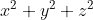
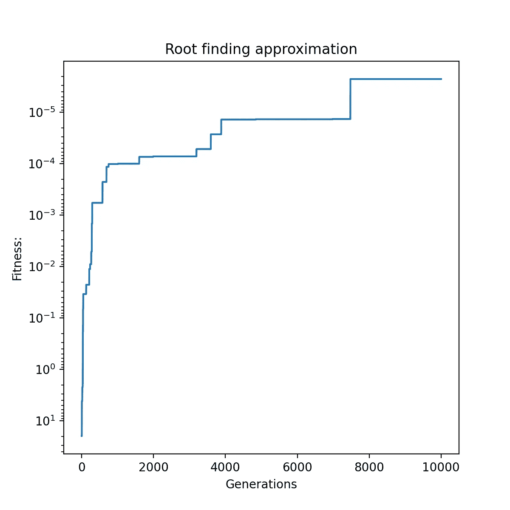

# 使用 EasyGA Python 包介绍遗传算法——带示例代码

> 原文：<https://towardsdatascience.com/introduction-to-genetic-algorithms-using-the-easyga-python-package-includes-example-code-c6591eb56215?source=collection_archive---------21----------------------->

## 创建遗传算法应用程序比以往任何时候都容易。


照片来自 Unsplash，作者是 Clément Hélardot

一种**遗传算法**是达尔文自然进化论的产物。该算法是围绕自然选择的思想建立的，在自然选择中，群体中的个体进行繁殖，希望产生更好的后代。这个过程会持续多代，希望能产生想要的结果。

有了 python 包，这个复杂的过程被简化了。asyGA python 包 将编写一个合适的 GA 的复杂而耗时的过程缩短到了几分钟，而不是几个小时。

[遗传算法介绍—包括示例代码](/introduction-to-genetic-algorithms-including-example-code-e396e98d8bf3)

**先说一个初学者的例子**。当我第一次开始写自然选择算法时，我受到了 Vijini Mallawaarachchi 的介绍性文章的启发，所以对我来说，利用她在基因库中得到所有 1 的问题是很自然的，或者在这种情况下，我们将基因库称为染色体。

首先，您需要安装 python 包。

```
pip3 install EasyGA
```

下面是她使用 EasyGA 解决问题的完整示例代码。

作者编写的代码。

**输出:**

```
Current Generation     : 1
Best Chromosome     : [1][1][0][0][1]
Best Fitness        : 3
--------------------------------------------------
Current Generation     : 2
Best Chromosome     : [1][1][0][1][1]
Best Fitness        : 4
--------------------------------------------------
Current Generation     : 3
Best Chromosome     : [1][1][0][1][1]
Best Fitness        : 4
--------------------------------------------------
Current Generation     : 4
Best Chromosome     : [1][1][1][1][1]
Best Fitness        : 5
```

如你所见，我们创造了一种遗传算法来解决我们染色体中有五个 1 的问题。对于如此强大的软件包来说非常简单。让我们试试另一个例子，一个求根算法。维基百科中定义的求根算法:

> 在数学和计算中，**求根算法**是一种寻找零的算法，也称为连续函数的“根”。从实数到实数或从复数到复数的函数 *f* 的零点是一个数 *x* ，使得 *f* ( *x* ) = 0。

在小学/高中，我们被教导如何化简方程来求根。然而，在这个例子中，我们将使用遗传算法来完成这项工作。不再多想，直接输入，得到答案。



我们的求根函数。作者照片。

下面是我们将要做的事情的安排。如你所见，EasyGA 不仅允许我们运行复杂的遗传算法，而且只用了 33 行 python 代码就完成了。

作者编写的代码。

**输出:**



图片作者。

**输出:**

```
Current Generation     : 10000Chromosome - 0:

[0.0004391616070176241]
[-0.00018549426948410996]
[0.0014267659834530377] Fitness = 2.26293221262846e-06Chromosome - 1:
[0.0004391616070176241]
[-0.00018549426948410996]
[0.0014267659834530377]Fitness = 2.26293221262846e-06Chromosome - 3:[0.3639195265169164]
[-0.00018549426948410996]
[0.0014267659834530377] Fitness = 0.00013243949184959217Chromosome - 4:[0.3639195265169164]
[-0.00018549426948410996]
[0.0014267659834530377]Fitness = 0.00013243949184959217
etc
```

# 摘要

在本教程中，我们展示了如何使用 EasyGA Python 包在基因库问题中简单地“寻找所有的 1 ”,然后用它来寻找数学方程的根。

包安装后，需要五个步骤来运行 EasyGA:

*   进口 EasyGA
*   设置您的 gene_impl 或 chronous _ impl 变量
*   创建和定义你的健身功能
*   进化你的遗传算法
*   最后，使用图表或打印您的解决方案来打印您的结果。

如果你想了解我的研究和其他活动的最新情况，你可以在 [Youtube](https://www.youtube.com/channel/UCjgDAGxCB0CF-X8eZdo6TGA) 、 [Github](https://github.com/danielwilczak101) 甚至 [Twitch](https://www.twitch.tv/mellowman101/videos?category=21548&filter=archives&sort=time) 上关注我做一些现场编码。

感谢您的阅读，
丹尼尔·威尔扎克