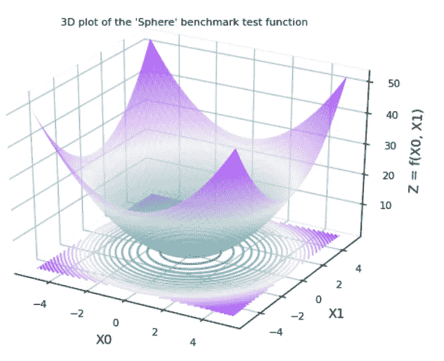

# 连续域函数的全局优化算法介绍；

> 原文：<https://towardsdatascience.com/introduction-to-global-optimization-algorithms-for-continuous-domain-functions-7ad9d01db055?source=collection_archive---------19----------------------->

## **蚁群优化(ACO)算法来救援！！**

由 [Salmen Bejaoui](https://unsplash.com/@slmnbj?utm_source=medium&utm_medium=referral) 在 [Unsplash](https://unsplash.com?utm_source=medium&utm_medium=referral) 上拍摄的照片

在本文中，我将概述蚁群优化(ACO)算法的实现(带有示例代码)以及如何使用它来解决一些常见基准连续域函数的优化(最小化)。ACO 算法属于所谓的自然启发的元启发式算法家族，这种算法在机器学习领域越来越受欢迎。

这篇文章的结构如下:

*   介绍
*   问题说明
*   蚁群算法
*   代码实现细节
*   基准测试结果
*   结束语
*   参考

1.  **简介**

全局优化是数学和计算机科学的一个分支，它开发的算法可用于寻找连续域函数或给定数据集的一组函数的全局最小值或最大值[1]。各种各样的最优化问题出现在许多定量学科中。机器学习(ML)中的一些例子包括:

*   ML 算法的超参数优化[2]
*   ML 算法特征选择[3]
*   深度学习或经典 ML 算法的损失/成本函数优化[4，5]
*   神经网络最佳架构设计[6]
*   最佳路径优化——如旅行推销员问题[7]

一般来说，优化问题包括通过在其边界内迭代地选择 N 个输入并计算函数值来最小化(或最大化)连续 N 维函数的计算。

全局优化算法可以大致分类如下:

*   确定性全局优化[8]
*   元启发式全局优化[9]

ACO 是一个自然启发的元启发式优化例程，本文将主要关注这个算法。然而，还有许多其他自然启发的元启发式优化算法，其中一些包括:

*   模拟退火
*   遗传算法
*   粒子群优化
*   人工蜂群优化
*   多方面优化
*   蝙蝠算法优化
*   萤火虫算法
*   和许多其他的，进一步的细节可以在[10]中找到

我将在以后的文章中探讨这些元启发式算法。本文的下一部分将描述问题规范。

**2。问题说明**

问题规格是使用 ACO 算法解决 5 个基准经典连续域函数的最小化。这些功能是:

1.  Rosenbrock 具有属性[11]:

*   维数，d = 10
*   Xi ∈ [-5.0，10.0]，对于所有 i = 1，…，d
*   在 X* = (1.0，…，1.0)处，f(X*) = 0.0

2.具有属性[12]的 Ackley:

*   维数，d = 10
*   Xi ∈ [-32.768，32.768]，对于所有 i = 1，…，d
*   在 X* = (0.0，…，0.0)处，f(X*) = 0.0

3.球体[13]具有以下属性:

*   维数，d = 10
*   Xi ∈ [-5.12，5.12]，对于所有 i = 1，…，d
*   在 X* = (0.0，…，0.0)处，f(X*) = 0.0

4.Styblinski-Tang 具有属性[14]:

*   维数，d = 10
*   Xi ∈ [-5.0，5.0]，对于所有 i = 1，…，d
*   f(X*) = -39.16599d，X* = (-2.903534，…, -2.903534)

5.具有属性[15]的 Rastrigin:

*   维数，d = 10
*   Xi ∈ [-5.12，5.12]，对于所有 i = 1，…，d
*   在 X* = (0.0，…，0.0)处，f(X*) = 0.0

**3。蚁群算法**

用于解决上一节中描述的最小化问题的 ACO 算法的伪代码概述如下:

ACO 作者伪代码

例如，阿克利问题(在第 2 节中描述)有 10 个变量(d = 10)的 Xi，每个变量有一个连续的域边界:Xi ∈ [-32.768，32.768]。Ackley 函数的 3D 图如下所示(即，自然地，该图针对维度 d = 2):

作者绘制的“Ackley”基准问题的三维图

算法输入/输出为:

由作者输入 Ackley 问题的 ACO 参数

按作者输出“Ackley”问题的 ACO 结果

“Ackley”问题目标函数的期望值为:

在 X* = (0.0，…，0.0)处，f(X*) = 0.0

结果表明，蚁群算法在优化最小搜索方面表现良好。ACO 计算的收敛图如下所示:

作者的 ACO 优化‘Ackley’问题的收敛图

**4。代码实现细节**

ACO 算法的实现是用 Python 编写的，代码的 Github repo 可以在[这里](https://github.com/aidowu1/Py-Optimization-Algorithms)找到。这段代码部分是由[16]提供的 Matlab 实现的 python 移植，是对 ACO 群体智能[17]的一篇论文的解释。用于调用 ACO 算法的核心组件是 **AcorContinuousDomain** 类。可以通过向构造函数提供以下参数来构造该类:

*   蚂蚁种群数量大小(__n_pop)
*   被优化的连续函数的变量/维数(__n_vars)
*   正在优化的成本函数(__cost_func)
*   被优化的成本函数的上界和下界(__domain_bounds)

如以下代码片段所示:

要调用 ACO 算法主循环并获得最优解，请使用以下代码片段:

请注意，ACO 代码利用助手类 **ProblemConstants** 和 **AcoConstants** 来指定问题域用例以及超参数配置，如以下代码片段所示:

用于演示 ACO 算法的代码路径可以在 **Client.py** 模块中找到。该模块包含 runAcoClient()函数，该函数可用于演示特定问题用例的 ACO 解决方案，如以下代码片段所示:

**5。基准测试结果**

除了为 Ackley 连续域问题/函数获得的结果(在第 3 节中描述)。本节概述了对其他 4 个连续域问题/函数(在第 2 节中描述)获得的测试结果，即:

*   罗森布罗克
*   范围
*   斯蒂布林斯基-唐
*   拉斯特里金

请注意，这些函数是使用 ACO 算法求解的，其中维度/变量的数量设置为 2。这些函数的三维图如下所示:

作者绘制的 Rosenbrock 函数图

作者绘制的球面函数图

作者对汤功能的构思

作者绘制的栅格函数图

每个问题使用的 ACO 算法输入和结果输出如下:

作者提出的“Rosenbrock”问题的输入参数和输出结果

作者提出的“球体”问题的输入参数和输出结果

作者提出的“Styblinski-Tang”问题的输入参数和输出结果

作者的“光栅化”问题的输入参数和输出结果

**6。结束语**

本文向观众介绍了蚁群优化(ACO)的自然启发元启发式技术的使用。在这种情况下，用于多元连续函数的最小化(或最大化)。

它提供了如何用 python 实现 ACO 算法的分步演示。它还展示了 ACO 算法在一组经典的基准连续域优化问题上令人印象深刻的收敛特性(当配置了适当的 ACO 超限仪时)。

在我以后的文章中，我将探索使用其他自然启发的元启发式算法来优化连续域问题。

**7。参考文献**

[1] [数学优化](https://en.wikipedia.org/wiki/Mathematical_optimization#cite_note-1) (2021)，维基百科

[2] [超参数优化](https://en.wikipedia.org/wiki/Hyperparameter_optimization) (2021)，维基百科

[3] [特征选择](https://en.wikipedia.org/wiki/Feature_selection#Application_of_feature_selection_metaheuristics) (2021)，维基百科

[4] H. Martin 等，[卷积神经网络的元启发式算法](https://www.hindawi.com/journals/cin/2016/1537325/) (2016)，计算智能与神经科学

[5] Z. Ahmed，[训练神经网络(Numpy) —粒子群优化(PSO)](https://medium.com/@zeeshanahmad10809/train-neural-network-numpy-particle-swarm-optimization-pso-93f289fc8a8e) (2020)，中

[6] B. A .加罗和 R. A .瓦兹奎[使用粒子群优化算法设计人工神经网络](https://www.hindawi.com/journals/cin/2015/369298/) (2015)，计算智能和神经科学

[7] V. Chandra [使用优化技术的选址和最佳路径—加拿大邮政示例](/site-selection-and-best-path-using-optimization-techniques-canada-post-example-f0868d641bf7) (2020)，中等

[8] [确定性全局优化](https://en.wikipedia.org/wiki/Deterministic_global_optimization) (2020)，维基百科。

[9] [元启发式](https://en.wikipedia.org/wiki/Metaheuristic) (2021)，维基百科

[10] F. Aljarah 等人，[EvoloPy:Python 中一个受自然启发的开源优化框架](https://www.researchgate.net/publication/309201982_EvoloPy_An_Open-Source_Nature-Inspired_Optimization_Framework_in_Python) (2016)，载于《第八届国际计算智能联合会议论文集》(IJCCI 2016) -第 1 卷

11s . Sonjanovic 和 D. Bingham。，[模拟实验虚拟图书馆:测试函数和数据集-罗森布罗克函数](https://www.sfu.ca/~ssurjano/rosen.html) (2013)，西蒙弗雷泽大学

12s . Sonjanovic 和 D. Bingham。，[仿真实验虚拟库:测试函数和数据集-阿克利函数](https://www.sfu.ca/~ssurjano/ackley.html) (2013)，西蒙弗雷泽大学

13s . Sonjanovic 和 D. Bingham。，[仿真实验虚拟库:测试函数和数据集-球函数](https://www.sfu.ca/~ssurjano/spheref.html) (2013)，西蒙弗雷泽大学

14s . Sonjanovic 和 D. Bingham。，[仿真实验虚拟库:测试函数和数据集- Styblinski-Tang 函数](https://www.sfu.ca/~ssurjano/stybtang.html) (2013)，西蒙弗雷泽大学

15s . Sonjanovic 和 D. Bingham。，[仿真实验虚拟库:测试函数和数据集- Rastrigin 函数](https://www.sfu.ca/~ssurjano/rastr.html) (2013)，西蒙·弗雷泽大学

16m . k .赫里斯。，[MATLAB 中连续域的 ACO](https://yarpiz.com/67/ypea104-acor)(2015)，Yarpiz

[17]国际法院里亚迪案。，[认知蚁群优化:群体智能的新框架](http://usir.salford.ac.uk/id/eprint/30721/1/Riadi_Thesis_2014_jan.pdf) (2014)，博士论文，英国曼彻斯特索尔福德大学

**Github**

ACO 实现的完整代码(包括单元测试)可以在[这里](https://github.com/aidowu1/Py-Optimization-Algorithms)找到。

**感谢您阅读本文！**

**你可以通过** [**Github**](https://github.com/aidowu1) 和我联系