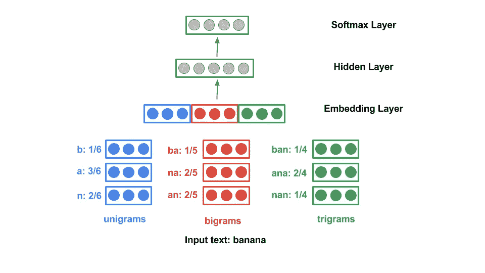

# Python 中 Google 的 Compact Language Detector v3 简介

> 原文：<https://towardsdatascience.com/introduction-to-googles-compact-language-detector-v3-in-python-b6887101ae47?source=collection_archive---------27----------------------->

## 一种用于语言识别的神经网络模型


汉娜·赖特在 [Unsplash](/s/photos/language?utm_source=unsplash&utm_medium=referral&utm_content=creditCopyText) 上拍摄的照片

通过阅读这篇文章，你将学会使用 Google CLD 3 的 Python 绑定来检测和识别文本中使用的语言。供您参考，Compact Language Detector v3 (CLD3)是 Google 发布的一个语言识别包。在撰写本文时，它已经对大多数通用语言提供了巨大的支持。您可以在以下链接中找到[完整列表。](https://github.com/google/cld3#supported-languages)

它包含基于 C++的训练模型和推理代码。根据官方文档

> “…推理代码从输入文本中提取字符 ngrams，并计算每个字符出现的时间。
> 
> 该模型根据分数平均对应于每个 ngram 类型的嵌入，并且平均的嵌入被连接以产生嵌入层。网络的其余组件是一个隐藏(校正线性)层和一个 softmax 层。"

CLD3 的基本架构如下，使用`banana`作为输入文本:



图片取自 [CLD3 的 Github](https://github.com/google/cld3) 页面

自 2020 年 8 月底以来，他们发布了一个官方的 Python 包，其中带有 Python 推理代码。从官方库中查看下面的[代码，了解基于`pybind`包的实际实现。](https://github.com/google/cld3/blob/master/gcld3/pybind_ext.cc)

让我们继续下一部分，开始安装必要的模块。

# 设置

为了从 PyPI 安装 CLD3，您需要在本地计算机上安装以下附加软件包:

*   Protobuf 编译器是`protoc`的可执行文件
*   Protobuf 开发头文件和`libprotoc`库
*   一个编译器，最好是`g++`

## 原蟾蜍

如果您使用的是 Debian/Ubuntu 操作系统，请运行以下命令:

```
sudo apt-get install -y --no-install-recommends g++ protobuf-compiler libprotobuf-dev
```

有关其他操作系统安装过程的更多信息，请查看自述文件中的[。](https://github.com/protocolbuffers/protobuf/tree/master/src)

## CLD3

强烈建议您在继续安装之前创建一个虚拟环境。激活它并在您的终端中运行以下命令来安装 CLD3 的官方 Python 绑定:

```
pip install gcld3
```

# 履行

一旦安装了所有必需的包，就可以直接在 Python 脚本中使用它。创建一个名为`test.py`的新 Python 脚本。

## 导入

在文件顶部添加以下 import 语句。

```
import gcld3
```

## 语言标识符对象

接下来，初始化一个新的`NNetLanguageIdentifier`对象。

```
detector = gcld3.NNetLanguageIdentifier(min_num_bytes=0, max_num_bytes=1000)
```

它接受以下参数:

*   `min_num_bytes`:推断时要考虑的最小字节数。将此项设置为大于 0 的值将返回空字符串的`und`。
*   `max_num_bytes`:推断时要考虑的最大字节数。如果输入文本超过了设置的值，它将截断多余的字节。

如果您想过滤掉空字符串和短字符串，可以按如下方式初始化实例:

```
detector = gcld3.NNetLanguageIdentifier(min_num_bytes=10, max_num_bytes=1000)
```

## 检测单一语言

CDL3 附带了两个推理函数。第一个是用于单一语言推理的`FindLanguage`函数。它接受代表样本文本的单个`text`参数。

```
sample = "Welcome to Medium."
result = detector.FindLanguage(text=sample)
```

它返回一个包含以下字段的`Result`对象:

*   `language`:BCP 47 式表示的语言代码。
*   `is_reliable`:反映检测可靠性的布尔值。
*   `proportion`:float，表示样本文本中预测语言的比例和权重。范围从 0 到 1。该字段在多语言检测过程中很有用。
*   `probability`:预测的置信度。范围从 0 到 1。

只需如下调用每个字段即可获得相应的值:

```
result.languageresult.is_reliableresult.proportionresult.probability
```

## 检测多种语言

您应该使用`FindTopNMostFreqLangs`来检测多种语言。除了`text`参数，它还接受另一个名为`num_langs`的整数参数。

```
sample = ("Welcome to Medium. Bienvenido a Medium.")
results = detector.FindTopNMostFreqLangs(text=sample, num_langs=2)
```

`FindTopNMostFreqLangs`返回一个`Result`对象列表。只需在一个循环中调用相应的字段，就可以获得所需的输出。

```
for i in results:
    print(i.language)
```

请注意，列表长度基于`num_langs`。如果将它的值设置为 5，它将返回列表中的 5 个`Result`对象。

你可以在[下面的要点](https://gist.github.com/wfng92/509f8c83d366b3d7ef35f71caeaf751b)中找到完整的代码。

# 结论

让我们回顾一下你今天所学的内容。

本文首先简要介绍了 Google 的 Compact Language Detector v3 背后的基本架构和概念。

接下来，它讲述了基于您所拥有的操作系统的安装过程。CLD3 的 Python 包通过`pip install`安装。

在实现部分，以`FindLanguage`和`FindTopNMostFreqLangs`函数为基础进行说明。这两个函数都返回`a single`或一个包含一些有用参数的`Result`对象列表，如`language`和`probability`。

感谢你阅读这篇文章。希望你会回来看我的其他文章！

# 参考

1.  [Github — CLD3](https://github.com/google/cld3)
2.  [PyPI — gcld3](https://pypi.org/project/gcld3/)