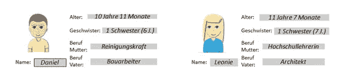
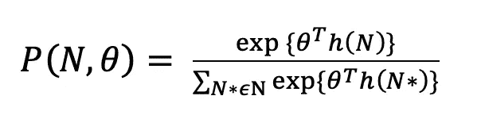
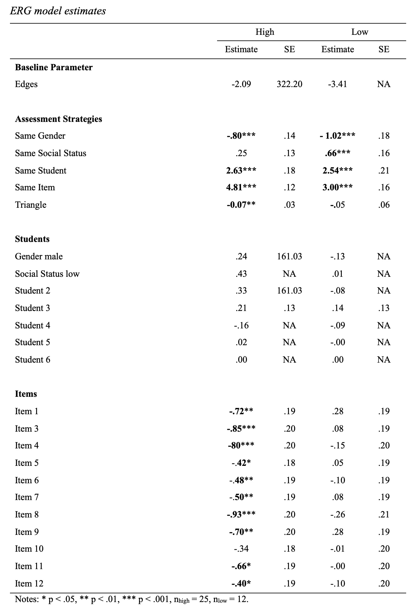

# 点击流数据的图形模型介绍

> 原文：<https://towardsdatascience.com/introduction-to-graph-models-for-clickstream-data-c2bc44da90bb?source=collection_archive---------16----------------------->

## 来自模拟教室的教育示例

艾莉娜·格鲁布尼亚克在 [Unsplash](https://unsplash.com?utm_source=medium&utm_medium=referral) 上的照片

# **简介**

每当我们分析*人们如何与数字内容*互动时，我们倾向于将人们的行为视为他们*思想和情感的表达*。但这只是硬币的一面。人们行动的环境(在线或离线)对人们与之互动的方式有着重要的影响。

图片和大的浮华元素吸引注意力，页面底部的小东西经常被忽略。如果我们想创造有意义的数字旅程，让人们的生活更轻松，我们需要了解数字内容对用户及其行为有什么影响。

但是我们怎样才能理清这两种影响的来源呢？在班伯格大学，我参与了一个在教育背景下解决这个问题的研究项目。我来详细说明一下。

# **研究背景**

## 让我们想想学校。

我们想知道老师们对学生成绩的判断究竟是如何形成的。由于真实的教室是一个高度复杂和互动的环境，我们选择了一个参与者可以在电脑上工作的模拟版本。通过这种方式，我们可以记录每一次鼠标点击，并最终获得一组点击流数据。但是如何处理这些数据呢？

这就是 ***指数随机图模型****【ERGM】*进入的阶段。但是我们先来看看研究设置。

## **实验设置**

我们选择了 12 个不同类型的数学任务，难度范围很广。学生能力通过每个学生达到的最高任务难度 T30 来操作。当任务难度超过特定学生的能力时，学生解决特定任务的概率从 1 变到 0(参见确定性潜在特质模型[1])。我们版本的**模拟教室**如下图所示。

模拟课堂软件截图。图片作者。

最初，参与者必须估计 12 个项目的难度。在第二步中，呈现六个**学生描述**，指示学生的*姓名*、*年龄*、*性别*、*兄弟姐妹数量*及其*父母的职业*，以便给出潜在相关和不太相关的信息。下图给出了两个示例说明。

图片作者。

在模拟教室中，参与者可以使用最初评估的 *12 个项目来评估六名模拟学生的能力*，目的是对六名模拟学生的能力做出判断。**分配给学生的每个项目被视为一次互动**。在模拟教室中完成评估后，参与者必须用 11 分的李克特量表(Likert-Scale)从 0 到 100 分评估学生的数学能力。

## **样品**

样本由 37 名德国中学教师组成。59%的参与者是女性。参与者平均有 11.37 年(标准差= 10.13)的教学经验。

# **我们来谈谈网络。**

## **点击流网络**

点击流数据可以理解为在基于模拟或数字的环境中工作期间采取的一系列**行动**。该序列中的每个操作都记录在日志文件中。对于每一步，参与者可以从一组有限的可能行动中进行选择。未来的行动通常会受到先前行动的影响。

这些点击流数据可以表示为网络。每个节点代表一个动作，节点之间的有向边表示从一个动作到下一个动作的转换。乏色曼和浮士德[2]将这些类型的网络描述为**加权有向网络**或**有向图**。那些可以定义为一组节点 **V** = {v1，v2，…。，vg)，一组连杆 **L** = {l2，l2，…，lt)和一组连杆的权重 **W** = {w1，w1，…wg}。这种网络可以用一个 *g x g 邻接矩阵* M 来描述。节点以行和列来表示，单元中的数字表示从行中的节点到列中的节点的转换被选择的频率

## **定义节点至关重要**

我们将节点定义为*一个项目被分配给一个学生*。有了 12 个项目和 6 个学生，这就形成了一个 72 节点的网络，每个学生-任务组合有一个节点。因此，每个节点代表两个选项，一个用于项目，一个用于学生。

由于参与者被限制在最多 50 个动作，导致 49 条纽带代表节点之间的顺序交互，单个网络非常稀疏。因此，样本被分为两组的基础上，判断准确性的估计学生的能力。他们的能力判断和学生的经验能力之间的等级相关性 r = .70 或更高的参与者被认为具有高的判断准确性。每个群组的 r < .70 was considered to be low. This results in n(high) = 25 and n(low) = 12 participants. By adding up the *个邻接矩阵*的等级顺序关联我们最终得到了*两个群组网络*，它们更加*紧密连接*。

## **指数随机图模型**

一般来说，任何观测值之间存在潜在依赖关系的系统都可以被视为一个网络。应用标准回归方法并因此**忽略相关性会导致有偏估计**，并违反回归模型中的假设，即观察值必须相互独立且同分布。

*指数随机图模型* (ERGMs)允许我们显式地对这些依赖关系建模。ERGMs 的重点是描述*二元*、*一元*和*高阶机制*或*协变量*共同导致观察到的结构【3】。ERGMs 建立在网络统计数据(例如，边的数量、相互关系(互惠)的数量或中心性度量)的基础上，并根据这些统计数据为图形分配一个概率:

给定网络 *N* 的概率由网络统计量之和除以与 *N* 具有相同边数和相同网络统计量的 *N* 的所有排列之和给出。 *θ* 是网络统计量 h( *N* )的系数向量。

ERGM 的输出，即 *θ* 系数估计值可以解释为类似于回归模型的输出。对应于结构特征(如互易性)的系数的积极且显著的影响意味着该特征出现的频率比预期的要高[4]。对应于节点属性(协变量)的系数的解释是不同的。在这种情况下，连接两个节点 I 和 j 的边的条件对数优势被理解为增加了两个节点的系数和协变量值之和的乘积。

## **建立模型**

我们以高和低的判断准确度计算两组参与者的 ERGMs。使用 R 包 *statnet* [5]进行分析。变量和系数估计值如下表所示。下面结果中的模型系数只能在两个模型中解释。参考同一变量的不同模型的系数不会被调查为彼此(显著)不同。这两个模型是同等指定的，即它们包含相同的变量。

# **结果**

请记住:ERGMs 只能处理*二元边*，也就是说，一条领带要么存在，要么不存在。由于我们从两个基于组的网络中的加权边开始，我们丢失了一定量的信息。两个模型的结果如下表所示。

## **设计的影响**

模拟教室的设计方式是参与者只能从有限的一组动作中进行选择，项目和学生必须交替选择。如果参与者没有完全随机地选择项目和学生，参与者通过设计产生一个学生和/或项目焦点。结果显示两组都有一个明显的倾向，即把一个项目分配给多个学生( ***同一个项目*** )，以及集中于一个学生并给这个学生分配不同的项目( ***同一个学生*** )。然而，这些趋势可能会受到模拟教室设计的影响，即，对项目和学生进行选择性选择的限制，并不纯粹反映有意义的认知选择过程。

## 男孩还是女孩？

学生性别的相关性的结果指向类似的方向。两组的参与者似乎交替地给男孩和女孩分配项目( ***同性*** )。这可能是模拟教室中座位位置的反映(交替的性别属性)，因此倾向于*选择学生按顺序坐在一起*。

## **富家子弟穷孩子**

将具有相同社会地位属性的学生连接成一排( ***相同社会地位*** )可能意味着参与者想要对比那些学生。也可能是给坐在一起的学生分配物品的结果。模拟教室里的学生是这样安排的，三个社会地位相同或高或低的学生挨着坐。将项目分配给具有相同社会地位属性的学生的显著趋势可以被解释为伪效应。

## **座位安排**

在模拟教室中，沿着座位位置移动的参与者会自动询问一排中具有相同社会地位的学生。这反映了一种特定的行为模式，而不是主动利用社会地位信息的潜在认知过程。与高判断准确性组的参与者相比，低判断准确性组的参与者表现出明显的倾向于遵循某种评估惯例，该惯例在模拟教室中沿着学生的座位移动，并且表现出比高判断准确性组的参与者更少区分的评估行为。

## **到目前为止我们学到了什么**

两组的参与者都没有表现出更关注男孩和女孩或者社会地位高和低的学生的倾向。此外，没有模拟学生特别受欢迎，即，与任何其他学生相比，被问了更多的问题。在这个模拟课堂环境中，学生的总体特征似乎对两组参与者的判断过程没有相关的影响。这些发现支持这样的解释，即性别和社会地位的相似性效应反映了*行为倾向* *而不是有目的的选择过程*。

## 但是物品呢？

到目前为止，结果主要描述了使用学生特征和一般评估策略的总体趋势。通过包含**I*tem*术语，我们可以探究在考虑到上述学生特征和评估策略后，参与者是否使用不同的术语。高判断准确性组和低判断准确性组的结果表明，在选择项目评估学生能力方面有明显的差异。**

与具有中等经验难度的项目 2 的基线相比，高判断准确性组的模型显示了对 11 个项目中的 10 个项目的显著和负面影响。其他项目都是低难度和相当高的实证难度。这意味着，在控制学生特征和评估策略后，与高或低经验难度的项目相比，高判断准确性组的参与者对中等经验难度的项目略有偏好。

来自低判断准确率组的参与者没有表现出*项目选择的区分效果*。在低判断准确性组的模型中，所有项目的系数与 0 没有显著差异。所有项目都有相同的机会被选中。

# **包装完毕**

通过使用 ERGMs，我们能够在一个模型中同时考虑内容变量，如*项目*或*学生属性*以及*行为变量*，这些变量来自参与者与模拟教室的交互。这让我们更好地了解数字内容(在这种情况下，模拟教室)的设计实际上对人们与之互动的方式有多大影响。这项研究的结果当然需要验证，因为 ERGMs 本质上不能包含所有相关因素，尤其是加权边。

在后续文章中，我将更多地讨论技术方面以及从数据准备到用 R 代码进行模型评估的整个工作流程。

# **参考文献**

[1] L .古特曼，尺度图分析的基础(1950)，载于 S.A .斯托福(编辑)，美国大兵。第二次世界大战中的社会心理学研究，普林斯顿:普林斯顿大学出版社

[2] S. Wassermann & K. Faust，《社会网络分析:方法与应用》(2018)，剑桥大学出版社

[3] G. Robins，P. Pattison，Y. Kalisher 和 D. Lusher，社会网络的指数随机图(p*)模型介绍(2007 年)，社会网络

[4] M .朱，z .舒和 A. A .冯·达维尔，利用网络可视化和分析教育评估过程数据(2016)，教育测量杂志

[5] M. S. Handcock，D. R. Hunter，C. T. Butts，S. M. Goodreau & M. Morris，statnet:网络数据的表示、可视化、分析和模拟的软件工具(2008 年)，《统计软件杂志》