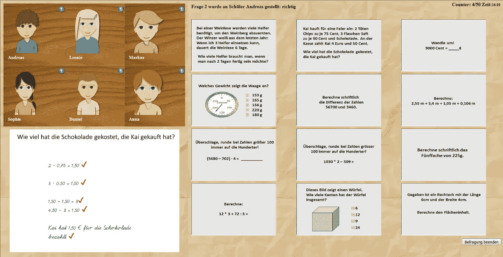
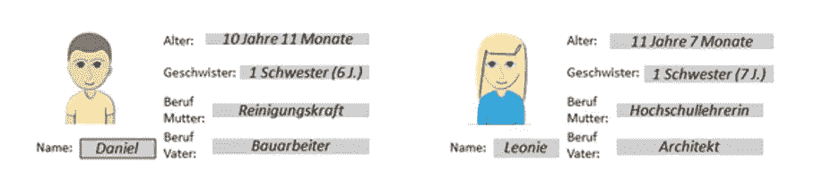
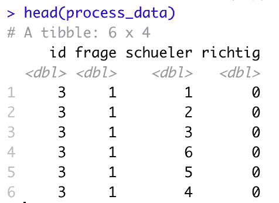
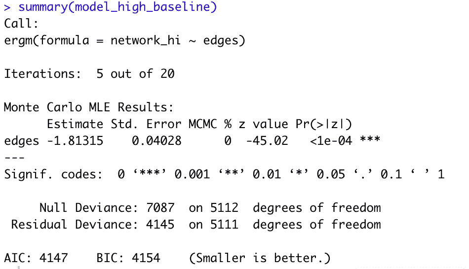
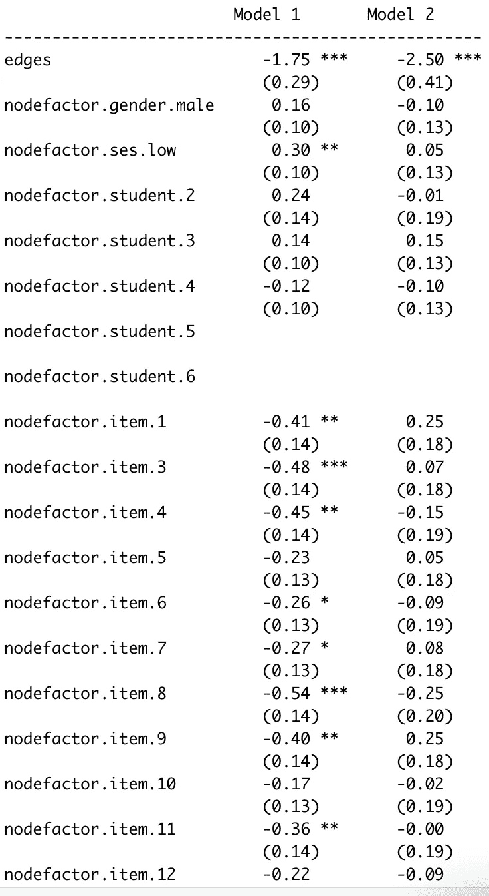
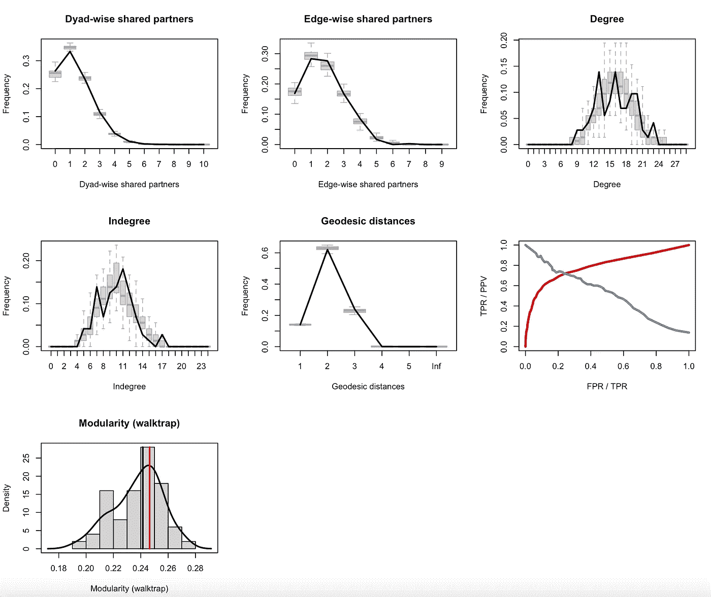

# 点击流数据的图模型介绍。2

> 原文：<https://towardsdatascience.com/introduction-to-graph-models-for-clickstream-data-pt-2-1c3314dc1703?source=collection_archive---------31----------------------->

## 用 R 语言从数据准备到模型评估

Robynne Hu 在 [Unsplash](https://unsplash.com?utm_source=medium&utm_medium=referral) 上的照片

# 介绍

在之前的文章“[点击流数据图模型介绍](/introduction-to-graph-models-for-clickstream-data-c2bc44da90bb)”中，我介绍了一种使用**指数随机图模型**(ERGM)【1】分析点击流数据的方法。当我们试图从与数字内容的交互中建模数据时，这种方法会很有帮助。由此产生的点击流数据不仅仅是人们思想的反映。数字内容及其布局对人们与之互动的方式有着同样重要的影响。如果我们想要建立更有意义和更愉快的数字体验，理清这两种影响来源是至关重要的。

为了说明核心概念，我使用了班伯格大学一个研究项目的数据，我们想找出老师是如何形成对学生成绩的判断的。我们使用了一个**模拟教室**环境(见下图),参与者必须选择项目(从非常容易到非常困难),并将它们分配给模拟学生。每次点击都被记录下来并储存在数据库中。

模拟课堂软件截图。图片作者。

此外，六个**学生描述**被呈现，指示学生的*姓名*、*年龄*、*性别*、*兄弟姐妹的数量*和他们的*父母的职业*，以便给出潜在相关和不太相关的信息。下图给出了两个示例说明。

图片作者。

来自与模拟教室交互的点击流数据表示为**网络**，其中每个节点表示两个选择:一个用于项目，一个用于学生。此外，我们计算了经验学生能力和我们的参与者的能力评估之间的等级顺序相关性，以创建两组:一组具有**高判断准确性** ( *r* > = .70)，另一组具有**低判断准确性** ( *r* < .70)。这导致 n(高)= 25 个参与者，n(低)= 12 个参与者。

接下来，我将向您介绍我的分析，并详细说明指定网络参数以及模型估计和模型评估的过程。

# 数据准备

## 装载和清洁

首先，我们需要加载所需的包和数据。在这种情况下，每个参与者有一个数据帧，每个步骤记录在一行中。

通过以这种方式加载数据，我最终得到了一个包含所有数据的数据框，但它需要被清理。正如在 *bind_rows* 参数中设置的，我们保留了一个 **id 变量**来标识数据中的每个参与者。这个 id 变量包含路径和文件名，文件名是唯一的参与者编号。我们只需要保存文件名中的数字作为标识符。此外，我们只需要每隔一行为*项目*和 *schueler* (学生)提供一个有效条目。

遵循这些步骤会生成一个仅包含相关条目和格式良好的 id 的数据帧。

## 将按行排列的数据转换成矩阵

创建网络对象要求数据采用**边列表**或**邻接矩阵**的形式。你可以选择任何一种方式，但我选择将单个点击流数据转换为邻接矩阵。读取矩阵的基本结构总是从**行到**列。单元格中的每个条目表示从行中的节点到列中的节点有一个转换。该条目可以是 0(不存在)或 1(存在),如果我们有多次转换，甚至可以大于 1。

在模拟教室中，我们有 **12 个项目**和 **6 个学生**，产生 **72 个项目学生组合**。对于某些网络分析，尤其是可视化，使用单独的开始和结束节点来显式包含这些步骤是非常有益的。

矩阵遵循一个基本结构:第一行和第一列代表附加的开始节点。第 2-13 行代表学生 1，所有 12 个项目都分配给学生 1。在行和列中，14 到 25 是分配给学生 2 的所有项目。这种模式一直持续到第 74 行和第 74 列，代表单独的结尾音符。

## **创建嵌套数据结构**

我在介绍中提到了**两个判断准确度组**。为了创建**两个群组网络对象**，我们必须首先创建单独的邻接矩阵。为了使数据易于管理，我们可以将整个数据框架转换成一个嵌套的数据框架，并将 id 作为指示变量。然后，我们只需将该函数应用于每个嵌套的数据帧，以便为每个参与者创建一个邻接矩阵，并将其存储在整个数据帧的另一个变量中。

## **创建两个评判小组**

本项目中未显示整体判断准确性的计算。我选择创建两个索引向量，包含具有高和低判断准确性的参与者的 id。然后我们只需要把每组的所有邻接矩阵加起来。即使我们在上面的邻接矩阵中引入了单独的开始和结束节点，我们也不需要在我们的网络模型的网络对象中有这两个节点。这导致两个 72×72 邻接矩阵，每个判断准确度组一个。

## **准备属性对象**

为了能够添加网络属性，我们需要首先加载这些信息。我为每个节点创建了一个单独的**属性**数据帧，其中包含了*项目*、*性别*、*学生*和*社会地位* (ses)的信息。实际上，我忘了在属性文件中添加学生变量(这里让它保持真实)，但是我们可以为它创建一个向量，并将其作为变量添加到属性数据框中。两种方式都同样有效。向每个节点添加属性是忽略单独的开始和结束节点是有益的主要原因。我们很难为这两个节点设置任何属性，这在我们构建模型时会是一个问题。开始和结束节点的所有连接不能连接到任何节点属性，因此将是无属性的随机变化。

## **创建网络对象**

现在我们终于可以创建网络对象并开始构建模型了。但和往常一样，数据准备需要一些时间，也很重要。

# 模型说明和解释

## **创建基线**

有几个不同的包来构建网络模型。在这种情况下，我与 statnet 合作。我们从建立一个只包含一个*边*项的基线模型开始。这不会让我们走得很远，但可以让我们看到当我们添加其他变量时，我们的模型是如何改进的。同样，我们对两个网络对象都这样做。为了有一个跨不同模型版本的整体模型性能的指标，我们从高判断准确性组的 AIC 4147 和低判断准确性组的 AIC 2729 开始。

高判断精度模型的模型总结。

**添加变量**

通过包含不同的*节点因子*项，我们可以测试具有特定因子级别的节点是否比其他节点连接得更频繁。这些*节点因子*术语的解释类似于逻辑回归中的变量，其中一个水平设定为基线，其他水平与基线水平进行比较。

我们开始看到这两种模式之间的差异。这里需要注意的重要一点是:模型参数不能跨不同的模型进行解释。我们只能解释同一个模型中与其他参数相关的参数！

我们看到学生 5 和 6 的*节点因子*项的参数无法估计。这表明模型还没有被很好地指定。

带有边和不同节点因子项的模型摘要。

**第一个不同点**

当我们查看与学生相关的变量(*学生*、*性别*和*社会地位*)时，在高判断准确性组(模型 1)中*节点因子. ses.low* 有一个显著的正系数。这意味着属性为*低社会地位*的节点通常比属性为*高社会地位*的节点更经常被连接。

对此的一种解释可能是，高判断准确率组的参与者实际上想更仔细地看看那些社会地位信息*低的学生*(正如一开始学生描述中他们父母的工作所表明的)。这是一个证据充分的事实，即社会地位对感知能力有负面影响，因此特别关注这些学生似乎是合理的。做出非常准确判断的参与者意识到了这种影响，并希望在这里小心不要成为它的受害者。对于低判断准确性组，我们没有发现任何显著的影响。

从项目来看，我们在模型 2(低判断准确率组)中没有发现差异化的项目选择。当选择*项目 2* (难度中等)作为基线类别时，所有*项目*系数与 0 无显著差异。在模型 1(高判断准确度组)中，我们的情况正好相反，与*第 2 项*相比，几乎所有系数都是显著的。这支持了高判断准确性组的参与者进步更深思熟虑的解释。他们似乎比其他人更关注一些学生，似乎也更有意识地选择他们的项目。

看看 AIC，我们看到一些微小的改进。高分组的 AIC 值为 4144，低分组的 AIC 值为 2748。因此，即使我们包括了额外的变量，这两个模型都没有显著改善。

## **添加行为变量**

在最终的模型中，我添加了一些变量，作为参与者如何在模拟教室中导航的代理。在网络术语中，它们是*节点匹配*术语。一般来说， *nodematch* 术语检查节点是否有更高的概率连接到具有相同属性的其他节点。我为*学生*、*项目*、*性别*和*社会地位*添加了*节点匹配*术语，在下面的汇总表中描述为**评估策略**。从技术上来说，这些本身并不是行为变量，但在这种情况下，它们捕捉到的效果很好地代表了行为模式。

包含所有变量的完整模型摘要。

对于两个模型中的*节点匹配学生* ( **同一学生**)和*节点匹配项目* ( **同一项目**)项，我们都有非常显著的系数。这主要是由于模拟教室的设计方式。参与者必须交替选择项目和学生。如果你不完全随机地这样做，就无法避免连续两次(或更多次)选择一个项目或一个学生。

在这两个模型中，我们都发现了一个有效的负系数用于*节点匹配 gende* r 项(**同性**)。这似乎是模拟教室建筑的人工制品:男生坐在女生旁边，反之亦然。将不同性别的学生联系起来可能反映了有意的评估过程，也可能只是意味着“让学生坐在一起”。最后一种解释得到了低判断准确率组中*节点匹配 ses* ( **相同社会地位** ) 的正系数的支持。这意味着参与者选择具有相同社会地位的学生。模拟教室里的学生被设置成上排社会地位高，下排社会地位低。因此，这个*节点匹配*术语似乎再次捕捉到了参与者如何在模拟教室中导航的效果:紧密地沿着座位排列。

有趣的是，*node factor ses**low*(**low social status**)项，这个在没有行为变量的模型中显著为负的项不再显著。

查看两个模型的 AIC 值，我们会发现两个模型这次都有所改善。对于高判断准确性组，我们的 AIC 值为 3066，对于低判断准确性组，我们的 AIC 值为 2212。

## 事情变得非常网络化

如果我们看一下模型规格，到目前为止，我们离逻辑回归并不太远。通过增加一个三角形项来改变这种情况。这个*三角形*项是网络中局部聚集的指示器。对于高判断准确率组，我们发现一个小的负面影响，这意味着网络有轻微的趋势，形成局部集群。这再次表明在模拟教室中有一个更深思熟虑和更有计划的评估程序。

# 模型评估

到目前为止，我只谈到了 AIC 作为一个模型性能的指标。评估网络模型的拟合优度是一项非常直观的任务。基本概念是使用估计的系数，用这些系数对新网络进行采样，并测量描述网络的某一组参数。然后，将来自采样网络的这些参数与我们凭经验观察的网络的参数进行比较(我们为此建立了模型)。如果它们匹配，我们就可以确定已经建立了一个模型，能够合理地捕捉数据生成过程。如果有更大的差异，我们将不得不回到理论上，思考如何使模型更加精确。

在 btergm 包[3]中有一个很好的函数来估计和绘制拟合优度。通过观察下图可以看出，经验模型参数和从样本网络中估计的参数之间没有显著差异(在方框图中)。这总是步入正轨的好迹象。

高判断准确度模型的拟合优度图。来源:作者

# 观点

ERGMs 的一个主要限制是它们只能处理**二进制边缘**。因为我决定将多个参与者分组，并且只查看他们的汇总数据，所以我丢失了一些信息。如果两个连续动作之间的转换出现一次或五次，肯定会有很大的不同。但是这个问题有一个解决方案:**广义指数随机图模型** (GERGMs) [4]。ERGMs 的这种一般化形式能够处理加权边并使用全部信息量。但是它们在计算上要求很高。在一台普通机器上，估计一个具有 20-30 个节点的中等规模网络的 GERGM 很容易需要几天甚至几周的时间。选择不同的似然估计(最大伪似然，而不是马尔可夫链蒙特卡罗最大似然估计)可以显著加快速度，但会引入有偏差估计的风险。

我将在下一篇文章中探讨这个问题。如果你对建立新模式有任何问题或想法，请随时联系 Linkedin 或 twitter (@MMuckshoff)。完整的代码也在 [github](https://github.com/MatthiasMM/judgement-graph-models) 上。

# 参考

[1] G. Robins，P. Pattison，Y. Kalisher 和 D. Lusher，社会网络的指数随机图(p*)模型介绍(2007 年)，社会网络

[2] M. S. Handcock，D. R. Hunter，C. T. Butts，S. M. Goodreau & M. Morris，statnet:网络数据的表示、可视化、分析和模拟的软件工具(2008 年)，《统计软件杂志》，24(1)

[3] P. Leifeld，S. J. Cranmer & B. A. Desmarais，带 btergm 的时间指数随机图模型:估计和 Bootstrap 置信区间(2017)，统计软件杂志 83(6)

[4] J. D. Wilson，M. J. Denny，S. Bhamidi，S. Cranmer & B. Desmarais，随机加权图:灵活的模型规范和模拟(2017)，社会网络，49