# 层次聚类简介(第 1 部分——理论、联系和相似性)

> 原文：<https://towardsdatascience.com/introduction-to-hierarchical-clustering-part-1-theory-linkage-and-affinity-e3b6a4817702?source=collection_archive---------25----------------------->

## 什么是层次聚类、亲和度和关联度

杰里米·毕晓普在 [Unsplash](https://unsplash.com?utm_source=medium&utm_medium=referral) 上的照片

# 使聚集

聚类是称为无监督学习的机器学习的一部分。这意味着，与监督学习相比，我们没有特定的目标，因为我们的结果变量不是预先定义的。例如，在回归或分类中，我们已经知道我们的模型试图通过预测一个连续的目标变量(y)或已经定义的类来实现什么。相比之下，对于聚类，我们没有定义的目标变量，相反，我们试图自己做出那些最终的组，然后我们可以根据我们预先存在的知识进行解释。

这在我们希望从现有数据中识别有意义的人群、目标、活动、地点等情况下非常有用。这种方法的商业应用包括识别购买相似商品的客户群，识别具有相似属性的地点，或者将我们想要从中识别聚类的某些行为或属性组合在一起。虽然我们人类可能擅长于从小数据集识别组，但是对于具有许多实例(行)和许多属性(列)的数据来说，这变得非常复杂。因此，算法已经被设计成能够帮助我们做到这一点，包括 kmeans、dbscan 或分层聚类。

# 分层聚类

通过创建不同组的层次结构，层次聚类适合更广泛的聚类算法世界，范围从所有数据点在它们自己的聚类中到所有数据点在同一个聚类中。其工作原理是找到在某个阈值距离内的点，然后一点一点地将它们组合在一起。具体来说，这种算法有两种形式:自顶向下或自底向上。第一种是自上而下的，首先将所有点视为单个聚类的一部分，然后逐渐将它们分解成单独的聚类(分割),直到它们都是自己的聚类的一部分。第二种是自底向上的，从所有点都是它们自己的聚类的一部分的基础开始，然后迭代地将两个最近的点分组在一起，直到它们都是单个聚类的一部分(聚集的)。这种聚类的层次结构可以表示为如下的树(或树形图),树叶表示单个聚类，距离随着聚类的增加而增加。

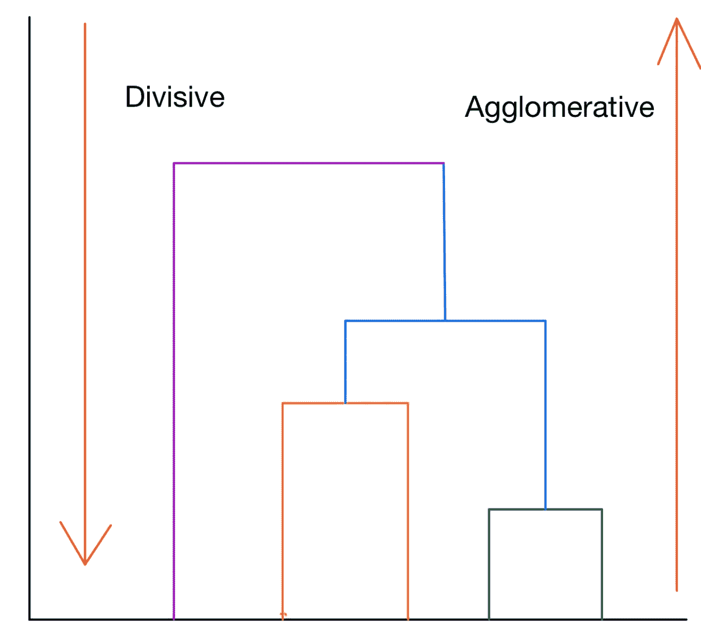

作者图片

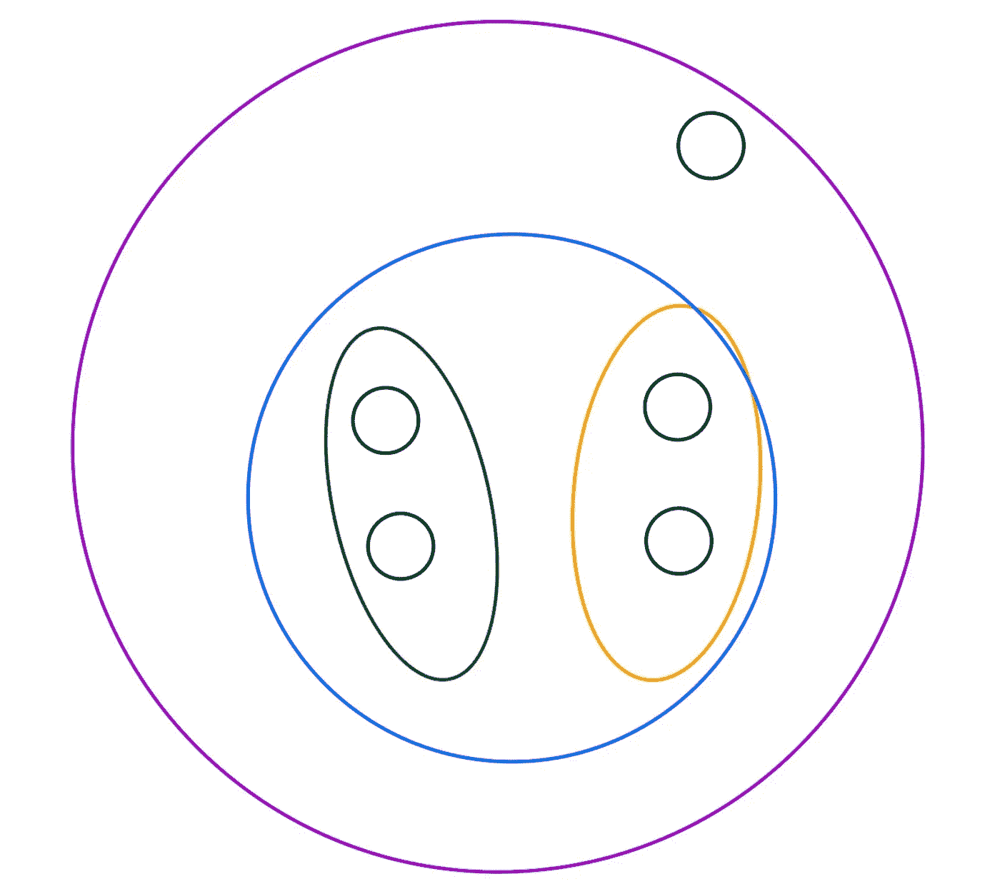

作者图片

我们在这里可以看到，根据您采用的算法形式，聚类逐渐建立或分解，最常见的形式是自底向上/凝聚方法。这里我们可以看到，当我们沿着树状图往上走，在下面的图中可以看到，集群逐渐连接起来，直到我们到达同一个紫色集群的所有点。因此，我们可以清楚地看到一个层次结构的形成，其中集群联合起来，因为集群是由其他集群组成的。

就最终创建的聚类而言，该算法的结果会受到两个主要因素的影响:所选择的相似性度量(如何计算点之间的距离)和所选择的链接方法(计算点之间的距离)。sklearn 包中的不同形式如下:

# 吸引力

这些也将取决于所使用的距离度量(相似性)的选择:

## 欧几里得(l2)

这是用于测量聚类之间距离的默认距离度量，简单来说就是两点之间的直线距离。这在数学上表示为:

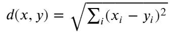

形象地表现为:

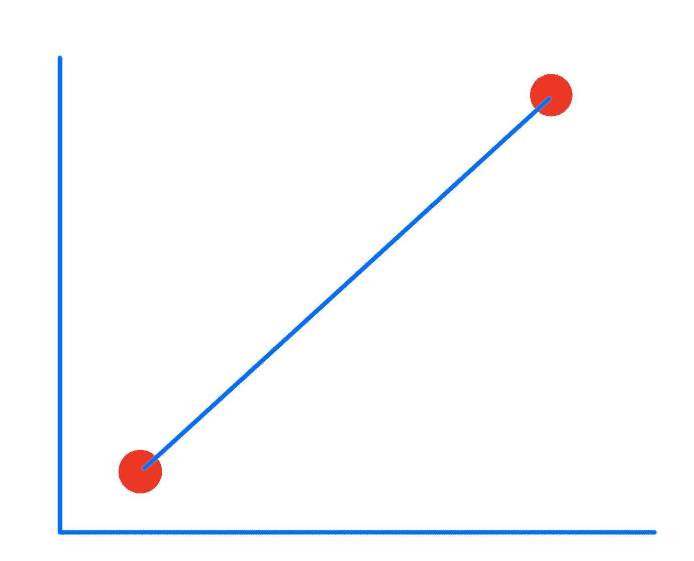

## 曼哈顿(l1)

这个距离是所有维度上的点之间的绝对差之和。这就好像点与点之间有网格状的路径一样。这在数学上表示为:

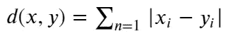

形象地表现为:

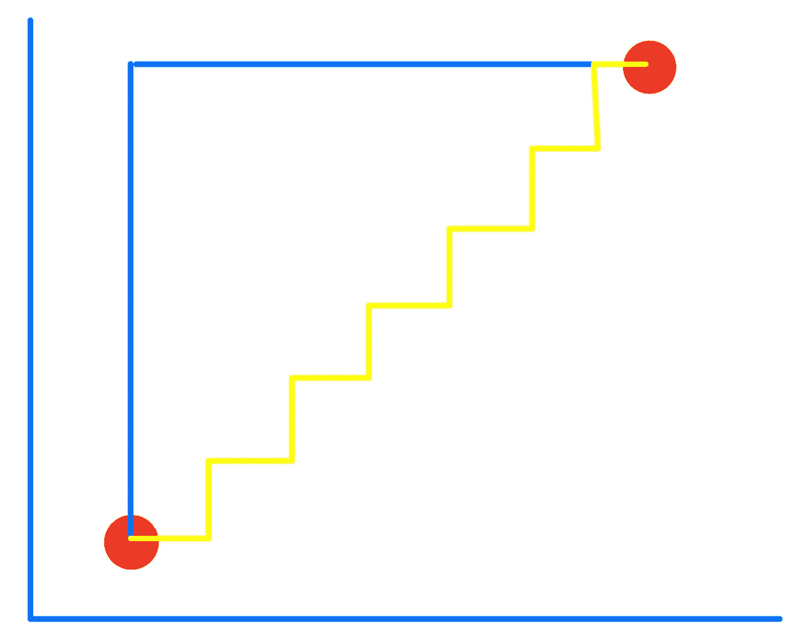

这也称为出租车几何形状和城市街区距离等。该距离通常适用于稀疏要素。

## 余弦

这个距离度量测量两个向量之间的角度。当点与点之间的大小无关紧要，但方向很重要时，就使用这种方法，这种方法通常用于自然语言编程中。这被测量为:

cos(𝜃)=𝐴𝐵˙||𝐴||∗||𝐵||cos⁡(θ)=ab˙||a||∗||b||

## 预先计算的

如果您已经为您的观测值预先计算了距离矩阵，则使用此选项。

选择的度量旨在最大化不同类别中样本之间的距离，并最小化每个类别之间的距离 [1](https://scikit-learn.org/stable/modules/clustering.html#hierarchical-clustering)

# 联系

这些组的形成取决于不同链接度量的选择:

## 单人/分钟

这将两个聚类的相似性度量为彼此最接近的点之间的最小相似性。在数学上，这表示为:

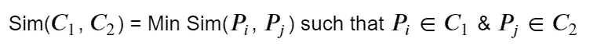

形象地表现为:

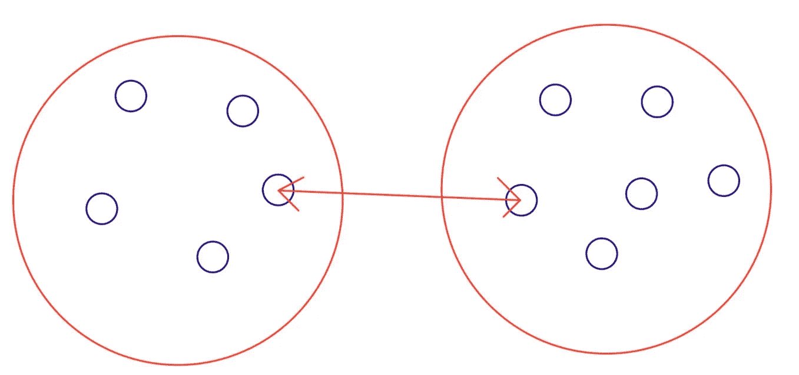

这种方法的好处是它可以处理非标准形状的聚类，但如果有噪声，就不能正确地分离聚类。

## 完整/最大

这与最小值方法相反，因为两个聚类的相似性等于每个聚类内的点之间的最大相似性。这可以写成:

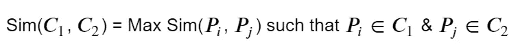

形象地表现为:

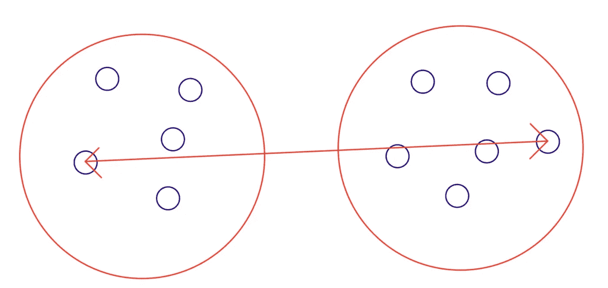

如果聚类之间有噪声，这种方法在分离聚类时效果很好，但是它偏向于圆形聚类，并且倾向于分解大的聚类。

## 平均的

这种关联度量使用两个集合的所有观察值的平均距离。在数学上，这表示为:

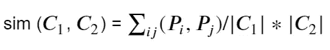

形象地表现为:

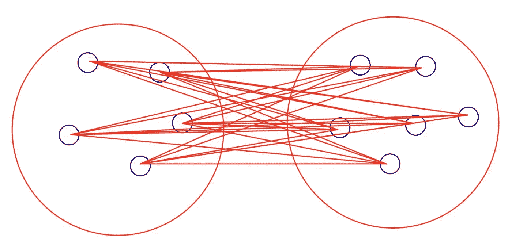

如果聚类之间有噪声，这在分离聚类方面做得很好，但是偏向于形成斑点的聚类。

## 病房

除了计算距离 Pi 和 Pj 的平方和之外，这种计算两个聚类之间相似性的方法与组平均相同。本质上，这最小化了被合并的聚类的方差。从数学上讲，这可以写成:

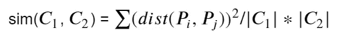

形象地表现为:

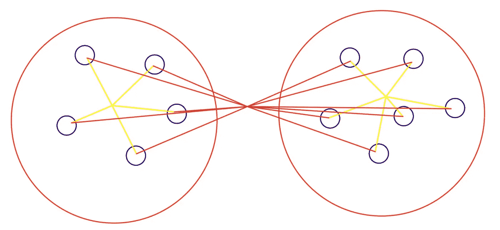

这种方法的好处是，如果有噪声，它在分离聚类方面做得很好，但是它偏向于圆形聚类组。

与其他聚类方法相比，层次聚类的优点在于它不需要指定聚类的数量。此外，该算法对距离度量并不敏感，这意味着结果不应该受到选择相似性度量的影响。当底层数据具有分层结构或者这就是我们对数据的预期时，这种算法特别有用，从中我们可以看到聚类最终如何组合在一起形成越来越少的聚类(或者相反)。

然而，由于 O(n)的时间复杂度和 O(n)的空间复杂度，这是以较低的效率为代价的。此外，与 kmeans 或 DBscan 不同，分层聚类没有自然的性能指标来判断哪些聚类最适合数据。更复杂的是，一旦集群形成，它将不会分裂(只要您采用凝聚模型)，并且只会随着您增加距离度量或减少集群数量而继续形成更大的组。这意味着，如果您有难以解释的集群，它们不太可能改变，除非您改变相似性或关联度量。

因此，总的来说，尽管由于复杂性和优化原因，该算法的使用率低于 dbscan 或 kmeans 算法，但当数据预计具有或已经具有层次结构，并且您拥有能够运行模型的计算资源时，该算法非常有用。

第 2 部分展示了 python 在这方面的应用，可以在这里找到:

 [## 分层聚类介绍(第 2 部分——python 实现)

### 伦敦犯罪数据的 sklearn 实现

towardsdatascience.com](/introduction-to-hierarchical-clustering-part-2-python-implementation-73d367f9c298) 

尽管受地理位置限制的实现可以在这里找到:

 [## 层次聚类简介(第 3 部分—空间聚类)

### 在层次聚类中引入空间维度

towardsdatascience.com](/introduction-to-hierarchical-clustering-part-3-spatial-clustering-1f8cbd451173) 

如果你想在 Medium 上阅读更多我和其他人的精彩文章，请随意使用我的推荐链接注册:

 [## 通过我的推荐链接加入媒体-菲利普·威尔金森

### 作为一个媒体会员，你的会员费的一部分会给你阅读的作家，你可以完全接触到每一个故事…

philip-wilkinson.medium.com](https://philip-wilkinson.medium.com/membership) 

来源:

[1][https://sci kit-learn . org/stable/modules/clustering . html # hierarchical-clustering](https://scikit-learn.org/stable/modules/clustering.html#hierarchical-clustering)

[2][https://towards data science . com/importance-of-distance-metrics-in-machine-learning-modeling-e 51395 FFE 60d](/importance-of-distance-metrics-in-machine-learning-modelling-e51395ffe60d)

[3][https://www . analyticsvidhya . com/blog/2020/02/4-机器学习中的距离度量类型/](https://www.analyticsvidhya.com/blog/2020/02/4-types-of-distance-metrics-in-machine-learning/)

[4][https://towards data science . com/understanding-the-concept-of-hierarchical-clustering-technique-c6e 8243758 EC](/understanding-the-concept-of-hierarchical-clustering-technique-c6e8243758ec)

[5][https://www . saedsayad . com/clustering _ hierarchical . htm #:~:text = In % 20 average % 20 linkage % 20 hierarchical % 20 cluster，point % 20 In % 20 the % 20 other % 20 cluster](https://www.saedsayad.com/clustering_hierarchical.htm#:~:text=In%20average%20linkage%20hierarchical%20clustering,point%20in%20the%20other%20cluster)。

 [## 随机森林分类器简介

### 预测 NBA 球员的位置——我们正在看到一个真正的“无位置”联盟吗？

towardsdatascience.com](/introduction-to-random-forest-classifiers-9a3b8d8d3fa7)  [## scikit-learn 决策树分类器简介

towardsdatascience.com](/introduction-to-decision-tree-classifiers-from-scikit-learn-32cd5d23f4d)  [## 面向数据科学家的面向对象编程介绍

### 面向对象的基础知识，适合那些以前可能没有接触过这个概念或者想知道更多的人

towardsdatascience.com](/an-introduction-to-object-oriented-programming-for-data-scientists-879106d90d89)