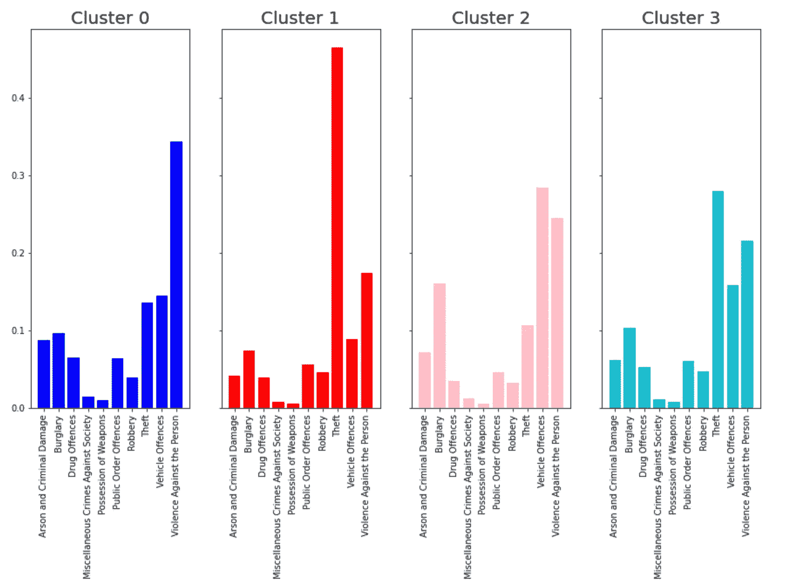

# 分层聚类介绍(第 2 部分——python 实现)

> 原文：<https://towardsdatascience.com/introduction-to-hierarchical-clustering-part-2-python-implementation-73d367f9c298?source=collection_archive---------17----------------------->

## 伦敦犯罪数据的 Python 实现


本杰明·戴维斯在 [Unsplash](https://unsplash.com?utm_source=medium&utm_medium=referral) 上拍摄的照片

在[的上一篇文章](/introduction-to-hierarchical-clustering-part-1-theory-linkage-and-affinity-e3b6a4817702)中，介绍了层次化集群的目的以及对其工作原理的广泛描述，本文的目的是在此基础上，通过 sklearn 包展示其实现的结果。作为其中的一部分，我认为将这个问题与了解不同类型的犯罪如何在伦敦聚集在一起的问题结合起来会很好。

通过等级聚类识别的这些犯罪聚类，不是犯罪的数量，而是伦敦的犯罪类型。例如，在伦敦是否有一些地区，不管犯罪数量多少，都有很高比例的特定数量的犯罪，如盗窃或入室盗窃。如果这些区域被确定，那么理论上特定的干预措施可以针对特定类型的犯罪，而不是将这些资源分散到整个伦敦。这方面的一个例子可能是，预计伦敦市中心的盗窃率相对较高，那里有许多游客和个人，因为针对盗窃的具体干预措施，如增加警力和多种语言的警告标志，可以在这里实施，但效果不如伦敦外围地区。作为这一过程的一部分，由于我们在地理上代表这些集群，从同类犯罪的高比例来看，属于同一犯罪集群的地区在地理上应该是接近的。在盗窃案件中，我们假设伦敦市中心的区域都是盗窃高发区。这只是遵循了地理第一定律“万物皆相关，但近物比远物更相关”[1]。

第一步是获取数据。由于这里使用的例子是伦敦，大伦敦的犯罪数据可以很容易地通过伦敦数据库访问(伦敦市除外)[2]。这些数据经过清理，以便提取 2019 年伦敦每个较低超级产出地区(LSOA)的每种主要犯罪类型(相对于该地区犯罪总数)的百分比。这些结果可以可视化:

```
#extract the columns that we don't want to plot
not_plot = ["LSOA11CD", "geometry", "LSOA Code", "Total_crime"]
#use this to extract the columns that we do want to plot
to_plot = [col for col in London_crime.columns if col not in not_plot]#print(to_plot)#create a subplot axis, given that we have 10 different categories this has to be a 3 by 4 matrix of plots
fig, axis = plt.subplots(3,4, figsize = (30,30))
#flatten the axis so that we can iterate over them
axis = axis.flatten()#creating the plot function
#use the enumerate to get the value and its index
for i, col in enumerate(to_plot):
    #set the axis as in the rows
    ax = axis[i]
    #to make it cleaner move two axis across
    if i >=8:
        ax = axis[i+1]
    #plot the crime map using the magma color map
    crim_plt = London_crime.plot(column = col, ax=ax, cmap = "magma", vmin =0, vmax = 1)
    #remove the axis so that it looks cleaner
    ax.set_axis_off()
    #set the plot title as the column name
    ax.set_title(col, fontsize = 25)#plt.subplots_adjust(right = 0.8)
#cbar_ax = fig.add_axes([0.85, 0.15, 0.05, 0.7])
#cbar = plt.colorbar(cax=cbar_ax)#adding a color bar for the overall plto
#[https://stackoverflow.com/questions/8342549/matplotlib-add-colorbar-to-a-sequence-of-line-plots/11558629#11558629](https://stackoverflow.com/questions/8342549/matplotlib-add-colorbar-to-a-sequence-of-line-plots/11558629#11558629)
vmin, vmax = 0,100#create a subaxis within the figure
fig = ax.get_figure()
plt.subplots_adjust(right = 0.8)
cax = fig.add_axes([0.85, 0.15, 0.05, 0.7], label = "Percentage of crime")
#create a colorbar and plot it
sm = plt.cm.ScalarMappable(cmap='magma', norm=plt.Normalize(vmin=vmin, vmax=vmax))
sm._A = []
cb = fig.colorbar(sm, cax=cax)
#change the size of the tick parameters
cb.ax.tick_params(labelsize = 30)
#set the label title
#[https://stackoverflow.com/questions/17475619/how-do-i-adjust-offset-colorbar-title-in-matplotlib](https://stackoverflow.com/questions/17475619/how-do-i-adjust-offset-colorbar-title-in-matplotlib)
cb.set_label("Percentage of crimes committed in 2019 (%)", rotation = 270, fontsize= 40, labelpad = 50)
#
#cax.tight_layout()#remove axis of plots not covered
axis[8].set_axis_off()
axis[11].set_axis_off()
#show the results
plt.show()
```


作者图片

从这个图中我们可以看到伦敦有 10 种主要的犯罪类型被报道。由此可以看出，入室行窃、盗窃、车辆犯罪和针对人身的暴力似乎在价值上有最大的差异，并在犯罪中占最大的总百分比。这对于我们的聚类算法来说意味着，由于聚类会受到因素之间不同方差的强烈影响，因此该算法可能会关注这四个因素。这有可能通过标准化这些值来控制，例如根据最小-最大值将每个犯罪的每个百分比置于 0 到 1 的范围内，或者计算 z 分数，这在理论上可以将所有值置于相同的范围内。然而，由于我们关心的是识别由一种犯罪类型支配的聚类，进一步的标准化/规范化可能会删除我们感兴趣的任何有价值的信息。因此，这种不同的范围和变化目前是可以接受的，但是可以改变以观察这如何影响算法的性能。

因此，现在我们已经在空间上看到了结果，我们可以尝试对结果进行聚类，以查看聚类是如何发展的。第一个实现的代码如下:

```
#import the necessary module
from sklearn.cluster import AgglomerativeClustering#extract the values that we want to plot
crime_clus = London_crime[to_plot]#create the model that we want, setting the linkage to ward, the distance threshold to 4 and 
#set the number of clusters to none so that we can plot the dendrogram afterwards
model = AgglomerativeClustering(linkage="ward", distance_threshold = 4, n_clusters=None)#fit the model to the data
model.fit(crime_clus)
```

这段代码导入了凝聚聚类算法，提取了我们希望算法处理的值，创建了我们想要的模型，并使模型适合数据。这里我们使用了 wards 链接，距离阈值等于 4，使用默认的欧几里德距离度量，并将聚类数设置为无。我们使用`distance_threshold`而不是`n_clusters`的原因是因为我们希望能够在以后绘制树状图。然而现在，我们想看看算法实际上是如何执行的。我们可以通过绘制实际的集群来做到这一点:

```
#extract the model labels
London_crime["Aggl_clus"] = model.labels_#get the means of each cluster
agglom_means =London_crime.groupby("Aggl_clus")[to_plot].mean()#transpose the dataframe so that we get the column titles as individual clusters
agglom_means_T = agglom_means.T.round(3)#reset the index
agglom_means_T.reset_index(inplace=True)#create the subplot
fig, ax = plt.subplots(1,4, figsize = (15,8), sharey = True, sharex = True)#get the colours
colors = ["blue", "red", "pink", "tab:cyan"]#create subplots for each cluster
fig, ax = plt.subplots(1,4, figsize = (15,8), sharey = True, sharex = True)
#flatten the axis
axis = ax.flatten()#going over each column
for i, col  in enumerate(agglom_means_T.columns):
    #ignore the index column
    if col != "index":
        ax = axis[i-1]
        #plot the bar chart
        ax.bar(height = agglom_means_T[col], x=agglom_means_T["index"], color = colors[i-1] )
        #rotate the x-ticks
        ax.set_xticklabels(labels =agglom_means_T["index"], rotation = 90)
        #set the title
        ax.set_title(f"Cluster {col}", fontsize = 20)
```



```
#plot the results on London
fig, ax = plt.subplots(figsize = (10,10))London_crime.plot(column = "Aggl_clus", categorical = True, legend=True, ax=ax)ax.set_axis_off()
```


```
agglom_sizes = London_crime.groupby("Aggl_clus").size()
agglom_sizes#Out:
0    2083
1     441
2    1644
3     661
```

根据这些图和结果，假设聚类的目的是能够创建我们可以解释的组，我们可以为每个聚类分配标签如下:

群组 0:对人的暴力行为(没有明确的地理区域)

第一组:伦敦市中心的盗窃

第二组:伦敦郊区的车辆犯罪和入室盗窃

群组 3:盗窃和暴力侵害人身(没有明确的地理区域)

这种标记暗示了簇 0 和 3 以及 1 和 3 之间潜在地存在某种程度的重叠。这表明我们不一定有独特的集群。此外，考虑到我们的研究问题，我们对聚类的地理表示感兴趣，其中聚类 0 和 3 没有显示出必要的清晰地理表示，这意味着我们的目标没有完全达到。此外，从每个组中 LSOAs 的数量来看每个集群的大小，我们可以看到集群 1 和 3 比 0 或 2 小得多，这支持了这一观点，即这不是最佳的集群结果，因为这些组并不均匀(不均匀的集群并不总是表明有问题，但如果它们非常不同，则值得研究)。

假设这是层次聚类，那么我们可以看看模型是如何表现的，我们可以使用从[文档](https://scikit-learn.org/stable/auto_examples/cluster/plot_agglomerative_dendrogram.html#sphx-glr-auto-examples-cluster-plot-agglomerative-dendrogram-py)中获得的以下代码:

```
import numpy as np
from scipy.cluster.hierarchy import dendrogramdef plot_dendrogram(model, **kwargs):

    counts = np.zeros(model.children_.shape[0])
    n_samples = len(model.labels_)
    for i, merge in enumerate(model.children_):
        current_count = 0
        for child_idx in merge:
            if child_idx < n_samples:
                current_count +=1
            else:
                current_count += counts[child_idx-n_samples]
        counts[i] = current_count

    linkage_matrix = np.column_stack([model.children_, model.distances_,
                                     counts]).astype(float)

    dendrogram(linkage_matrix, **kwargs)fig, ax = plt.subplots(figsize = (10,10))
ax.set_title("Hierarchical clustering dendrogram")
#plot the top three levels of the dendrogram
plot_dendrogram(model, truncate_mode='level', p=3)
plt.axhline(y = 4, color = "r", linestyle = "--")
ax.set_xlabel("Number of points in node")
plt.show()
```


这表明在当前距离阈值为 4 的情况下，我们得到了我们看到的四个集群。然而，假设我们可以看到，在稍高的距离阈值处，两个最小的聚类合并，并且直到下一次合并的距离阈值很长(表明这些聚类相对稳定)，这将表明聚类 1 和 3 可能更好地合并以获得更好的输出。因此，我们可以将距离度量更改为距离阈值 6，并再次探索结果。

然而，我们也可以反过来看，将聚类距离减少到 3.45，以将两个最大的聚类分成更小的聚类。这将有效地减小最大和最小集群之间的大小差异，并且潜在地产生关于如何创建集群 0 和 2 的更多信息。我们可以在树状图上看到这两个不同的距离度量，方法是在图上再添加两个`plt.axhline(y= d, color = "r", linestyle = "--")`,得到:


因此，我们可以遵循与之前相同的工作流程，以便可视化和理解距离阈值设置为 6 且距离阈值设置为 3.45 的聚类输出:

```
#distance threshold of 6
model6 = AgglomerativeClustering(linkage="ward", distance_threshold = 6, n_clusters=None)
#fit the model to the data
model6.fit(crime_clus)#assign labels
London_crime["Aggl_clus_6"] = model6.labels_#distance threshold of 3.45
model3_45 = AgglomerativeClustering(linkage="ward", distance_threshold = 3.45, n_clusters=None)
#fit the model to the data
model3_45.fit(crime_clus)
London_crime["Aggl_clus_3_45"] = model3_45.labels_#plot the London resultsfig, ax = plt.subplots(1, 2, figsize = (15,30))London_crime.plot(column = "Aggl_clus_6", categorical = True, legend=True, ax=ax[0])
ax[0].set_axis_off()
ax[0].set_title("Distance threshold 6 cluster")London_crime.plot(column = "Aggl_clus_3_45", categorical = True, legend=True, ax=ax[1])
ax[1].set_axis_off()
ax[1].set_title("Distance threshold 3.45 cluster")
```


```
agglom_means =London_crime.groupby("Aggl_clus_6")[to_plot].mean()
agglom_means_T = agglom_means.T.round(3)agglom_means_T = pd.DataFrame(agglom_means_T)agglom_means_T.reset_index(inplace=True)colors = ["blue", "brown", "tab:cyan"]fig, ax = plt.subplots(1,3, figsize = (15,8), sharey = True, sharex = True)
axis = ax.flatten()
for i, col  in enumerate(agglom_means_T.columns):
    if col != "index":
        ax = axis[i-1]
        ax.bar(height = agglom_means_T[col], x=agglom_means_T["index"],  color = colors[i-1])
        ax.set_xticklabels(labels =agglom_means_T["index"], rotation = 90)
        ax.set_title(f"Cluster {col}", fontsize = 20)

plt.suptitle("Clusters with distance threshold 6", fontsize = 20)
```


```
agglom_means =London_crime.groupby("Aggl_clus_3_45")[to_plot].mean()
agglom_means_T = agglom_means.T.round(3)agglom_means_T = pd.DataFrame(agglom_means_T)agglom_means_T.reset_index(inplace=True)colors = ["blue", "green", "purple", "pink", "tab:olive", "tab:cyan"]fig, ax = plt.subplots(2,3, figsize = (30,20), sharey = True, sharex = True)
axis = ax.flatten()
for i, col  in enumerate(agglom_means_T.columns):
    if col != "index":
        ax = axis[i-1]
        ax.bar(height = agglom_means_T[col], x=agglom_means_T["index"],
               color = colors[i-1])
        ax.set_xticklabels(labels =agglom_means_T["index"], rotation = 90)
        ax.set_title(f"Cluster {col}", fontsize = 20)

plt.suptitle("Clusters with distance threshold 3", fontsize = 20)
```


当然，理解聚类算法如何执行的关键是能够解释输出。首先，我们可以探索距离阈值为 6 的结果。对于这个集群，标签可以解释为:

第 0 类—盗窃主要发生在伦敦市中心
第 1 类—伦敦市中心周围针对人身的暴力行为。
第二组——伦敦郊区的车辆犯罪和入室盗窃

我们可以从原始组中看到，这将组 1 和组 3 组合在一起，因此我们现在在地理上和解释上都获得了更明显的组。这也大致符合我们的预期，因为我们预计游客数量多的伦敦市中心的盗窃率高，而在伦敦外围，我们预计车辆犯罪和盗窃的比例更高，因为在郊区，因此与伦敦市中心相比，有更多的房子和更多的汽车使用。

接下来，查看带有`distance_threshold =3.45`的结果，我们可以看到标签可能被解释为:

聚类 0 —伦敦外围盗窃案高发
聚类 1 —伦敦市中心盗窃案高发
聚类 2 —针对人身的暴力和盗窃案高发，无明确的地理区域
聚类 3 —相对较高的盗窃案、针对人身的暴力和盗窃案，无明确的地理区域
聚类 4 —针对人身的暴力案高发，无明确的地理区域
聚类 5 —针对人身的暴力案和纵火案高发，无明确的地理区域

虽然其中一些集群在犯罪类型和地理区域方面相对容易解释，但其他集群则不太清楚。我们还可以看到，虽然有一个大的集群(集群 5 有 1566 个 LSOAs)，但其余的集群大小相对相似，这表明比距离阈值为 4 时更适合。

从这些结果中，我们可以清楚地看到层次结构是如何工作的，当我们的距离为 3.45 时，聚类 3 和 0 合并形成聚类 2，当我们的距离阈值为 4 时，然后是 6。然后再次从距离 3.45 开始，当距离阈值被设置为 4 时，聚类 4 和 5 合并以形成聚类 1，当距离阈值为 6 时，聚类 1，而距离为 3.45 的剩余两个聚类在距离阈值为 6 时合并以形成聚类 0。

当然，由于这是无监督的学习，因此没有明确的目标可以最大化或像有监督的学习那样瞄准，什么结果是最好的通常是主观的。分层聚类也不同于 dbscan 或 kmeans 聚类，后者没有根据聚类数量来确定最佳匹配的方法。

因此，由于这种拟合的目标是能够识别伦敦周围特定 rimes 组的地理聚类，查看方法和视觉图，那么距离阈值 6，3 个清晰的清晰聚类，在给定我们当前拥有的数据的情况下，看起来是最好的，并且最符合我们对伦敦的了解。这可以通过添加更多的地理信息来得到加强，以便能够解释这些群体，或者了解与其他因素(如收入、交通联系和年龄)的联系，这些因素也可以与每个 LSOA 联系起来。然后，该链接可以潜在地证明具有 6 个聚类的距离阈值 3.45 将是更好的拟合。

然而，考虑到这样做的目的是在空间上识别聚类，我们还没有从地理溢出的角度考虑数据的空间维度，因此我们将在第 3 部分的后续文章中对此进行研究。

本三部曲的第一部分涵盖了理论联系和亲和力，可在以下网址找到:

</introduction-to-hierarchical-clustering-part-1-theory-linkage-and-affinity-e3b6a4817702>  

使用地理约束集群的最后一部分可以在这里找到:

</introduction-to-hierarchical-clustering-part-3-spatial-clustering-1f8cbd451173>  

该代码可在以下网址找到:

<https://github.com/PhilipDW183/London_crime_clusters>  

如果你想在 Medium 上阅读更多我和其他人写的好文章，请随意使用我的参考链接注册 Medium 会员:

<https://philip-wilkinson.medium.com/membership>  

来源:

[1]托布勒·w .(1970)[“模拟底特律地区城市增长的计算机电影”](https://pdfs.semanticscholar.org/eaa5/eefedd4fa34b7de7448c0c8e0822e9fdf956.pdf)。*经济地理*，46(增补):234–240。

[2]https://data.london.gov.uk/

</an-introduction-to-plotting-with-matplotlib-in-python-6d983b9ba081>  </introduction-to-random-forest-classifiers-9a3b8d8d3fa7>  </introduction-to-decision-tree-classifiers-from-scikit-learn-32cd5d23f4d> [## scikit-learn 决策树分类器简介

towardsdatascience.com](/introduction-to-decision-tree-classifiers-from-scikit-learn-32cd5d23f4d)