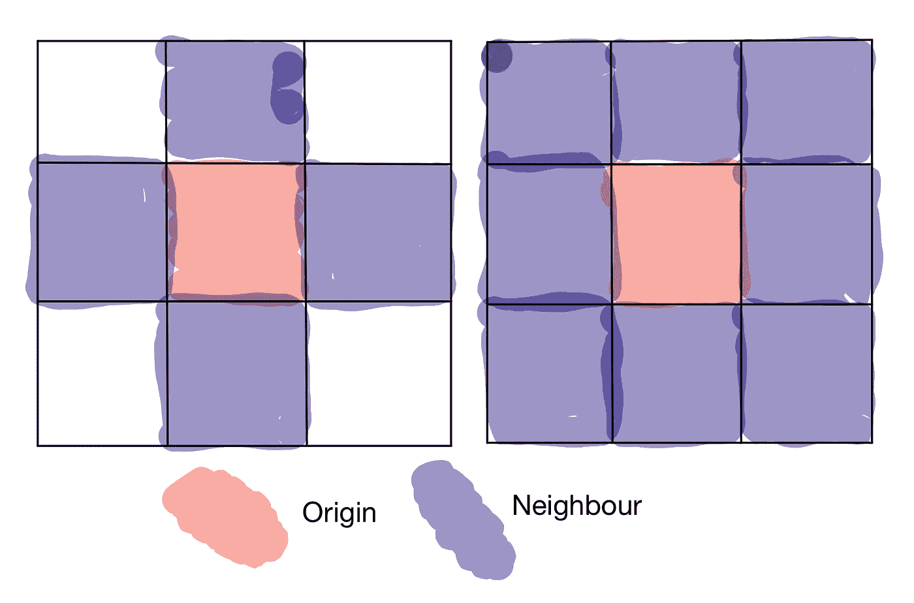
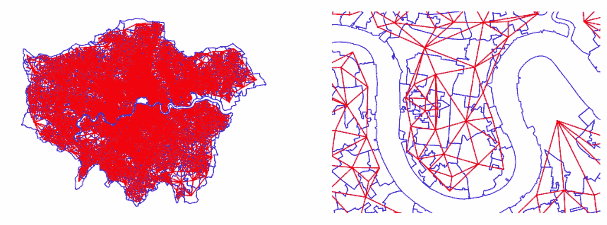
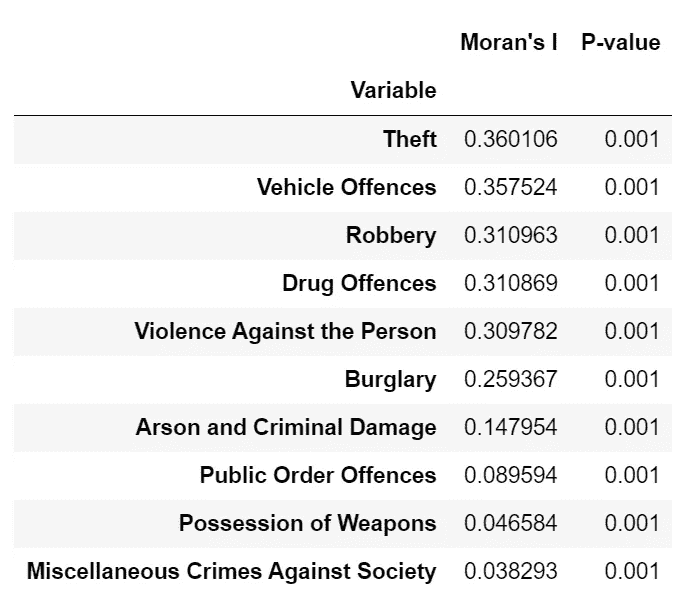
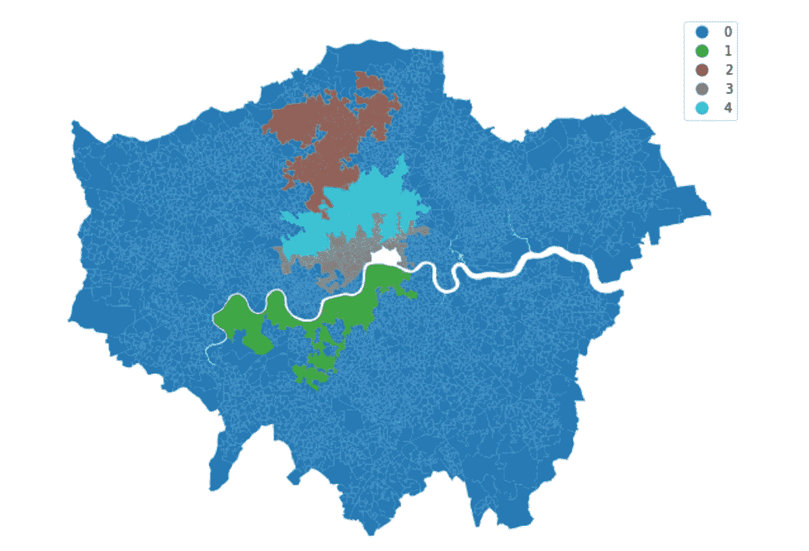
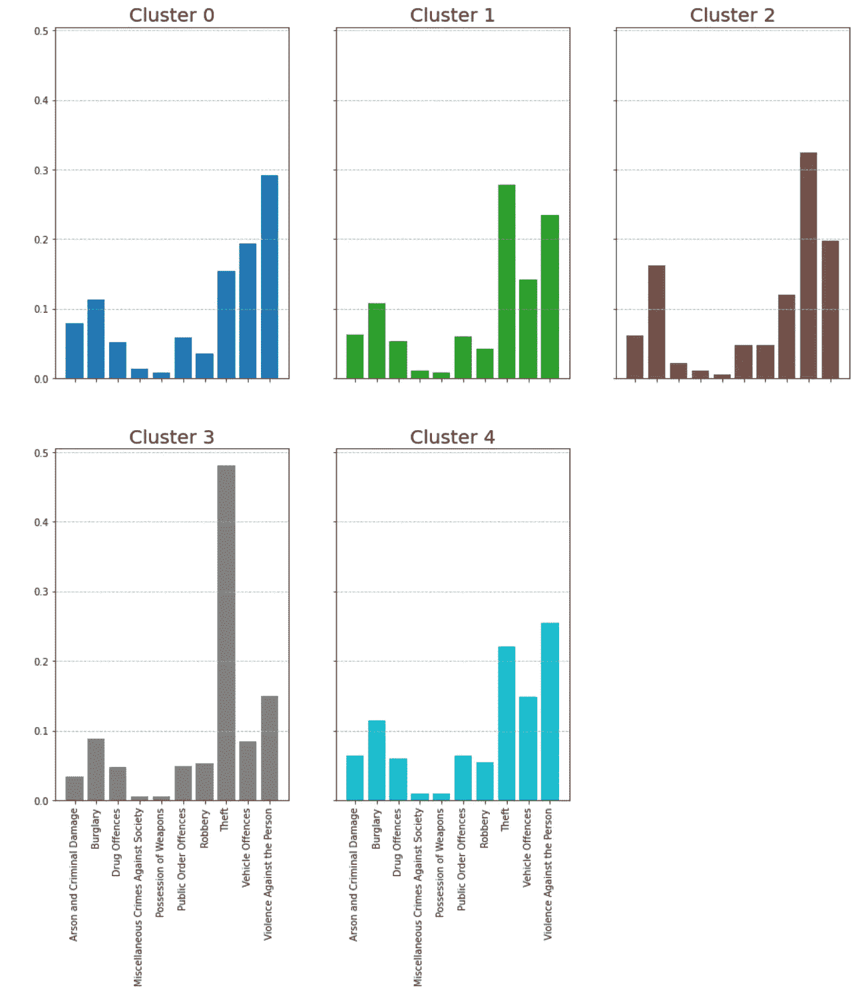
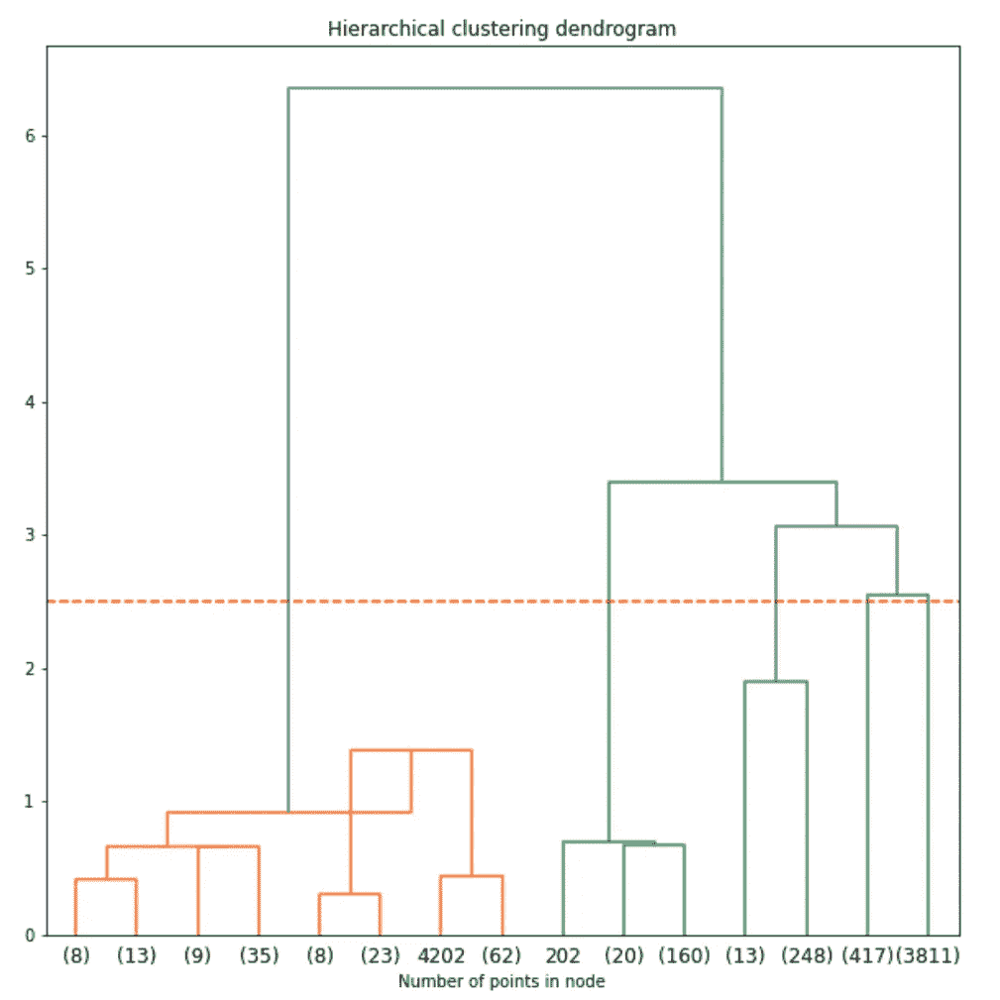

# 层次聚类简介(第 3 部分—空间聚类)

> 原文：<https://towardsdatascience.com/introduction-to-hierarchical-clustering-part-3-spatial-clustering-1f8cbd451173?source=collection_archive---------21----------------------->

## 在层次聚类中引入空间维度


[卡菲刘](https://unsplash.com/@kafailiu?utm_source=medium&utm_medium=referral)在 [Unsplash](https://unsplash.com?utm_source=medium&utm_medium=referral) 上的照片

在[的上一篇文章](/introduction-to-hierarchical-clustering-part-2-python-implementation-73d367f9c298)中，我们试图对伦敦的犯罪进行聚类，在执行聚类时，我们忽略了数据的空间维度。因此，本文试图通过明确说明这一点来解决这个问题。

由于聚类的目的是确定不同的聚类在空间上是如何表现出来的，并且最初的理论是位于另一个 LSOA 附近的一个很可能与主要的犯罪类型相关，因此我们需要考虑这种潜在的空间关系。这是通过对集群施加空间约束来实现的。

在这样做的过程中，这就创建了用特定聚类来标识的区域。这种行为在真实世界的数据集中很容易看到，例如在欧洲，我们有 NUTS1、NUTS2 和 NUTS3 经济边界，它们对应于不同的经济区域，这些经济区域的规模从主要经济区域向更小的区域减小。与算法相关的不同之处在于，这些区域不是用于经济分析的功能单元，而是统计定义的，考虑到了它们的自然地理分布。

集成到算法中的这种地理分布可以来自识别或说明这些地理关系的各种不同方法。有关这些不同类型关系的更多信息，以及可用于定义地理接近度的方法，请参见 [Rey 等人，【2021】](https://geographicdata.science/book/notebooks/04_spatial_weights.html)。

出于我们的目的，我们希望看到彼此相邻的 LSOAs 之间的溢出，因此我们可以使用邻接空间矩阵。这意味着我们检查共享公共边界或顶点的空间单元。这种邻近性的两种类型可以被定义为鲁克的邻近性(冯诺依曼的邻近性)和女王的邻近性(摩尔的邻近性)。这些类别中的前一个类别是地理相邻者，即共享直接边界的那些类别，后一个类别将相邻者表示为共享直接边界和顶点的那些类别。这可以表示为:



左:车，右:皇后

对于这一点，由于我们关心的是犯罪可能蔓延的邻居，我们把前一个例子作为车的相似性，作为那些根据共享相似边界而连接的车的相似性。我们可以在现有的数据框架上实现这一点，如下所示:

```
#import the necessary packages
from libpysal import weights#calculate the weights matrix
#selecting Rook's similarity
wq = weights.contiguity.Rook.from_dataframe(London_crime)
```

然后我们可以想象这在地图上是什么样子:

```
#looking at London
fig, ax = plt.subplots(1,2, figsize = (15,15))London_crime.plot(edgecolor = "blue", facecolor = "w", ax=ax[0])wq.plot(London_crime, ax=ax[0],
       edge_kws=dict(color="r", linestyle = "--", linewidth =1),
       node_kws=dict(marker=''))ax[0].set_axis_off()#Second plot looking into deepr depth
London_crime.plot(edgecolor = "blue", facecolor = "w", ax=ax[1])wq.plot(London_crime, ax=ax[1],
       edge_kws=dict(color="r", linestyle = "--", linewidth =1),
       node_kws=dict(marker=''))
#zzoming ino Canary Wharf
ax[1].axis([536_000, 540_000, 178_000, 181_000])ax[1].set_axis_off()
```



右:整个伦敦，左:金丝雀码头

在整个地图上看起来有点乱，但我们可以通过放大金丝雀码头来更清楚地看到这种关系，在金丝雀码头，当 LSOAs 共享边界时，它们相互连接。

考虑到这一点，问题就变成了我们用来聚类的变量(犯罪百分比)在多大程度上是空间自相关的。这意味着要衡量地理位置相近的地区之间的相关犯罪率。我们可以使用衡量空间自相关整体程度的莫兰 I 值对此进行整体测试。这个值越大，如果这些值靠得很近，它们溢出或彼此紧密相关的可能性就越大。这可以通过以下方式实现:

```
#code from: [https://geographicdata.science/book/notebooks/10_clustering_and_regionalization.html](https://geographicdata.science/book/notebooks/10_clustering_and_regionalization.html)#import Moran
from esda.moran import Moran#extract the resutls for each column
mi_results = [Moran(London_crime[col], wr) for col in to_plot]#create a table based on this
#extract the variable, and results from the zipped list
table = pd.DataFrame([(to_plot, res.I, res.p_sim) \
                          for to_plot,res \
                          in zip(to_plot, mi_results)
                         ], 
                     #set the columns
                     columns=['Variable', "Moran's I", 'P-value'])\
              .set_index('Variable')
#set the index to the variable#sort the tables values 
table.sort_values(by= ["Moran's I"], ascending=False)
```



从这些结果中我们可以看出，所有类型的犯罪都有很大程度的空间自相关性(P 值< 0.01), but that this is especially strong for Theft, Vehicle Offences, Violence against the Person and Burglary. It is interesting to note that these are the main variables which were used to define clusters in the previous article in terms of their means and how they are spatially represented. This is because this suggests that these crimes are spatially related to each other and thus there is a degree of spillover.

What is good about agglomerative clustering is that we can add a connectivity constraint in the algorithm so that only adjacent clusters can be merged together. Given that we have a spatial matrix defined by Rooks contiguity, we can then input this into the algorithm to account for the spatial relationship. This is done through the 【 parameter as follows:

```
#create the model with wards linkage
model = AgglomerativeClustering(linkage="ward", 
                                #define the connectivity
                                connectivity = wr.sparse,
                                #set the distance threshold
                                distance_threshold = 2.5, 
                                n_clusters=None)#fit the model
model.fit(crime_clus)
```

It is important to note that how this algorithm performs when using the connectivity measures depends on the linkage parameter chosen, as noted in the sklearn documentation, ward’s linkage avoids the ‘rich getting richer’ problem associated with other linkage options [【1】](https://scikit-learn.org/stable/modules/clustering.html#hierarchical-clustering))，因此我们希望看到相对均匀的聚类。

正如我们之前所做的那样，我们可以绘制结果图来查看聚类的结果:

```
#extract labels
London_crime["Aggl_clus_spa"] = model.labels_#creating axis
fig, ax =plt.subplots(figsize = (10,10))#plt the results
London_crime.plot(column = "Aggl_clus_spa", categorical = True, legend=True, ax = ax)
ax.set_axis_off()
```



以及这些集群在犯罪方面的表现:

```
agglom_means =London_crime.groupby("Aggl_clus_spa")[to_plot].mean()agglom_means_T = pd.DataFrame(agglom_means.T.round(3))agglom_means_T.reset_index(inplace=True)colors = ["tab:blue", "tab:green", "tab:brown", "tab:grey", "tab:cyan"]fig, ax = plt.subplots(2,3, figsize = (15,20), sharey = True, sharex = True)
axis = ax.flatten()
for i, col  in enumerate(agglom_means_T.columns):
    if col != "index":
        ax = axis[i-1]
        ax.bar(height = agglom_means_T[col], x=agglom_means_T["index"],
               color = colors[i-1])
        ax.set_xticklabels(labels =agglom_means_T["index"], rotation = 90)
        ax.set_title(f"Cluster {col}", fontsize = 20)axis[5].set_axis_off()

plt.suptitle("Clusters with distance threshold 3", fontsize = 20)
```



然后，我们可以将这些集群解释为:

群组 0:针对人身的严重暴力，伦敦市区

第 1 组:伦敦西南中部的高盗窃和公共秩序犯罪

第二组:伦敦北部外围的高车辆犯罪和入室盗窃

第三组:伦敦市中心的高盗窃率

集群 4:伦敦中北部暴力和盗窃高发

我们还可以创建树状图来查看算法是如何到达这一点的，但这与之前不同，因为我们现在考虑了地理邻近性:

```
import numpy as np
from scipy.cluster.hierarchy import dendrogramdef plot_dendrogram(model, **kwargs):

    counts = np.zeros(model.children_.shape[0])
    n_samples = len(model.labels_)
    for i, merge in enumerate(model.children_):
        current_count = 0
        for child_idx in merge:
            if child_idx < n_samples:
                current_count +=1
            else:
                current_count += counts[child_idx-n_samples]
        counts[i] = current_count

    linkage_matrix = np.column_stack([model.children_, model.distances_,
                                     counts]).astype(float)

    dendrogram(linkage_matrix, **kwargs)fig, ax = plt.subplots(figsize = (10,10))
ax.set_title("Hierarchical clustering dendrogram")
#plot the top three levels of the dendrogram
plot_dendrogram(model, truncate_mode='level', p=3)
ax.set_xlabel("Number of points in node")
plt.show()
```



我们可以从中看出，尽管使用了 wards 连锁，但我们仍然有一个 0 的优势聚类问题，它包含 3811 个 LSOAs，这表明我们的连锁和地理邻近性措施可能没有创建最合适的聚类。这一点，以及所产生的集群难以解释的事实。

因此，在 was 中考虑地理上的接近可能没有产生我们想要的结果，因为集群很难根据它们的犯罪和地理位置来解释。因此，可以使用空间接近度的替代方法，或者可以将犯罪百分比标准化，这样我们就不会查看百分比，而是查看平均值的方差。我们还可以尝试不同的链接或距离度量，以查看算法如何执行以及输出如何变化。因此，这突出了与聚类相关的困难，因为为了获得正确的结果，可以考虑许多不同的方法和因素，并且最终，结果是否正确是主观的。

本文的代码可以在以下位置找到:

[](https://github.com/PhilipDW183/hierarchical_clustering) [## GitHub-Philip dw 183/hierarchical _ clustering

### 此时您不能执行该操作。您已使用另一个标签页或窗口登录。您已在另一个选项卡中注销，或者…

github.com](https://github.com/PhilipDW183/hierarchical_clustering) 

尽管可以在此处找到对分层集群的首次介绍:

[](/introduction-to-hierarchical-clustering-part-1-theory-linkage-and-affinity-e3b6a4817702) [## 层次聚类简介(第 1 部分——理论、联系和相似性)

### 什么是层次聚类、亲和度和关联度

towardsdatascience.com](/introduction-to-hierarchical-clustering-part-1-theory-linkage-and-affinity-e3b6a4817702) 

第一个不受地理位置限制的 python 实现可以在这里找到:

[](/introduction-to-hierarchical-clustering-part-2-python-implementation-73d367f9c298) [## 分层聚类介绍(第 2 部分——python 实现)

### 伦敦犯罪数据的 sklearn 实现

towardsdatascience.com](/introduction-to-hierarchical-clustering-part-2-python-implementation-73d367f9c298) 

如果你想在 Medium 上阅读更多我和其他人的精彩文章，请随意使用我的推荐链接注册:

[](https://philip-wilkinson.medium.com/membership) [## 通过我的推荐链接加入媒体-菲利普·威尔金森

### 作为一个媒体会员，你的会员费的一部分会给你阅读的作家，你可以完全接触到每一个故事…

philip-wilkinson.medium.com](https://philip-wilkinson.medium.com/membership) [](/easy-grouped-bar-charts-in-python-b6161cdd563d) [## Python 中的简易分组条形图

### 如何创建每个条目有两个、三个或更多条的条形图

towardsdatascience.com](/easy-grouped-bar-charts-in-python-b6161cdd563d) [](/an-introduction-to-plotting-with-matplotlib-in-python-6d983b9ba081) [## Python 中 Matplotlib 绘图简介

### UCL 数据科学学会研讨会 7:创建一个基本的图表，在同一图表上绘制不同的信息…

towardsdatascience.com](/an-introduction-to-plotting-with-matplotlib-in-python-6d983b9ba081) [](/introduction-to-random-forest-classifiers-9a3b8d8d3fa7) [## 随机森林分类器简介

### 预测 NBA 球员的位置——我们正在看到一个真正的“无位置”联盟吗？

towardsdatascience.com](/introduction-to-random-forest-classifiers-9a3b8d8d3fa7)