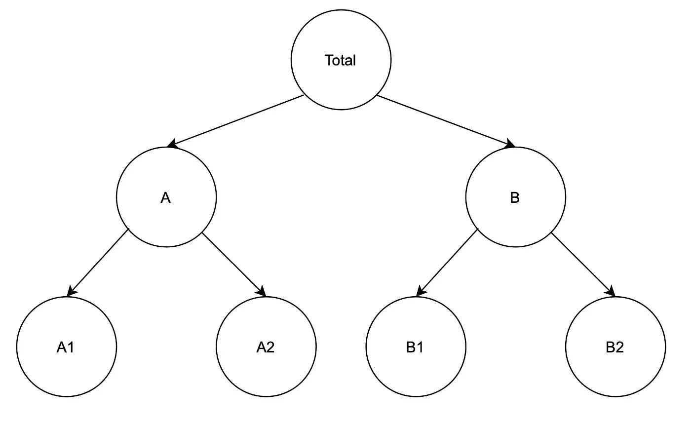
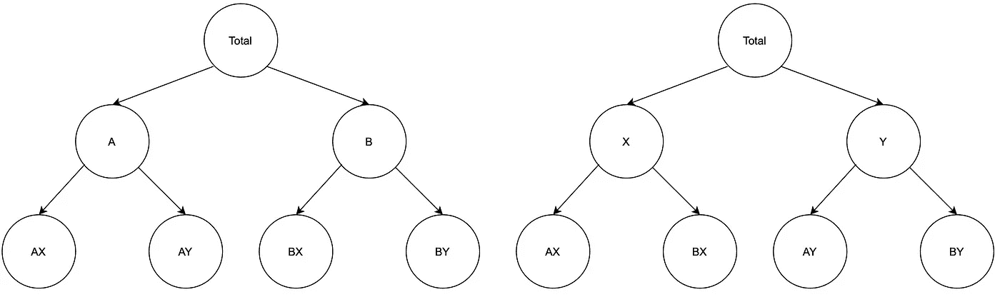

# 分层时间序列预测简介—第一部分

> 原文：<https://towardsdatascience.com/introduction-to-hierarchical-time-series-forecasting-part-i-88a116f2e2?source=collection_archive---------3----------------------->

Edvard Alexander lvaag 在 [Unsplash](https://unsplash.com/?utm_source=unsplash&utm_medium=referral&utm_content=creditCopyText) 上拍摄的照片

## 问题定义和不同方法概述

大多数关于时间序列预测的文章都集中在特定的聚合级别上。然而，当我们可以深入我们的聚合数据以在更细粒度的级别上观察相同的系列时，挑战就出现了。在这种情况下，我们经常会发现低层的预报与总的预报不一致——它们是不连贯的。为了确保不出现这种情况，我们可以采用一种叫做分层时间序列(HTS)预测的方法。

# 理论介绍

我们应该从数据开始介绍。当谈到合计和分解时间序列时，我们可以区分两种情况。通过分析一个例子来理解它们是最容易的，所以让我们假设我们是一个在线零售商，在许多市场上销售不同种类的产品(比如亚马逊)。

第一个场景涉及清晰的数据层次结构，其中较低的级别唯一地嵌套在较高级别的组中。最简单的例子就是地理分裂。作为零售商，我们可以查看所有市场的总销售水平，然后按国家细分汇总的系列。如有必要，我们可以更深入地了解每个地区的销售额(如美国各州等。).当我们的数据遵循这样的结构时，我们处理的是**层次时间序列**。

分层时间序列的一个例子。图片由作者提供。

第二种情况涉及时间序列，其中各层次是交叉的，而不是嵌套的。作为零售商，我们可以有多个层次的细节:产品类别、价格范围、我们自己的产品与第三方卖家销售的产品的对比，等等。有了这样的分割，就没有单一的“正确”聚合方式。在这种情况下，我们用**分组的时间序列**工作。

分组时间序列示例。图片作者。

自然地，当我们分析地理位置和产品类别时，分层和分组的时间序列可以混合成更复杂的结构。

**分层时间序列预测**(为了清楚起见，该名称还包括分组和混合情况)的整个挑战是生成在整个聚合结构中**一致的**预测。所谓一致，我指的是以与基础聚合结构一致的方式相加的预测。例如，所有区域的预测应添加到国家一级，所有国家一级应添加到更高一级，等等。或者，不一致的预测可以被调和以使它们一致。

还有一点需要澄清的是，分层时间序列预测不是时间序列预测的方法论(如 ARIMA、ETS 或 Prophet) *本身*。相反，它是一个不同技术的集合，使预测在给定的单个时间序列层次上保持一致。

下面，我们来看看层次时间序列预测的主要方法。

## 自下而上的方法

在自下而上的方法中，我们预测层次结构中最细粒度的级别，然后汇总这些预测以创建更高级别的估计值。回到最初的在线零售商的例子，我们将预测每个地区的销售额，然后将它们相加，以创建各个国家的预测。我们可以再次求和，得出洲/地区级别，然后最终得出总计。

优势:

*   汇总不会导致信息丢失，因为预测是在最低级别获得的。

缺点:

*   系列之间的关系(例如，不同区域之间的关系)没有被考虑，
*   倾向于在高度聚合的数据上表现不佳，
*   计算量大(取决于任务和较低级别中系列的数量)，
*   在最精细的级别上，数据中的噪声越多，预测的整体准确性就越差。

## 自上而下的方法

自上而下的方法包括预测层次结构的顶层，然后将预测分成更细化的系列。最常见的是，历史比例用于确定分割。举个例子，我们会预测总计水平。然后，查看过去的数据，我们可以推断美国占销售额的 50%，欧洲占 40%，等等。然后，我们可以迭代并将系列分解成更细粒度的级别。

优势:

*   最简单的方法，
*   对更高层次的可靠预测，
*   只需要一个预测。

缺点:

*   由于信息丢失(通过历史比例)，较低层次的预测不太准确。

## 中间向外方法

中间剔除法是上述两种方法的结合，只能用于严格分级的时间序列。在这种方法中，我们选择中间级别并直接预测它。然后，对于所选级别之上的所有级别，我们使用自下而上的方法—我们将层级向上求和。对于中间一层以下的层，我们使用自顶向下的方法。

由于它是两种不同方法之间的折衷，因此得到的预测不会丢失太多信息，并且计算时间不会像自底向上方法那样激增。

## 最佳协调方法

上面描述的三种方法集中于在一个层次上预测时间序列，然后使用它们来推断其余的层次。与它们相反，在最佳协调方法中，我们使用给定层次结构可以提供的所有信息和关系来预测每个级别。

在这种方法中，我们假设基本预测(对于所有级别的每个系列)近似满足层次结构。这意味着预测应该相对准确，而不是扭曲平衡。然后，我们使用线性回归模型来协调个人预测。实际上，一致性预测是所有级别的所有基本预测的加权和。为了找到权重，我们需要求解一个方程组，以确保不同级别之间的层次关系得以保留。

优势:

*   更准确的预测，
*   以最小的信息损失对所有级别进行公正的预测
*   考虑时间序列之间的关系，
*   由于每个预测都是独立创建的，该方法允许使用不同的预测方法(ARIMA、ETS、Prophet 等)。)每一级。此外，不同的级别可以使用不同的特性集，因为某些变量在给定的粒度级别上可能不可用。

缺点:

*   最复杂的方法，
*   可能是计算密集型的—不能很好地适应大量的系列。

还有其他可用的协调方法，例如 MinT(最小跟踪)最佳协调方法，您可以在此处阅读[。](https://otexts.com/fpp3/reconciliation.html)

# 结论

在本文中，我简要介绍了分层时间序列预测，并描述了用于应对这一挑战的最流行的方法。一个明显的问题是使用哪种方法。你可能已经猜到了，答案是:视情况而定。

前三种方法倾向于偏向于他们预测的水平，这在直觉上是有意义的。因此，当获得特定水平的准确预测是最重要的，并且我们希望获得其余的作为副产品时，我们可能希望从一个更简单的方法开始，看看我们是否满意。

否则，我们可能会研究在层次结构的所有级别上都相当准确的最佳协调方法。理想情况下，我们可以尝试所有不同的方法，同时采用某种时间序列交叉验证方案来评估每种方法的性能，并选择最适合我们问题的方法。

关于如何用 Python 实现分层时间序列预测的例子，请看文章的[第二部分](/introduction-to-hierarchical-time-series-forecasting-part-ii-e73dfd3de86b)。

一如既往，我们欢迎任何建设性的反馈。你可以在[推特](https://twitter.com/erykml1?source=post_page---------------------------)或评论中联系我。

如果您喜欢这篇文章，您可能还会对以下内容感兴趣:

</beautiful-decision-tree-visualizations-with-dtreeviz-af1a66c1c180>  </the-best-book-to-start-learning-about-time-series-forecasting-69fcc618b6bb>  </facebooks-prophet-deep-learning-neuralprophet-76796aed1d86>  

# 参考

*   Hyndman，R.J .，& Athanasopoulos，G. (2021) *预测:原理与实践*，第三版，OTexts:澳洲墨尔本。OTexts.com/fpp3.
*   Rob J. Hyndman，Roman A. Ahmed，George Athanasopoulos，Han L Shang (2011) *计算统计与数据分析* **55** (9)，2579–2589