# 分层时间序列预测简介—第二部分

> 原文：<https://towardsdatascience.com/introduction-to-hierarchical-time-series-forecasting-part-ii-e73dfd3de86b?source=collection_archive---------0----------------------->


布鲁克·坎贝尔在 [Unsplash](/s/photos/time?utm_source=unsplash&utm_medium=referral&utm_content=creditCopyText) 上拍摄的照片

## Python 中使用 scikit-hts 的示例

在本文的第一部分[中，我介绍了分层时间序列预测，描述了不同类型的分层结构，并回顾了预测这种时间序列的最流行的方法。在第二部分中，我将展示一个例子，说明如何使用`scikit-hts`库在 Python 中完成这样的任务。](/introduction-to-hierarchical-time-series-forecasting-part-i-88a116f2e2)

# 设置

一如既往，我们从设置开始。首先，我们需要使用`pip`安装`scikit-hts`。然后，我们导入以下库。

注意`scikit-hts`被简单地作为`hts`导入。

# 数据

在本文中，我们使用澳大利亚旅游数据集，它也用于*预测:原则和实践*(你可以在这里阅读我对本书[的看法)。数据集在名为`tsibble`的 R 包中自带，但你也可以从](/the-best-book-to-start-learning-about-time-series-forecasting-69fcc618b6bb) [Kaggle](https://www.kaggle.com/luisblanche/quarterly-tourism-in-australia) 或 my [GitHub](https://github.com/erykml/medium_articles/blob/master/data/tourism.csv) 下载。

该数据集包含 1998 年至 2016 年期间前往澳大利亚的季度次数。此外，它还附有地理细分(每个州和地区)和旅行目的(商务、度假、旅游、其他)。因此，我们可以创建一个层次或分组的时间序列预测。对于本文，我们将关注严格的层次结构(尽管`scikit-hts`也可以处理分组变体)。

原始数据集包含 8 个状态，而我们将要处理的数据集只包含 7 个状态。不同的是塔斯马尼亚岛，它显然在 Kaggle 数据集中被删除了。

在下面的代码片段中，我们执行了一些预处理步骤。两个值得注意的步骤是聚合目的(因为我们将使用严格的层次结构)和将澳大利亚各州重命名为它们的缩写。最后，我们还创建了一个州和地区的连接，以创建一个惟一的标识符，然后我们将使用它来创建层次结构。

完成所有步骤后，数据帧如下所示:

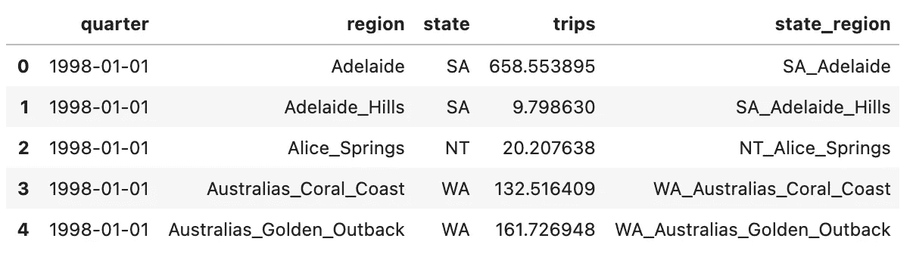

作者图片

使用这个一行程序，我们可以检查数据集中每个州内的区域。

```
# inspect all the regions per state
df.groupby("state")["region"].apply(set).to_frame()
```

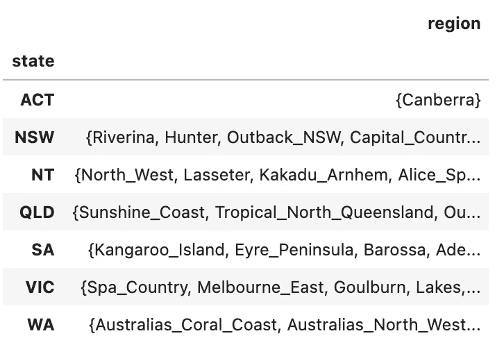

作者图片

下一步是创建一个数据框架，我们可以将它提供给`scikit-hts`模型。数据框架应该以列的形式包含每个时间序列，行表示给定时间段(在本例中为季度)的观察值。

使用上面的代码片段，我们创建了三个数据帧，层次结构的每一级都有一个数据帧:

*   底层—这只是一个将长格式的初始数据帧转换为宽格式的枢纽，
*   中层—在旋转数据框架之前，我们首先对状态求和，
*   总级别—最高级别，是所有状态的总和。

准备好数据帧后，我们使用索引将它们连接起来，并打印层次结构中每一层的唯一系列的数量:

```
Number of time series at the bottom level: 77
Number of time series at the middle level: 7
```

加上总计水平，我们得到 85 个独特的时间序列。

# 创建层次结构

我们将要使用的估计量也需要层次结构的明确定义。准备它的最简单的方法是将层次树构建成一个字典。每个节点(在字典中被标识为键)都有一个孩子列表，作为字典中的相应值。然后，每个孩子也可以是字典中的一个关键，并有自己的孩子。

理解它最简单的方法是看一个例子。在下面的代码片段中，我们创建了时间序列的层次结构。

如您所见，我们受益于创建唯一的州-地区名称，因为现在我们可以通过检查地区名称是否以州的缩写开头来轻松识别州的子地区。下面我们展示一段`hierarchy`字典。

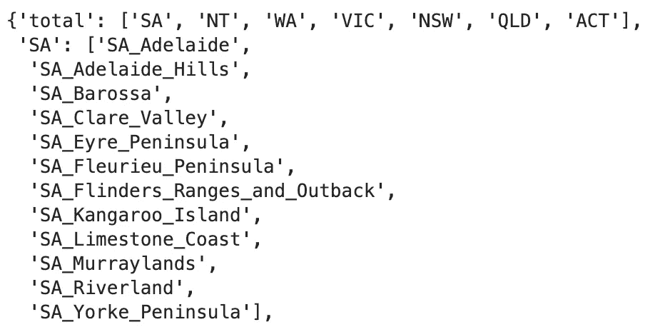

作者图片

或者，我们可以使用`HierarchyTree`类来表示我们系列的底层结构。我们必须提供数据帧和字典作为输入，然后我们可以直接将实例化的对象传递给估计器(不需要`HierarchyTree`的单独组件)。一个额外的好处是稍微好一点的树的结构表示，您可以在下面看到。

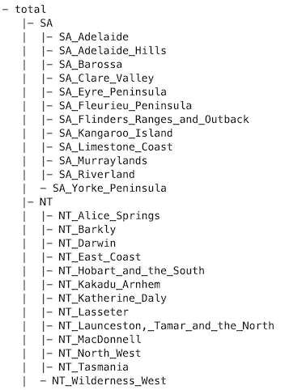

作者图片

# 可视化数据

使用准备好的层次结构，我们可以快速可视化数据。我们从总计水平开始。在该图中，我们可以观察到该练习可用数据的整个历史。

```
hierarchy_df["total"].plot(title="Trips - total level");
```

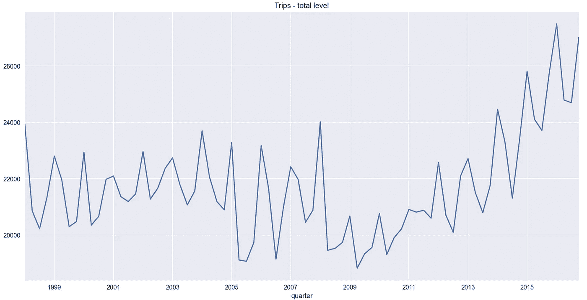

作者图片

第二步，我们把所有的州级系列都标出来。为此，我们可以简单地获取所有列，这些列是已经定义的层次结构中总级别的子级。

```
ax = hierarchy_df[hierarchy['total']].plot(title="Trips - state level")
ax.legend(bbox_to_anchor=(1.0, 1.0));
```

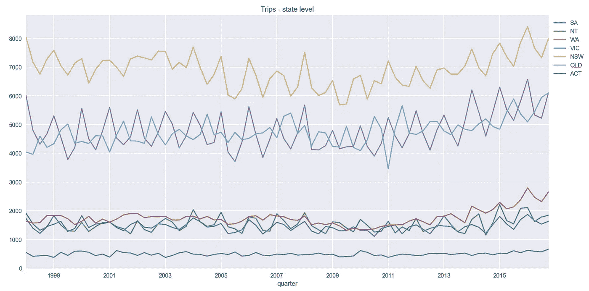

作者图片

最后，让我们画出西澳大利亚州的最低水平。我选择这一个，因为它有最少的区域，所以情节仍然容易阅读。

```
ax = hierarchy_df[hierarchy['WA']].plot(title="Trips - regions of Western Australia")
ax.legend(bbox_to_anchor=(1.0, 1.0));
```

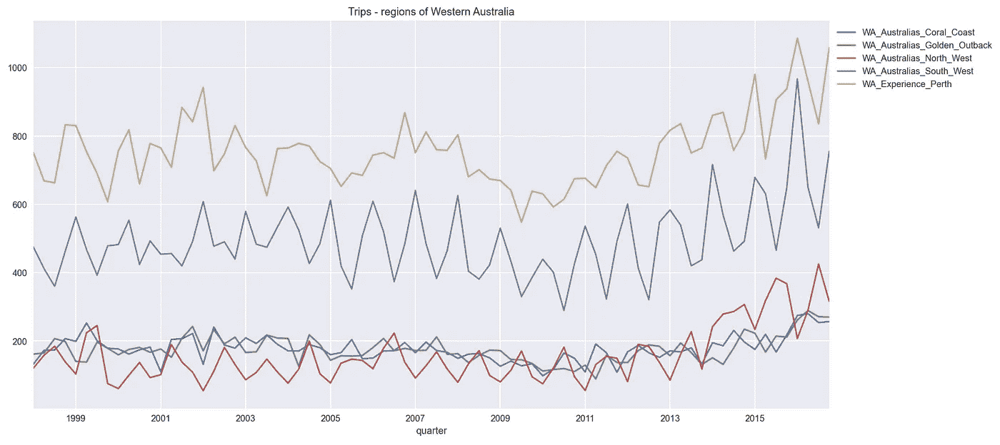

作者图片

# 分层时间序列预测

最后，我们可以专注于建模部分。在本文中，我只想强调一下`scikit-hts`的功能。这就是为什么我提出了简化的例子，其中我使用整个数据集进行训练，然后预测未来的 4 个步骤(一年)。当然，在现实生活中，我们会采用适当的时间序列交叉验证方案，并尝试调整模型的超参数以获得最佳拟合。

本库的主类是`HTSRegressor`。任何以前使用过`scikit-learn`的人都会熟悉这个库的用法(初始化估计器- >拟合数据- >预测)。我们要注意的两个论点是`model`和`revision_method`。

`model`确定用于预测单个时间序列的模型的基础类型。目前，该库支持:

*   `auto_arima` —从`pmdarima`库中，
*   SARIMAX —来自`statsmodels`，
*   霍尔特-温特斯指数平滑法—同样来自`statsmodels`，
*   脸书的先知。

`revision_method`参数负责分层时间序列预测的方法。我们可以选择:

*   `BU` —自下而上的方法，
*   `AHP` —平均历史比例(自上而下的方法)，
*   `PHA` —历史平均值的比例(自上而下的方法)，
*   `FP` —预测比例(自上而下的方法)，
*   `OLS` —使用 OLS 的最佳组合，
*   `WLSS` -使用结构加权 OLS 的最佳组合，
*   `WLSV` -使用方差加权 OLS 的最佳组合。

要更详细地了解这些方法，我建议你参考 [*预测:原理与实践*](https://otexts.com/fpp3/hierarchical.html) *。*

## 自下而上的方法

我试图从自底向上的方法开始，但是，我不断遇到奇怪的错误。同样的语法也适用于其他修订方法，所以我认为库中存在某种缺陷。

但是我们还是可以看看语法。首先，我实例化估计器——在这种情况下，我使用自动 ARIMA 和自底向上的修正方法。然后，我使用熟悉的`fit`方法拟合模型。作为参数，我传递包含所有时间序列的数据帧和包含层次结构的字典。最后，我使用`predict`方法获得了 4 个样本外预测。得到的数据帧包含`n + 4`行，其中`n`是原始数据帧中的行数。我们得到拟合值(`n`)和在这些值之上的 4 个预测值。

## 自上而下的方法

在运行上一个例子失败后，我使用平均历史比例转移到自上而下的方法。这一次，代码运行成功。

下面，您可以看到三个级别(总计级别、州和地区级别)的拟合值和预测值。为了简洁起见，我只展示了一个较低层次的例子。在笔记本中，您可以找到一个方便的函数，用于为层次结构的任何级别生成图。

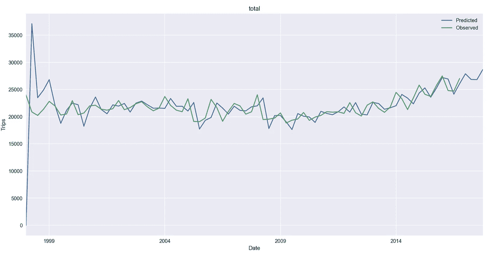

使用自上而下方法的总计水平。图片由作者提供。

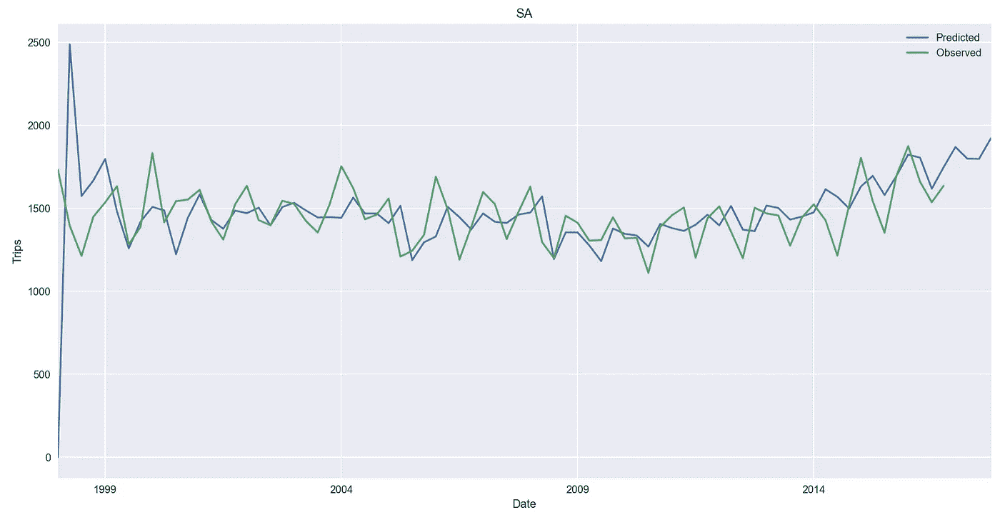

使用自上而下方法的状态级别(SA)。图片由作者提供。

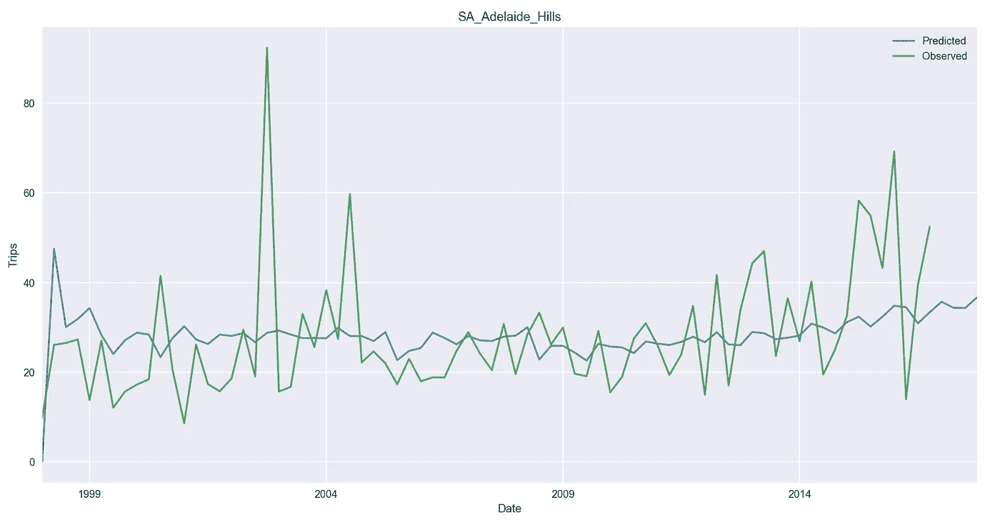

使用自上而下方法的最低级别系列之一的示例。图片由作者提供。

正如我们所看到的，这些模型在时间序列的起点非常偏离，但是它们很快就稳定下来了。当然，这是一个非常不科学的性能评估，但是如前所述，我们纯粹关注于获得分层预测，并且调整它们超出了本文的范围。另一个观察结果是，较低的级别更不稳定，也就是说，它们包含更多的噪声。

在玩这个库的时候，我注意到了一些怪癖:

*   与`scikit-learn` API 不同，我们不能使用`n_jobs=-1`来指示使用所有可用的内核。当使用除 0 以外的数字时(如库的作者提供的例子)，我得到了奇怪的结果。
*   在可用的例子中，作者建议在调用`fit`方法时分配一个输出。
*   当使用 Prophet 作为底层模型时，结果会大相径庭。你可以在下图中看到这一点。

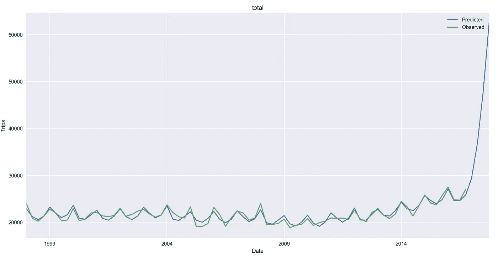

使用 Prophet 和自顶向下的方法时会产生奇怪的结果。图片由作者提供。

## 使用 OLS 的最优组合

最后，我们利用 OLS 进行最优协调。代码只需稍加调整。

为了便于比较，我们展示了与自上而下方法完全相同的水平图。

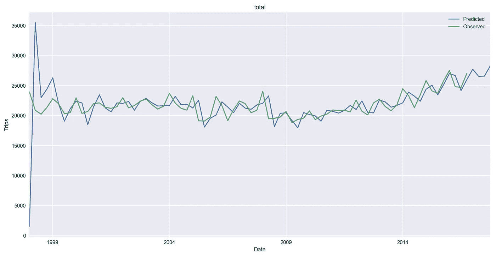

使用 OLS 方法得出的总计水平。图片由作者提供。

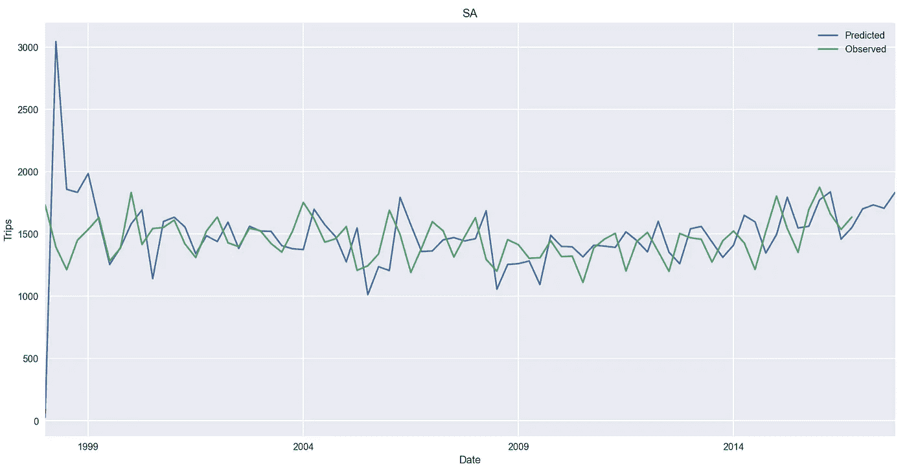

使用 OLS 方法的州级(SA)。图片由作者提供。

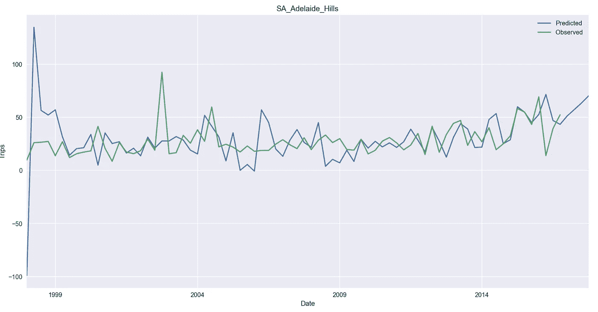

使用 OLS 方法的最低级别系列之一的示例。图片由作者提供。

这种差异在最低层次上最明显，使用 OLS 方法的拟合要好得多，尽管该系列本身非常嘈杂。这并不奇怪，因为最佳协调方法可以提供最准确的预测(有关其优势的更多信息，请参见[之前的文章](/introduction-to-hierarchical-time-series-forecasting-part-i-88a116f2e2))。

还有一件事我们应该知道——OLS 方法为第一次观察创造了一个负的拟合值。正如我们所知，数列中的所有值都是非负的。然而，考虑到它只是拟合值，并且只是针对系列中的第一次观察(当算法具有非常少的信息时)，这应该不是问题。

# 结论

在本文中，我展示了如何在 Python 中使用`scikit-hts`进行分层时间序列预测。该库提供了一个类似于 `scikit-learn`的 API，并且很容易上手。

但是，该库是 alpha 版本。在花了相当多的时间试图让这个例子工作(并不是所有的修订方法都成功)之后，我必须说 Python 库要赶上 R 的对等体`fable`还有很长的路要走。不幸的是，文档也很不完整，不容易理解(回购中的例子也是如此)。

话虽如此，如果在一个严肃的项目中使用`scikit-hts`是有意义的，我会给予额外的考虑。我要么考虑创建一个定制的解决方案(特别是如果使用更简单的方法，比如自底向上的方法)，要么可能针对特定的预测转移到 R。

您可以在我的 [GitHub](https://github.com/erykml/medium_articles/blob/master/Time%20Series/hierarchical_time_series.ipynb) 上找到本文使用的代码。如果你设法克服了我在文章中提到的问题，我会很高兴听到你是如何做到的。此外，欢迎任何建设性的反馈。可以在 [Twitter](https://twitter.com/erykml1?source=post_page---------------------------) 或者评论里联系我。

喜欢这篇文章吗？成为一个媒介成员，通过无限制的阅读继续学习。如果你使用[这个链接](https://eryk-lewinson.medium.com/membership)成为会员，你将支持我，不需要你额外付费。提前感谢，再见！

您可能也会对以下文章之一感兴趣:

</the-best-book-to-start-learning-about-time-series-forecasting-69fcc618b6bb>  </5-free-tools-that-increase-my-productivity-c0fafbbbdd42>  </choosing-the-correct-error-metric-mape-vs-smape-5328dec53fac>  

# 参考

*   Hyndman，R.J .，& Athanasopoulos，G. (2021) *预测:原理与实践*，第三版，原文:澳大利亚墨尔本。OTexts.com/fpp3.
*   数据:[https://www . ka ggle . com/luisblanche/quarterly-tourism-in-Australia](https://www.kaggle.com/luisblanche/quarterly-tourism-in-australia)
*   【https://scikit-hts.readthedocs.io/en/latest/readme.html 