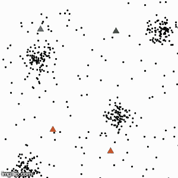
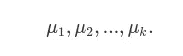
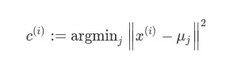
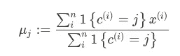
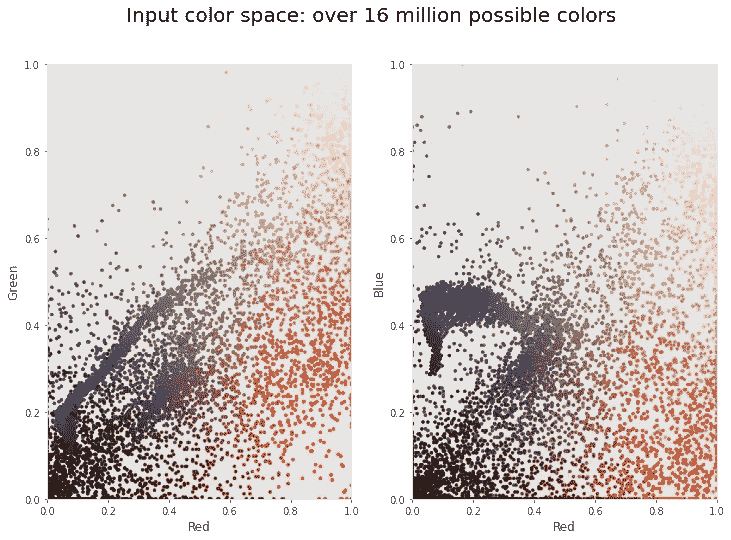
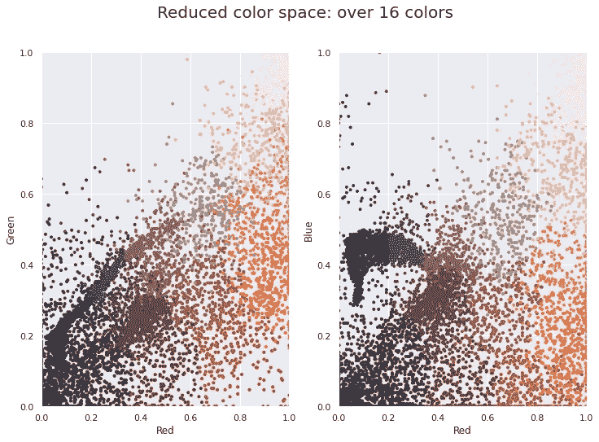

# K-均值聚类介绍:实现和图像压缩。

> 原文：<https://towardsdatascience.com/introduction-to-k-means-clustering-implementation-and-image-compression-8c59c439d1b?source=collection_archive---------14----------------------->

[**蚂蚁**](https://unsplash.com/@rozetsky) **上** [**下**](https://unsplash.com/)

## 本文通过 K-means 集群的 Python 实现对其进行了介绍。此外，它还包括其在图像压缩中的应用。

K-means 聚类是最流行的无监督聚类算法之一。聚类意味着由于某些相似性而分组在一起的数据点的集合。聚类有大量的应用，如细分、排序、营销和销售等。在本文中，我将通过 K-means 聚类的 Python 实现来介绍它的思想，以及如何将它用于图像压缩。

# 算法

k 均值算法。来源:Incheol via [Wikimedia](https://commons.wikimedia.org/wiki/File:Kmeans_animation.gif)

1.  初始化:从输入图像中随机抽取 k 种颜色。这些是初始的 k 均值

2.对于图像中的每个像素，将其分配到由下式给出的最接近的平均值

欧几里得距离

3.使用步骤 2 中的像素分配更新平均值。

找到每个聚类的中间点

4.重复步骤 2 和 3，直到收敛。

# Python 实现

现在我附上我的上述算法的 Python 实现。然而，这种实现仅用于教育目的，因此在时间方面效率不高。为了看出这一点，我将比较两种实现处理相同图像所用的时间。

# 图像压缩

## 为什么需要图像压缩技术？

图像压缩可能有多种需求，例如:

1.  数据压缩后需要的空间更少，从而可以用更少的磁盘空间存储更多的数据。这在医疗保健中至关重要，因为医疗图像需要存档，而且数据集的量非常大。
2.  有时我们需要提取并存储图像中最有用的部分，这被表示为嵌入，因此图像压缩可能是存储更多数据的非常有益的方法。

圣巴西勒大教堂。来源:[Julius Silver](https://commons.wikimedia.org/wiki/User:Julius_Sil)via[Wikimedia](https://commons.wikimedia.org/wiki/File:1_Saint_Basils_Cathedral.jpg)

让我们以上面显示的一幅图像为例，仔细看看如何使用 K-means 聚类来解决这个问题。我将把我们的任务分解为以下子任务:

1.  数据预处理
2.  使用点云可视化颜色空间
3.  可视化 K-意味着减少颜色空间

> 数据预处理

您可能已经知道，一幅图像由三个通道组成，即红色、绿色和蓝色，每个通道的值都在[0，255]的范围内。因此，某个图像可能有 255 * 255 * 255 种不同的颜色。因此，在我们输入图像之前，我们需要对其进行预处理。首先，我们需要通过将图像除以 255，将图像归一化到[0，1]的范围内。最后，我们需要展平图像，因为我们可以将 3D 数据输入到我们的算法中。

> 使用点云可视化色彩空间

原始色彩空间

可以看出，我们的原始图像色彩非常丰富。事实上，有超过 1600 万种可能的颜色。此外，我们可以注意到，一个图像包含多个蓝色阴影，这可能是代表所有表示的整个集群。使用 K-means 聚类算法，我们可以通过相应的质心来概括所有这些颜色。因此，仅通过使用质心来压缩图像。

实现比较

> 可视化 K-意味着减少颜色空间

压缩色彩空间

在我们对图像进行聚类之后，我们可以看到颜色空间中的颜色变化更加剧烈，因为我们只使用了 16 个质心来表示图像。此外，我们的实现与原始实现的比较表明，它几乎慢了三倍；因此，我只提供给你理解。最后，如果原始图像需要大约 96 kB，那么压缩表示只需要 60 kB，同时保留足够的信息来表示圣巴西勒大教堂。

圣巴西勒大教堂的压缩图像

现在，假设您有 1GB 的空间来存储数据集。您可以存储大约 10，922 张大小为 96kB 的图像，也可以将图像压缩为每张 60kB，存储大约 17，476 张图像。空间越大，这些数字给人的印象就越深刻。

# 一些遗言

有不同的方法来压缩我们的图像。所以，如果你有兴趣进一步研究它，我附上一些有用的文章。此外，我鼓励您熟悉聚类算法的其他应用。这个作品在我的 [GitHub](https://github.com/chingisooinar/K-means-Image-Compression) :)上很容易找到

# 相关文章

 [## 理解机器学习中的 K-均值聚类

### K-means 聚类是最简单和最流行的无监督机器学习算法之一。

towardsdatascience.com](/understanding-k-means-clustering-in-machine-learning-6a6e67336aa1)  [## 2019 年基于深度学习的图像压缩指南

### 流行的和最近的方法

heartbeat.fritz.ai](https://heartbeat.fritz.ai/a-2019-guide-to-deep-learning-based-image-compression-2f5253b4d811)