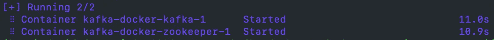
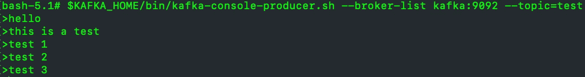
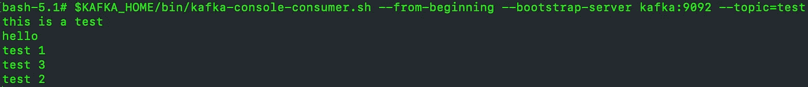
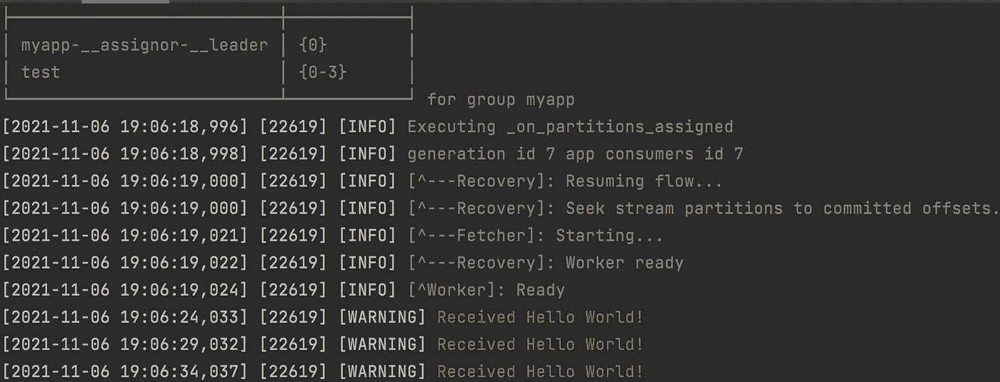

# Python 中 Kafka 流处理简介

> 原文：<https://towardsdatascience.com/introduction-to-kafka-stream-processing-in-python-e30d34bf3a12?source=collection_archive---------2----------------------->

## 卡夫卡|流媒体| PYTHON

## 使用 Faust 在 Python 中轻松处理 Kafka 流的分步指南


亨特·哈里特在 [Unsplash](https://unsplash.com?utm_source=medium&utm_medium=referral) 上的照片

# 在我们开始之前，卡夫卡是什么？

让我们首先为那些不了解 Apache Kafka 技术的人提供一个快速的介绍。

Kafka 简单来说就是 Apache 的开源分布式事件流平台。Kafka 允许我们建立和管理实时数据流管道。

为了这篇文章，你需要了解卡夫卡的四个主要概念。

1.  **话题** : *卡夫卡所有的信息都是通过话题传递的。主题只是我们组织和分组信息集合的一种方式。我们可以有多个主题，每个主题都有一个唯一的名称。*
2.  **消费者:** *消费者是 Kafka 内部的一个实体(通常称为订阅者)，负责连接(或订阅)某个特定主题以阅读其消息。*
3.  **制作者:** *制作者是 Kafka 内部的一个实体(俗称出版者)，负责撰写(或发布)某个特定主题的消息。*
4.  **消费群体:**在卡夫卡中，我们可以有多个主题，有多个消费者订阅。我们也可以有多个服务(即外部应用程序)订阅相同的主题。为了防止重叠和数据问题，每个服务都可以有自己的使用者组来跟踪哪些消息已经被处理(通常称为偏移量)。

## TL；速度三角形定位法(dead reckoning)

阿帕奇卡夫卡是一个信息传递系统。

消息按主题组织。

生产者向主题发送数据。

消费者从主题中读取数据。

消费者团体管理一组消费者。

# 设置本地 Kafka 实例

wurstmeister 为在 docker 容器中运行 Kafka 提供了一个非常好的仓库。

如果我们希望我们的 Kafka 集群可以从外部访问(即从您的终端或服务)，我们需要更新 **docker-compose.yml** 文件。

**vim docker-compose.yml** 并用以下内容更新它:

然后在终端中 **docker-compose up -d** 。

以上将打开 ***localhost:9092 上的卡夫卡监听器。***

一旦构建了 docker 映像，我们应该会看到 Kafka 实例正在运行。



运行中的卡夫卡实例

要进入 Kafka bash shell，我们可以使用:

```
kafka-docker % docker exec -i -t -u root $(docker ps | grep docker_kafka | cut -d' ' -f1) /bin/bash
```

现在是我们创建第一个主题的时候了。我们可以通过以下方式做到这一点:

```
$KAFKA_HOME/bin/kafka-topics.sh --create --partitions 4 --bootstrap-server kafka:9092 --topic test
```

要列出 Kafka 实例中所有可用的主题，我们可以使用:

```
$KAFKA_HOME/bin/kafka-topics.sh --bootstrap-server kafka:9092 --list
```

为了测试是否一切正常，让我们发送一些消息。

在主题测试中启动一个生成器:

```
$KAFKA_HOME/bin/kafka-console-producer.sh --broker-list kafka:9092 --topic=test
```



测试制作人

启动主题测试的消费者:

```
$KAFKA_HOME/bin/kafka-console-consumer.sh --from-beginning --bootstrap-server kafka:9092 --topic=test
```



测试消费者

我们可以确认消费者阅读了生产者发布的所有消息。

# 介绍浮士德

[Faust](https://github.com/robinhood/faust) 是 Robinhood 开发的流和事件处理框架。Python 社区最终分叉了知识库，并诞生了[浮士德流](https://github.com/faust-streaming/faust)。在这篇文章的整个过程中，我们将使用浮士德流。

《浮士德》背后的概念相对简单，并且很大程度上基于《T4》和《卡夫卡》背后的思想。Faust 使用异步编程，然后要求 Python 版本≥ 3.6.0(由于 async/await 关键字)。

快速提示:对于异步和并发编程的技能复习者，请随意查看这些文章。

[](/introduction-to-asynchronous-programming-in-python-3cd190748cd5) [## Python 异步编程简介

### 编写更具响应性和性能的程序指南

towardsdatascience.com](/introduction-to-asynchronous-programming-in-python-3cd190748cd5) [](/introduction-to-concurrency-in-python-a3ad6aa8b2d1) [## Python 中的并发性介绍

### 加速 Python 代码的指南

towardsdatascience.com](/introduction-to-concurrency-in-python-a3ad6aa8b2d1) 

浮士德背后的主要概念是:

1.  浮士德应用程序——实例化浮士德并连接到我们的卡夫卡经纪人。
2.  代理—创建流处理器。代理是一个**异步定义**函数。我们使用 **@app.agent** 装饰器来定义代理。

我们可以使用以下命令通过 pip 安装 Faust:

```
pip install faust-streaming
```

# 构建我们的第一个浮士德应用程序

运行浮士德应用程序非常简单。让我们在 **myapp.py** 中构建我们的第一个应用。

我们可以使用以下工具运行我们的应用程序:

```
faust -A myapp worker -l info
```

这将启动 myapp 的 Worker 实例(由 Faust 处理)。日志 ***Worker ready*** 表示 Worker 已经成功启动并准备开始处理流。

这个应用程序将每 5 秒钟向我们的测试 Kafka 主题发送一条消息，并让代理实时消耗它，并为我们打印出来。



运行我们的第一个 Faust 应用程序的示例输出

让我们开始一点一点地剖析代码。

## 浮士德应用程序

```
app = faust.App*(*'myapp', broker='kafka://localhost:9092'*)*
```

在这里，我们为我们的应用程序命名(这也将用于创建 Kafka 消费群),并指定我们的 Kafka 经纪人的位置。假设您和我一起遵循本指南，您不需要更改代理设置。当然，如果您有不同的代理 URL，请指定它们！

这些是《浮士德》入门所需的最低参数。app 参数的完整列表可以在[这里](https://faust.readthedocs.io/en/latest/userguide/application.html#application-parameters)找到。

我们还使用 **app.topic()** 函数指定我们想要使用的主题。我们传入参数 **value_type** 来强制消息结构。该参数主要用于向 Kafka 主题发送消息。如果我们不需要强制任何消息类型，我们可以将 **value_type** 设置为使用*字节*(**value _ type = bytes**)。

可以通过创建一个 Python 类来实现消息类型，该类扩展了类 **faust。记录**。

## 代理人

我们通过使用**@ app . agent*()****装饰器*来表示一个函数是浮士德代理。*我们传递希望代理订阅的主题，作为装饰器的一部分。*

*代理应该总是协程。因此，我们应该使用 **async def** 关键字来定义代理函数。*

*因为我们的代理订阅了一个主题，所以我们需要一个异步循环来检查流中的消息。我们通过对关键字使用**异步来做到这一点。***

*在这个 for 循环中，我们现在可以访问代理使用的每一条消息。在这里，我们可以开始实现我们的流处理逻辑。*

*除了为代理订阅 Kafka 主题之外，我们还可以让代理发布一些 Kafka 主题的消息。代理装饰器接受一个参数——**sink**——它定义了用于发布消息的 Kafka 主题。*

*在上面的例子中，我们将目标主题作为接收器传递给代理(在本例中，是我们用于源的相同测试主题)。在消费第一条消息(如上所示，我们可以通过生产者发送)时，代理将开始执行异步循环中的逻辑。*

*我们正在向接收器/目的地主题发出另一条消息。在我们的例子中，目的主题与源主题相同，模拟了我们的 Kafka 主题中不断接收消息的行为。*

## *成批处理*

*代理还为我们提供了批量处理任何 Kafka 流的能力。我们可以通过 **stream.take()** 函数实现这种行为。*

***take()** 函数接受两个参数:*

*   **最大 _ —* 批量消息的最大数量*
*   *在-等待接收 max_ messages 的超时时间*

*我们在例子中还使用了另一个应用装饰器— **@app.timer *(* 间隔=5.0 *)*** 。这是一个与代理类似的协程，但是它没有订阅任何 Kafka 流或主题。取而代之的是，这个协程将在每个间隔被触发(在我们的例子中，我们将间隔设置为 5 秒)。*

*这些装饰器被称为动作。你可以在这里找到已接受行动的完整列表[。](https://faust.readthedocs.io/en/latest/userguide/application.html#id3)*

*我们可以在应用程序中定义多个动作(就像我们的例子中所做的那样)。*

# *项目结构*

*在我们的例子中，我们用一个 python 脚本编写了整个 Faust 应用程序。对于生产代码或更复杂的应用程序，最好将我们的项目结构组织成适当的层次结构。*

*浮士德建议大型项目采用以下项目结构:*

```
*+ proj/
    - setup.py
    - MANIFEST.in
    - README.rst
    - setup.cfg + proj/
        - __init__.py
        - __main__.py
        - app.py       # APP initialisation and app settings

        + <APP_NAME>/
        -   __init__.py
        -   agents.py  # all agents and actions
        -   models.py  # message structures as python classes
        -   views.py   # all web views*
```

*注意:使用这种结构，我们将在不同的模块中有几个代理和其他动作装饰器。要告诉浮士德搜索这些装修工，我们可以将***auto discover = True***选项传递给 ***app.py*** 中的浮士德 App。*

# *结论*

*在本文中，我们讨论了如何在 Docker 中生成 Kafka 集群，以及如何使用 Faust 健壮地处理来自 Python 的事件流。我们讨论了如何启动一个最小的浮士德应用程序来订阅 Kafka 流并处理其事件。*

*就这些吗？肯定不是。浮士德是一个不断发展的巨大图书馆，还有许多其他惊人的功能。但是现在，我们已经有了开始构建高性能分布式系统的基础。*

*我强烈建议你阅读一下 [Faust 文档](https://faust.readthedocs.io/en/latest/userguide/index.html)并继续尝试本库提供的不同功能！*

*你喜欢这篇文章吗？如果是的话，也许你可以考虑成为会员来支持我和你其他喜欢的作家。*

*[](https://david-farrugia.medium.com/membership) [## 加入我的介绍链接媒体-大卫法鲁吉亚

### 作为一个媒体会员，你的会员费的一部分会给你阅读的作家，你可以完全接触到每一个故事…

david-farrugia.medium.com](https://david-farrugia.medium.com/membership)* 

*想给我买杯咖啡吗？*

*[](https://paypal.me/itsdavidfarrugia?country.x=MT&locale.x=en_US) [## 使用贝宝支付大卫法鲁吉亚。我

### 如果您接受 cookies，我们将使用它们来改善和定制您的体验，并使我们的合作伙伴能够向您展示…

paypal.me](https://paypal.me/itsdavidfarrugia?country.x=MT&locale.x=en_US)* 

# *想联系吗？*

*我很想听听你对这个话题的想法，或者任何关于 Python 和 AI 的想法。如果你想联系我，请发邮件到 davidfarrugia53@gmail.com 给我。*

*[Linkedin](https://www.linkedin.com/in/david-farrugia/)——[Twitter](https://twitter.com/davidfarrugia53)*