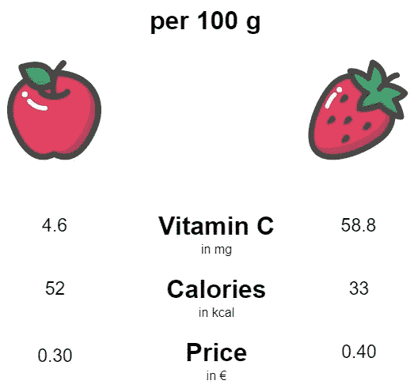
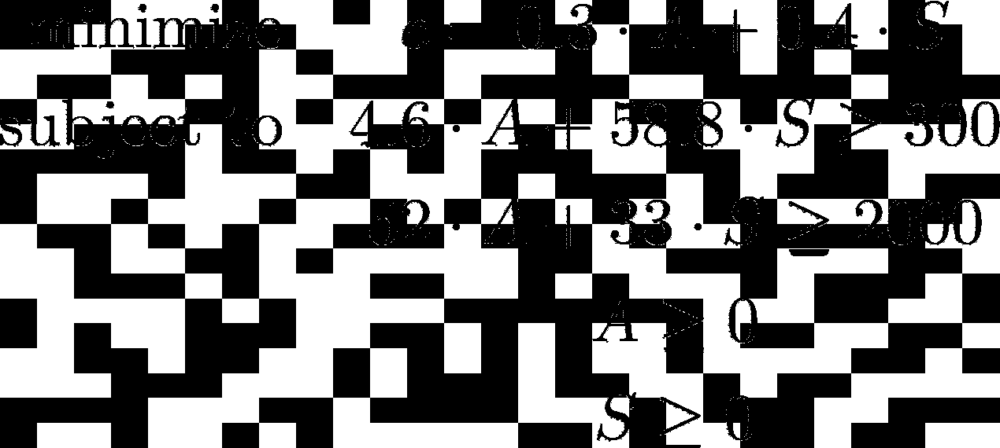
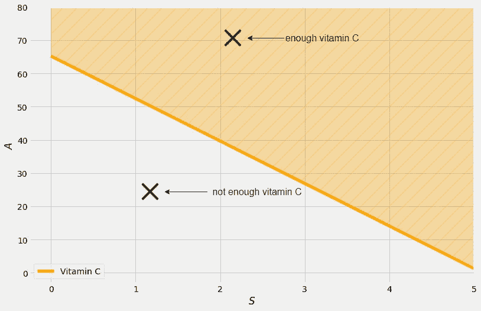
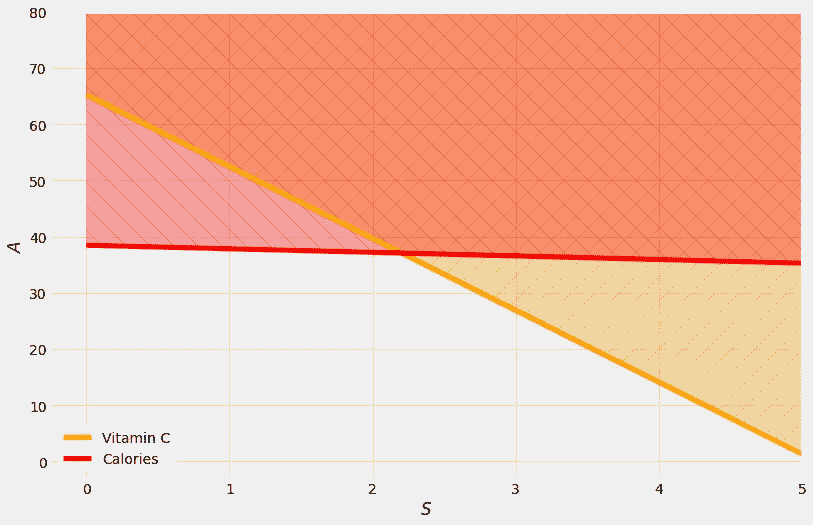
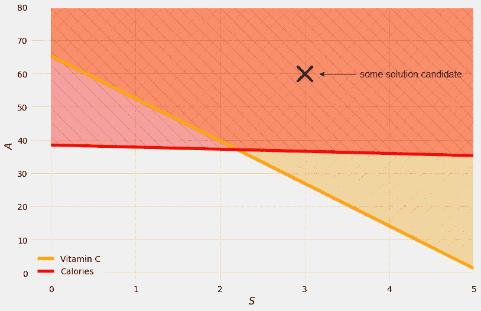
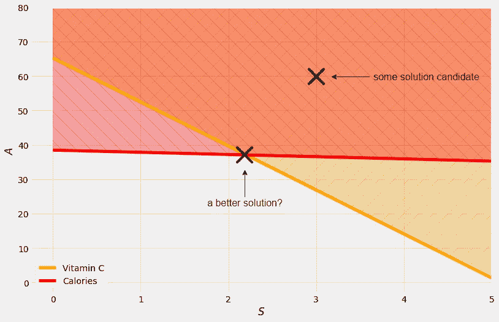

# 线性规划导论

> 原文：<https://towardsdatascience.com/introduction-to-linear-programming-b6647d20d5f6?source=collection_archive---------18----------------------->

## 识别线性程序问题并使用 CVXPY 在 Python 中解决它们


由 [Unsplash](https://unsplash.com?utm_source=medium&utm_medium=referral) 上的 [Karoline Stk](https://unsplash.com/@kstock?utm_source=medium&utm_medium=referral) 拍摄的照片

# 动机

想象一下，不管出于什么原因，你想只吃苹果和草莓。你并不真的偏爱一种水果，但你想确保你…

1.  摄入足够的维生素 C 和
2.  摄入足够的热量。

除了维生素 C 和卡路里含量不同，苹果和草莓的价格也不同。所以，很自然地，你会要求最便宜的**饮食，同时满足你的两个*约束*。**

# 数例

假设你想每天至少摄入 300 毫克的维生素 C(这太多了，但是这让问题变得更好)，以及至少 2000 卡路里的热量。水果数据如下所示:



图片由作者提供。

现在怎么才能找到苹果和草莓的最佳组合呢？从变量开始总是好的:我们将你每天消耗的苹果质量记为 *A* ，草莓质量记为 *S* (都以 100 克为单位)*。*由于 *A* 和 *S* 都是量，**应该都大于等于零**。

有了这些定义，我们就可以用 *A* 、 *S* 和价格:***c*= 0.3 **A*+0.4 **S***来写成本。 *c* 应该是最小化了，不过这个到目前为止很容易:*什么都不吃，花 0€。*然而，我们目前没有纳入我们的营养限制。分别是**4.6 **A*+58.8 **S*≥300**和**52 **A*+33 **S*≥2000**。饮食 *A* = 0， *S* = 0 违反了这些约束，因此不是解决方案。

> 上面的问题是一个简单的带有两个变量和四个约束的*线性规划*的情况，可以通过*线性规划*来解决。

用一种更简洁的表示法，我们必须解决以下问题:



图片由作者提供。

你可以在维基百科上找到[的确切定义。](https://en.wikipedia.org/wiki/Linear_programming)

> 注:*称之为线性规划是因为最小化项是线性的，* ***不是*** *是因为约束是线性的。*

有几种方法可以解决这个问题。为了获得一些直觉，我们将首先通过一个图解方法。这是唯一可能的，因为我们只有两个变量，可以画在平面上。在更高的维度中，我们需要使用不同的算法来解决问题。

# 图解法

我们能够画出我们所拥有的约束。例如，约束 4.6 **A*+58.8 **S*≥300**可以被可视化如下:**

****

**图片由作者提供。**

**粗橙线正好是等式 4.6 **A*+58.8 **S*= 300。因为我们有更大的等号，所以不仅线上的点，而且线上的每个点也遵守这个约束。**

**让我们加上卡路里限制:**

****

**图片由作者提供。**

**此外，我们有约束条件，A*和 S*和 *S* 应该是正数，但我就是这样限制情节的。这意味着我们搜索的解决方案**必须在右上区域**带有交叉阴影图案的某处，因为只有这些点考虑所有约束。我们称这个区域为*可行区域*。**

**好的，我们知道现在要去哪里找，但是目标是什么？**最小化 0.3* *A* + 0.4* *S* ！****

**我们现在可以从可行域中盲目地插入一些值，但是由于有无限多的点，我们不能期望得到正确的解。比如 *A* = 60， *S* = 3 就是候选。这种减肥法的成本是 0.3*60 + 0.4*3 = 19.2 €，由 6 公斤苹果和 300 克草莓组成。**

> **一天 6 斤苹果，让每个医生永远远离。**

****

**图片由作者提供。**

**你能想到更好的候选人吗？为了最小化成本，小值的 *A* 和 *S* 是有利的，那么我们如何从✖移动到底部和左侧呢？**

****

**图片由作者提供。**

**我们插上，点在 *A* = 37， *S* = 2.2 左右。这种减肥法的费用是 0.3*37 + 0.4*2.2 ≈ 12 €，比第一种减肥法便宜 7 €左右！作为一个很好的副作用，我们每天只需要吃 3.7 公斤的苹果。愿这是最好的解决方案？**

**嗯，是的！现在有一些很好的理论说:**

> **最优解总是在可行域的某个角落。**

**让我们检查一下另一个角，大约在 *A* ≈ 65， *S* = 0。这里的成本大约是 0.3*65 = 19.5 €，再次高于其他角落的成本。因此，我们用图解法找到了最优解。甚至没有那么难。**

# **使用 CVXPY 解决问题**

**正如我之前所说，我们可以解决它，因为我们有两个变量。在更高维度中，我们不能画一些线和检查角落。在这些情况下，我们需要依靠算法来解决这类问题。其中一些是 Dantzig 的[单纯形算法或](https://en.wikipedia.org/wiki/Linear_programming#Simplex_algorithm_of_Dantzig)[内点方法](https://en.wikipedia.org/wiki/Linear_programming#Interior_point)族，我在此不再描述。相反，让我们使用 Python 库 [**CVXPY**](https://www.cvxpy.org/) 来完成繁重的工作。**

**之后，你可以用下面几行来解决上面的饮食问题:**

```
import cvxpy as cp

A = cp.Variable()
S = cp.Variable()

objective = cp.Minimize(0.3*A + 0.4*S)

constraints = [
    4.6*A + 58.8*S >= 300,
    52*A + 33*S >= 2000,
    A >= 0,
    S >= 0
]

linear_program = cp.Problem(objective, constraints)

result = linear_program.solve()

print(f'A = {A.value:.2f}, S = {S.value:.2f}, costs = {result:.2f}')
```

**这个短程序输出 *A* = 37.06， *S* = 2.20，costs = 12.00，这证实了我们的图形解决方案确实是正确的！**

**看看 CVXPY 库的界面有多漂亮。没有比这更瘦的了。你告诉它最小化，并给出公式，你提供一个简单的约束列表，你可以很容易地写，你创建一个问题实例，然后你解决它。你可以清楚地看到我们之前用过的所有公式。**

**还有其他很棒的包装，另一个著名的是[果肉](https://coin-or.github.io/pulp/)。然而，我认为 CVXPY 语法仍然是最好的。**

# **结论**

**在本文中，我们已经看到，线性程序不是一种特殊风格的计算机程序，而是一个优化问题。我们制定了一个简单的玩具问题，并用两种不同的方法解决了它。**

1.  **最多只能处理两个变量的图解法，但易于理解和手动应用。**
2.  **隐藏在 CVXPY 等令人敬畏的高级线性程序库中的高级算法。**

**CVXPY 甚至可以解决比线性规划更一般的问题，比如最小化公式为二次的[二次规划](https://en.wikipedia.org/wiki/Quadratic_programming)。它还可以解决带有某些约束的线性程序，这些约束使求解变得更加困难，例如变量必须是**整数**，或者只能是 **0/1** 。这些问题甚至是 [NP-complete](https://en.wikipedia.org/wiki/NP-completeness) ，这通常意味着解决大型实例变得不可行。但是 [CVXPY](https://www.cvxpy.org/) 还是尽力了。**

**最后一点，当然，还有比我们讨论的更有趣的线性程序。例如，检查一下[斯蒂格勒饮食](https://en.wikipedia.org/wiki/Stigler_diet)，这是一个类似的问题，但是有更多的食物和营养。无论如何，你现在能够发现线性规划，并相应地采取行动解决它们！**

**我希望你今天学到了新的、有趣的、有用的东西。感谢阅读！**

****作为最后一点，如果你****

1.  ****想支持我多写点机器学习和****
2.  ****无论如何都要计划获得中等订阅量，****

****为什么不做** [**通过这个环节**](https://dr-robert-kuebler.medium.com/membership) **？这将对我帮助很大！😊****

**透明地说，给你的价格不变，但大约一半的订阅费直接归我。**

**非常感谢，如果你考虑支持我的话！**

> ***有问题就在*[*LinkedIn*](https://www.linkedin.com/in/dr-robert-k%C3%BCbler-983859150/)*上写我！***