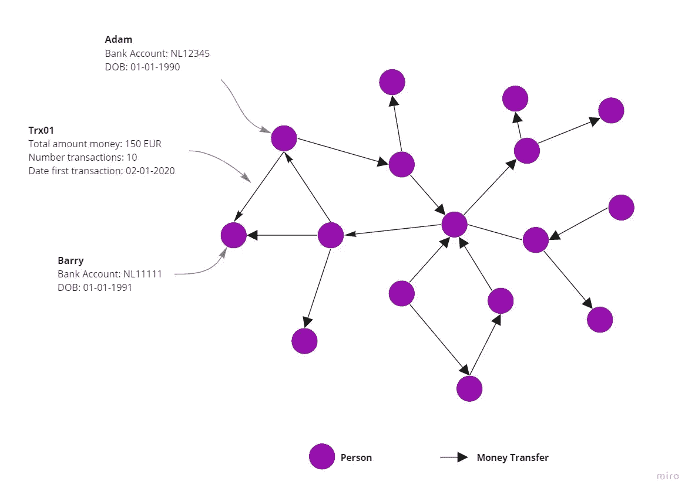

# 用图介绍机器学习

> 原文：<https://towardsdatascience.com/introduction-to-machine-learning-with-graphs-f3e73c38d4f8?source=collection_archive---------9----------------------->

## 这是一个关于机器学习的概念性介绍，包括图表和与这个研究领域相关的任务。

图片作者。

# 什么是图？

图是描述复杂系统中实体之间的关系和交互的数据结构。一般来说，一个图包含一组称为*节点*的实体和另一组称为*边的一对节点之间的交互。*节点代表实体，可以是与我们的问题领域相关的任何对象类型。通过用边连接节点，我们将得到一个节点图(网络)。此外，每个节点和边可能有*属性(或特征)*，包含关于那些实例的附加信息。

例如，如果我们想知道一家银行的客户根据他们的资金交易是如何相互关联的，那么我们可以将此建模为一个客户网络，这些客户通过整个客户数据集相互转移资金。在这个网络中，每个节点都是一个客户端，两个客户端之间的边表示这两个客户端曾经互相转账。节点属性可以是银行账号和出生日期。边缘属性可以是总金额、交易次数和第一次交易的日期。图一。显示了该网络的可视化效果。

图一。无向齐次图。图片作者。

## 无向图与有向图

不包含节点对之间相互作用方向的图称为*无向图(*[*Needham&Hodler*](https://neo4j.com/graph-algorithms-book/)*)。*图 1 的图形示例是无向图，因为根据我们的业务问题，我们感兴趣的是基于客户是否已经向彼此汇款来发现客户是否彼此相关。我们对谁是汇款人或收款人不感兴趣。因此，相互作用的方向无关紧要。然而，如果我们对谁是汇款人和收款人感兴趣，那么汇款的方向就很重要。包含一对节点之间交互方向的图称为*有向图*。我们通过在图的边缘放置箭头来形象化这一点。根据上面的例子，我们也可以将网络建模为一个有向图。在这种情况下，从节点 Adam 到 Barry 的箭头意味着钱已经从 Adam 转移到 Barry。因此，在这笔资金交易关系中，亚当是汇款人，巴里是受益人。图二。显示了这种情况。

图二。有向齐次图。图片作者。

## 同构与异构图形

另一种区分图形的方法是通过查看图形的节点类型。当图中的所有节点只有一个相同的类型时，那么这个图称为*齐次图。*上图 1 中的例子。是一个同构图形，因为所有节点都表示“person”类型。想象一下，银行的客户不全是个人，也包括公司。那么该图将包括代表“公司”的另一种类型的节点，这些“公司”具有它们自己的一组节点特征，例如商会编号和成立日期。拥有一种以上节点类型的图称为*异构图。*此外，还有不同类型边的图。这意味着在网络中，节点可以通过多种方式相互交互。这些图被称为*多关系*。有一点需要注意的是，在许多用例中，异构图中的边受到它所连接的节点类型的约束。因为某些交互只能发生在两个特定的节点类型之间。图三。显示了公司和个人之间的资金转移网络。该图包含边方向和异构节点。

图三。有向异构图。图片作者。

创建图表时，理解您试图解决的业务问题是关键，因为这将决定图表中的边是否应该有方向，以及它是同构的还是异构的。这很重要，因为当我们运行图算法来计算网络属性时，我们会在有向图和无向图上得到不同的结果。例如，当在无向支付交易网络模型上运行网络算法时，我们假设被转移的钱是双向的。这是极不可能的。

# 什么是带图的机器学习？

机器学习已经成为通过从历史数据中学习以发现模式和预测未来事件来解决问题的关键方法。当我们试图根据给定的输入标记数据预测目标输出值时，我们是在以*监督*的方式处理问题。如果目标是在我们的数据中发现模式，我们经常为此创建数据点的聚类，那么我们的方法就是所谓的*无监督*。使用图形的机器学习融合了这种区别，因为在处理问题时存在两个关键差异。

**带图的 ML 从数据点之间的连接中学习**
带图的机器学习与传统(无监督)方法之间的第一个关键区别是，后者从单个数据点的属性中学习。这些属性或特征不包括关于各个数据点如何相互连接的信息，而关于数据点之间关系的属性提供了描述数据集的有价值的信息。在图形中，这些数据点由节点表示，关于关系的信息在网络的边中捕获。然而，传统的机器学习方法需要数据科学家手动挑选信息，并在机器学习开发周期的“特征工程”步骤中将它们转化为特征([汉密尔顿](https://www.cs.mcgill.ca/~wlh/grl_book/))。

**带图的 ML 是半监督学习**
第二个关键区别是，带图的机器学习试图解决监督和非监督模型试图解决的相同问题，但训练期间是否有标签的要求不是严格强制的。通过对图进行机器学习，我们采用完整的图来训练模型，这也包括所有未标记的节点。尽管这些节点中的某些节点上的标签丢失了，但是我们仍然可以使用测试集中关于邻域节点和边的所有信息来在训练期间改进模型。这与监督模型明显不同，监督模型在训练期间不包括未标记的数据。在这种情况下，图上的机器学习使用标记和未标记的数据来训练模型，因此通常被称为*半监督* ( [汉密尔顿](https://www.cs.mcgill.ca/~wlh/grl_book/))。这里我想指出的是，半监督学习并不仅仅是图上的机器学习。有一个公平的研究和应用领域致力于生成模型，该模型可以从未标记的数据中学习，以提高监督分类器的性能。

最近被充分研究和应用的带有图的机器学习技术可以粗略地分为三个任务:节点嵌入、节点分类和关联预测。我将概括地描述这些任务，说明它们需要什么以及如何在实践中使用它们。

## 节点嵌入

创建节点嵌入是聚集节点在图中的位置及其本地邻居的信息的任务。这个聚集过程产生一个编码的特征向量，称为*节点嵌入*，它概括了一个节点的属性及其与本地邻居节点的关系。在许多情况下，获得节点嵌入是实现带有图形的机器学习模型的第一步。通常，在训练期间，作为附加特征，所得到的节点嵌入将被传递到另一个下游机器学习模型中。这里的直觉是，添加节点嵌入将提高下游模型的模型性能，因为它包含关于数据点的基础结构信息，这些数据点不是用模型的初始特征集捕获的( [Hamilton，应& Leskovec](https://arxiv.org/abs/1709.05584) )。

图 4。生成节点嵌入。图片作者。

例如，让我们从上面亚当和巴里之间的交易数据，并应用随机森林分类器来确定一个人是否是一个骗子。一般来说，典型的机器学习生命周期将从使用一些特征工程技术将原始数据转换为结构化数据开始，这些技术允许我们将这些特征传递到我们的随机森林模型中以预测标签。然而，通过节点嵌入的任务，我们正在学习交易网络中每个人的特征表示。然后，我们像所有其他特征一样，将该节点作为特征向量嵌入到我们的随机森林模型中，并照常预测标签。参见图 5。最近的应用表明，网络特征与常规特征的结合可以大大提高性能。

图五。结合常规特征使用节点嵌入作为下游随机森林分类器的输入特征向量。图片作者。

## **节点分类**

上面我们已经看到了如何通过将节点嵌入作为输入特征向量添加到随机森林模型中来改进机器学习模型。然而，也可以直接从图结构数据中对节点标签进行分类，而不依赖于下游的机器学习模型。这个任务叫做*节点分类。*节点分类的目标是基于每个节点与其他邻居节点的关联来预测每个节点的标签。真正的标签只包含在整个图形的子集上。因此，给定一个部分标记的图，预测没有标记的节点的标记。

例如，如果我们要对一个野生动物交易网络进行建模，以识别非法交易活动和交易方，那么在这个图中，每个节点都可以是买方或卖方，而一条边则代表这些买方和卖方之间的交易。节点属性可以包括姓名、出生日期和银行账号，而边属性可以包括产品名称、贸易单据号和价格。假设根据报告的数据，一部分卖家被标记为非法交易者。在这种情况下，节点分类旨在预测未被标记的交易者是否应该被标记为非法。它通过调查网络中其他人的交易行为来做到这一点。具有相似特征的节点以及被标记为非法的节点的边也更有可能是非法的。参见图 6。

图六。节点分类:给定一个带有标记和未标记节点的图，根据其节点特征和其邻域节点预测无标记节点。图片作者。

## **链接预测**

*链接预测*的任务是确定一个图中两个节点之间链接的概率(【詹】&陈)。执行这项任务的一类众所周知的方法叫做启发式方法。这些方法基于它们的试探法(例如图形距离、公共邻居或 Pagerank)来计算两个节点之间的相似性得分。启发式方法基本上揭示了图形、节点和边在某一时间点的属性。我们可以从图中直接计算这些属性，以获得每个节点对的相似性得分。之后，我们根据节点对的相似性得分对其进行排序，并预测得分最高的节点对之间应该存在一条边。最后，我们通过检查初始时间框架中不存在的边是否在稍后的时间点出现来评估我们的预测。

启发式方法的一个缺点是，它假设当两个节点有共同的邻居时，它们更有可能连接。当该图表示一个社会网络(如上面的非法野生动物交易示例)时，可能会出现这种情况，但例如，在蛋白质相互作用网络中，共享许多共同邻居的两个蛋白质不太可能相互作用( [Hamilton](https://www.cs.mcgill.ca/~wlh/grl_book/) )。这里的挑战是确定我们应该使用哪种启发式方法来计算对我们的用例有意义的相似性得分。最近的研究表明，我们实际上可以了解这种启发式方法应该如何优化我们的链接预测。这个想法是，我们为每条边取封闭节点，并为这些节点生成一个嵌入。然后，我们将这两个节点嵌入传递到一个连接(或求和、平均、距离等)的函数中。)将它们转换成新的特征向量，并将其传递给下游的二元分类器。参见图 7。

图 7。链接预测:给定一个节点对，它们之间没有链接，根据它们的节点特征和邻域节点预测它们将来是否会连接。图片作者。

# 结论

图形分析侧重于调查数据集中数据点之间的关系。将数据结构表示为图形使我们能够发现关系和模式，如果我们围绕孤立的数据点对数据建模，这些关系和模式可能会被忽略。图上的机器学习帮助我们对这样的图结构进行编码，这些图结构可以被机器学习模型进一步利用([汉密尔顿](https://www.cs.mcgill.ca/~wlh/grl_book/))。

# 来源

【https://www.cs.mcgill.ca/~wlh/grl_book/】图表示学
[图表示学](https://www.cs.mcgill.ca/~wlh/grl_book/)

**图的表征学习:方法与应用** [https://arxiv.org/abs/1709.05584](https://arxiv.org/abs/1709.05584)

**基于图神经网络的链接预测**[https://papers . nips . cc/paper/2018/file/53f 0d 7 c 537d 99 b 3824 f 0f 99d 62 ea 2428-paper . pdf](https://papers.nips.cc/paper/2018/file/53f0d7c537d99b3824f0f99d62ea2428-Paper.pdf)

**图算法** [https://www . oreilly . com/library/view/Graph-Algorithms/9781492047674/](https://www.oreilly.com/library/view/graph-algorithms/9781492047674/)