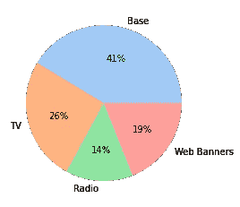

# Python 市场营销组合建模简介

> 原文：<https://towardsdatascience.com/introduction-to-marketing-mix-modeling-in-python-d0dd81f4e794?source=collection_archive---------1----------------------->

## [营销分析](https://medium.com/tag/marketing-analytics)

## 哪些广告支出真正推动了你的销售？


[蒂姆·约翰逊](https://unsplash.com/@mangofantasy?utm_source=medium&utm_medium=referral)在 [Unsplash](https://unsplash.com?utm_source=medium&utm_medium=referral) 上拍照

# 广告入门

为了维持一家公司的运营，在广告上花钱是至关重要的——无论这家公司是小公司还是老牌公司都是如此。这个行业的广告支出是巨大的:


来源:[https://www . webstrategiesinc . com/blog/how-much-budget-for-online-marketing-in-2014](https://www.webstrategiesinc.com/blog/how-much-budget-for-online-marketing-in-2014)，**文章更新于 2020 年)**

这些数量使得明智地使用每一美元广告成为必要。然而，说起来容易做起来难，正如美国零售业巨头约翰·沃纳梅克或英国实业家勒弗胡尔姆勋爵在大约一百年前所说的:

> “我花在广告上的钱有一半都浪费了；问题是我不知道是哪一半。”

你可能认为现在这已经不是什么问题了，但奇怪的是，它仍然存在。幸运的是，我们能够访问大量数据和强大的计算机，通过高级分析来改变这种状况，如**归因建模**或**营销组合建模**。在本文中，我们将关注后者，因为它有一个很大的优势，那就是它在我们即将进入的 [**无烹饪世界**](https://www.gartner.com/en/marketing/insights/articles/three-steps-for-marketers-to-prepare-for-a-cookieless-world) 中工作。

# 示例数据集和简单建模

现在想象一下，你负责某家知名公司的营销预算。为了增加销售额，你在三个不同的*广告渠道打广告:*

*   **电视**，
*   **无线电**和
*   **网页横幅**。

## 数据

每周，你决定在每个频道上花多少钱，或者不花。此外，你可以观察每周的销售额。200 周收集的数据可能如下所示:


图片由作者提供。

表格中的所有数字都是你选择的货币，从现在开始我将使用€。 [**你可以在这里得到上面的文件。**](https://github.com/Garve/datasets/blob/4576d323bf2b66c906d5130d686245ad205505cf/mmm.csv)

从上面的小偷偷看，我们可以看到有很多周没有电视广告(71%)，也有一些没有广播广告(54%)。只有大约 24%的调查对象禁用了网页横幅，这使其成为最常用的渠道。

然而，当我们进行电视广告支出时，它们往往高于广播广告支出，而广播广告支出又高于网络横幅广告支出。再者，一直都有销售。

现在，在开始建模之前，让我们先明确目标。

## 目标

最终，我们希望能够回答以下问题

> 截至 2021 年 10 月 10 日的一周，€15，904.11 英镑的销售额中有多少是由电视广告产生的？广播和网络横幅广告的费用是多少？基线是什么，也就是说，如果没有任何广告，我们会有多少销售额？



潜在的结果。图片由作者提供。

如果我们的模型可以做到这一点，我们也可以用它来计算投资回报率和优化支出，这是公司最终想要的。考虑到这个目标，我们可以将自己限制在**加法**模型，即

> 销售额= f(电视)+ g(广播)+ h(横幅)+基数

因为他们让我们轻松分解销售。销售额只是某个仅依赖于电视支出的函数、另一个仅依赖于广播支出的函数、另一个仅依赖于网络广告支出的函数和(恒定)基线的总和。

诸如**随机森林**、**梯度提升、**或(简单前馈)**神经网络**之类的模型**在这里并不合适**，因为我们无法从它们那里得到这样的分解。

> ***注:*** *当然，有*种*做我们想做的事情的沙普利价值观，但往往按照沙普利价值观的贡献是负数，这是营销人不愿意听到的不合理的东西。*

给我们每个通道一个加性贡献的候选是一个老朋友——线性回归，加性模型最简单的代表！

**你可以在这里找到更详细模型的后续文章:**

> [**https://towardsdatascience . com/an-upgraded-marketing-mix-modeling-in-python-5 ebb 3 bddc 1b 6**](/an-upgraded-marketing-mix-modeling-in-python-5ebb3bddc1b6)

## 通过线性回归建模

将上述数据存储在变量`data`中后，我们执行以下操作:

```
from sklearn.linear_model import LinearRegression
from sklearn.model_selection import cross_val_score, TimeSeriesSplit
import pandas as pd

data = pd.read_csv(
    'https://raw.githubusercontent.com/Garve/datasets/4576d323bf2b66c906d5130d686245ad205505cf/mmm.csv',
    parse_dates=['Date'],
    index_col='Date'
)

X = data.drop(columns=['Sales'])
y = data['Sales']

lr = LinearRegression()

print(cross_val_score(lr, X, y, cv=TimeSeriesSplit()))

# Output: [0.69594303 0.69302285 0.66850729 0.78807363 0.73512387]
```

> ***注:*** *我们这里不使用标准的* k *-fold 交叉验证，因为我们处理的是时间序列数据。* `*TimeSeriesSplit*` *是比较合理的做法，可以在这里*[](https://scikit-learn.org/stable/modules/cross_validation.html#time-series-split)**了解更多。**

*嗯，这看起来已经很合理了，尽管还可以做得更好。但是这种模式让我们可以随心所欲地拆分销售，因为公式很简单*

> *销售额= 0.36 *电视+ 0.49 *广播+ 1.23 *横幅+ 6678.40*

*我们可以通过一个简单的*

```
*lr.fit(X, y) # refit the model with the complete dataset

print('Coefficients:', lr.coef_)
print('Intercept:', lr.intercept_)

# Output:
# Coefficients: [0.35968382 0.48833246 1.2159193 ]
# Intercept: 6678.396933606161*
```

## *分解销售*

*为了说明贡献的计算，让我们考虑一周:*

**

*图片由作者提供。*

*让我们把数字代入，看看我们会得到什么:*

```
*print(lr.predict(([[11543.58, 4615.35, 2518.88]])))

# Output: [16147.01594158]*
```

*这并不完全是上表中 15904.11 的正确答案，但现在让我们坚持下去。我们现在可以看到，电视的(未经调整的)贡献是*

> *coef _ TV * spendings _ TV = 0.36 * 11543.58 = 4155.69，*

*并且相应地用于其他通道。现在，贡献总计为模型预测 16147.0159，这不是 15904.11 的真正目标，因此让我们将贡献和基线乘以修正因子 correction _ factor = 15904.11/16147.0159≈0.985，一切都很好。我们得到了*

> *贡献 _TV =修正 _ 因子* 4155.69 = 4089.57。*

*我们也得到*

*   *贡献 _ 无线电= 2219.92 和*
*   *贡献 _ 横幅= 3016.68*
*   *基数= 6577.93。*

*把所有东西加起来就产生了我们想要的观察标签:*

> *4089.57 + 2219.93 + 3016.68 + 6577.93 = 15904.11.*

*我们可以为所有观察值生成一个很好的贡献图，如下所示:*

```
*weights = pd.Series(
    lr.coef_,
    index=X.columns
)

base = lr.intercept_

unadj_contributions = X.mul(weights).assign(Base=base)

adj_contributions = (unadj_contributions
                     .div(unadj_contributions.sum(axis=1), axis=0)
                     .mul(y, axis=0)
                    ) # contains all contributions for each day

ax = (adj_contributions[['Base', 'Banners', 'Radio', 'TV']]
      .plot.area(
          figsize=(16, 10),
          linewidth=1,
          title='Predicted Sales and Breakdown',
          ylabel='Sales',
          xlabel='Date')
     )

handles, labels = ax.get_legend_handles_labels()
ax.legend(
    handles[::-1], labels[::-1],
    title='Channels', loc="center left",
    bbox_to_anchor=(1.01, 0.5)
)*
```

*输出是:*

**

*图片由作者提供。*

*我们可以看到(或计算出)基线是每天大约 6500 次销售，横幅广告和广播活跃时平均贡献大约 2500 次，电视活跃时大约 3500 次。不错！*

## *计算投资回报(ROI)*

*我们现在可以确定哪个渠道在 ROI 方面是最好的，ROI 是一个衡量效率的数字。公式很简单:*

> *channel_ROI =渠道销售额/渠道支出*

*有了上面的代码片段，我们已经拥有了计算所需的所有数据。您可以按如下方式计算电视投资回报率:*

```
*sales_from_tv = adj_contributions['TV'].sum()
spendings_on_tv = data['TV'].sum()
tv_roi = sales_from_tv / spendings_on_tv
# tv_roi is around 0.36*
```

*就这么简单。投资回报率小于 1 意味着渠道表现不佳。对于电视投资回报率，我们可以说:*

> *我们在电视上每花 1 €，就能得到 36 美分的回报。*

*如果我们想让公司生存下去，这种交易就不要做得太频繁。另一方面，横幅广告的投资回报率为 1.21，这要好得多，看起来这个渠道在我们考虑的时间段内工作得相当好。*

## *这个简单方法的问题*

*虽然上述方法似乎合理，但它有一些我们必须解决的缺点:*

1.  *表演可以更好。有时候，我们对糟糕的表现无能为力，因为它在很大程度上取决于数据，但无论如何我们都应该尽力而为。*
2.  *更严重的是:模型本身绝对不能反映现实。根据线性公式，我们可以通过在广告上花费越来越多的钱来推动销售。由于横幅广告的系数很高，为 1.23，因此我们在该渠道中每花费 1 €，就会产生 1.23 €的额外销售额。重复无限的钱，客户会讨厌这种伎俩！*
3.  *优化也变得琐碎和不现实。为了实现销售最大化，我们现在将把所有资金投入到网络横幅广告渠道，因为它的系数最高。我们将完全放弃电视和广播广告，如果公司想在人们中保持知名度，这可能不是正确的做法。*

*我们将在后续文章中解决所有这些问题，敬请关注！*

# *总结与展望*

*我们已经看到，公司将收入的很大一部分用于广告，以鼓励客户购买他们的产品。然而，有效地使用营销预算并不容易，无论是一百年前还是今天。要弄清楚某个电视广告支出对销售的影响有多大，并由此确定广告支出是否值得，以及如何在下次进行优化，这并不容易。*

*为了解决这个问题，我们创建了一个小型营销组合模型，允许我们将观察到的销售分成几部分:电视、广播、横幅和基本份额。这些渠道贡献让我们可以计算投资回报率，从而了解每个渠道的表现。*

*然而，这种模型过于简单，无法捕捉现实，这就产生了许多问题。但是，我们将学习如何通过使模型稍微复杂一些，但仍然可以解释来规避这些问题。*

***你可以在这里找到后续文章:***

*[](/an-upgraded-marketing-mix-modeling-in-python-5ebb3bddc1b6) [## Python 中升级的营销组合建模

### 让我平庸的营销组合模式更加强大

towardsdatascience.com](/an-upgraded-marketing-mix-modeling-in-python-5ebb3bddc1b6)* 

*我希望你今天学到了新的、有趣的、有用的东西。感谢阅读！*

***作为最后一点，如果你***

1.  ***想支持我多写点机器学习和***
2.  ***无论如何，计划获得一个中等订阅，***

***为什么不通过此链接**[](https://dr-robert-kuebler.medium.com/membership)****？这将对我帮助很大！😊*****

****说白了，给你的价格不变，但大约一半的订阅费直接归我。****

***非常感谢，如果你考虑支持我的话！***

> ****有问题就在* [*LinkedIn*](https://www.linkedin.com/in/dr-robert-k%C3%BCbler-983859150/) *上写我！****