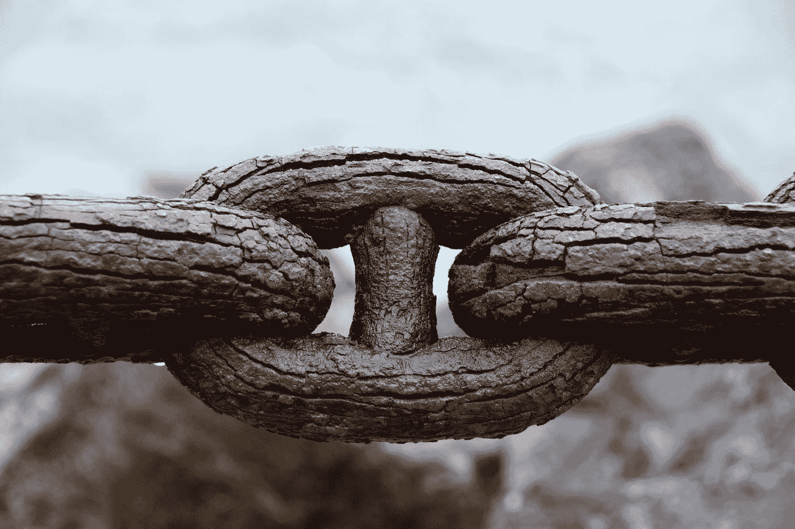
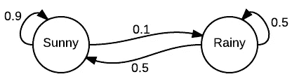
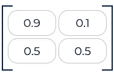

# 马尔可夫链编程导论

> 原文：<https://towardsdatascience.com/introduction-to-markov-chain-programming-8ddbe0ac1c84?source=collection_archive---------8----------------------->

## 什么是马尔可夫链，为什么有用，如何实现

想象以下场景:你想知道明天的天气是晴天还是雨天。现在，根据你的经验和对天气的历史观察，你可能会有一种自然的直觉。如果过去一周天气晴朗，那么你有 90%的把握明天也会是晴天。但是，如果前一周左右的天气一直是阴雨连绵，那么明天是晴天的可能性就不太好了:只有 50%的可能性。这个场景可以描述为一个 ***马尔可夫链*** 的过程。



[邵杰](https://unsplash.com/@neural_notworks?utm_source=medium&utm_medium=referral)在 [Unsplash](https://unsplash.com?utm_source=medium&utm_medium=referral) 上拍照

# 什么是马尔可夫链？

但是什么是马尔可夫链呢？马尔可夫链是一个数学系统，它描述了根据某些随机或概率规则从一个状态到另一个状态的转换的集合。

以我们之前预测第二天天气的场景为例。如果今天天气晴朗，那么根据我们(可靠的)经验，明天天气转变为雨天的概率是 10%，晴天的概率是 90%。另一方面，如果目前天气是多雨的，那么明天保持多雨和晴朗的概率是 50%。

> 不同状态之间的这些变化(或没有变化)被称为转变，而感兴趣的变量(即雨天或晴天)被称为状态。



遵循马尔可夫规则的天气转变

然而，对于这些转移来说，要成为马尔可夫链，它们必须满足**马尔可夫性质**。属性声明转移的概率完全只取决于当前状态，而不取决于前面的序列集。这个特性允许马尔可夫链**无记忆**。

# **为什么是马尔可夫链？**

既然我们已经讨论了什么是马尔可夫链，我们来讨论一下*为什么*值得去熟悉。马尔可夫链在现实世界的过程中有许多应用，例如博弈论、物理学、经济学、信号处理、信息论等等。

此外，这个看似简单的过程是许多更复杂的随机模拟方法的基础，如马尔可夫链蒙特卡罗(MCMC)或隐马尔可夫链。此外，马尔可夫链是许多现代数据科学技术的前身，例如贝叶斯统计的构建模块之一。

总之，马尔可夫链将成为你理解数据科学中更高级的统计建模技术的良好起点。因此，当务之急是通过数学理解来理解马尔可夫过程的基础知识，并对其算法实现进行编码。

# **关于马尔可夫链的更多信息:数学定义**

马尔可夫链模型将状态转移的概率表示为一个 ***转移矩阵*** *。*如果系统有 **N** 个可能的状态(例如 **N** =2 用于我们的天气预测情况)，那么转移矩阵将有一个 **N x N** 形状的转移矩阵。随后，矩阵的单个条目 **N(i，j)** 将指示在**状态 I 和状态 j** 之间转换的概率。

对于我们的天气预测情况，转移矩阵，*可以表示为:*

**

*转移矩阵， **T** ，用于天气预报问题*

> *如果你想确定多个阶段的概率，比如说在接下来的 *M* 天*内天气会下雨，会发生什么？你可以简单地把转移概率提高到 m 的幂。**

# ***编程马尔可夫链***

*让我们试着用 Python 编写上面的例子。*

1.  *导入必要的库*

```
*import numpy as np
import random as rm*
```

*2.定义状态及其概率(**注意**:确保每行的总概率总和为 1)*

```
*states = ["sunny", rainy"]
transitions = [["SS", "SR"],["RS", "RR"]]T = [[0.9, 0.1],[0.5, 0.5]]*
```

*3.让我们编写(相当乏味的)马尔可夫链函数来预测未来 **n** 天的天气！(**注意**:你可能应该寻找更好的 Python [库](https://pypi.org/project/PyDTMC/)，它抽象了马尔可夫链的实现)。*

*4.比如说，在接下来的 5 天里运行这个程序。*

```
*future_weathers = weather_forecast(n_days = 5)*
```

# *结论*

*我们已经描述性地和正式地讨论了什么是马尔可夫链，以及为什么学习它的基本原理是重要的。我们还从头开始编写了一个非常基本的马尔可夫过程。既然您已经熟悉了马尔可夫链的工作原理，那么您可以深入研究更复杂的随机建模技术，比如隐马尔可夫过程或 MCMC。更多这些后续内容敬请期待！*

****做订阅我的邮件简讯:***[*【https://tinyurl.com/2npw2fnz】*](https://tinyurl.com/2npw2fnz)****在那里我定期用通俗易懂的英语和漂亮的可视化总结 AI 研究论文。*****