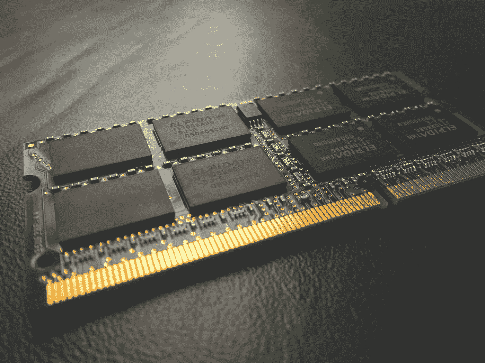
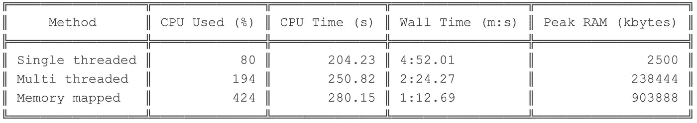

# 内存映射 IO 简介

> 原文：<https://towardsdatascience.com/introduction-to-memory-mapped-io-3540454770f7?source=collection_archive---------11----------------------->

## 利用内存映射 IO 实现超高速并行文件写入



[附身摄影](https://unsplash.com/@possessedphotography?utm_source=unsplash&utm_medium=referral&utm_content=creditCopyText)在 [Unsplash](https://unsplash.com/s/photos/ram?utm_source=unsplash&utm_medium=referral&utm_content=creditCopyText) 上拍照

# 什么是内存映射文件？

[内存映射文件](https://en.wikipedia.org/wiki/Memory-mapped_file)是**虚拟内存**中的一段。虚拟内存是物理内存的抽象，由 ***操作系统*** (OS)提供给 ***进程*** 。如果操作系统耗尽内存或看到某个进程长时间空闲，这些虚拟内存段将被“**分页**”到物理磁盘位置上(“**交换**”)。所以“**交换**本质上是磁盘上的那部分虚拟内存。

**更准确地说，内存映射文件是完全由操作系统管理的虚拟内存上的部分(或全部)文件的镜像**。

换句话说，每当一个文件被内存映射时，操作系统会立即将文件内存映射到虚拟内存上的一个区域。你可以认为这是一些内存空间。每当操作系统将文件内容转储到磁盘(以容纳另一个任务)时，就会发生[页面错误](https://en.wikipedia.org/wiki/Page_fault)。这时操作系统会返回并将内容重新加载到 RAM 中。但是我们的程序将永远看不到这种变化，而是在 ***内存映射 IO*** 中面临偶尔的延迟。

> 在本文中，我将只讨论内存映射写。下次再读！我将以一个生物信息学相关的任务作为运行实例。请随意将它转换到您自己的领域并进行尝试。

# 内存映射文件写入的额外好处

使用或不使用内存映射文件有很多理由。我只谈优点！

**并行性:**内存映射区可以认为是一个巨大的字节数组。所以你可以从尽可能多的线程中写/读。或者甚至在进程之间共享。只要不出现竞态条件。

**性能:**内存映射写入通常很快，因为不使用流/文件缓冲区。操作系统执行实际的文件写入，通常一次写入几千字节的数据块。

> 不利的一面是，除非你按顺序写，否则可能会有页面错误减缓你的程序。

# 开始编码吧！


照片由[丹尼尔·伊德里](https://unsplash.com/@ricaros?utm_source=unsplash&utm_medium=referral&utm_content=creditCopyText)在 [Unsplash](https://unsplash.com/s/photos/programming?utm_source=unsplash&utm_medium=referral&utm_content=creditCopyText) 拍摄

在这个例子中，我们的任务如下:

*给定 100 万个 DNA 序列，将其矢量化，并以文本形式写入，用于未来的机器学习任务。注意，每个向量具有 136 维的固定大小，并且使用函数* `*vectorize(sequence)*` *来获得，因为它是如何完成的并不相关。为了使它更有趣，让我们从单线程的常规文件写入开始，逐步改进我们的程序。*

## 单线程操作

我们将简单地读取序列并进行矢量化。得到的向量将被转换成一个字符串，并写到输出缓冲区。概要 C++代码可在[这里](https://gist.github.com/anuradhawick/b80513dfb7f555f68d73698151acfe4e)获得。

```
while (seq := has_sequence(input_file))
    vector := vectorize(seq)
    output << to_string(vector)
```

## 多线程操作

在多线程操作中，我们需要确保输出和输入的顺序相同。否则，我们可能会忘记哪个数据点是哪个数据点。因此，我将使用一个数据队列进行读取，并使用一个消费者进行批处理和并行处理。这两个过程是异步发生，因此队列总是满的。

```
Queue = {}thread_1
while (seq := has_sequence(input_file) and Queue.size() < 20000)
    Queue := Queue + seqthread_2
while Queue.size() != 0
    batch := dequeue(Queue, 10000 items)
    batch_vectors := vectorize_batch(batch)
    output << to_string(batch_vectors)
```

注意，为了清楚起见，我省略了互斥和其他细粒度的同步技巧。概要 C++代码可在[这里](https://gist.github.com/anuradhawick/222c1024972d9a10ea32deeb09847a91)获得。我使用了条件变量来访问队列和终止线程。

## 存储器映射操作

关于内存映射操作，有一些事情需要记住。当创建一个新的内存映射文件时，我们必须指定一个大小。这是因为我们不能动态地增加操作系统分配给我们的区域(我们可以通过复制来增加大小，比如调整数组大小。这可能非常慢)。因此，我们需要对总产出规模有一个概念。这对我们来说很容易，因为我们知道向量的大小。我们还可以通过在数据集上快速迭代一次来获得数据项的总数。所以我们的代码如下:

```
num_sequences := iterate_once_get_seqs()
vector_size := 136
float_size := 8 
size_of_line := vector_size * (float_size + 1)
size_of_file := size_of_line * num_sequences
mmap_file := mmap.open(output, size_of_file, write_mode)
```

请注意，此时我们已经创建了一个内存映射文件。我们固定了浮点值的长度(要么填充零，要么截断十进制精度)。让我们在以固定宽度方式书写时变得容易。

```
vectorize_function:
   lock(mutex)
   seq := has_sequence(input_file)
   unlock(mutex)
   if (seq):
       vec := vectorize(seq)
       mmapfile.write(**offset**, to_string(vec))thread_pool(many threads)for _ in range(num workers)
    thread_pool.add_worker(vectorize_function, mmapfile)
```

注意，我们有一个**偏移**参数。这可以通过下面的等式获得:

```
offset := size_of_line * sequence_id
```

序列 id 是数据集中从零开始的序列的索引。我们将把内存映射文件指针从开始增加到偏移量，并在该偏移量处复制字符串向量。操作系统会处理剩下的事情。

> 注意，我们在文件读取时只有一个互斥体！不再有阻塞的调用或序列的批处理。

# 每种方法的性能

我使用了`/usr/bin/time -v program.o`命令来获得每种方法使用的 CPU 和 Wall 时间。结果如下。



作者图片

请注意，CPU 使用率从 80%增加到了 420%。它几乎是批处理多线程方法的两倍。CPU 时间几乎保持不变，因为我们要做的计算量大致相同。墙壁时间减少到四分之一。然而，由于操作系统将内存映射文件保存在 RAM 中，RAM 的使用从 2MB 增加到了近 1GB。因为我有足够的内存，操作系统似乎一直在内存中维护文件。使用 linux `diff`命令验证了结果。

我们几乎用光了我电脑的全部 4 个内核！这是一个胜利！也节省了很多时间。


由[卢卡斯·布拉塞克](https://unsplash.com/@goumbik?utm_source=unsplash&utm_medium=referral&utm_content=creditCopyText)在 [Unsplash](https://unsplash.com/s/photos/time?utm_source=unsplash&utm_medium=referral&utm_content=creditCopyText) 拍摄的照片

# 结束语

我们可以通过使用各种其他技巧(比如使用内存映射来读取文件)来进一步优化这个程序。然而，收益是以额外的工作和编码为代价的。在这个例子中，我使用了 C++ Boost 库(`#include <boost/iostreams/device/mapped_file.hpp>`)。Boost 有一个可移植的内存映射扩展，它可以帮助你忘记你运行的平台。

Python 也有类似的实现(参考[文档](https://docs.python.org/3/library/mmap.html))。因此，即使对于 python 程序员来说，这也应该相当简单。

我希望你喜欢阅读这篇文章，并相信这些知识将有助于编写更好更快的程序。在下面找到完整的项目(面向生物信息学家)；

<https://github.com/anuradhawick/seq2vec>  

祝您愉快！😃