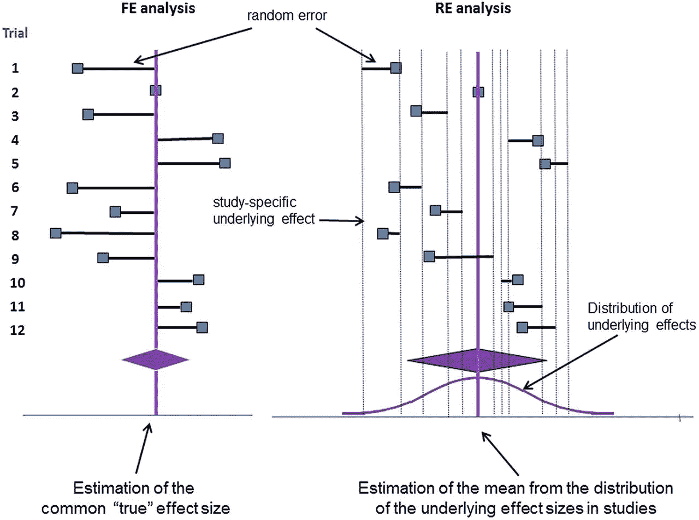
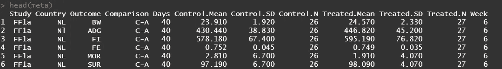
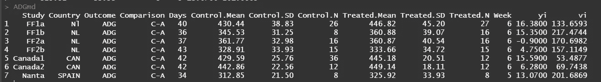
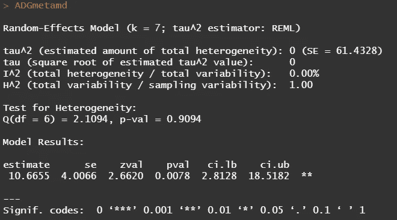
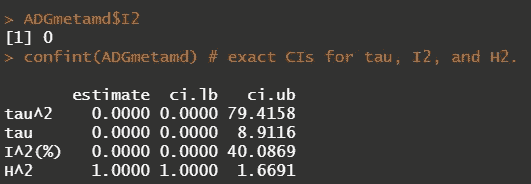
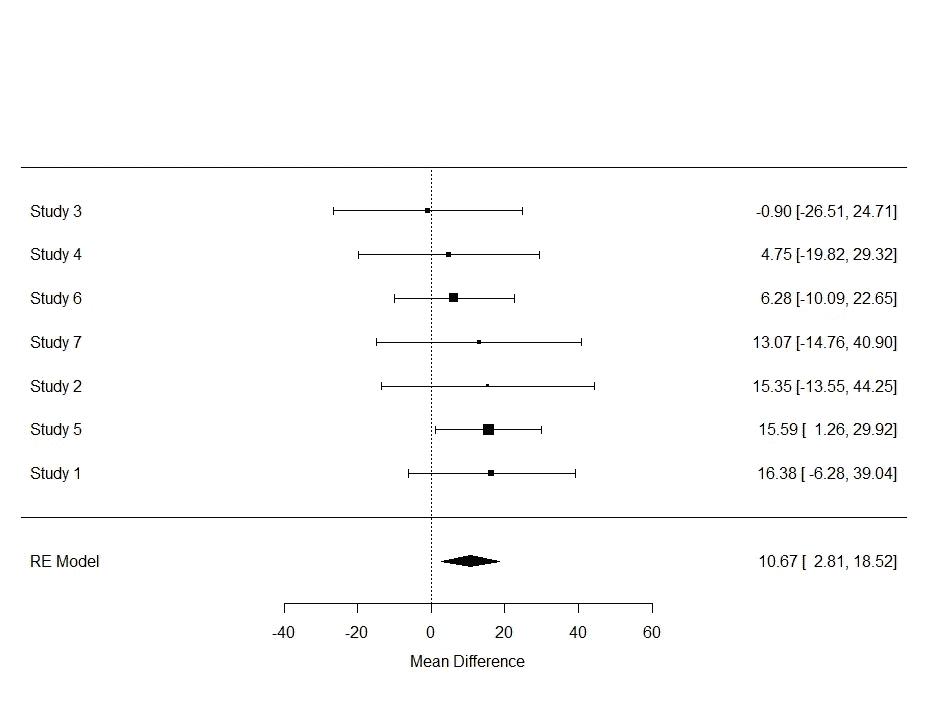
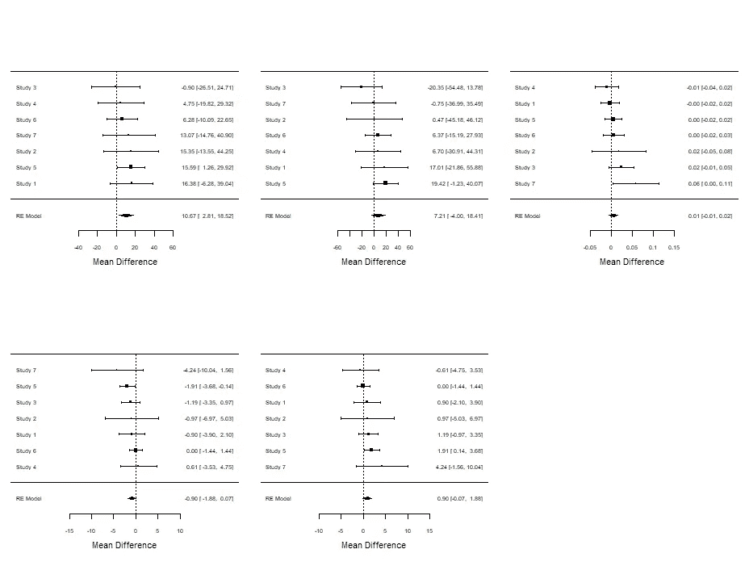
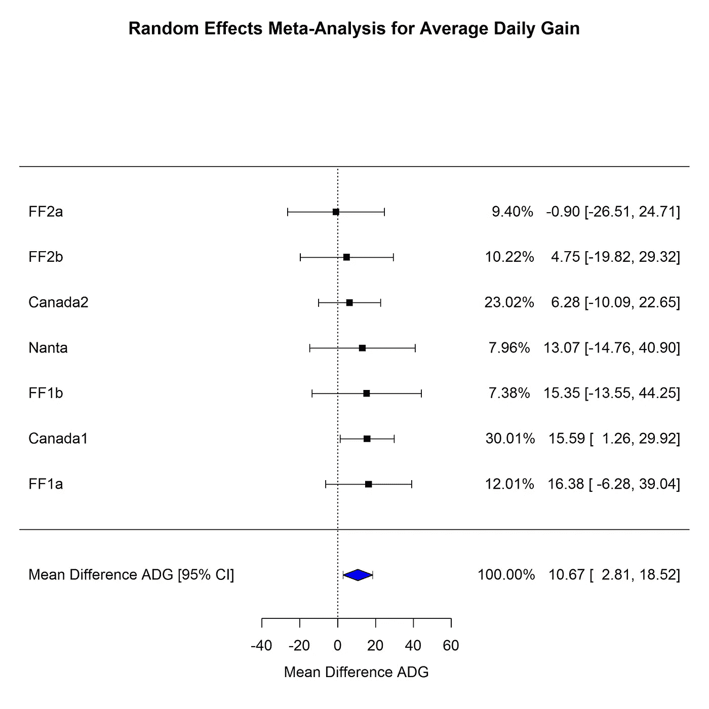

# R 中的元分析介绍

> 原文：<https://towardsdatascience.com/introduction-to-meta-analysis-in-r-468e9b33925c?source=collection_archive---------6----------------------->

## 如何将研究结合起来提供一个洞见的世界

meta 这个词是希腊语，意思是“T1”后面的“T0”，或者“T2”后面的“超越”。所以[荟萃分析](https://en.wikipedia.org/wiki/Meta-analysis)是指**后分析**或**后分析。**虽然这听起来有些奇怪，但元分析实际上是一种方法，可以:

1.  **结合**和**分析**几次试验。
2.  估计一个**总结**治疗效果。
3.  获得一个**超出**单独分析数据时发现的(单一)影响的发现。

元分析这个词是研究综合的同义词。它综合了各种研究的结果，以便得出一个总的结论。研究越同质，结论就越明确。荟萃分析既看内部效度，也看是否有影响？—和外部有效性——这种效果可以推广到哪一部分？。也许描述元分析的最佳方式是谈论苹果、梨和(腐烂的)水果。

元分析的唯一目标是比较苹果和梨。然而，如果你的研究是异质的，你可能不仅会得到一个苹果或一个梨，还会得到一个香蕉、一个橘子和一些葡萄。现在，在这种情况下，苹果和梨之间的比较受到严重影响，你能做的最好的事情就是谈论水果。如果研究本身存在严重的方法缺陷，你就只能吃腐烂的水果了。也许最好什么都不要说，尽管这样的发现实际上可能比明确的荟萃分析更有趣。

进行荟萃分析的主要原因是:

1.  **当单一试验由于局限性和/或异质性无法提供治疗效果时，如农业中的农场，增加功率**。
2.  对 **农场/国家的**处理效果的**变化**进行估计。****
3.  在**中确定哪些**农场和国家的治疗显示出我们想要看到的效果。

因此，荟萃分析的目标不仅仅是报告平均治疗效果，而是理解效果的模式。如果跨研究的效应大小是一致的，我们需要知道并考虑其含义。如果 T2 发生变化，我们也需要知道这一点，并考虑其影响。最终，您将:

1.  结合不同的研究，通过**增加样本量和统计功效**来展示治疗效果。
2.  减少小型个体研究中常见的高**II 型误差**(假阴性结果)的不确定性。
3.  在广泛的实验条件下获得更多**自信结论**(*外部效度*)。

然而，在大多数研究领域，一项功能强大的[随机对照试验](https://en.wikipedia.org/wiki/Randomized_controlled_trial) (RCT)仍然被认为足以提供可靠的治疗评估和变更指南。在农业中，我们通常期望动物代表种群，这对于来自单一农场的研究来说是没有意义的。此外，由于农场的限制，仅使用一个农场来设计一个功能强大的研究即使不是不可能，也是具有挑战性的。此外，如果我们对不同农场、甚至不同国家的治疗效果感兴趣，我们需要对治疗的外部有效性有一个全面的认识。

理论上，要进行荟萃分析，你至少需要两项研究。最好，你包括更多，没有上限。为了提高效率，纳入的研究必须进行完全相同的处理。然而，它们不必有完全相同的设置——有时我们实际上想要不同的设置来增加外部有效性。包含各种设置可能会产生负面的结果——添加任何新的东西都等于增加了变化，而这种变化并不总是能够用一个新的设置来解释。

在任何荟萃分析中，最重要的考虑是确定包括哪些研究。如果至少纳入的治疗方法完全相同，那么荟萃分析是最强有力的。此外，您必须确定是否存在使试验不可比的试验因素。所有这些都取决于研究者，而不是统计学家。关键是要确定影响处理效果的因素，这些因素超出了因不同农场或国家而产生的随机变化的预期。

简而言之，你的研究设计应该反映你进行荟萃分析的目的。这意味着所有纳入的研究应具有相同的研究设计、相同的治疗和相同的研究方案。在开始元分析的第一项研究之前，应该做一个合理的功效计算，记住元分析

到目前为止，应该很清楚进行一个合理的元分析需要做出几个选择，这些选择是科学的而不是统计的。一旦你开始分析，算法并不能抵消你选择包括水果而不仅仅是苹果和梨。因此，您需要在设计阶段预先确定潜在的影响者，并确定他们的重要性。你应该想到的重要问题是:

1.  治疗效果会不会没那么强？
2.  治疗效果会不会走向另一个方向？
3.  在设计阶段限制/删除其影响的可能性有多大？
4.  如果我不能在设计阶段限制他们的影响，那么在分析中限制/删除他们的影响的可能性有多大？
5.  如果我不能限制它们的影响，而且影响很大，我还能把这项研究纳入荟萃分析吗？

现在，当我们到达分析阶段时，大多数人不太清楚的是，元分析理论上是一个混合模型:

1.  固定效果→治疗
2.  随机效应→研究*(方差之间)*
3.  重复效应→研究*(方差内)*

因此，荟萃分析着眼于研究间差异的治疗效果，可以使用包括研究内和研究间差异的两级混合模型进行描述。**在第一级**，效果大小估计只是效果大小参数加上随机变化。如果我们结合所有的效应大小估计，我们得到平均效应大小估计。**在第二级**，效应大小参数由平均效应大小加上特定研究的随机效应决定。随机效应代表研究间的差异。随机效应的变化描述了研究间的变化量

在左边，你有一个固定效应元分析，它把数据处理成只有一个真实效应+随机变化。在右边，你有一个随机效应元分析，它将数据处理为具有多个真实效应+跨研究的随机变化。(图片来自 https://ebmh.bmj.com/content/17/2/53[BMJ](https://ebmh.bmj.com/content/17/2/53))

现在，在必要的介绍之后，让我们开始吧。进行元分析的代码出奇的少，因为元分析的所有重要工作都必须在实际分析之前完成。垃圾进，垃圾出。

metafor 包是这篇文章的核心。

接下来是数据争论和根据感兴趣的结果分割数据集。

数据显示，元分析没有太多必要。这里，我们有每个研究结果组合的平均值、标准差(SD)和两种治疗的观察次数(N)。还有一些额外的变量可能会影响分析，但我们暂时不考虑它们。图片作者。

现在，我们将使用必要的指标——mean、sd、N——来估计所请求的感兴趣的度量。这里，我们指定处理之间的平均差异。然而， [metafor](https://www.metafor-project.org/doku.php) 包允许估计更多的度量。

对于每个感兴趣的结果，我们要求根据每个治疗的平均值、标准差和观察次数计算特定结果的平均差异。

现在发生的是，基于输入，算法将分别为每个研究计算平均差异(*易*)和抽样方差( *vi* )。

在这里，您可以看到每项研究的平均差异和抽样方差。图片作者。

这两个指标是下一个算法——随机效应荟萃分析——需要详细说明治疗效果和差异，以及获得总体治疗效果和研究间异质性的估计。就像我已经说过的，它本质上是一个混合模型，所以将会发生的是——在研究水平上——一个固定的治疗效果和一个随机的研究截距是合适的。这将为我们提供治疗差异的总体估计、治疗间方差的估计(这里称为 I)以及研究内变异的估计。

下面的代码是 metafor 为每个结果请求的:

1.  进行随机效应荟萃分析。
2.  提供了异质性的估计。
3.  提供了置信区间。
4.  使用森林图显示结果。

元分析的分析非常简单

下面你会看到随机效应模型的结果。总共包括 7 项研究，初步估计显示异质性很小。这意味着我们可以更加肯定地“相信”所提供的显示治疗之间显著差异的比较。

图片作者。

方差的置信限显示了估计自然边界为零的指标的置信限有多困难。尽管如此，还是要密切关注，因为零点估计值之上的宽间隔可能暗示着收敛误差。图片作者。

尽管查看置信区间等指标总是好的，但元分析真正最好的评估是通过它的森林图。在这里，人们可以很容易地发现过多的内部和之间的差异，并获得一个良好的总体估计的有效性的感觉。

在下图中，除了一个点(研究 3)之外，所有的点估计都显示了类似的效果。它们的内方差不同，但间方差很小甚至不存在。因此，正如输出中已经显示的，我们有一个同质批次。

最重要的是理解我必须解释的东西——而且还必须解释无数次:没有显示出统计学意义的研究，可能会导致具有统计学意义的汇总估计。原因是所有的研究估计被汇集以获得更好的信噪比。如果研究过于异质性，或者没有显示出相同的效果，荟萃分析实际上可能弊大于利。

显示每项研究的平均差异和变异内的森林图，导致汇总估计和研究间变异的估计。图片作者。

并非所有的结果都表现出相同的同质性。图片作者。

下面的代码结构可以提供更好的情节。

图片作者。

现在，请记住，进行荟萃分析的危险隐藏在我刚刚展示的简单性中。当一个荟萃分析显示出很多异质性时，你必须接受结果是垃圾，不能使用。在这一点上，分组或敏感性分析可能会对你有所帮助——还有元回归——但是这些选择本身也有危险，我将在以后的文章中讨论。

别忘了，荟萃分析是一个混合模型。因此，适用于混合模型的所有假设在这里也适用。