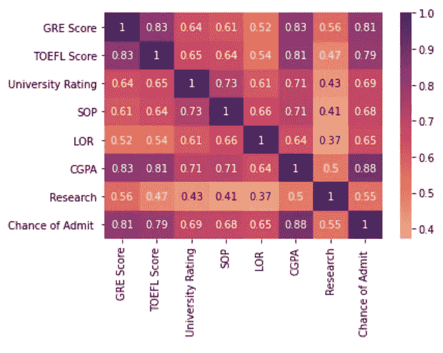
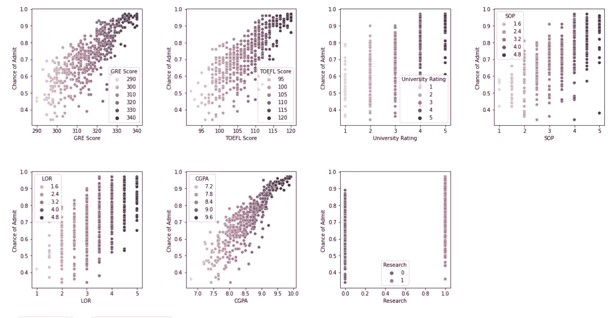
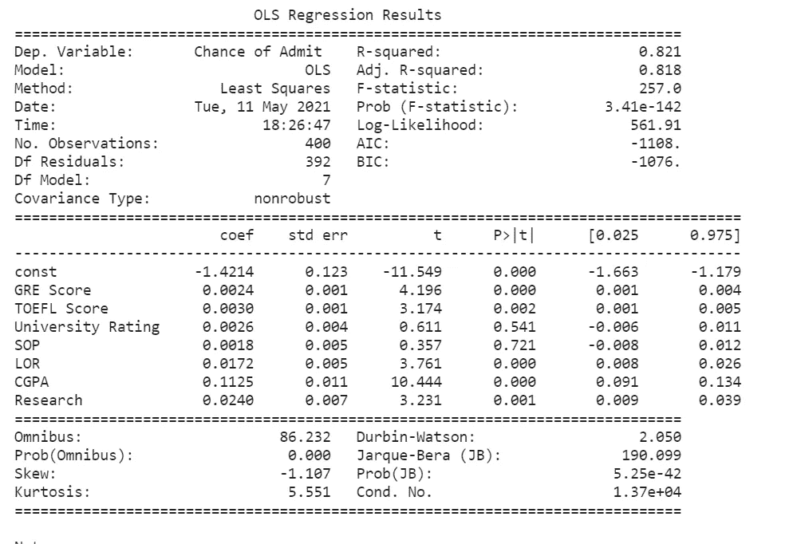
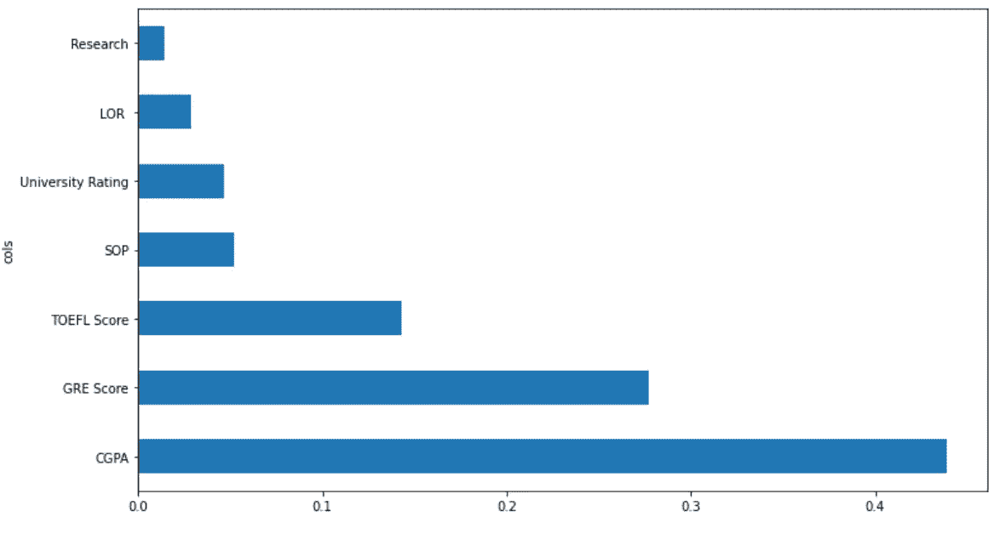
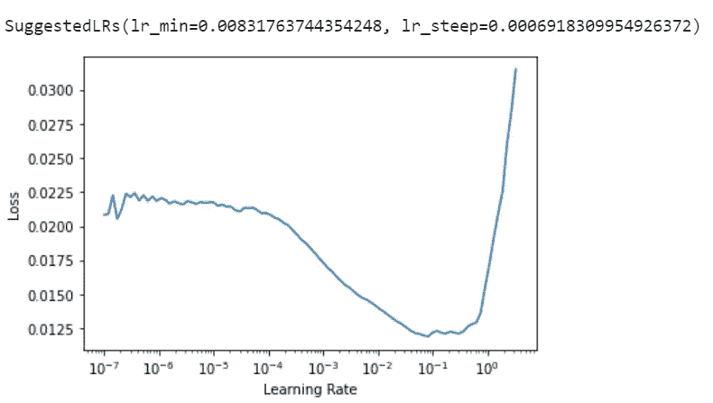
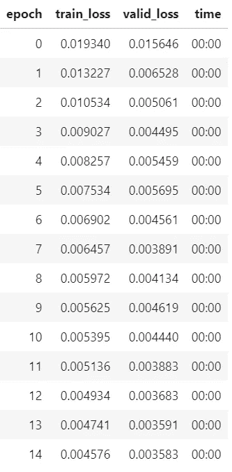
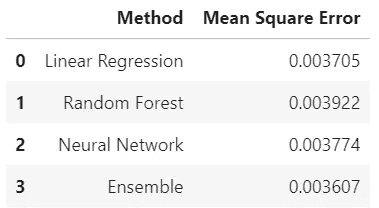

# 表格数据建模简介:用最大似然法预测学生被录取的机会

> 原文：<https://towardsdatascience.com/introduction-to-modelling-tabular-data-predicting-a-students-chance-of-gaining-admission-using-ml-3a440f709c71?source=collection_archive---------19----------------------->

## 我们如何使用回归模型、随机森林和神经网络来预测学生被研究生院录取的机会？

# **简介**

这种分析的目的是探索学生进入研究生院的最重要因素，并选择最准确的模型来预测学生进入研究生院的机会。

我将使用的数据是[大学毕业生录取 2](https://www.kaggle.com/mohansacharya/graduate-admissions) 数据集，它可以在 Kaggle 上找到，灵感来自加州大学洛杉矶分校的录取数据集。

**导入所需的库**

```
#import required libraries
from pandas.api.types import is_string_dtype, is_numeric_dtype, is_categorical_dtype
from fastai.tabular.all import *
from sklearn.ensemble import RandomForestRegressor
from sklearn.tree import DecisionTreeRegressor
from sklearn.model_selection import train_test_split
from sklearn.metrics import mean_squared_error
from IPython.display import Image, display_svg, SVG
import pandas as pd
import seaborn as sns
import matplotlib.pyplot as plt
import statsmodels.api as sm
import numpy as np
```

# **探索性数据分析**

我们首先将 csv 文件加载到 Pandas DataFrame 中，并删除不需要的列。

```
#load csv into Pandas dataframes
data_df = pd.read_csv('../input/graduate-admissions/Admission_Predict_Ver1.1.csv')#drop the serial no. of the students as we dont need it 
data_df.drop('Serial No.', axis = 1, inplace = True)
```

然后，我们将执行 EDA，以更好地理解我们的数据，并观察数据中的任何模式。

首先，我们可以绘制一个热图来可视化变量之间的相关性。

```
corr = data_df.corr()#plot correlation matrix heatmap
hm = sns.heatmap(data = corr, annot = True, cmap = sns.color_palette("flare", as_cmap=True)
)
```



相关矩阵热图。图片作者。

从相关矩阵热图来看，似乎所有的变量都与录取机会正相关，CGPA、GRE 分数和 TOEFL 分数是与录取机会最相关的变量。

为了进一步形象化我们的数据，我们绘制了入学机会对变量的散点图。

```
#plot scatter plots of Chance of Admission to each of the variables
column_names = list(data_df.columns)
column_names.pop(-1)fig = plt.figure(figsize = (20,10))
fig.subplots_adjust(hspace=0.4, wspace=0.4)
for i in range(0, len(column_names)):
    ax = fig.add_subplot(2, 4,i+1)
    sns.scatterplot(x = data_df[column_names[i]], y = data_df['Chance of Admit '], hue = data_df[column_names[i]] )
```



从上面的图来看，CGPA，TOEFL 成绩，GRE 成绩都显得与录取几率呈线性关系。大学排名较高的学生似乎也有更高的录取机会。具有更高目标陈述(SOP)和推荐信强度(LOR)的人似乎也有更高的录取机会。此外，有研究经验的学生往往有更高的录取机会。

# **造型**

我们将拟合 3 种不同的模型，即多元线性回归模型、随机森林和神经网络。我们还将尝试集成模型以产生更精确的模型。

我们将使用均方差来评估我们的数据。较低的均方误差表示模型更精确。

然后，我们在拟合我们的机器学习模型之前分割我们的数据集。

```
#split our data into train and test data
Y = data_df['Chance of Admit ']
X = data_df.drop(columns = {'Chance of Admit '})X_train, X_test, Y_train, Y_test = train_test_split(X, Y, test_size=0.2)
```

**线性回归**

我们将使用 statsmodel 库将 OLS 线性回归模型拟合到我们的数据中。与 sklearn 库相比，我更喜欢使用 statsmodel 库进行回归建模，因为 stats model 提供了关于所用模型的更多见解，但是使用任何一个库都会产生相同的结果。

我们将拟合以下没有交互项的模型:

录取几率= beta_0 + beta_1 * GRE 成绩+ beta_2 *托福成绩+ beta_3 *大学评级+beta _ 4 * SOP+beta _ 5 * LOR+beta _ 6 * CGPA+beta _ 7 *研

```
#fit a multiple linear regression model using statsmodels#add a constant
X1_train = sm.add_constant(X_train)
X1_test = sm.add_constant(X_test)#fit model
model = sm.OLS(Y_train, X1_train).fit()
predictions = model.predict(X1_test)print_model = model.summary()
print(print_model)#i used statsmodels as it provides additional insights about the model but both would work perfectly fine
#below is the code for fitting with sklearn
"""
from sklearn.linear_model import LinearRegression# with sklearn
regr = linear_model.LinearRegression()
regr.fit(X_train, Y_train)"""
```

上面的代码给出了以下输出:



statsmodels 输出。图片来自作者。

从上面的输出中，我们可以看到模型的 R 平方为 0.821，表明与数据非常吻合。我们还可以观察到，大学评级系数和 SOP 与 p 值不显著，分别为 0.541 和 0.721。该模型在测试集上给出了 0.003705 的**均方误差。移除不显著变量会导致稍微高一点的均方差 **0.003773** 以及 R 平方值稍微下降。因此，我们将使用完整的模型。**

请注意，在实践中，如果准确性略有下降，我们通常会选择更简单的模型，因为更简单的模型通常更容易解释和推广。

**随机森林**

我们将使用 sklearn 库来使随机森林模型符合我们的数据。

```
forest = RandomForestRegressor(n_estimators=1100,max_depth =6 ,max_features = 0.5)
forest.fit(X_train, Y_train)
predictions_rf = forest.predict(X_test)#calculate the mean squared error 
mean_squared_error(predictions_rf, Y_test)
```

在拟合我们的随机森林模型后，我们不仅想知道我们的模型有多精确，还想知道我们的模型是如何进行预测的。为此，*特性重要性*让我们深入了解这一点。

```
def rf_feat_importance(m, df):
    return pd.DataFrame({'cols':df.columns, 'imp':m.feature_importances_}
                       ).sort_values('imp', ascending=False)#check most important features
fi = rf_feat_importance(forest, X_train)def plot_fi(fi):
    return fi.plot('cols', 'imp', 'barh', figsize=(12,7), legend=False)plot_fi(fi);
```



特征重要性图。作者图片

从图中，我们可以看到像 CGPA，GRE 分数和 TOEFL 分数这样的特征对模型来说是最重要的，而像 Research 和 LOR 这样的特征对模型来说是不太重要的。因为没有一个特征具有非常低的特征重要性值，所以我们可以将这些特征保留在模型中。

随机森林模型在测试集上给出的均方差为 **0.003922**

**神经网络**

我们将使用构建在 PyTorch 之上的强大的 FastAI 库来为我们的数据拟合神经网络。为此，我们必须对数据进行预处理，并创建数据加载器将数据输入神经网络。为了处理连续变量和分类变量，我们可以使用 fastai 的函数 cont_cat_split()，它会自动拆分连续变量和分类变量。请注意，该函数将“SOP”误认为是一个连续变量，因为它有 0.5 个值，但实际上它是分类变量。

```
train_df = X_train
test_df = X_test
train_df = train_df.join(Y_train)
test_df = test_df.join(Y_test)#split the variables into continuous variables and categorical variables using fastai's factory method
cont_nn,cat_nn = cont_cat_split(train_df, dep_var='Chance of Admit ')
```

然后，我们可以创建数据加载器。

```
#create dataloaders
procs_nn = [Categorify, FillMissing, Normalize]
to_nn = TabularPandas(train_df, procs_nn, cat_nn, cont_nn, y_names='Chance of Admit ',splits = RandomSplitter(valid_pct=0.4)(range_of(train_df))
)
dls = to_nn.dataloaders()
```

在创建数据加载器之后，我们可以在 FastAI 中创建一个表格学习器。

```
#create tabular learner
learn = tabular_learner(dls, y_range=(0.3,1),n_out=1, loss_func=F.mse_loss)
```

然后，我们可以使用 fit_one_cycle 对我们的模型进行 15 个时期的训练，看看它看起来如何:

```
learn.lr_find()
```



学习率查找器。图片作者。

```
learn.fit_one_cycle(15, 1e-2)
```



图片作者。

神经网络在测试集上给出的均方差为 **0.003744** 。

```
test_df.drop(['Chance of Admit '], axis=1, inplace=True)
dl = learn.dls.test_dl(test_df)preds = learn.get_preds(dl=dl)#convert the predictions into a list
y = []
for i in range(0,len(Y_test)):
    x = preds[0][i].tolist()
    y += x

mean_squared_error(y,Y_test)
```

# **组装**

作为线性回归模型，随机森林和神经网络都有各自的优缺点。我们可以做的事情是把三个世界结合起来，试图产生一个更好的结果。有许多方法可以做到这一点，但我们将只使用一种简单的方法，即取模型预测的平均值。

```
ens_preds = (predictions + predictions_rf + y) /3
mean_squared_error(ens_preds, Y_test)
```

通过组合模型，我们在测试集上获得了 0.003607 的均方误差，这优于所有 3 个模型本身！

# **结论**



汇总表。图片作者。

在这种情况下，与神经网络和随机森林相比，线性回归似乎表现得最好，这证明复杂的模型并不总是产生更好的结果。然而，与单独的 3 个模型相比，组合模型产生了更好的结果。

代码可以在我的 [Github](https://github.com/jq28/graduate_analysis) 中找到