# 自然语言处理深度学习理论简介

> 原文：<https://towardsdatascience.com/introduction-to-nlp-deep-learning-theories-9d6801e3aa7d?source=collection_archive---------13----------------------->

## NLP 深度学习

## 我从自然语言处理和深度学习课程中学到的总结

帕特里克·托马索在 [Unsplash](https://unsplash.com?utm_source=medium&utm_medium=referral) 上的照片

在这篇文章中，我将总结我从斯坦福大学提供的*自然语言处理与深度学习*中学到的东西，包括【2017 年冬季视频讲座，以及【2019 年冬季系列讲座。两场讲座都由斯坦福大学的克里斯托弗·曼宁教授授课。这两个讲座中涉及的深度学习 NLP 理论的几个主题包括:

*   单词表示法
*   NLP 神经网络
*   注意力和变压器
*   最近的 NLP 深度学习模型

# 1.单词表示法

深度学习模型依靠数字向量来“理解”输入的单词。我们可以认为数字向量是代表输入单词的高维特征。在这个高维度空间中，单词的位置要么彼此靠近，要么彼此远离。

通过为给定语料库中的所有单词找到适当的数字向量表示来构建单词表示。单词表示的质量依赖于语料库。这可以很容易地理解为两个人对同一个词可以有不同的理解，取决于他喜欢花时间读现代报纸还是莎士比亚的文学。此外，单词表示的质量很大程度上依赖于找到所有单词的数字向量表示的方法。有几种通过从单词的上下文中学习来生成单词表示的方法。

> 从一个字所交的朋友，你就可以知道这个字。
> 
> 约翰·鲁珀特·弗斯

**1.1 基于计数的方法:共生矩阵**

共现描述了两个词在一定距离内的出现，该距离由固定的窗口大小定义。在语料库层面上，共现矩阵捕捉语料库中所有独特单词对的共现频率。这样，它提供了语料库的统计描述。共现矩阵中的每一行都是代表一个单词的数值向量。

然而，为了捕获语料库中所有独特单词对的共现频率，该共现矩阵会占用大量内存。假设你有一个拥有 10k 个唯一词的语料库，那么共现矩阵的规模就是 10k 乘 10k！同时，每个词向量的维数是 10k！为了降低单词向量的维数，通常使用奇异值分解(SVD)。

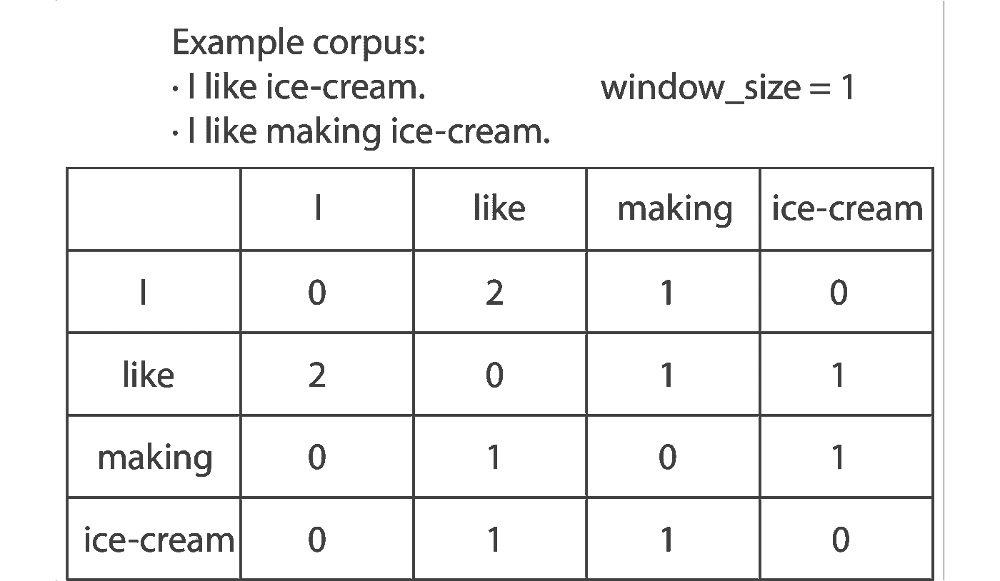

从小型语料库构建的共现矩阵。

**1.2 基于预测的方法:Word2vec**

除了纯粹依赖于统计的基于计数的共现矩阵方法之外，还可以通过使用浅层前馈神经网络模型的基于预测的方法来生成词向量。这种基于预测的方法包括 word2vec，它可以用 skip-gram 或连续词包(CBOW)算法来实现。skip-gram 和 CBOW 算法都是针对固定窗口大小内的词进行预测，它们的预测方向不同。Skip-gram 使用中心单词预测上下文单词，而 CBOW 使用上下文单词预测中心单词。

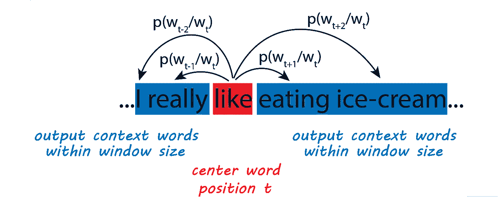

skip-gram 算法使用给定的中心单词预测上下文单词。

使用浅层神经网络来训练 Skip-gram，并且输入是 T 个唯一单词的语料库。每个单词被随机分配为一个 d 维向量。这样，在这个浅层神经网络中有 2*T*d 个参数需要优化，中心词矩阵和上下文词矩阵各有 T*d 个参数。该神经网络通过迭代地将每个单词作为中心单词并在给定当前中心单词的情况下最大化上下文单词的概率来训练。

Word2vec 可以在 [Gensim](https://radimrehurek.com/gensim/models/word2vec.html) 上获得，它可以很容易地导入到代码中，以生成基于预测的词向量。

**1.3 基于计数和基于预测相结合的方法:Glove**

一方面，共现矩阵在语料库水平上提供单词共现的统计描述。另一方面，word2vec 通过使用浅层神经网络来捕获窗口大小内的上下文单词的预测能力。Glove 是一种被提出来结合这两种方法的架构，以具有统计能力和局部上下文预测能力。与 word2vec 类似，Glove 也是使用浅层神经网络进行训练的。成本函数是 Glove 与 word2vec 的区别。Glove 的成本函数包括 Xᵢⱼ，即单词 j 在单词 I 的上下文中出现的次数，并且这并入了语料库的统计描述。

[Glove](https://github.com/stanfordnlp/GloVe) 也可以作为 Python 库使用。斯坦福 Glove Python 库可以作为预训练的词向量生成器，因为它是在大规模网络数据集上预训练的，具有像维基百科和 Twitter 这样的语料库。此外，它还可以在新的语料库上进行训练。

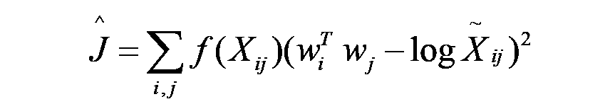

手套成本函数

# 2.NLP 神经网络

到这里，我们已经学习了单词表示法，即将单词变成机器可以理解的数字向量。然后，下一步是弄清楚如何使用这些单词表示来完成 NLP 任务。

许多 NLP 任务可以被认为是分类问题。一个简单的例子是情感分析，它可以简单到将电影评论分为积极或消极的情感。一个不太直接的例子是下一个单词预测的 NLP 任务。当我想预测“我喜欢吃……”后面的下一个单词时，这个下一个单词可以是我的语料库中的任何单词。下一个单词预测的方法是计算我的语料库中所有唯一单词的概率，然后选择概率最大的单词。Softmax 通常用于归一化多个输出类的概率。

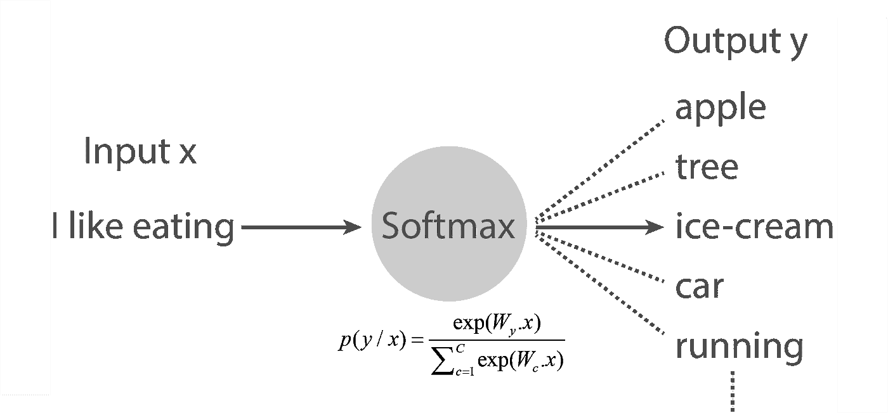

下一个单词预测任务的 Softmax

softmax 的问题在于它是输入单词向量的线性变换。因此，对于多类分类问题，它只能给出一个线性的决策边界。对于复杂的 NLP 任务，单词向量的线性变换是不够的。我们需要在将单词向量送入 softmax 的最后一层之前引入非线性。神经网络是一种解决方案，可以在 softmax 的最后一层之前实现，以将非线性引入模型。

在本节中，我们将从基本的神经网络元素——神经元开始，然后讨论 NLP 任务的三种基本神经网络架构，即递归神经网络(RNN)、卷积神经网络(CNN)和树形递归神经网络(树形 RNN)。

**2.1 神经元**

神经元是神经网络中的基本计算单位。在一个神经元中，输入经过线性变换后，结果被送入逻辑回归。逻辑回归将非线性引入到神经元的计算中。因此，神经元本质上是一个二元逻辑回归单元。神经网络由多层组成，其中每层进一步由一束神经元组成。我们可以将每一层想象成同时运行的几个逻辑回归，然后将结果输入到另一个逻辑回归中。

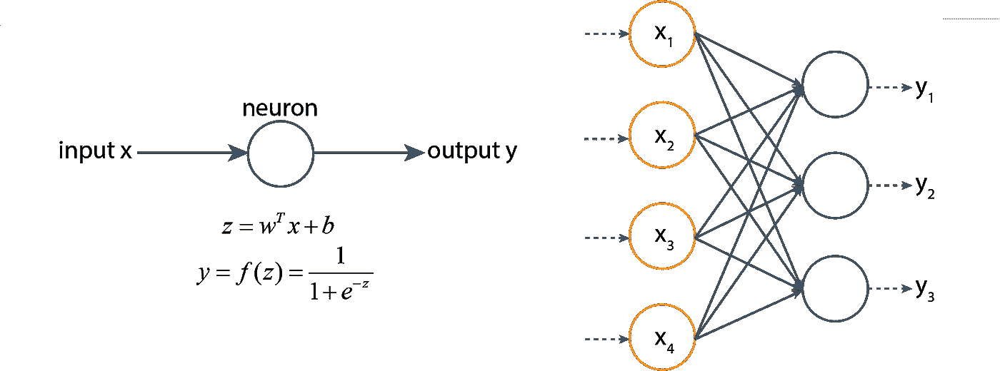

神经元和神经网络

**2.2 递归神经网络(RNN)**

通常，在 NLP 任务中，我们会处理一系列单词，这些单词可以是不完整句子的电影评论或写得很好的研究文章。预测下一个单词需要对前面的单词序列有一个整体的理解。RNN 是一种适合处理数据序列的体系结构。基本上，在每个时间步，一个单词向量被输入到 RNN 的一个神经元中。除了在该时间步长的输入单词向量之外，神经元还接收携带关于先前时间步长的信息的隐藏状态。这样，单词序列的信息在神经网络中传递。

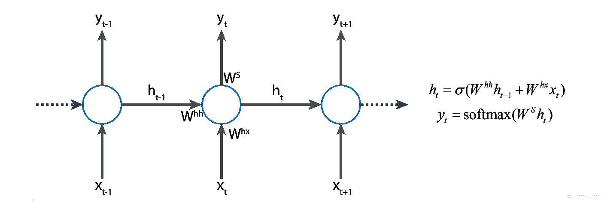

递归神经网络体系结构

上面提到的 RNN 建筑也被称为香草 RNN。香草 RNN 遭受消失梯度问题，这是由反向传播过程中的参数更新的长链引起的。反向传播旨在更新神经网络参数以最小化输出误差。然而，由于香草 RNN 的顺序连接性质，进一步的神经元的参数不能有效地更新。这样，神经元很容易死亡。为了克服香草 RNN 的消失梯度问题，提出了两个先进的 RNN 建筑解决方案:门控循环单元(GRU)和长短期记忆(LSTM)。GRU 和 LSTM 解决渐变消失问题的方法是通过引入某种形式的门控机制来控制传递到当前单元格的前一个单元格的信息量。

门控循环单元体系结构

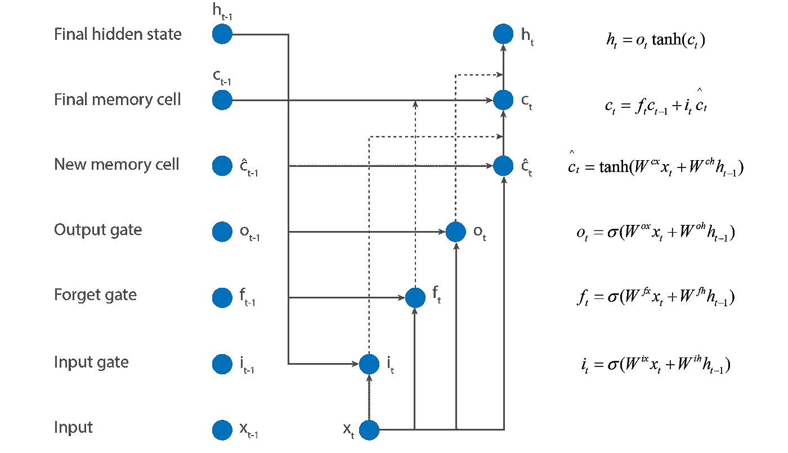

长短期记忆结构

**2.3 卷积神经网络(CNN)**

RNN 允许信息跨时间流动，从而能够理解全球语义。这在本质上决定了 RNN 计算是一个缓慢的过程，因为后面的神经元等待来自前面神经元的信息流。作为一种更快的解决方案，CNN 已经被探索用于一些对全局语义理解要求较低的 NLP 任务。

CNN 广泛应用于计算机视觉模型中。CNN 的基本思想是对输入数据并行应用多个滤波器，每个滤波器提取某个特征。在计算机视觉任务中，这些过滤器识别空间中的局部模式。类似地，当应用于 NLP 任务时，这些过滤器可以被训练来识别时间上的局部模式。

当窗口滑过输入时，过滤器对给定窗口大小内的输入单词向量进行处理，其中窗口大小是在 CNN 训练中要优化的超参数。对于每个过滤器，当找到一个特定的模式时，它将强烈激发，并可以由后续的 max-pooling 层选择。例如，在情感分析中，当发现“不喜欢”时，窗口大小为 3 的过滤器将强烈启动。这样，我们可以把一个窗口大小为 n 的滤波器想象成 n 元模式搜索器。

# 3.注意力和变压器

RNN 和 CNN 是 NLP 深度学习模型中广泛使用的基本单元。RNN 擅长顺序学习远程语义，而 CNN 擅长学习局部语义，可以通过并行计算实现。远程语义和并行计算很重要，有可能两者同时实现吗？在本次会议中，我将讨论一些最新的高级神经网络架构。

**3.1 注意:基于解码器查询对齐编码器信息池的相似性评分机制**

由于伯特模型，许多人都听说过“注意力”和“变压器”这两个词。然而，与 transformer 架构(直到最近才在谷歌 2017 年名为 [Attention is All You Need](http://papers.nips.cc/paper/7181-attention-is-all-you-need) ⁴的出版物中提出)不同，注意力机制在神经机器翻译中已经使用了很长时间。根据 Christopher Manning 的说法，神经机器翻译是通过一个大型人工神经网络对整个机器翻译过程进行建模的方法。

传统上，神经机器翻译使用带有编码器和解码器的序列到序列模型，编码器和解码器使用 RNN 单元构建。在没有注意机制的编码器-解码器架构中，编码器序列中的最后一个神经元是连接到解码器的唯一单元。然而，编码器序列中的最后一个神经元可能无法携带输入序列中的所有有用信息。注意机制可以解决这个问题。

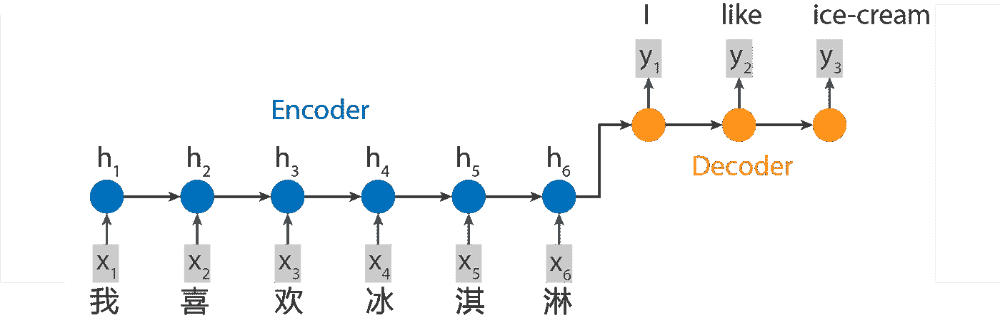

无注意机制的神经机器翻译

注意机制允许解码器神经元从编码器的信息池中提取隐藏状态。注意层采用两个输入向量，这是编码器和解码器的隐藏状态，并返回归一化的相似性得分。这样，关注层有助于根据给定的解码器查询来调整编码器信息。

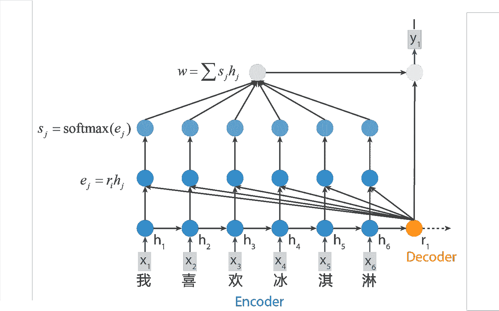

具有注意机制的神经机器翻译

**3.2 自我关注:具有并行计算能力的序列处理**

RNN 可以携带长距离的语义信息，但是由于顺序处理的性质，计算是缓慢的。相比之下，CNN 作为局部过滤器工作，可以很容易地在并行计算中实现，但同时缺乏长程语义信息。自我注意是一种以并行计算方式获得输入的全局理解的解决方案。

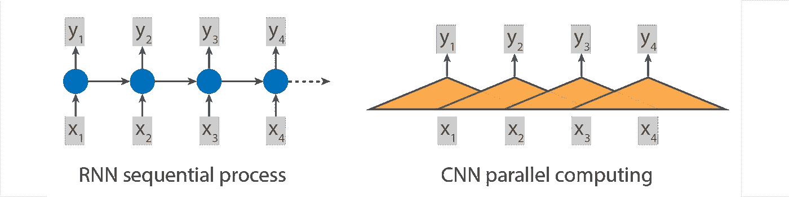

RNN 和 CNN

在自我注意中，每个输入单词首先被编码成三个向量:q、k 和 v。在每个位置计算输出向量。为了获得输出向量，使用输出位置的 q 和所有的 k 来计算注意力得分。然后注意力得分和每个 v 向量的加权和生成输出向量。

我认为自我关注是一种修正的 CNN 结构。在 CNN 中，过滤器仅适用于特定窗口大小内的附近输入向量。这样看来，CNN 善于捕捉地方特色。由于该滤波过程是纯粹的矩阵运算，因此可以容易地以并行方式实现，多个滤波器同时工作以寻找不同的特征。在自我关注中，这个过滤过程被修改，改为在每个输入位置取一个编码向量。这种修改使人们能够关注 CNN 固有的矩阵运算和并行实现的优势，同时也带来了理解全局语义的新优势。

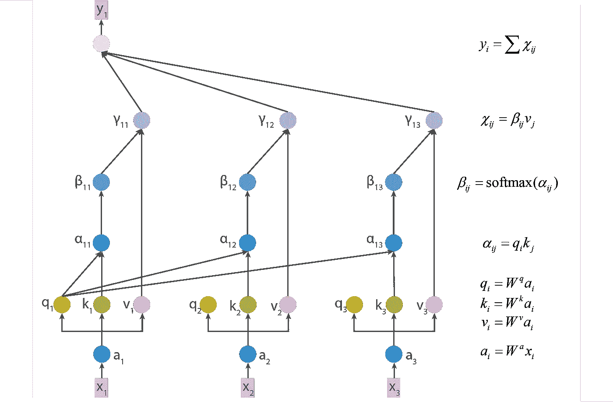

自我注意机制

**3.3 变压器:建立在自关注机制上的基本单元**

transformer 是 2017 年提出的深度学习基本单元架构，使用自关注机制构建。该变换器可以代替 RNN，取序列输入，产生序列输出，同时可以实现并行计算。

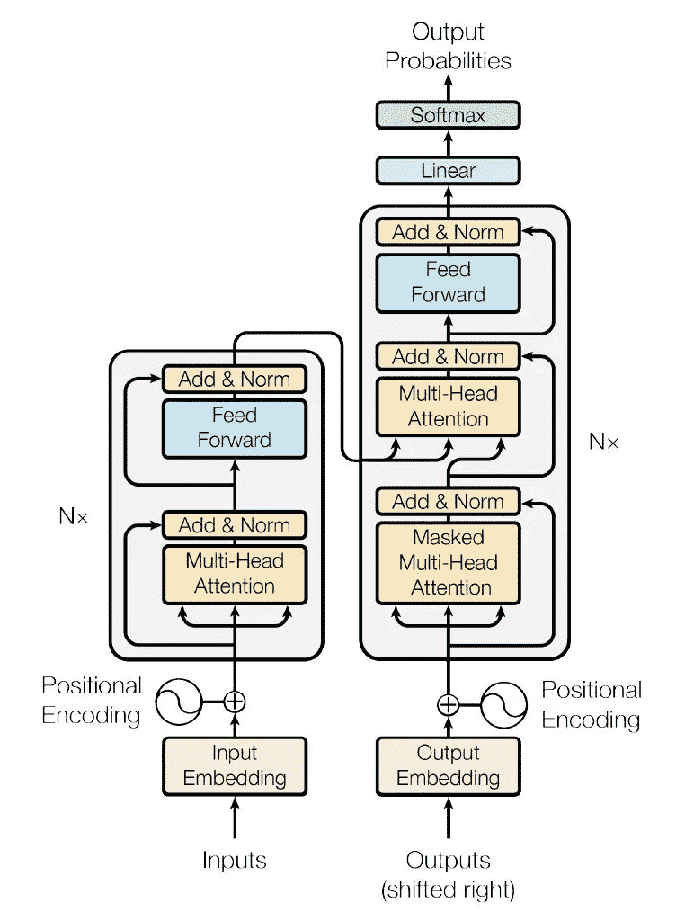

变压器 architecture⁴

# 4.最近的 NLP 深度学习模型

到目前为止，我已经讨论了单词表示(共现矩阵，word2vec，Glove)和初级深度学习单元架构(RNN，CNN，transformer)。在这一节中，我们将回顾自然语言处理领域的最新进展。

迁移学习已经广泛应用于计算机视觉领域，从图像分类到目标检测的计算机视觉任务大多使用在大型图像数据集上预先训练的模型。然而，NLP 中的迁移学习直到 2018 年才成为可能。在过去的两年里，已经出现了几个预先训练好的通用语言模型。我们将经历一些突破。杰伊·阿拉玛写的一篇关于最近 NLP 发展的好文章可以在[这里](http://jalammar.github.io/illustrated-bert/)找到。

**4.1 ELMo:首个上下文单词嵌入模型**

语言嵌入模型(ELMo)是第一个上下文词嵌入模型，于 20 世纪初在⁸⁵.发表我们已经在这篇文章的第一部分讨论了单词表示。然而，在 ELMo 之前的所有单词表示模型，包括 word2vec 和 Glove，都只能生成静态的单词嵌入。对于静态单词嵌入，我们的意思是每种单词类型只有一个单词嵌入。例如，在“河岸”和“银行账户”中，“银行”一词将具有相同的矢量表示。这种静态单词嵌入不能很好地表示单词在特定语言环境中的含义。

相反，ELMo 通过使用两个双层 LSTM 的内部状态来生成上下文单词嵌入，这两个双层包括向前和向后单元。确定如何使用内部状态来生成加权和结果(即上下文单词嵌入)的参数是在每个特定的 NLP 任务中学习的。

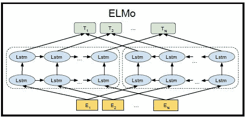

ELMo⁶正反两层 LSTM 结构

**4.2 ULMFit:用 transformer 代替 lstm，探索 NLP 迁移学习**

继 ELMo 之后，通用语言模型微调(ULMFiT)也于 20 世纪初在⁸⁷.发布 ELMo 和 ULMFiT 的一个区别是，ULMFiT 用一个变压器取代了所有的 LSTM 单元，这是谷歌在 2018 年初刚刚发布的。

ULMFiT 的目标是实现一个可用于迁移学习的通用语言模型。实现 ULMFit 分为两个阶段:在通用领域语料库上进行语言模型预训练，以及在特定的自然语言处理任务中进行微调。这样，预先训练的语言模型学习到了语言的一般特征，迁移学习有助于快速训练模型适应不同的 NLP 任务。

**4.3 GPT:使用正向变换器的大规模预训练 NLP 语言模型**

在 ULMFit 中，在通用领域语料库上的预训练语言模型的第一阶段是无监督的学习任务。未标记的文本语料库非常丰富，而标记良好的文本语料库却很难找到。预训练语言模型的无监督学习方式使得该模型通常可以从大量可用文本中学习。ULMFiT 在一个相对较小的语料库上进行预训练，以证明迁移学习语言模型的可能性。然后在 ULMFiT 之后不久，生成性预训练(GPT)由 OpenAI 在 20 ⁸⁸.出版与 ULMFiT 类似，GPT 使用前向变换器，但 GPT 是在模型中有更多参数的更大语料库上训练的。

2019 年初，OpenAI 发布了 GPT- ⁹，这是一个比 GPT 更大、更强大的预训练语言模型。它有 1.5B 个参数，并在 40GB 的互联网文本上进行了预训练。

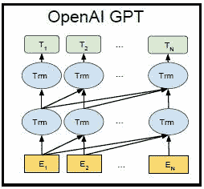

GPT⁶的正向变压器

**4.4 BERT:使用双向转换器的大规模预训练 NLP 语言模型**

2018 年底，谷歌发布了变形金刚(BERT)⁶.)的双向编码器表示与 GPT 相似，BERT 也是一种语言模型，与 ULMFiT 相比，它在更大的语料库上进行预训练，具有更多的参数。

由于我在这次 Kaggle TensorFlow 2.0 问答比赛中使用了 BERT，因此在本系列的后续帖子中将提供更多关于 BERT 的讨论。

BERT⁶的双向变压器

# 5.摘要

在这篇文章中，我总结了我从*自然语言处理和深度学习*课程中学到的东西。文章介绍了单词表示和 NLP 神经网络结构。希望你觉得总结有用！

[1] Pennington，Jeffrey，Richard Socher 和 Christopher Manning。"手套:单词表示的全局向量."在*2014 年自然语言处理经验方法会议(EMNLP)* 中，第 1532–1543 页。2014.

[2]赵京贤、巴特·范·梅林波尔、卡格拉尔·古尔切雷、迪米特里·巴丹瑙、费特希·布加雷斯、奥尔赫·施文克和约舒阿·本吉奥。"使用统计机器翻译的 RNN 编码器-解码器学习短语表示." *arXiv 预印本 arXiv:1406.1078* (2014)。

[3] Hochreiter、Sepp 和 Jürgen Schmidhuber。“长短期记忆。”*神经计算* 9，8 号(1997):1735–1780。

[4] Vaswani、Ashish、Noam Shazeer、Niki Parmar、Jakob Uszkoreit、Llion Jones、Aidan N. Gomez、ukasz Kaiser 和 Illia Polosukhin。“你需要的只是关注。”在*神经信息处理系统进展*中，第 5998–6008 页。2017.

[5]彼得斯、马修·e、马克·诺依曼、莫希特·伊耶、马特·加德纳、克里斯托弗·克拉克、肯顿·李和卢克·塞特勒莫耶。"深度语境化的词语表达." *arXiv 预印本 arXiv:1802.05365* (2018)。

[6] Devlin，Jacob，张明蔚，Kenton Lee 和 Kristina Toutanova。"伯特:用于语言理解的深度双向转换器的预训练." *arXiv 预印本 arXiv:1810.04805* (2018)。

[7]霍华德、杰里米和塞巴斯蒂安·鲁德。“用于文本分类的通用语言模型微调。” *arXiv 预印本 arXiv:1801.06146* (2018)。

[8]拉德福德、亚历克、卡蒂克·纳拉辛汉、蒂姆·萨利曼斯和伊利亚·苏茨基弗。"通过生成性预训练提高语言理解能力."*网址*[*https://S3-us-west-2。*](https://s3-us-west-2.) *亚马逊鹦鹉。com/open ai-assets/research covers/language unsupervised/语言理解论文。pdf* (2018)。

[9]拉德福德、亚历克、杰弗里·吴、雷文·蔡尔德、戴维·栾、达里奥·阿莫代伊和伊利亚·苏茨基弗。"语言模型是无人监督的多任务学习者." *OpenAI 博客* 1，第 8 期(2019)。