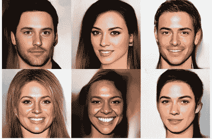
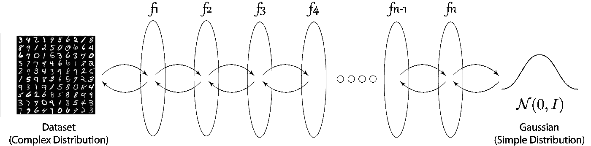
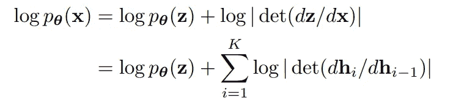
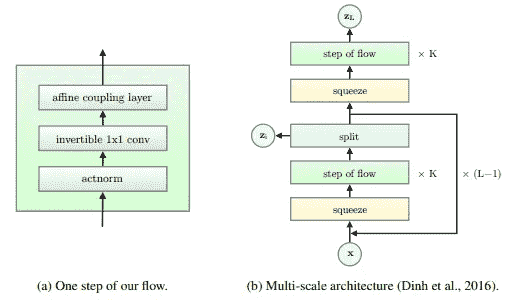
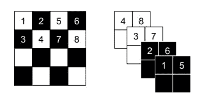
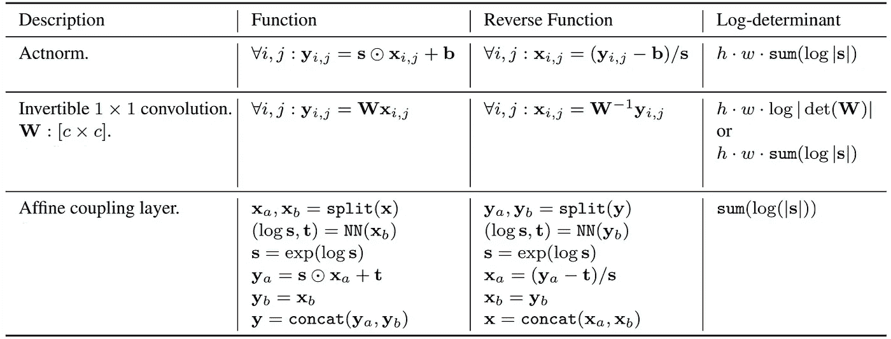
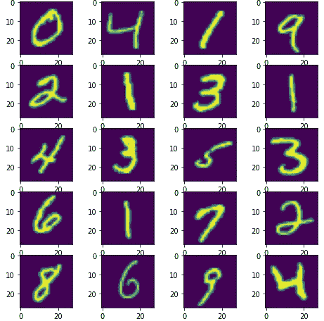

# 标准化流程简介

> 原文：<https://towardsdatascience.com/introduction-to-normalizing-flows-d002af262a4b?source=collection_archive---------0----------------------->

## 为什么以及如何实现 gan 和 vae 上的标准化流

学习复杂数据表示的表示是机器学习中的一个基本问题。这项任务的重要性在于可以获得大量非结构化和无标签的数据，这些数据只能通过无监督学习来理解。它可以应用于密度估计、离群点检测、文本摘要、数据聚类、生物信息学、DNA 建模等。多年来，已经引入了许多方法来学习大数据集的概率分布。这些技术包括生成式对抗网络(GANs)、变分自动编码器(VAEs)和规范化流程。

来自发光模型的样本([来源](https://papers.nips.cc/paper/2018/file/d139db6a236200b21cc7f752979132d0-Paper.pdf)

GANs 和 VAEs 在学习复杂的数据分布和简单的推理方法方面显示了令人惊叹的结果。然而，GAN 和 VAE 都缺乏对概率分布的精确评估和推断，这通常导致 VAEs 中的低质量模糊结果，并且在 GAN 中具有挑战性的 GAN 训练具有诸如模式崩溃和消失梯度后验崩溃等挑战。通过使用可逆函数，标准化流被提出来解决 gan 和 vae 的许多当前问题。

# 标准化流程

简而言之，标准化流是一系列可逆的简单函数，或者可以计算出函数的解析逆。例如，f(x) = x + 2 是可逆函数，因为对于每个输入，存在唯一的输出，反之亦然，而 f(x) = x 不是可逆函数。这种函数也称为双射函数。

(来源:作者)

从上图可以看出，归一化流程将复杂的数据点(如 MNIST 图像)转换为简单的高斯分布，反之亦然。从训练生成器的 GANs 中可以看出明显的差异，该生成器采用随机向量并产生图像，其中基于流量的模型在训练期间从数据点转换为简单分布。在测试期间，从高斯分布中抽取随机样本，以从模型反向获得 MNIST 图像。

使用负对数似然损失函数训练基于流量的模型，其中 p(z)是概率函数。下面的损失函数是利用基本统计学中的变量变化公式得到的。

([来源](https://papers.nips.cc/paper/2018/file/d139db6a236200b21cc7f752979132d0-Paper.pdf)

# 标准化流程的优势:-

规范化流提供了各种优于 GANs 和 VAEs 的优势。其中一些列举如下

*   标准化流模型不需要在输出中加入噪声，因此可以具有更强大的局部方差模型。
*   与 GAN 的 GAN 训练相比，基于流的模型的训练过程非常稳定，GAN 训练需要仔细调整生成器和鉴别器的超参数。
*   与 GANs 和 VAEs 相比，标准化流更容易收敛。

# 标准化流程的缺点:-

虽然基于流的模型有其优点，但它们也有如下一些缺点

*   由于流模型在密度估计等任务上表现平平，人们认为它们不如其他方法有表现力。
*   流动模型双射的两个要求之一是变换时的体积保持，这通常导致非常高维的潜在空间，这通常更难解释。
*   与 GANs 和 VAEs 相比，通过基于流量的模型生成的样本没有那么好。

为了更好的理解，我们以 Glow 架构为例，这是 OpenAI 在 2018 年提出的基于流程的模型。下图显示了 Glow 架构。

发光建筑([来源](https://papers.nips.cc/paper/2018/file/d139db6a236200b21cc7f752979132d0-Paper.pdf))

glow 架构是由本文后面讨论的一些表面层组合而成的。首先，我们将通过辉光模型的多尺度架构。光晕模型由一系列重复层(称为“比例”)组成。每个秤都包含一个挤压功能，后跟一个流动步骤。每个流程步骤都包含 ActNorm、1x1 卷积和耦合层，后跟一个分裂函数。分裂函数在通道维度上将输入分成两个相等的部分，其中一半进入进一步的层。相比之下，后半部分去损失函数。进行分割是为了减少梯度消失的影响，当以端到端的方式训练模型时，会发生梯度消失。

**挤压函数**通过对张量进行横向整形，将大小为[c，h，w]的输入张量转换为大小为[4*c，h/2，w/2]的张量，如下所示。此外，在整形期间，可以在测试阶段使用函数来将输入[4*c，h/2，w/2]整形为大小为[c，h，w]的张量。

([来源](https://arxiv.org/pdf/1605.08803.pdf))

其他层如 ActNorm、1x1 卷积和仿射耦合层可以从下表中理解，该表以正向和反向方式显示了每层的功能。

([来源](https://arxiv.org/pdf/1605.08803.pdf))

# 实施:

在讨论了标准化流程和发光模型的基础知识后，我们将使用 PyTorch 实现该模型，并在 MNIST 数据集上进行训练。

## 发光模型:

首先，我们将使用 PyTorch 和 nflows 实现 Glow 架构，它包含所有层的实现，以节省实验时间。

该模型可以在各种数据集上进行训练，例如 MNIST、CIFAR-10、ImageNet 等。在本文中，我们将仅限于 MNIST 数据集。像 [MNIST](https://www.google.com/url?q=https://gas.graviti.com/dataset/hellodataset/MNIST?utm_medium%3D0715Aryansh_1&sa=D&source=editors&ust=1626367404346000&usg=AOvVaw1rp0JNNJALdWZzSHQookR_) 这样的数据集可以很容易地从 [Graviti 的开放数据集平台](https://www.google.com/url?q=https://gas.graviti.com/open-datasets?utm_medium%3D0715Aryansh_1&sa=D&source=editors&ust=1626367404343000&usg=AOvVaw0tJPuwlGEGCSvWApwkLipF)中访问，该平台包含机器学习中常用的所有开放数据集，用于各种任务，如分类、密度估计、对象检测和基于文本的分类数据集等。

要访问一个数据集，用户需要[在 Graviti 平台上创建一个账户](https://www.google.com/url?q=https://account.graviti.com/sign-in/?callback%3Dhttps%253A%252F%252Fgas.graviti.com%252Fopen-datasets?utm_medium%3D0715Aryansh_1&sa=D&source=editors&ust=1626367404344000&usg=AOvVaw1vZLkDjshAEOYWBjYMiZn1)，派生相关数据集以下载并导入他们管道中的数据集。基本代码片段和相关文档可在 [TensorBay](https://www.google.com/url?q=https://graviti.com/tensorBay?utm_medium%3D0715Aryansh_1&sa=D&source=editors&ust=1626367404346000&usg=AOvVaw0nkt_CgI2ieUAczctfCQGk) 平台上获得。

为 MNIST 数据集创建 PyTorch 数据集的代码示例如下所示。

## 训练模型:

要训练模型，可以编写一个简单的脚本，如下所示。该代码使用 Graviti tensorbay 管道创建数据加载器。ACCESS_KEY 可以从 accounts 部分的设置中获得。

以上脚本用于为 MNIST 数据集训练规范化流量模型。通过替换相应数据集的数据加载器，可以类似地训练其他数据集的模型。

## 生成样本:

在为两个数据集训练模型之后，我们可以生成如下样本

nflows 库提供了一种仅使用一行代码生成样本的完美方式。显示功能在正方形网格中显示生成的样本。为两个数据集生成的样本如下

在 MNIST 数据集上生成的样本

# 结论:

本文介绍了标准化流的基本知识，并将其与其他 gan 和 vae 进行了比较，然后讨论了 Glow 模型。我们还实现了发光模型，并使用 MNIST 数据集对其进行了训练，并从两个数据集采样了 25 幅图像。在 Graviti 的开放数据集平台的帮助下，数据集可以更容易地访问。除了采样之外，还可以使用潜在空间向量来做更多的事情，比如让一张脸微笑或者改变性别或头发颜色，以及许多其他事情。