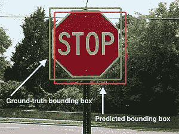
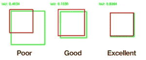
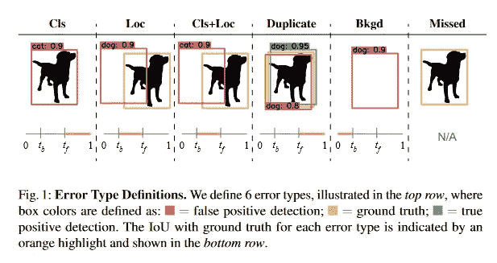

# 目标检测模型评估简介

> 原文：<https://towardsdatascience.com/introduction-to-object-detection-model-evaluation-3a789220a9bf?source=collection_archive---------5----------------------->


超市货架上的物品——查尔斯郡的郡主

评估对象检测模型并不简单，因为**每个图像可以有许多对象**和**每个对象可以属于不同的类别**。这意味着我们需要衡量模型是否找到了所有的对象，以及验证找到的对象是否属于正确的类。

这意味着对象检测模型需要完成两件事:

*   **查找图像中的所有对象**
*   检查找到的对象**是否属于正确的类别**

在本文中，您将看到对象检测研究人员如何创建将这两者结合在一个单一指标中的方法，即平均精度(mAP)。

最近发布了两个开源工具，它们在这些评估任务上给了我们很大的帮助。这意味着现在是开始研究对象检测模型的好时机。我们开始吧！

# 目标检测任务

当你标注对象时，**边界框**是你画出的指示位置的框。



边界框的例子，来自[维基百科](https://en.wikipedia.org/wiki/Jaccard_index)

对象检测模型产生三个分量的输出:

*   如果使用 COCO 文件格式，**边界框** — `x1, y1, width, height`
*   边界框的**类**
*   该预测的**概率得分**——模型确定该类实际上是预测的类的程度

我们需要仔细看看**概率得分**的组成部分。主要是因为现代神经网络校准不良[1]:

> 神经网络架构和训练的最新进展——模型容量、标准化和正则化——对网络校准产生了强烈的影响— [郭川、杰夫·普莱斯、孙玉、基利安·q·温伯格关于现代神经网络校准的文章](https://arxiv.org/abs/1706.04599)

现在，假设您需要比较两种不同对象检测模型的性能。因为我们知道概率分数校准得很差，所以在另一个模型上，概率分数为 80%的边界框很可能与概率分数为 50%的边界框具有相同的位置坐标。我们将如何着手比较这些模型的性能？我们将在下一节中解决这个问题。

如您所见，对象检测任务引入了一些我们在常规分类任务中没有看到的新挑战。让我们在接下来的章节中讨论其中的三个。

## 问题 1:如何分割训练/测试数据集？

在多类分类任务中，您知道数据集在每个影像中的分布，因为每个影像只能有一个类。这意味着你可以很容易地分割你的训练/测试数据。但是在目标检测中，每幅图像可以有许多来自不同类别的目标。

假设您有一个数据集，其中包含超市货架上的图像。假设您无法访问新数据，并且需要拆分此数据集来创建测试集，您将如何将图像拆分到训练/测试组中？

在我参与的一个项目中，我们使用品牌和产品数量进行了一些聚类实验，以从图像中获取样本。我们仍然需要做更多的研究来展示这些发现，但它似乎为我们提供了一个很好的代理来创建对象检测数据集中的训练/测试组。

## 问题 2:你如何知道一个物体的位置？

为了评估对象是否被定位，我们使用并集上的交集(IoU)作为相似性度量。它由重叠区域的面积除以两个边界框的并集的大小得到。


并集上的交集是如何计算的— [维基百科](https://en.wikipedia.org/wiki/Jaccard_index)



IoU 值的一些例子— [维基百科](https://en.wikipedia.org/wiki/Jaccard_index)

需要 IoU 来计算平均精度，因为第一步是定义两个边界框是否指向同一个对象。为了回答这个问题，我们使用的默认 IoU 值是 0.5。

## 问题 3:如何使用单一指标比较模型？

该模型输出边界框的坐标和预测类的概率得分。问题是神经网络没有得到很好的校准，这意味着我们没有直接的方法来比较两个不同模型的概率得分。

这个问题的解决方案是使用每个模型输出的边界框的**排序**。这是计算平均精度(AP)指标的方法。您开始对概率分数进行排序，然后使用 IoU 阈值来比较边界框是真阳性还是假阳性。

正如[Harshit Kumar](https://kharshit.github.io/about/)【2】在这个伟大的解释中所指出的[，如果对单个物体有一个以上的检测，则具有最高 IoU 的检测被认为是 TP，其余的被认为是 FP。](https://kharshit.github.io/blog/2019/09/20/evaluation-metrics-for-object-detection-and-segmentation)


计算边界框的精度和召回率——图片来自 [Harshit Kumar 文章](https://kharshit.github.io/blog/2019/09/20/evaluation-metrics-for-object-detection-and-segmentation)

计算累计 TP 和累计 FP，并计算每行的精度/召回率。通常，平均精度计算为 11 个等距召回级别的平均精度。**Mean Average Precision(mAP)**是所有对象类别的平均 AP，它更多地用于评估对象检测模型。

由于我们首先对预测进行了排名，现在绝对概率得分并不重要，我们可以对不同的模型使用相同的指标。

对象标注任务的一个特点是，在对象的位置和大小的表示上缺乏共识，并且性能评估工具实现不同的度量标准[3]。

如果您需要评估一个对象检测模型，并且不想从头开始计算指标(您为什么想要这样做？哈哈)[3]的作者开发并发布了一个名为[的开源工具，用于对象检测度量](https://github.com/rafaelpadilla/review_object_detection_metrics)。该工具包填补了目标检测指标的可靠来源的空白。

如果我们需要比较模型，地图是好的，但是如果我们的目标是对它的表现有一个定性的看法呢？我们将在下一节讨论这一点。

# 为什么平均精度不够

该地图适用于比赛环境或快速评估模型的表现，但如果您想了解模型的表现，您需要不同的指标。

对象检测任务中的误差来源可能是多种多样的:

*   模型可以找到边界框的正确位置，但输出的类不正确
*   该模型可以找到具有正确类别的对象，但是对于边界框的位置是完全错误的
*   模型可能会完全漏掉一个对象
*   等等

为了解决这个问题,[4]的作者开发了 [TIDE](https://dbolya.github.io/tide/) 。TIDE 是一个通用工具箱，用于计算和评估对象检测和实例分割对整体性能的影响。

[潮汐聚焦视频](https://www.youtube.com/watch?v=McYFYU3PXcU)为 ECCV 2020 造势

工具箱通过修复错误并观察导致的地图变化来确定给定错误对地图整体的重要性。我们来看看分析什么样的错误，他们是怎么做的。

## 介绍 TIDE(用于识别对象检测错误的工具箱)

作者定义了 6 种错误类型:

1.  **分类错误**:定位正确但分类错误
2.  **定位错误**:分类正确但定位不正确
3.  **Cls 和 Loc 错误**:分类错误，定位错误
4.  **重复检测错误**:如果不是更高评分的检测，将是正确的
5.  **背景错误**:检测到背景为前景
6.  **遗漏燃气轮机错误**:所有未被检测到的地面真相(假阴性)尚未被分类或定位错误覆盖



TIDE 错误— [Tide:用于识别物体检测错误的通用工具箱](https://arxiv.org/abs/2008.08115)

为了测量每种类型的误差，实施了一个 oracle 来纠正它们，并且该工具计算如果不存在这种类型的误差，地图将如何增加。这些信息是黄金，因为它可以指导我们如何改进模型。

下面是一个[潮汐结果](https://dbolya.github.io/tide/)的例子:

```
-- mask_rcnn_bbox --

bbox AP @ 50: 61.80

                         Main Errors
=============================================================
  Type      Cls      Loc     Both     Dupe      Bkg     Miss
-------------------------------------------------------------
   dAP     3.40     6.65     1.18     0.19     3.96     7.53
=============================================================

        Special Error
=============================
  Type   FalsePos   FalseNeg
-----------------------------
   dAP      16.28      15.57
=============================
```

我们可以看到，如果您纠正遗漏的 GT 错误，您可以将地图增加`7.53`点。现在，您可以研究训练图像和验证图像，以找出如何修复这些错误。如果我们只使用地图结果，`61.80`，这可能需要很长时间才能弄清楚。

# 结论

目标检测任务带来了我们在多类分类任务中没有看到的挑战。使用对象检测，您需要找到对象并预测正确的类。此外，每个图像通常具有可变数量的注释对象。

幸运的是，许多优秀的研究人员一直在研究这些问题，现在我们有办法解决它们。为了比较两个边界框是相似的，我们使用并集上的交集(IoU ),并且使用平均精度(mAP)来测量模型性能。[用于对象检测度量的开源工具箱](https://github.com/rafaelpadilla/review_object_detection_metrics)提供了一个开源工具，它支持许多边界框格式，并使用不同的度量来评估检测。

仅有地图还不足以确定需要做些什么来提高模型的性能。为了解决这个问题,[4]的作者创建了 TIDE，这是一个计算和评估对象检测对整体模型性能的影响的工具箱。

# 参考

[1] [郭川](https://arxiv.org/search/cs?searchtype=author&query=Guo%2C+C)，[杰夫·普莱斯](https://arxiv.org/search/cs?searchtype=author&query=Pleiss%2C+G)，[孙玉](https://arxiv.org/search/cs?searchtype=author&query=Sun%2C+Y)，[基连·q·温伯格](https://arxiv.org/search/cs?searchtype=author&query=Weinberger%2C+K+Q)，《论现代神经网络的校准》[arXiv:1706.04599](https://arxiv.org/abs/1706.04599)【cs。LG]，2016 年 8 月。

[2]库马尔，哈什特。“对象检测和分割的评估指标:地图”。[https://kharshit . github . io/blog/2019/09/20/evaluation-metrics-for-object-detection-and-segmentation](https://kharshit.github.io/blog/2019/09/20/evaluation-metrics-for-object-detection-and-segmentation)

[3] Padilla，Rafael 等人，“使用配套的开源工具包对对象检测度量的比较分析”电子学 10.3 (2021): 279。

[4] Bolya，Daniel，等，“Tide:识别对象检测错误的通用工具箱”arXiv 预印本 arXiv:2008.08115 (2020)。