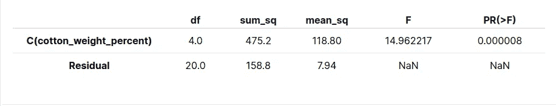

# 单向方差分析介绍:比较两组以上的平均值的检验

> 原文：<https://towardsdatascience.com/introduction-to-one-way-anova-a-test-to-compare-the-means-between-more-than-two-groups-a656cb53b19c?source=collection_archive---------8----------------------->

## 不同组的结果看起来不同，但它们在统计上不同吗？


拉奎尔·马丁内斯在 [Unsplash](https://unsplash.com?utm_source=medium&utm_medium=referral) 上拍摄的照片

# 动机

t 检验有助于发现两组之间是否存在显著差异。然而，t 检验不能用于比较**三个或更多的**独立组。

例如，如果您是产品开发人员，您可能想知道合成纤维中使用的棉花百分比的变化是否会导致纤维拉伸强度的增加。

为了找到答案，你可以进行一个完全随机的实验，有五个棉花含量水平，重复实验五次，代表五次试验。数据可能如下表所示:

从实验的设计和分析中获得的数据，第八版

单看表格，很难知道这 5 个棉花含量水平的平均值之间是否有**统计上的显著差异**。由于有超过 2 组被比较，在这种情况下不能使用 t 检验。

有没有一种方法可以确定这些均值在统计上是否彼此不同，并产生如下所示的有意义的输出？

*统计上无差异的棉花含量水平对:*

*   *(15，20)*
*   *(15，25)*
*   *(15，30)*
*   *(20，30)*
*   *(25，35)*
*   *(30，35)*

*统计上不同的棉花含量水平对:*

*   *(15，35)*
*   *(20，25)*
*   *(20，35)*
*   *(25，30)*

这时单向方差分析就派上用场了。

# 什么是单向方差分析？

单向 ANOVA 比较您感兴趣的组的平均值，并确定这些平均值之间是否存在统计差异。单向 ANOVA 有一个独立变量，而双向 ANOVA 有两个独立变量。

由于我们的问题中只有一个独立变量，即拉伸强度，我们将使用单向 ANOVA。

为了在 Python 中执行单向 ANOVA，我们将安装并使用 [statsmodels](https://www.statsmodels.org/stable/) 包:

```
pip install statsmodels
```

# 创建数据

我们将创建简介中显示的数据。

从实验的设计和分析中获得的数据，第八版

不错！数据设置完毕。现在我们准备使用单向 ANOVA 测试。

# 比较不同组之间的平均值

我们首先测试某些棉花含量水平的平均值在统计上是否不同。

*   零假设:均值没有差异
*   替代假设:平均值并不都相等

由于`[anova-lm](https://www.statsmodels.org/stable/generated/statsmodels.stats.anova.anova_lm.html)`需要一个或多个拟合的线性模型，我们从将普通最小二乘(OLS)模型拟合到我们的数据开始，然后将其用作`anova_lm`的参数。



模型的 F 统计量为 14.962217。模型的 p 值是 8e-06。

由于 p 值小于 0.05 的显著性水平，因此有足够的证据声称不同水平的棉花含量的一些平均值在统计上是不同的。

即使我们知道一些平均值在统计上总体不同，****两种**棉花含量的哪个具体水平不同？这时图基的 HSD(诚实显著差异)就派上用场了。**

# **使用 Tukey 的 HSD 比较每一对平均值**

**Tukey 的 HSD 发现了哪些特定群体的方法是不同的。该测试比较所有可能的平均值对。**

**让我们使用`MultiComparision`和它的`turkeyhsd()`方法来测试多重比较。**

**上表解释:**

*   **`group1`被比作`group2`**
*   **`meandiff`:`group1`和`group2`的平均差值**
*   **`p-adj`:在多大程度上`group1`和`group2`具有相同的含义**
*   **`lower`和`upper`:置信区间的下限和上限。**
*   **`reject`:如果是`True`，则拒绝零假设。有足够的证据表明，被比较的两种水平的棉花的平均值是显著不同的。**

**统计上不同的棉花含量水平对:**

*   **(15, 35)**
*   **(20, 25)**
*   **(20, 35)**
*   **(25, 30)**

**为了更好地理解结果，让我们来看看每组有一个置信区间的显著差异图。**

**上图比较了第 15 组(含 15%棉的纤维)的平均值和其他组的平均值。**

*   **因为第 35 组的平均值与第 15 组的平均值在统计上没有差异，所以第 35 组是灰色的。**
*   **因为组 20、25 和 30 的平均值与组 15 的平均值显著不同，所以它们被标为红色。**

**选择下拉栏中的其他选项进行其他比较。**

# **检查模型假设**

**ANOVA 假设每个样本都是从正态分布的总体中抽取的。要使用方差分析，我们需要确保这个假设得到满足。**

**为了检验正态性，我们将创建一个 Q-Q 残差图。Q-Q 图绘制了数据的分位数与正态分布的分位数。**

**由于数据点沿着 Q-Q 图中的直对角线，数据集可能遵循正态分布。因此，数据满足方差分析的正态性假设。**

# **结论**

**恭喜你！您刚刚学习了如何使用单向 ANOVA 来比较三个或更多独立组的平均值。无论你的数据有多好，如果你没有一个好的测试技术，你将无法从你的数据中提取有意义的见解。**

**使用 ANOVA，您将能够确定三组或更多组之间的平均值差异是偶然的，还是确实存在显著差异。最终，它会帮助你决定选择一个群体是否有益。**

**本文的源代码可以在这里找到:**

**<https://github.com/khuyentran1401/Data-science/blob/master/statistics/ANOVA_examples.ipynb> ** 

**我喜欢写一些基本的数据科学概念，并尝试不同的算法和数据科学工具。你可以在 LinkedIn 和 T2 Twitter 上与我联系。**

**星[这个回购](https://github.com/khuyentran1401/Data-science)如果你想检查我写的所有文章的代码。在 Medium 上关注我，了解我的最新数据科学文章，例如:**

**</how-to-match-two-people-with-python-7583b51ff3f9>  </how-to-turn-a-dinosaur-dataset-into-a-circle-dataset-with-the-same-statistics-64136c2e2ca0>  

[https://towards data science . com/top-6-python-libraries-for-visualization-which-one-to-use-Fe 43381 CD 658](/top-6-python-libraries-for-visualization-which-one-to-use-fe43381cd658)

</pytest-for-data-scientists-2990319e55e6>  

# 参考

"单向方差分析。"*单向 ANOVA——介绍何时应该运行该测试以及测试假设| Laerd Statistics* ，Statistics . Laerd . com/statistical-guides/One-Way-ANOVA-statistical-guide . PHP。**