# Pandas 简介——用于数据操作和分析的 Python 库

> 原文：<https://towardsdatascience.com/introduction-to-pandas-hands-on-tutorial-part-one-2e74f35ab166?source=collection_archive---------24----------------------->

## 实践教程—第 1 部分

## 本教程面向数据科学和/或 Python 编程的初学者。它侧重于使用 Python 中的 Pandas 库进行探索性数据分析、数据操作和数据过滤。


库纳尔·卡拉在 [Unsplash](https://unsplash.com?utm_source=medium&utm_medium=referral) 上拍摄的照片

如果你是一个经常处理数据的 [Python](https://www.python.org/) 开发者，我肯定你听说过甚至使用过 [Pandas](https://www.python.org/) 库。这是一个面向[数据科学](https://en.wikipedia.org/wiki/Data_science#:~:text=Data%20science%20is%20an%20inter,machine%20learning%20and%20big%20data.)和/或 Python 编程领域初学者的实践教程。我坚信“边做边学”，因此我觉得实践指导是学习的最好方式。我不会用太多的理论来烦你，并确保本教程是中肯的。我的目标是为你探索无穷无尽的数据科学世界铺平道路。

所以，让我先简单介绍一下熊猫。 [Pandas](https://pandas.pydata.org/) 是一个库，允许你处理表格数据、时间序列数据、矩阵数据等等。熊猫让我们的生活变得更轻松的几个很好的例子是:

*   **从** **逗号分隔值(CSV)文件、JSON 文件等导入数据。**
*   **填写数据集中缺失的值**
*   **数据争论和操纵**
*   **将多个数据集合并成一个数据集**
*   **将我们的结果导出为逗号分隔值(CSV)文件、JSON 文件等。**

说到这个图书馆能提供什么，可能性是无穷无尽的。所以事不宜迟，让我们开始第一个教程。我已经将本教程分解为易于遵循的步骤，最后我列出了一些活动，你可以在方便的时候做，以提高你的技能。

**第一步——安装熊猫**

首先，让我们从如何安装熊猫库开始。本教程我使用的是 Windows 10 PC，但是你可以自由选择使用任何操作系统(MacOS，Linux 等等)。我们有很多方法可以安置熊猫。我将亲自解释我是如何做的。但是如果你想用其他方式，这里有一套完整的安装熊猫的说明。

安装 Pandas 最简单的方法是通过 [Anaconda](https://docs.continuum.io/anaconda/install/) 发行版，这是科学计算领域最流行的 Python 发行版。熊猫图书馆将作为发行的一部分。我目前有 Python 版本 3.8.5，但它应该可以完美地用于 Python 版本 3.5.3 和更高版本。

让我们确认我的声明，熊猫库是 Anaconda 发行版的一部分。如果您的 Anaconda 安装成功，那么您的 PC 上应该安装了一个名为 Anaconda Navigator 的应用程序。在 Anaconda Navigator 的闪屏页面上，应该有一个名为“CMD.exe Prompt”的应用。点击“发射”。

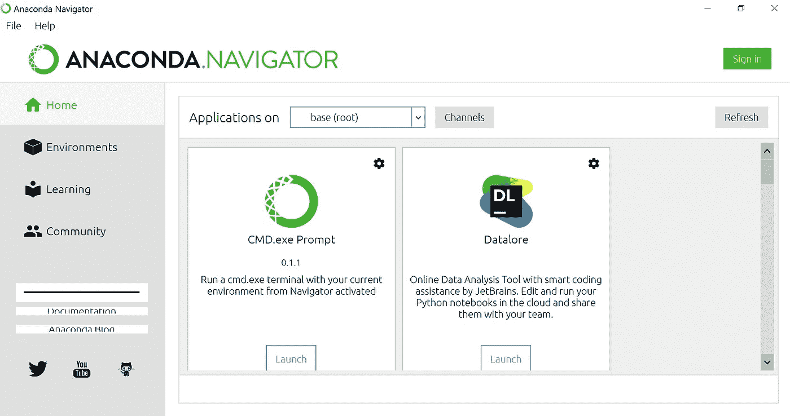

Anaconda 导航器启动页面

一旦你点击“发射”，一个终端就会打开。此终端可用于安装/卸载库，如 Pandas。

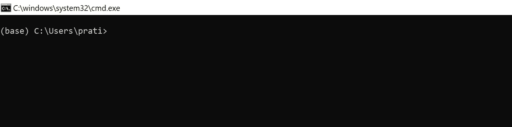

CMD.exe 提示

终端出现后，键入以下命令之一，然后按“Enter”键。

```
conda install pandaspip install pandas
```

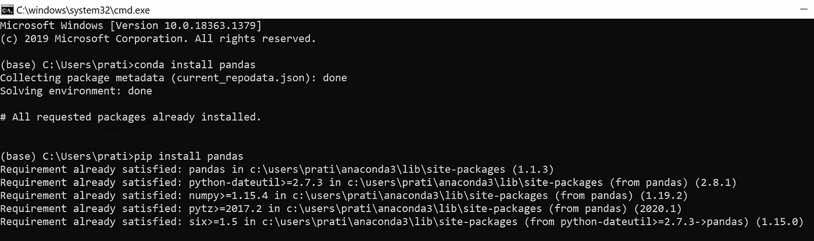

熊猫已经安装好了！

你应该看到熊猫已经安装好了！

Anaconda 附带了[集成开发环境](https://en.wikipedia.org/wiki/Integrated_development_environment) (IDE)，比如已经安装的 [Jupyter Notebook](https://jupyter.org/) 。我将使用 Jupyter 笔记本来完成我的教程，但是你可以自由选择你喜欢的 IDE。

**步骤 2 —设置 Jupyter 笔记本**

现在，我们准备深入熊猫的世界。但首先我想向您展示如何设置 Jupyter 笔记本 IDE。如果你打算使用 Jupyter 笔记本，请跟随本教程。如果没有，可以跳到第 3 步。

打开“CMD.exe 提示符”，如步骤 1 所示。然后输入下面的命令并点击“回车”。

```
**jupyter notebook**
```

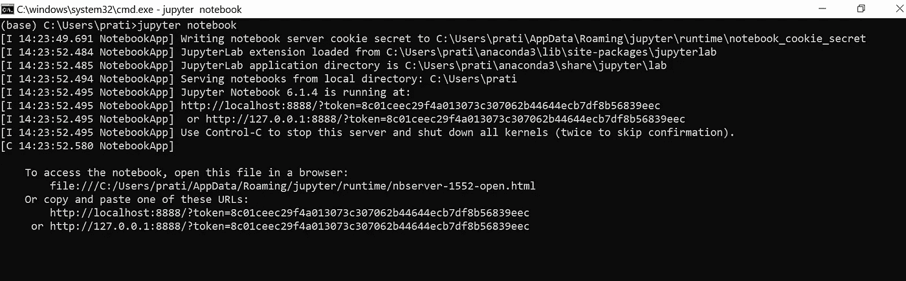

使用 CMD.exe 提示符打开 Jupyter 笔记本

或者，您可以在 Anaconda Navigator 启动器中搜索 Jupyter notebook 应用程序，并启动 Jupyter notebook。

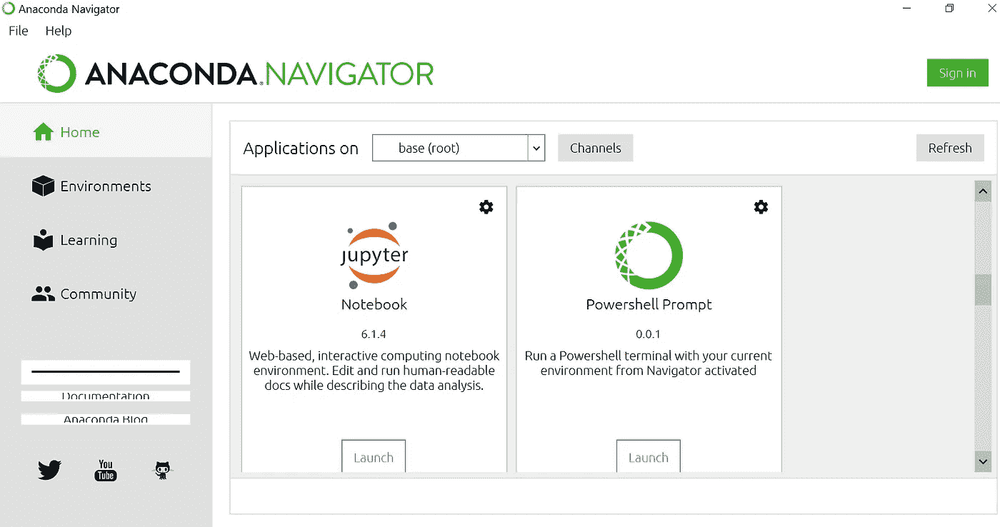

点击 Jupyter 笔记本上的“启动”

您的浏览器上将打开一个页面，如下所示:

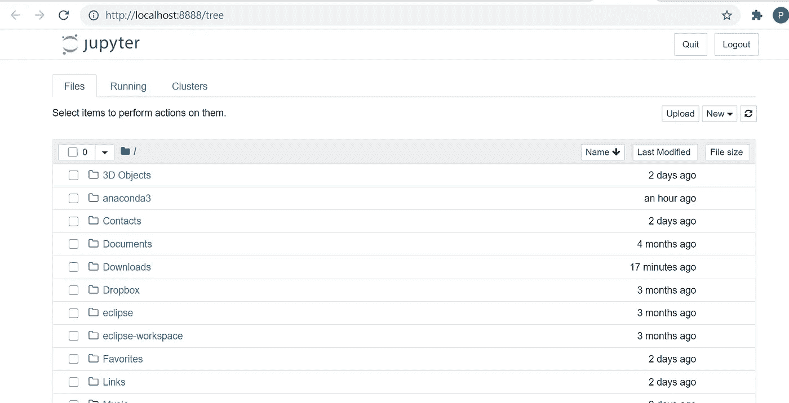

Jupyter 的启动页面

点击“新建”，选择“笔记本”下的“Python 3”

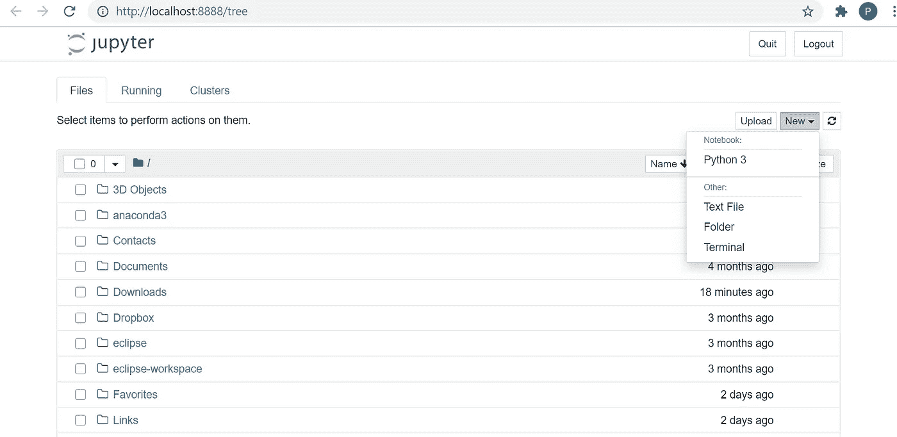

瞧啊。你应该有你自己的 Jupyter 笔记本！

重要的事情先来！我们把笔记本重新命名为“熊猫 _ 教程”之类的吧。你可以随意给它起任何名字。

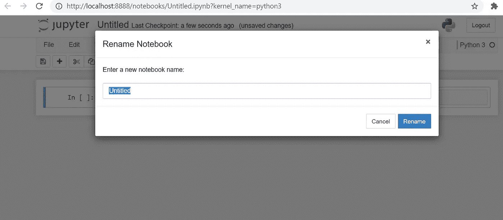

现在我们可以开始编码了！万岁！

**步骤 3—从熊猫的 CSV 文件中导入数据**

如果你坚持到了这里，好事情很快就会到来，我的朋友！抓紧，准备发射！

让我们从非常重要的一步开始:**在我们的 Jupyter 笔记本中输入熊猫**。

我们可以通过打字进口熊猫

```
**import pandas as pd**
```

使用熊猫的别名(如 pd)可以减少您在后续步骤中输入的工作量，尽管这是完全可选的。

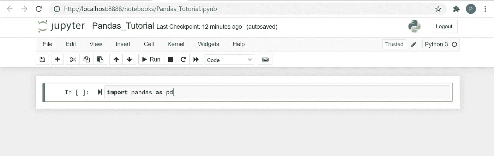

进口熊猫

现在让我们下载一个 CSV 文件，我们将在本教程中使用。我将使用 [Spotify 音乐分类](https://www.kaggle.com/geomack/spotifyclassification)的数据集。在 [Kaggle](https://www.kaggle.com/) 上注册/签到即可下载。我选择这个数据集的原因是，它有许多描述歌曲的“特征”或“属性”，我们可以用它们来获得一些有趣的见解。这个过程被称为[探索性数据分析](https://en.wikipedia.org/wiki/Exploratory_data_analysis)，在这个过程中，我们将尝试找出关于数据集的有意义的信息，例如:

*   **寻找前 K 首“最有活力/最没活力”的歌曲**
*   **查找持续时间最短/最长的前 K 首歌曲**
*   **寻找 K 首最适合跳舞/最不适合跳舞的歌曲**

诸如此类。

我们可以使用以下代码导入该数据集:

```
**df = pd.read_csv(r“**<File Path>**\data.csv”)**
```

文件路径前的 r 不是输入错误，而是表示原始字符串的特殊字符。如果我们不指定它，我们可能会在 Windows 机器上得到一个“FileNotFoundError”。

Pandas 使用一种叫做 [DataFrame](https://pandas.pydata.org/pandas-docs/stable/reference/api/pandas.DataFrame.html) 的数据结构来保存这些数据。DataFrame 允许我们存储“关系”或“表格”数据，并为我们提供了许多内置函数来操作数据。

我们可以只写下数据帧的名称来查看它，如下所示:

```
**df**
```

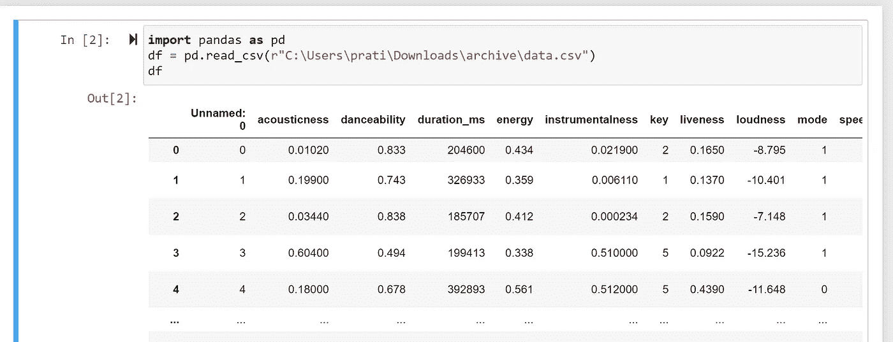

将 CSV 导入数据帧并查看

但通常，我们不想查看全部数据。我们只想先睹为快。这是你可以做到的。

```
**df.head() #**By default it shows the first 5 rows
```

我们还可以在 head()函数中指定行数，如下所示:

```
**df.head(10) #**It will show the first 10 rows
```

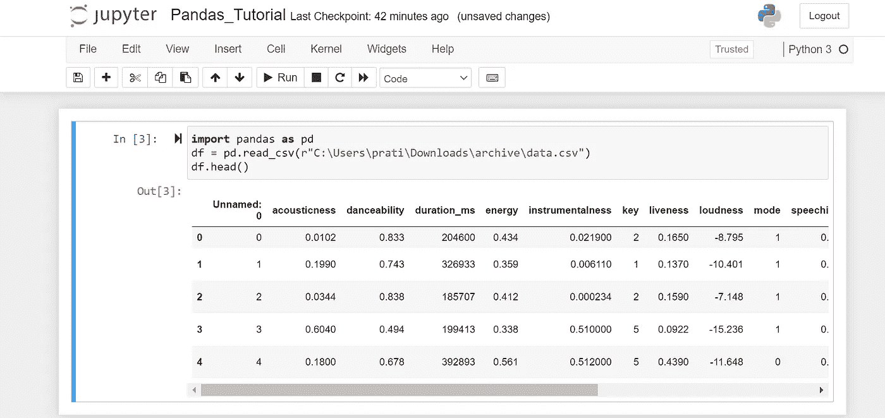

数据帧的前 5 行

如果我们想查看最后几行呢？

```
**df.tail() #**By default it shows the last 5 rows
```

我们还可以在 tail()函数中指定行数，如下所示:

```
**df.tail(10) #**It will show the last 10 rows
```

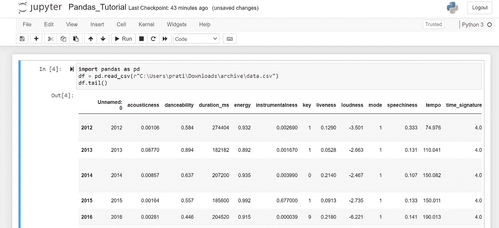

数据帧的最后 5 行

如果我们不想查看数据，而是想快速浏览整个数据框，比如列的数据类型、列中 Null/非 Null 值的数量等等，该怎么办？我们可以如下使用 **df.info()** 函数

```
**df.info()**
```

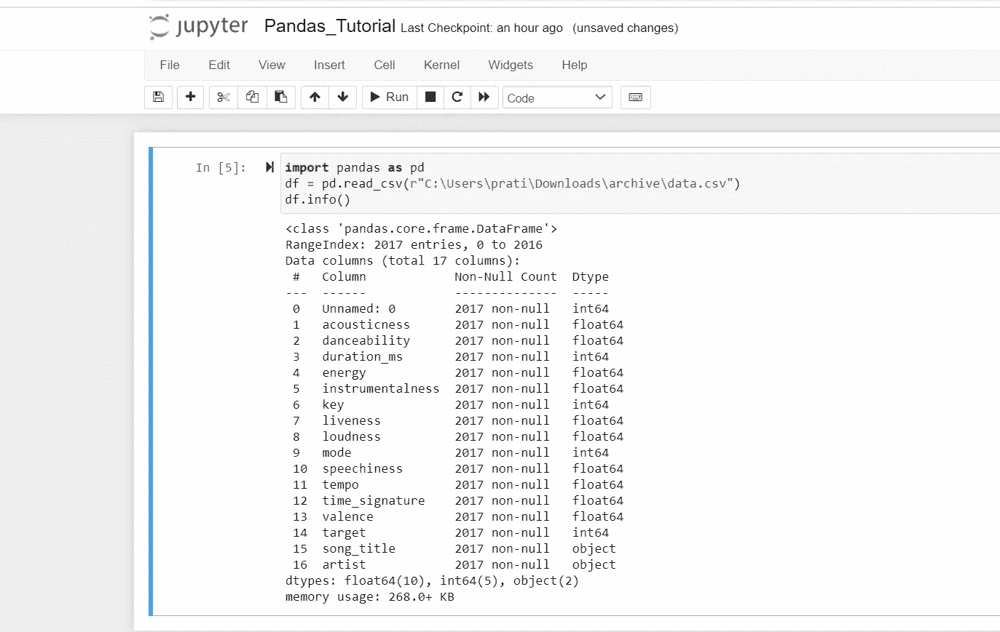

关于数据帧的信息

从上面的截图中，我们可以观察到 DataFrame 中有 16 列。我们也可以观察到有 2017 个数据点。我们还可以看到没有空值，这表明数据得到了很好的维护。我们还可以看到数据帧中所有列的数据类型。

如果我们只对列的数据类型感兴趣，我们可以使用 **df.dtypes** 来检查它

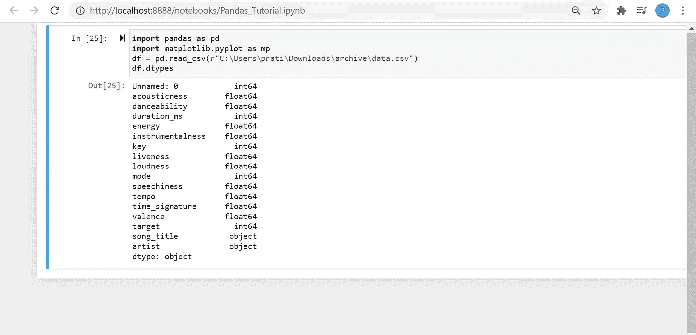

数据帧所有列的数据类型

通过这种方式，我们可以查看数据并提取关于数据的有意义的信息。如果这个数据集有空值，我们也必须处理那些丢失的值。对于教程 2，我计划使用一个包含空值的数据集，这样我就可以演示如何解决这个问题。

**步骤 4——过滤数据帧中的数据**

过滤是数据科学中经常使用的术语。它基本上意味着将数据帧分解成满足特定条件的子集。

在这个数据集中，我们可以使用诸如可跳性、持续时间等属性。要过滤出符合特定标准的前 K 首歌曲，如下所示:

**十大“最不适合跳舞”的歌曲:**

我们可以根据`danceability`列(默认为升序)对行进行排序，找到前 10 行并只提取`song_title`列的数据。这将给我们带来十大“最不适合跳舞”歌曲的`song_title`。

```
df.sort_values('danceability')['song_title'].head(10) 
```

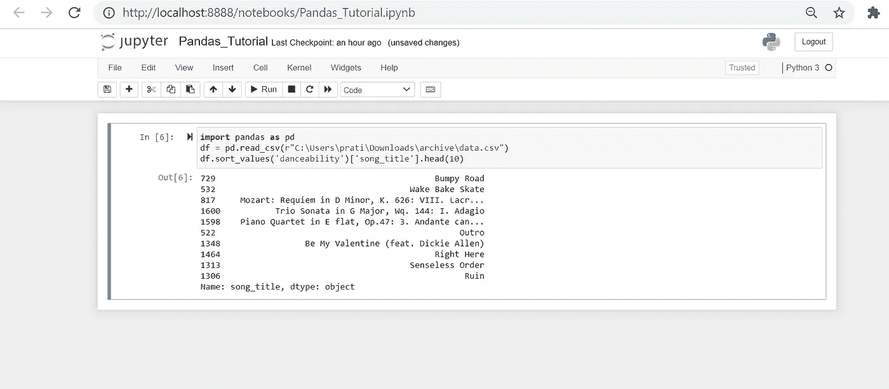

十大“最不适合跳舞”的歌曲

假设我们还想查看艺术家姓名，因为歌曲标题可能不是唯一的。我们可以通过在想要查看的列中添加`artist`来做到这一点，如下所示:

```
df.sort_values('danceability')[['song_title', 'artist']].head(10) 
```

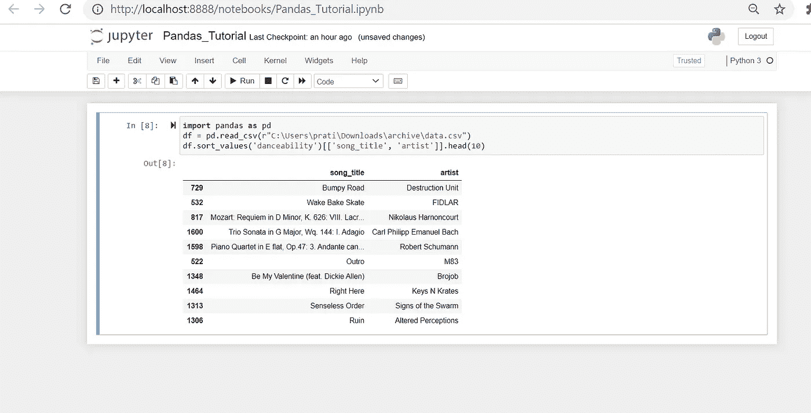

十大“最不适合跳舞”的歌曲名和艺人名

**最长的 10 首歌:**

我们可以根据`duration_ms`列对行进行排序，找到最后 10 行(因为默认情况下这些值是按升序排列的),并提取`song_title, artist, duration_ms`列的数据，如下所示:

```
df.sort_values('duration_ms')[['song_title', 'artist', 'duration_ms']].tail(10)
```

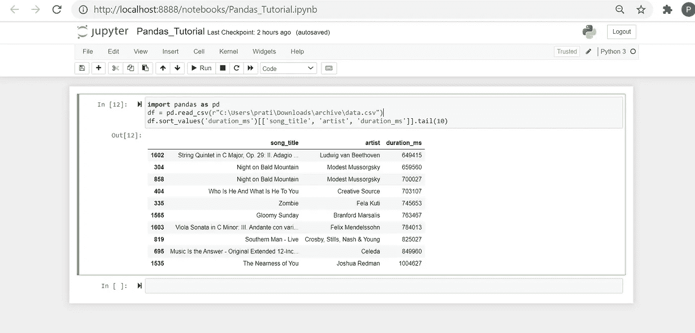

持续时间最长的歌曲及其持续时间和艺术家姓名

如果我们想做一个更复杂的查询呢？

**对于时长少于 400 秒的歌曲，找出前 10 首“最有活力”的歌曲:**

这里我们将不得不应用两个过滤器。

第一个过滤器是:**寻找少于 400 秒的歌曲**

如果我们应用第一个滤波器，我们可以观察到 1925 首歌曲的持续时间小于 400000 毫秒(即 400 秒)。因此，在 2017 年的歌曲中，我们只需要查看 1925 年的歌曲进行下一次筛选。

```
df_filt = df[df['duration_ms'] < 400000] #Our first filter in action
```

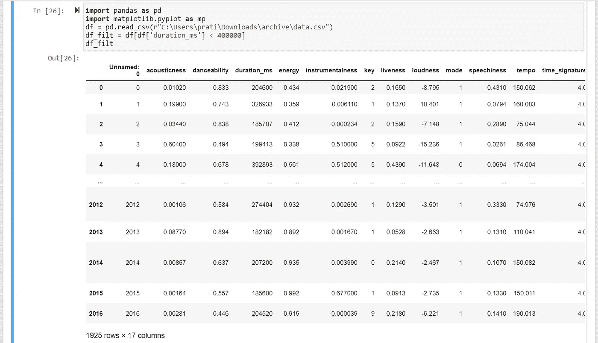

现在我们将应用我们的第二个过滤器。我们将从过滤的数据帧(df_filt)中以能量的升序排列这些歌曲，并提取最后 10 个值。

```
df_filt2 = df_filt.sort_values('energy')[['song_title', 'artist', 'duration_ms']].tail(10)
```

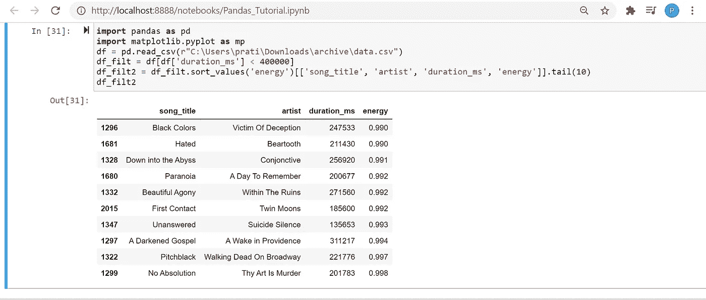

持续时间少于 400000 毫秒(400 秒)的前 10 首“最有活力”的歌曲

我们已经得到了我们想要的结果！但是现在我们观察到这些值是按升序排列的。既然我们已经要求了前 10 个值，让我们通过在`sort_values()`函数中设置属性`ascending=False`来将它们转换成降序，以获得更好的可读性。就这样，我们的任务完成了！

```
ans = df_filt2.sort_values('energy', ascending=False)
```

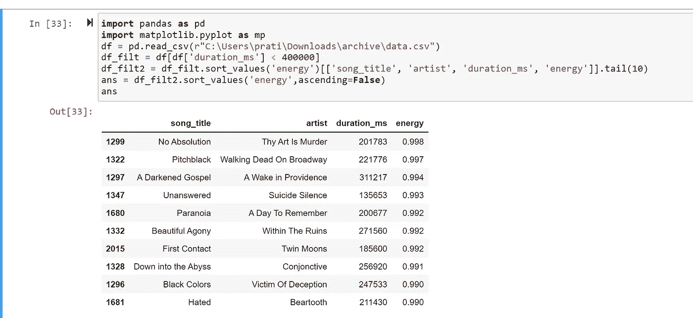

最终答案

我们还可以在应用第二个过滤器时按降序排列行，这样效率会高得多。但是我想一步一步地解释这些概念，所以我选择这样做。

**步骤 5—将数据导出为 CSV 格式**

假设我们在一个数据帧上进行一些数据操作，并在一个数据帧中得到预期的结果。如果我们想将其导出为 CSV 格式，用于其他地方或作为备份存储，我们可以执行以下操作:

```
df_filtered = df.sort_values('duration_ms')[['song_title', 'artist', 'duration_ms']].tail(10)
df_filtered.to_csv(r'<File Path>\filtered_data.csv')
```

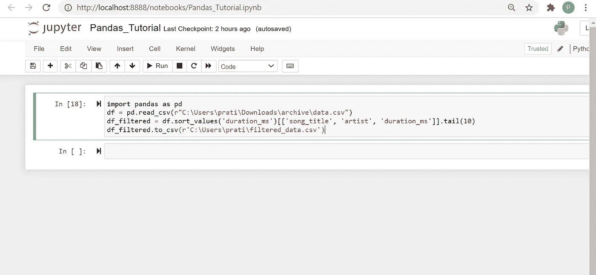

将 CSV 导出到本地

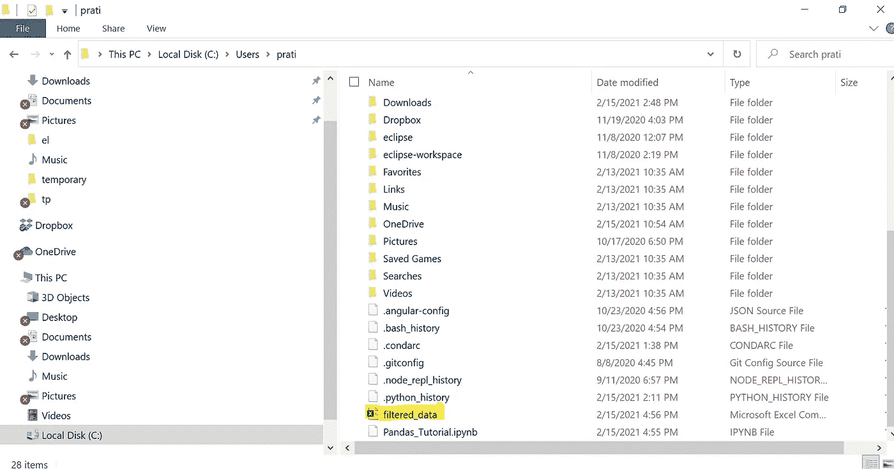

CSV 下载到本地

我们仅仅触及了使用这个库所能做的令人惊奇的事情的表面。俗话说“熟能生巧”，所以我会敦促你在收工前做以下活动！我知道你有这个能力！先别放弃！

**提高技能的活动**

如果你需要额外的练习，你可以尝试做以下活动:

*   查找`energy`列的值大于 0.4 的歌曲，并显示`song_title`列的值。
*   对于持续时间`duration_ms`值小于 300000 毫秒(300 秒)的歌曲，查找前 10 首“最快”的歌曲(`tempo`列值最高的歌曲)并显示`song_title, artist`列的值。
*   查找`artist`列= Drake 且`energy`列的值大于 0.5 的歌曲，并显示`song_title`列的值。


Photo by [蔡 世宏](https://unsplash.com/@cshong?utm_source=medium&utm_medium=referral) on [Unsplash](https://unsplash.com?utm_source=medium&utm_medium=referral)

**包装**

我知道你现在可能像上面的熊猫一样又累又困。但是我有一些好消息，我们已经完成了教程的第一部分。我计划再发布一篇关于熊猫的教程，其中我将介绍如何合并多个数据集，并且我还将使用 [Matplotlib](https://matplotlib.org/stable/index.html) 来执行信息可视化，这是另一个充满乐趣的 Python 库。我希望你读的时候和我写的时候一样开心！

下次再见朋友们！