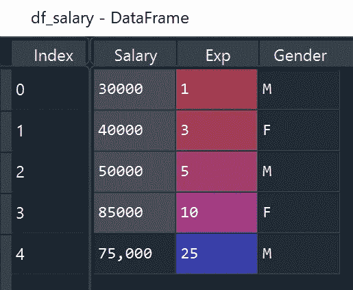
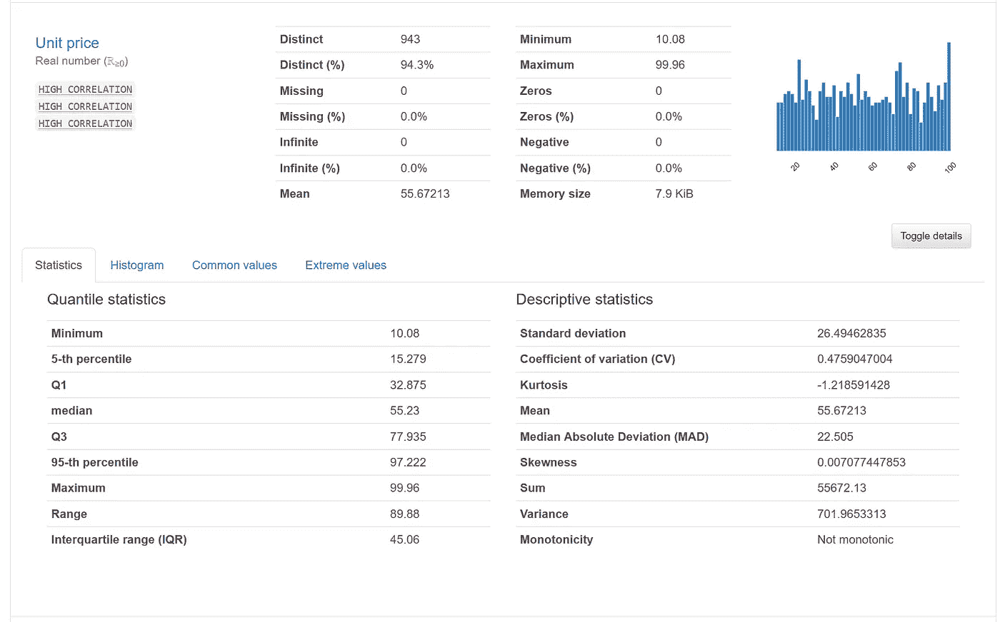
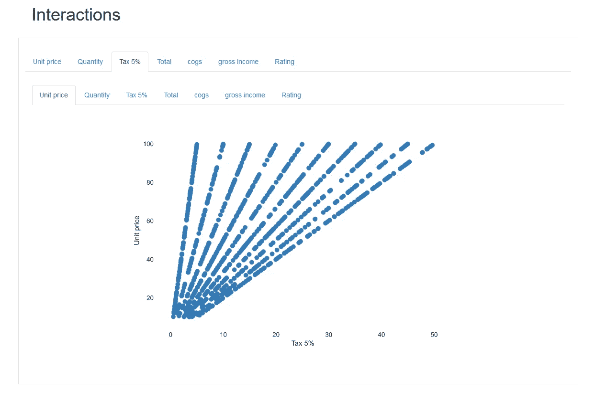
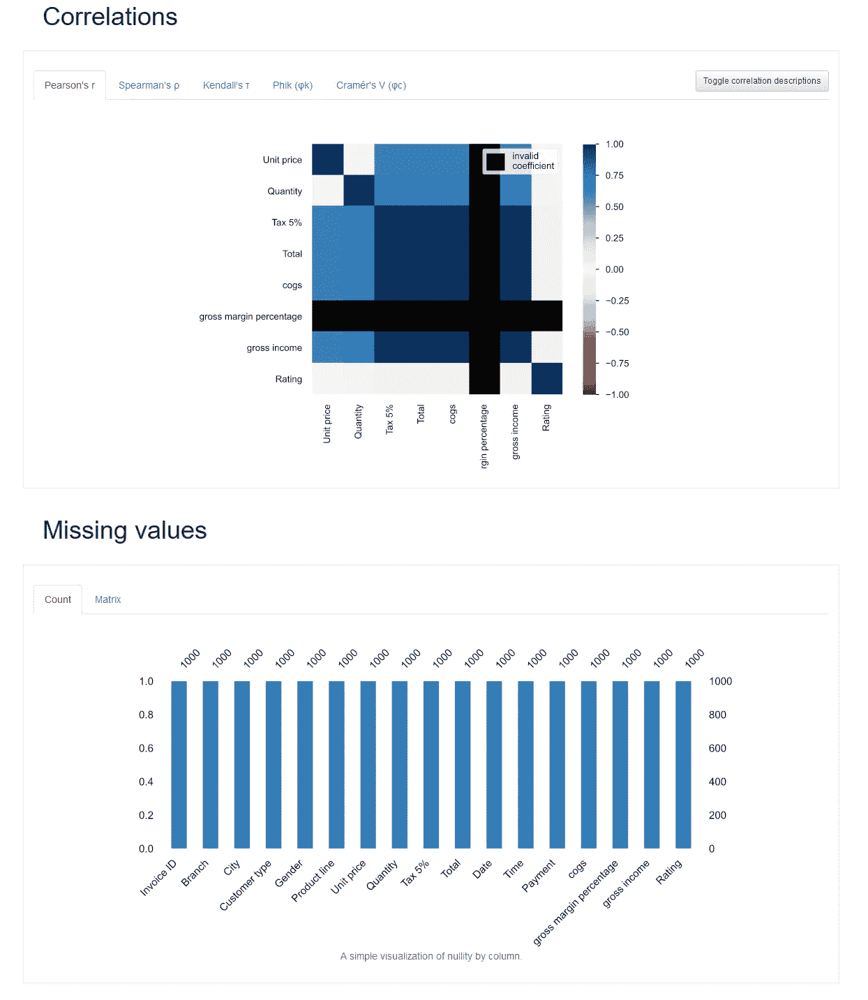
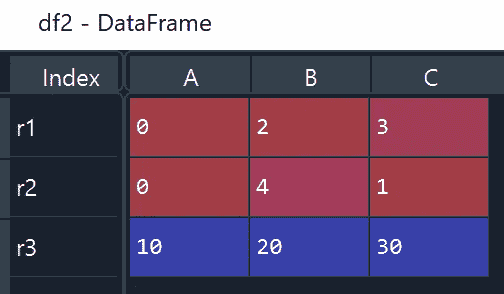

# 实用 Python 熊猫技巧-第 2 部分:数据预览和子集化

> 原文：<https://towardsdatascience.com/introduction-to-pandas-part-2-quick-data-exploration-582fc9b0de28?source=collection_archive---------40----------------------->

## 有用的熊猫函数和技巧来预览和子集化数据帧


照片由[杰·曼特里](https://unsplash.com/@jaymantri?utm_source=medium&utm_medium=referral)在 [Unsplash](https://unsplash.com?utm_source=medium&utm_medium=referral) 上拍摄

这篇文章是熊猫系列[的第二部分。请继续关注更多关于这个主题的文章。](https://pandas.pydata.org/)

[**第 1 部分:导入并创建数据帧**](/introduction-to-pandas-part-1-import-and-create-dataframe-e53326b6e2b1)

[**第二部分:数据预览和子集化**](/introduction-to-pandas-part-2-quick-data-exploration-582fc9b0de28)

[**第三部分:数据角力**](/introduction-to-pandas-part-3-data-wrangling-b490f8e47ca2)

# 介绍

在任何数据科学项目的开始，我们总是希望尽快熟悉数据。查看前 n 行并计算基本信息，如列名、数据类型、分布、统计汇总，将有助于我们理解数据。一旦我们对数据有了初步的了解，最常见的数据清理步骤之一就是子集化。

在本文中，我将使用“supermarket _ sales—sheet 1 . CSV”([下载链接](https://www.kaggle.com/aungpyaeap/supermarket-sales))作为数据源来介绍一些 Pandas 函数，这些函数允许我们进行快速数据探索和子集化。

# 先决条件

```
**# Install pandas library**
!pip install pandas**# Import pandas library**
import pandas as pd**# Import data source**
df = pd.read_csv('supermarket_sales - Sheet1.csv')
```

# 快速数据预览

**头&尾:**我们不用回顾整个数据集，只需要几行记录就能轻松消化信息。这两个函数分别返回 dataframe 的前 n 行和后 n 行。

```
**df.head(5)**
Out[65]: 
    Invoice ID Branch       City  ... gross margin percentage gross income Rating
0  750-67-8428      A     Yangon  ...                4.761905      26.1415    9.1
1  226-31-3081      C  Naypyitaw  ...                4.761905       3.8200    9.6
2  631-41-3108      A     Yangon  ...                4.761905      16.2155    7.4
3  123-19-1176      A     Yangon  ...                4.761905      23.2880    8.4
4  373-73-7910      A     Yangon  ...                4.761905      30.2085    5.3[5 rows x 17 columns]**df.tail(5)**
Out[66]: 
      Invoice ID Branch  ... gross income Rating
995  233-67-5758      C  ...       2.0175    6.2
996  303-96-2227      B  ...      48.6900    4.4
997  727-02-1313      A  ...       1.5920    7.7
998  347-56-2442      A  ...       3.2910    4.1
999  849-09-3807      A  ...      30.9190    6.6[5 rows x 17 columns]
```

**技巧 1:** 当我们想要预览一个巨大的 CSV 文件(> 10GB)时，我们可能不想等待很长时间来导入整个数据。有时，快速的数据片段对于确定数据文件及其数据结构中包含的信息非常有帮助。在这种情况下，我们可以使用`read_csv`中的`skiprows`和`nrows`选项来指定我们想要跳过和读取的行数，这可能会将导入时间从几个小时减少到几秒钟。

```
skiprows = 0
lenrow = 100
preview_df = pd.read_csv('supermarket_sales - Sheet1.csv', skiprows = skiprows, nrows = lenrow, header=0, engine='python')
```

**列&信息:**了解列名和数据类型对于初始检查非常重要。`columns`和`inf`函数可以输出列名、非空值的个数和每列的数据类型。

```
**df.columns** 
Index(['Invoice ID', 'Branch', 'City', 'Customer type', 'Gender',
       'Product line', 'Unit price', 'Quantity', 'Tax 5%', 'Total', 'Date',
       'Time', 'Payment', 'cogs', 'gross margin percentage', 'gross income',
       'Rating'],
      dtype='object')**df.info()**
Data columns (total 17 columns):
 #   Column                   Non-Null Count  Dtype  
---  ------                   --------------  -----  
 0   Invoice ID               1000 non-null   object 
 1   Branch                   1000 non-null   object 
 2   City                     1000 non-null   object 
 3   Customer type            1000 non-null   object 
 4   Gender                   1000 non-null   object 
 5   Product line             1000 non-null   object 
 6   Unit price               1000 non-null   float64
 7   Quantity                 1000 non-null   int64  
 8   Tax 5%                   1000 non-null   float64
 9   Total                    1000 non-null   float64
 10  Date                     1000 non-null   object 
 11  Time                     1000 non-null   object 
 12  Payment                  1000 non-null   object 
 13  cogs                     1000 non-null   float64
 14  gross margin percentage  1000 non-null   float64
 15  gross income             1000 non-null   float64
 16  Rating                   1000 non-null   float64
dtypes: float64(7), int64(1), object(9)
memory usage: 132.9+ KB
```

**技巧 2:** 您可能会注意到上面输出中的`object`数据类型。`object`可以包含整数、浮点、字符串等多种不同类型，统称为`object`。为了进一步检查给定列的数据类型，我们可以使用`type`来输出更多的细节。

在下面的示例中,“Salary”列包含整数值和字符串值。通过使用`type`，我们能够产生频率计数并基于数据类型查看子集。



(作者创作)

```
data= {'Salary': [30000, 40000, 50000, 85000, '75,000'],            
        'Exp': [1, 3, 5, 10, 25],          
        'Gender': ['M','F', 'M', 'F', 'M']} 
df_salary = pd.DataFrame(data)
**df_salary.info()**Out[74]:
Data columns (total 3 columns):
 #   Column  Non-Null Count  Dtype 
---  ------  --------------  ----- 
 0   Salary  5 non-null      object
 1   Exp     5 non-null      int64 
 2   Gender  5 non-null      object**df_salary.apply(lambda x: type(x['Salary']), axis = 1).value_counts()**Out[75]:
<class 'int'>    4
<class 'str'>    1
dtype: int64**df_salary[df_salary.apply(lambda x: type(x['Salary']), axis = 1)== str]**Out[80]: 
   Salary  Exp Gender
4  75,000   25      M
```

**招数 3:** 我上面提到过 **value_counts** 。它输出给定列的唯一值的计数。有时，我们需要制作两列的交叉表格。交叉表是一个方便的函数。默认情况下，它通过数据帧中的任意两列生成一个**频率表**。也可以传递一个聚合函数，比如`sum`。在下面的代码中，我们可以通过“产品线”和“城市”来计算总“数量”。

```
**df['City'].value_counts()**
Out[19]: 
Yangon       340
Mandalay     332
Naypyitaw    328
Name: City, dtype: int64**pd.crosstab(df['Product line'], df['City'])**
Out[22]: 
City                    Mandalay  Naypyitaw  Yangon
Product line                                       
Electronic accessories        55         55      60
Fashion accessories           62         65      51
Food and beverages            50         66      58
Health and beauty             53         52      47
Home and lifestyle            50         45      65
Sports and travel             62         45      59**pd.crosstab(df['Product line'], df['City'], values = df['Quantity'], aggfunc= 'sum')** Out[98]: 
City                    Mandalay  Naypyitaw  Yangon
Product line                                       
Electronic accessories       316        333     322
Fashion accessories          297        342     263
Food and beverages           270        369     313
Health and beauty            320        277     257
Home and lifestyle           295        245     371
Sports and travel            322        265     333
```

**描述:**该函数输出一个描述性的统计摘要，包括观察值、平均值、标准偏差、最小值、最大值和百分位数。

```
**df.describe()**
Out[18]: 
        Unit price     Quantity  ...  gross income      Rating
count  1000.000000  1000.000000  ...   1000.000000  1000.00000
mean     55.672130     5.510000  ...     15.379369     6.97270
std      26.494628     2.923431  ...     11.708825     1.71858
min      10.080000     1.000000  ...      0.508500     4.00000
25%      32.875000     3.000000  ...      5.924875     5.50000
50%      55.230000     5.000000  ...     12.088000     7.00000
75%      77.935000     8.000000  ...     22.445250     8.50000
max      99.960000    10.000000  ...     49.650000    10.00000[8 rows x 8 columns]
```

**招数四:描述**有帮助，但是**熊猫 _ 侧写。ProfileReport** 更好。Python 库，熊猫 _ 剖析。ProfileReport 允许我们生成全面的数据探索报告。类似于 describe，pandas_profiling。ProfileReport 将产生每一列的基本信息和描述性统计摘要。

```
**# Install the library**
!pip install pandas-profiling**# Import the library**
import pandas_profilingprofile = pandas_profiling.ProfileReport(df, title = "Data Exploration")
profile.to_file(output_file='Data Profile Output.html')
```

它还可以生成每一列的快速直方图，并允许我们创建任意两个数字列的散点图。此外，它还包括不同类型的列相关性和缺失值的计数。所有这些有用的信息都可以用几行代码生成。

使用此功能的另一个好处是，我们可以将报告保存为 web 格式，然后发送给其他人查看。



(作者创作)



(作者创作)



(作者创作)

# 子集数据框架

对于本节，让我们创建另一个示例数据帧。在该数据帧中，它包含['r1 '，' r2 '，' r3']的索引和['A '，' B '，' C']的列。

```
# Create a dataframe
df2 = pd.DataFrame([[0, 2, 3], [0, 4, 1], [10, 20, 30]],                 index=['r1', 'r2', 'r3'], columns=['A', 'B', 'C'])
```



(作者创作)

## 使用括号进行行选择

**df[开始行:结束行]:** 这将给**连续数据行的子集**。例如，df2[0:3]产生数据帧中的第一行到第三行。

**招数五:** df2[0]不提取第一行。相反，这会给我们一个名为“0”的列，这在我们的数据列['A '，' B '，' C']中是不可用的。相反，我们应该使用 df[0:1]来获取第一行。

**df[condition(boolean)]:**这将基于指定的条件创建数据帧的子集。例如，df2[df2[' C ']>10]生成列“C”大于 10 的行。df2[df2[' C ']≥3&df2[' A ']>3]生成列“C”大于或等于 3 且列“A”大于 3 的行。

**招数六:**在指定多个条件时，我们也可以在布尔条件内部使用`apply`，更加灵活。例如，`axis = 1`允许我们以行的方式实现分析。我们可以通过`bool`和`regular expression` 来输出真/假。

```
df2[df2.apply(lambda x: x['C']>=3 & x['A'] > 3, axis = 1)]
df[df.apply(lambda x: bool(re.findall('beauty', x['Product line'])) & (x['Gender'] == 'Female'), axis = 1)]
```

**招数 7:** 我们可以用`query`来指定一个布尔表达式。一个优点是我们不需要多次显式地写数据帧名称。

```
# df[df['Gender']=='Female']
df.query('Gender == "Female"') # df[df['Quantity']> 7]
df.query('Quantity > 7')
```

## 使用 iloc 选择行

**df . iloc[所选行]:]:**`iloc`允许我们根据**行号**提取一个子集。例如:df2.iloc[0:10，:]将生成前 10 行，而 df2.iloc[[0，2，5]，:]将生成包含第一、第三和第六行的子集。方括号内的`:`意味着我们将保留所有的列。

## 使用 loc 进行行选择

**df.loc[Selected Index，:】** : `loc`允许根据**索引**提取子集。例如，df2.loc['r1 '，:]将生成一个带有“index = 'r1 '”的子集。df2.loc[['r1 '，' r2']，:]将生成一个带有“index = 'r1 '和' r2 '”的子集。

## 使用双括号选择列

**df[[选择的列]]:** 使用一个双括号，我们可以在一个数据帧中选择单个或多个列。例如，df[['单价'，'数量']]将提取数据帧中的'单价'和'数量'列。

**招数八:单支架 vs 双支架。**我们可以使用单个括号来提取单个列。但是输出将被存储为一个**系列**，而一个双括号将给我们一个**数据帧**。

```
test1 = df[['Quantity']]type(test1)
Out[176]: pandas.core.frame.DataFrametest2 = df['Quantity']type(test2)
Out[178]: pandas.core.series.Series
```

**df.iloc[:，Selected Columns]vs df . loc[:，Selected Columns]:**`iloc`和`loc`都可以从数据帧中提取列的子集。区别在于`iloc`基于列号，而`loc`使用实际的列名。例如，df2.iloc[:，0]将提取第一列而不提及列名，而 df2.loc[:，' A']将从数据帧中提取列“A”。

# 感谢您的阅读！！！

如果你喜欢这篇文章，并且想**请我喝杯咖啡，**请[点击这里](https://ko-fi.com/aaronzhu)。

您可以注册一个 [**会员**](https://aaron-zhu.medium.com/membership) 来解锁我的文章的全部访问权限，并且可以无限制地访问介质上的所有内容。如果你想在我发表新文章时收到电子邮件通知，请订阅。