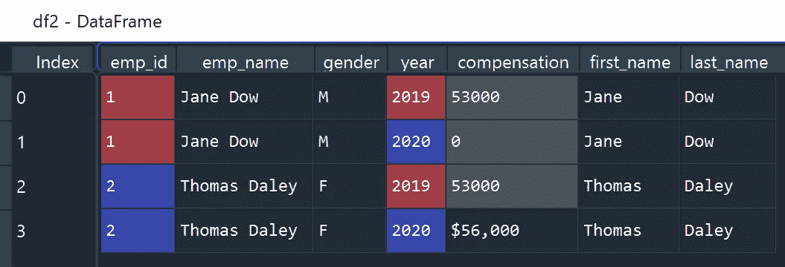
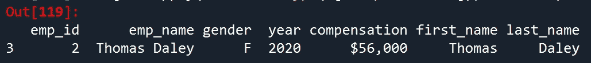

# 实用的 Python 熊猫把戏-第 3 部分:数据争论

> 原文：<https://towardsdatascience.com/introduction-to-pandas-part-3-data-wrangling-b490f8e47ca2?source=collection_archive---------26----------------------->

## 任何统计分析和机器学习模型都可以和你输入的数据质量一样好


由[和](https://unsplash.com/@kazuend?utm_source=medium&utm_medium=referral)在 [Unsplash](https://unsplash.com?utm_source=medium&utm_medium=referral) 上拍摄的照片

这篇文章是熊猫系列[的第三部分。请继续关注更多关于这个主题的文章。](https://pandas.pydata.org/)

[**第 1 部分:导入并创建数据帧**](/introduction-to-pandas-part-1-import-and-create-dataframe-e53326b6e2b1)

[**第二部分:数据预览和子集化**](/introduction-to-pandas-part-2-quick-data-exploration-582fc9b0de28)

[**第三部分:数据角力**](/introduction-to-pandas-part-3-data-wrangling-b490f8e47ca2)

# 介绍

在这篇文章中，我将介绍 Pandas 清理和转换数据帧的函数。我认为这是任何数据科学项目中最重要的步骤之一。 [**任何统计分析和机器学习模型都可以和你输入其中的数据质量一样好。**](/etl-skills-you-will-need-for-data-science-project-ebc67f7c9277)

# 先决条件

```
**# Install pandas library**
!pip install pandas**# Import libraries**
import pandas as pd
import numpy as np
```

# 缺少值

先说和熊猫处理缺失值。我将使用下面的 dataframe 作为数据源。

```
data = {'emp_id': [1, 1, 2, 2],
        'emp_name': ['Jane Dow', 'Jane Dow', 'Thomas Daley', 'Thomas Daley'],
        'gender': [np.nan, 'M', 'F', 'F'],
        'year': [2019, 2020, 2019, 2020],
        'compensation': [53000, np.nan, 53000, '$56,000']}df2  = pd.DataFrame(data)
df2Out[107]: 
   emp_id      emp_name gender  year compensation
0       1      Jane Dow    NaN  2019        53000
1       1      Jane Dow      M  2020          NaN
2       2  Thomas Daley      F  2019        53000
3       2  Thomas Daley      F  2020      $56,000
```

**is null()&not null():**`isnull()`允许我们根据指定的列显示缺少值的行，而`notnull()`将返回没有缺少值的行。

```
**df2[df2['compensation'].isnull()]**
Out[108]: 
   emp_id  emp_name gender  year compensation
1       1  Jane Dow      M  2020          NaN**df2[df2['compensation'].notnull()]**
Out[109]: 
   emp_id      emp_name gender  year compensation
0       1      Jane Dow    NaN  2019        53000
2       2  Thomas Daley      F  2019        53000
3       2  Thomas Daley      F  2020      $56,000
```

在我们检查了丢失的数据之后，我们可以删除它们或者用适当的值填充丢失的单元格。(关于缺失数据可以查看我的另一篇文章[】。)](/etl-skills-you-will-need-for-data-science-project-ebc67f7c9277)

在此数据框架中，我们看到“性别”和“薪酬”列中缺少值。我们可以用每个员工的非缺失性别值来填充缺失的性别，因为性别不会随时间而改变。此外，人力资源部门告诉我们，薪酬缺失意味着该员工已在当年离开公司。我们应该用 0 代替缺失的补偿。

`fillna()`允许我们用任何值替换丢失的值。在这种情况下，我们用值 0 替换丢失的补偿。我们可以将`method = 'backfill'`和`'ffill'`与`groupby()`一起使用，用给定员工的上一次或下一次有效观察来填充缺失的性别。

```
**df2['compensation'].fillna(0, inplace = True)**df2['gender'] = df2.groupby('emp_id')['gender'].**fillna(method = 'backfill')**df2['gender'] = df2.groupby('emp_id')['gender'].**fillna(method = 'ffill')**print(df2)
   emp_id      emp_name gender  year compensation
0       1      Jane Dow      **M**  2019        53000
1       1      Jane Dow      M  2020           ** 0**
2       2  Thomas Daley      F  2019        53000
3       2  Thomas Daley      F  2020      $56,000
```

# 字符串操作

**str.split():** `str.split()`允许我们将给定列中的文本拆分成多列。在下面的代码中，使用选项`expand = True`将“emp_name”列拆分为“first_name”和“last_name”列。默认情况下，列中的文本由空白分割，但是您可以使用选项`pat = '<str>'`指定分隔符。

```
df2[['first_name', 'last_name']] = df2['emp_name'].str.split(expand = True)
print(df2)
```



(作者创作)

**str.replace & re():字符串值包含字符，如“$”和“，”。**

```
**df2.apply(lambda x: type(x['compensation']), axis = 1).value_counts()**Out[118]: 
<class 'int'>    3
<class 'str'>    1
dtype: int64 **df2[df2.apply(lambda x: type(x['compensation']), axis = 1)== str]**
```



(作者创作)

很容易使用`str.replace()`来删除“$”和“，”。但是当我们这样做时，我们注意到整数值将被替换为`np.nan`，因为`str.replace()`不能处理整数值。

```
# Incorrect Method 
**df2['compensation'].str.replace('\$|,', '')**Out[124]: 
0      NaN
1      NaN
2      NaN
3    56000
Name: compensation, dtype: object
```

**技巧 1:** 为了正确地清理混合了字符串和数值的列，我们需要首先使用`astype()`将列中的值转换为字符串值，然后根据需要使用`str.replace()`或`re.sub()`替换相关的字符串值。最后，我们将列转换回数值。

```
# Method 1: Using str.replace() with astype()
df2['compensation'].astype(str).str.replace('\$|,', '').astype(int)# Method 2: Using apply with re.sub()
df2['compensation'] = df2.apply(lambda x: re.sub('\$|,', '', str(x['compensation'])), axis = 1).astype(int)
```

# 窗口功能

窗口功能在称为**窗口框架**的一组行上实现。窗口框架是基于一列或多列的同一组中的所有行。当一个窗口函数被实现时，一个新的列将被产生，并且输出将具有与原始数据集相同数量的行**。**

**创建行号为**的新列

```
df['new_column_name'] = df.groupby('{column name}').cumcount()+1
```

**在组内创建计数/最大值/最小值/平均值/总和**

在熊猫中，我们经常使用带窗口函数的**变换**，比如，count，max，min，avg，sum。

```
df.groupby('gender')['salary'].transform('count')
df.groupby('gender')['salary'].transform('max')
df.groupby('gender')['salary'].transform('min')
df.groupby('gender')['salary'].transform('mean')
df.groupby('gender')['salary'].transform('sum')
```

**在组内创建运行总和**

```
df.groupby('gender')['salary'].transform('cumsum')
```

**在组内创建百分位数**

```
# create median 
df.groupby('gender')['salary'].transform(lambda x: x.quantile(0.5))
```

**在组内创建滞后/领先**

```
# create lag variable
df.groupby('gender')['salary'].transform(lambda x: x.shift(1)) 
# create lead variable
df.groupby('gender')['salary'].transform(lambda x: x.shift(-1))
```

**创建组内排名**

```
df.groupby('gender')['salary'].rank('dense', ascending = False)
```

# 聚合函数

集合函数的实现方式与窗口函数相同。但是结果会更紧凑。最终输出中的观察值数量将等于不同组的数量(即分组变量中的唯一值)。

**折叠一个组中具有计数/最大值/最小值/平均值/总和的行**

在 Pandas 中，有许多方法可以实现聚合函数。我在下面的代码片段中包含了 3 种不同的方法。

*   使用 **groupby** 将聚合函数作为默认函数运行
*   使用**应用**运行内置聚合函数或带有 **groupby** 的用户自定义函数
*   使用 **agg** 更灵活地运行内置聚合函数或用户定义函数，例如命名新列和创建多个新列

```
df.groupby('gender')['salary'].mean().reset_index()
df.groupby('gender')['salary'].min().reset_index()
df.groupby('gender')['salary'].max().reset_index()
df.groupby('gender')['salary'].sum().reset_index()df.groupby('gender').apply(lambda x: x['salary'].mean()).reset_index()df.groupby('gender').agg(count = pd.NamedAgg('salary', 'mean')).reset_index()
```

**在组内创建百分位数**

```
df.groupby(‘gender’)[‘salary’].quantile(0.9).reset_index()
```

你可以在本文中查看更多关于 [**窗口函数&聚合函数**](/data-manipulation-sql-vs-pandas-116bb33a9abf) 的内容。

**招数二:应用自定义函数** — `apply`函数让我们有更大的灵活性和可控性来创建自定义函数。在下面的例子中，我将使用“supermarket _ sales—sheet 1 . CSV”([下载链接](https://www.kaggle.com/aungpyaeap/supermarket-sales))作为数据源。我们将根据“评级”列中的值创建一个新的评级类别列。

```
# Import data source
df = pd.read_csv('supermarket_sales - Sheet1.csv')def **rating_category**(rating):
    if rating >= 4 and rating <6:
        return 'Low'
    elif rating >= 6 and rating <8:
        return 'Mid'
    else:
        return 'High'df['rating_cat'] = df.apply(lambda x: **rating_category**(x['Rating']), axis = 1)
```

**招数三:使用 tqdm** 显示进度条——处理大数据集时，运行`apply`函数需要一段时间。如果我们知道工作状态以及我们预计任务完成的时间，那就太好了。Python 库`tqdm`与熊猫无缝协作。你只需要把`apply`换成`progress_apply`，其他都不变。

```
from tqdm import tqdm
tqdm.pandas()
df.progress_apply(lambda x: rating_category(x['Rating']), axis = 1)**100%|██████████| 1000/1000 [00:00<00:00, 104413.84it/s]**
```

**技巧 4:使用 Swifter 加速** —能够充分利用硬件能力来加速运行时间对于数据科学任务来说非常重要。如果决策者希望在短时间内看到结果，您的分析可能对他们没有帮助，但是您的程序需要几周或几个月才能运行。

Python 库`[swifter](https://medium.com/@jmcarpenter2/swiftapply-automatically-efficient-pandas-apply-operations-50e1058909f9)`可以有效地利用硬件能力，以最快的方式将任何函数应用于 Pandas 数据帧或系列对象。语法很简单，你只需要在`apply`函数前加上`swifter`。

```
import swifter
df.swifter.apply(lambda x: rating_category(x['Rating']), axis = 1)
```

# 连接多个数据框架

## 组合行

**append() & concat():** 我们可以使用`append()`或`concat()`按行方式组合两个数据帧，并产生相同的输出。我们可以使用`reset_index(drop=True)`来重置组合数据帧中的索引。

```
df3 = pd.DataFrame({'emp_id': 3, 'emp_name': 'Jason Zandi', 'gender': 'M', 'year': 2020, 'compensation': 60000}, index = [0])**df2.append(df3).reset_index(drop=True)
pd.concat([df2, df3]).reset_index(drop=True)**Out[182]: 
   emp_id      emp_name gender  year compensation
0       1      Jane Dow    NaN  2019        53000
1       1      Jane Dow      M  2020          NaN
2       2  Thomas Daley      F  2019        53000
3       2  Thomas Daley      F  2020      $56,000
4       3   Jason Zandi      M  2020        60000
```

## 合并列

**join()&merge():**`join()`或`merge()`都可以按列的方式组合两个数据帧。**区别在于** `**join()**` **是基于索引，而** `**merge()**` **是基于两个数据帧的公共列。**在下面的示例中，当使用基于索引的 join()组合 df2 和 df4 时，我们有一个匹配索引为[0]的行。当基于列“emp_id”使用 merge()组合 df2 和 d5 时，我们实现了一个典型的左连接操作。

```
df4 = pd.DataFrame({'test': 300}, index = [0]) 
df4
Out[190]: 
   test
0   300df5 = pd.DataFrame({'emp_id': [1, 2], 'title': ['Engineer', 'Analyst']})
df5
Out[192]: 
   emp_id     title
0       1  Engineer
1       2   Analyst **df2.join(df4)**
Out[188]: 
   emp_id      emp_name gender  year compensation   test
0       1      Jane Dow    NaN  2019        53000  300.0
1       1      Jane Dow      M  2020          NaN    NaN
2       2  Thomas Daley      F  2019        53000    NaN
3       2  Thomas Daley      F  2020      $56,000    NaN**df2.merge(df5, on = 'emp_id', how = 'right')**
Out[189]: 
   emp_id      emp_name gender  year compensation     title
0       1      Jane Dow    NaN  2019        53000  Engineer
1       1      Jane Dow      M  2020          NaN  Engineer
2       2  Thomas Daley      F  2019        53000   Analyst
3       2  Thomas Daley      F  2020      $56,000   Analyst
```

# 重新格式化数据帧

## 将数据帧从长转换为宽

`pivot()`和`pivot_table()`都会生成一个(宽)表，汇总来自一个更大(长)表的数据。不同的是`pivot_table()`还可以合并聚合函数，比如 sum、average、max、min 和 first。在下面的示例中，我们尝试基于“year”列创建单独的薪酬列“2019”和“2020”。

```
df2
Out[200]: 
   emp_id      emp_name gender  year compensation
0       1      Jane Dow      M  2019        53000
1       1      Jane Dow      M  2020            0
2       2  Thomas Daley      F  2019        53000
3       2  Thomas Daley      F  2020      $56,000**df_wide = df2.pivot(index = ['emp_id', 'emp_name', 'gender'], columns = ['year'], values = 'compensation').reset_index()**
print(df_wide)
year  emp_id      emp_name gender   2019     2020
0          1      Jane Dow      M  53000        0
1          2  Thomas Daley      F  53000  $56,000**df_wide2 = df2.pivot_table(index = ['emp_id', 'emp_name', 'gender'], columns = ['year'], values = 'compensation', aggfunc = 'first').reset_index()**
print(df_wide2)
year  emp_id      emp_name gender   2019     2020
0          1      Jane Dow      M  53000        0
1          2  Thomas Daley      F  53000  $56,000
```

## 将数据帧从宽转换为长

`melt()`允许我们将数据帧格式从宽改为长。这与创建数据透视表相反。在下面的示例中，我们希望将薪酬列“2019”和“2020”合并为一列，并创建一个新的“年份”列。

```
**df_long = df_wide.melt(id_vars= ['emp_id', 'emp_name', 'gender'], var_name= 'year', value_vars= [2019, 2020], value_name="Compensation")**
print(df_long)
   emp_id      emp_name gender  year Compensation
0       1      Jane Dow      M  2019        53000
1       2  Thomas Daley      F  2019        53000
2       1      Jane Dow      M  2020            0
3       2  Thomas Daley      F  2020      $56,000
```

# 感谢您的阅读！！！

如果你喜欢这篇文章，并且想**请我喝杯咖啡，请[点击这里](https://ko-fi.com/aaronzhu)。**

您可以注册一个 [**会员**](https://aaron-zhu.medium.com/membership) 来解锁我的文章的全部访问权限，并且可以无限制地访问介质上的所有内容。如果你想在我发表新文章时收到电子邮件通知，请 [**订阅**](https://aaron-zhu.medium.com/subscribe) 。