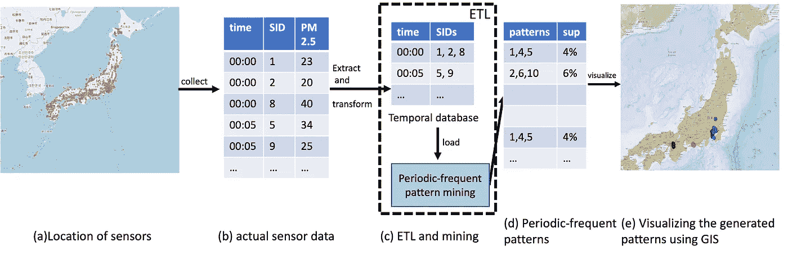
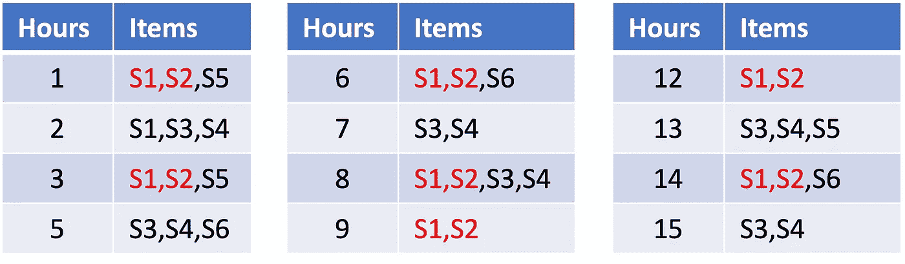

# 使用 PAMI 的空气污染分析

> 原文：<https://towardsdatascience.com/introduction-to-periodic-frequent-pattern-mining-using-pami-python-library-49a6e9dbc2e5?source=collection_archive---------20----------------------->

## 通过周期-频繁模式识别日本的污染热点

信息和通信技术领域的技术进步使各组织能够收集大数据。这些数据库中隐藏着能够使最终用户实现社会经济发展的有用信息。模式挖掘领域的出现是为了发现大数据中可能存在的有趣模式(或项目集)。本教程涵盖以下主题:

*   什么是周期性频繁模式？
*   如何在时态大数据中发现周期-频繁模式？
*   通过使用 PAMI 软件包中可用的算法寻找周期-频繁模式。
*   周期-频繁模式挖掘的优点和局限性是什么？

什么是周期-频繁模式？

周期频繁模式[1]是存在于时态数据库中的一类重要的规则。在现实世界的应用程序中找到这些模式具有很高的价值，因为它们代表了数据库可以预测的东西。*周期-频繁模式挖掘的目标是发现数据库中定期出现的所有频繁模式。*



图一。确定日本人们经常暴露于有害水平的 PM2.5 的地点[图片由作者提供]

**例如:**空气污染是日本许多心血管疾病的主要原因。日本平均每年有 4.26 万人因污染而死亡。为了解决这个问题，日本环境省建立了一个名为 [SORAMAME](https://soramame.env.go.jp/) (大气环境区域观测系统:AEROS) [3]的全国性传感器网络来监测污染。图 1a 显示了这些传感器在日本的空间位置。该系统每小时生成的空气污染物的原始数据(见图 1b)可以表示为时间数据库(见图 1c)。对该数据库的周期性-频繁模式挖掘(见图 1c)为环境学家和决策者提供了关于人们经常暴露于有害空气污染水平的区域的有用信息(见图 1d & 1e)。



表 1:一个样本时态数据库[图片由作者提供]

设 *{S1，S2，S3，S4，S5，S6}* 为一组空气污染测量传感器。表 1 显示了由这些传感器产生的假设的空气污染时间数据库。该数据库包含 12 个事务。该数据库的**初始时间戳**，即 *ts_initial=0* 。该数据库的**最终时间戳**，即 *ts_final=15* 。该数据库中的第一个事务提供了传感器 *S1、S2、*和 *S5* 记录了 PM2.5 的危险水平的信息。该数据库中的其他事务可以用类似的方式解释。传感器的集合， *S1* 和 *S2* ，即 *{S1，S2}* ，称为一个模式(或一个项集)。在表 1 中，这种模式出现在时间戳 1、3、6、8、9、12 和 14。因此，{S1，S2}的*支持度*(或*频率*)为 7。如果用户指定的*最小支持度*，记为 *minSup* 为 5，则 *{S1，S2}* 称为**频繁模式**。此模式的*周期*为:1 (=1-ts_initial)、2(= 3–1)、3(= 6–3)、2(= 8–6)、1(= 9–8)、3(= 12–9)、2(= 14–12)、1 (=ts_final-14)。该模式的最大*周期*被认为是其*周期*。于是， *{S1，S2}* 的*周期性*，即 *per({S1，S2})=max(1，2，3，2，1，3，2，1) = 3* 。这意味着传感器 *S1* 和 *S2* 至少每 3 小时同时记录一次 PM2.5 的危险水平。如果用户指定的*最大周期* ( *maxPer* )为 3，那么频繁模式 *{S1，S2}* 就称为周期-频繁模式。这种模式表示如下:

{S1，S2 }[支持度=7，周期=3]

**如何在时态大数据中发现周期-频繁模式？**

项目集格中项目的空间表示周期频繁模式挖掘的搜索空间。因此，周期-频繁模式挖掘的搜索空间是 *2^n-1* ，其中 *n* 表示数据库中的项目总数。挖掘算法通过使用**先验/反单调/向下闭包性质**来减少这个巨大的搜索空间。这个性质表示"*周期-频繁模式的所有非空子集也是周期-频繁模式*"这一特性使得模式挖掘在现实世界的大型数据库中变得可行。发现周期性频繁模式的算法有:

*   PFP-增长
*   PFP-增长++版
*   PS-增长和
*   PFP-ECLAT。

什么是 PAMI？怎么安装？如何实现在 PAMI 可用的周期-频繁模式挖掘算法？

[PAMI](https://github.com/udayRage/PAMI) 代表模式挖掘。它是一个 Python 库，包含几个模式挖掘算法。这个库是在 GPL V3 许可下提供的。用户只需执行以下命令即可安装该库:

```
pip install pami
```

PAMI 库的好处是数据库中的条目可以是整数或字符串。为了便于说明，我们使用空气污染数据库作为测试案例。[点击这里](https://www.u-aizu.ac.jp/~udayrage/datasets/temporalDatabases/temporal_pol_pm2_16.csv)下载数据库。用户可以尝试使用其他数据集。但是，请记住，时态数据库必须以以下格式存在:

```
timestamp<sep>item1<sep>item2<sep>...<sep>itemN
```

PAMI 算法使用的默认分隔符是制表符(默认)。然而，用户可以使用其他分隔符，如逗号和空格。如上所述，PAMI 包含几个算法来寻找周期频繁模式。然而，为了简洁起见，我们在本教程中使用 PS-growth 算法[4]。

PS-growth 算法的逐步含义如下:

步骤 1:从 PAMI 库中导入 PS-growth 算法

```
from PAMI.periodicFrequentPattern.basic import PSGrowth as alg
```

步骤 2:通过提供 data、minSup 和 maxPer 参数来初始化和执行挖掘算法。请注意，数据可以是 HTTP 链接、文件或数据帧。[点击此处](https://www.u-aizu.ac.jp/~udayrage/datasets/temporalDatabases/temporal_pol_pm2_16.csv)下载数据集。

```
URL="https://www.u-aizu.ac.jp/~udayrage/datasets/temporalDatabases/temporal_pol_pm2_16.csv"
obj = alg.PSGrowth(iFile=URL,minSup=100,maxPer=24)   #initialization
obj.startMine()                                      #execution 
```

步骤 3:将模式存储在文件中

```
obj.savePatterns('patterns.txt')
```

第四步:印刷图案

```
df = obj.getPatternsAsDataFrame()
df
```

步骤 5:计算模式、内存和运行时间的数量

```
print(len(df))
print(obj.getMemoryRSS())
print(obj.getRuntime())
```

**周期-频繁模式挖掘算法的优缺点是什么？**

优点:

*   向下封闭性使得挖掘算法可以部署在大规模数据库上
*   几个用户指定的(或超级)参数

缺点:

*   仅查找完全/完美出现的周期模式。因此，丢失了部分周期性出现的周期性模式。
*   数据库中可能生成了太多模式。

# **结论**

在这篇博客中，我们介绍了可能存在于时态数据库中的周期-频繁模式模型。这些模式的重要性也通过一个例子得到了证明。最后，我们描述了如何利用我们的 PAMI Python 库来发现空气污染数据中的隐藏模式。

**参考文献:**

[1] Syed Khairuzzaman Tanbeer，Chowdhury Farhan Ahmed，Byeong-Soo Jeong，Young-Koo Lee:在事务数据库中发现周期-频繁模式。pak DD 2009:242–253

[2]Statista:[https://www . Statista . com/statistics/935022/number-deaths-air-pollution-Japan/#:~:text = In % 202019% 2C % 20 the % 20 number % 20of，attribute % 20 to % 20 air % 20 pollution % 20 exposure](https://www.statista.com/statistics/935022/number-deaths-air-pollution-japan/#:~:text=In%202019%2C%20the%20number%20of,attributable%20to%20air%20pollution%20exposure)。

[3]SORAMAME:【https://soramame.env.go.jp/ (2021 年 11 月 14 日访问)

[4] R. Uday Kiran，Alampally Anirudh，Chennupati Saideep，Masashi Toyoda，P. Krishna Reddy，Masaru Kitsuregawa:使用周期摘要在时态数据库中寻找周期-频繁模式。《数据科学与模式识别》第 3 卷第 2 期第 24–46 页(2019 年)