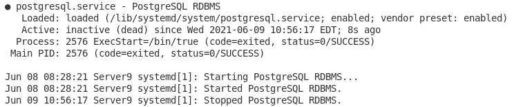

# Postgresql 简介:第 1 部分

> 原文：<https://towardsdatascience.com/introduction-to-postgresql-part-1-6ca9f25b02e1?source=collection_archive---------14----------------------->

## 让我们从头开始


詹姆斯·哈蒙德在 [Unsplash](https://unsplash.com?utm_source=medium&utm_medium=referral) 拍摄的照片

不久前，我写了一篇比较 MySQL 和 Postgresql 的文章。虽然这只是一个概述，但我对 Postgres 产生了兴趣。现在，这不是我第一次听说 Postgresql，我以前也尝试过使用它。然而，自从我接触它已经有一段时间了，我想现在是时候重新开始做一个教程了。首先，我们需要讨论 Postgresql 是什么，然后如何安装它，最后如何启动它。我使用 Ubuntu 命令行进行安装和配置。

# **关于 Postgresql 的更多信息**

Postgresql 是一个开源的数据库管理系统。它既强大又符合 ACID(原子性、一致性、隔离性、持久性)。Postgres 是一个对象关系数据库管理系统(ORDBMS)，这意味着它不同于 MySQL 等数据库管理系统。ORDBMS 结合了关系数据库管理系统和面向对象编程的特点。第一个主要区别在于数据类型。

Postgresql 支持所有常规 sql 数据类型，但也添加了典型 SQL RDBMS 不支持的各种类型。例如，Postgres 可以同时支持 JSON 和 XML 数据类型。它还可以支持数组、复合或范围等类型。Postgresql 甚至可以支持网络地址数据类型。这些数据类型不一定符合 ACID，因为它们不是原子的，但是在编码时允许更大范围的灵活性。

Postgresql 还体现了面向对象的能力。能够声明和使用函数就是这样一种能力。多态性也是 Postgres 可以容纳的一个因素。与此同时，继承也是 Postgres 的一项功能。使用 Postgresql 甚至可以进行数据封装和抽象。

为了帮助减少锁的机会，Postgres 实现了多版本并发控制(MVCC)。提醒一下，并发是指一次支持多个请求/操作的能力。它与并行不同，因为并行指的是同时运行两个或更多的请求/操作。MVCC 的一个主要目标是确保作者可以在不妨碍读者的情况下工作，反之亦然。MVCC 允许同一记录的多个版本，这样，即使正在进行更改，多个用户也可以访问该记录。在这种控制方法中，在写入数据库的用户提交更改之前，无论是添加、更新还是删除更改，都不会显示给正在读取记录的用户。

现在我们对 Postgresql 有了更多的了解，让我们来简单了解一下 Postgres 是为谁准备的，什么时候是使用 Postgresql 的好时机。

# Postgresql 是我的正确选择吗？

在选择您的数据库管理系统时，没有人比您更了解您的项目或项目的需求。然而，有几个很好的理由说明 Postgresql 为什么是一个很好的选择。

第一个原因是有多种数据类型可以使用。不仅是特定于 SQL 的，还有其他类型，如文档类型、几何类型，甚至是定制类型。这为您的数据库提供了更大的灵活性。

在选择数据库管理时，数据的完整性是另一个关键的考虑因素。Postgresql 通过各种可供选择的约束和锁来确保其数据。Postgres 也是 ACID 兼容的。除了完整性，Postgresql 还强调性能。无论是通过高级索引、实时(JIT)表达式编译、复杂的查询优化器，甚至是表分区，性能和可靠性都使 Postgres 成为编码人员技能的重要补充。

除了可靠性，您还需要考虑您可能需要什么类型的安全性。Postgresql 既有各种类型的身份验证，也有多因素身份验证。甚至对列和行级别都有安全性。但是在可靠性方面，你需要知道你可以恢复。因此，Postgres 也有灾难恢复计划。能够实施恢复计划，如预写日志(WAL)、不同类型的复制，甚至时间点恢复(PITR)。

就增长而言，Postgresql 有各种各样的可扩展特性。例如，因为它实现了一些面向对象的编程特性，所以可以实现函数和继承，以及多态。您还可以添加 PostGIS 等功能。Postgres 还支持 SQL 和 JSON 路径表达式。您甚至可以定制表的存储接口。最后一点，Postgresql 支持国际字符集，以及不区分重音的排序规则，并且可以实现全文搜索。

# **安装 Postgresql**

是时候安装 Postgres 了。提醒一下，我是用 Ubuntu 命令行安装的。

所以首先，我们需要更新我们的 apt-get，以防有我们目前没有安装的软件包更新。

```
sudo apt-get update
```

一旦运行完毕，我们现在就可以安装 Postgresql 了。我们将安装“postgresql”包和“postgresql-contrib”。回想一下，这可以在一行中完成。“contrib”包是可选的，只包含一些附加功能。然而，该功能的测试覆盖范围不如常规的“postgresql”包。如果您担心安装所需的空间，只需将“contrib”包从您的安装中去掉。

```
sudo apt-get install postgresql postgresql-contrib
```

现在我们已经安装了包，我们准备开始设置我们的数据库。

# **设置 Postgresql**

安装 Postgres 后，为了能够开始创建我们的数据库，我们需要确保它已经启动并运行。我们可以使用以下命令来检查服务的状态:

```
sudo service postgresql status
```



检查 PostgreSQL 服务的状态。

在我的例子中，看起来服务需要启动。我们可以用下面的命令来实现:

```
sudo service postgresql start
```

现在，我们再次运行状态并检查结果:

```
sudo service postgresql status
```


PostgreSQL 服务已启动。

如您所见，Postgresql 现在已经启动并运行了。现在，我们必须做的就是启动命令行界面。为此，我们使用以下代码行:

```
sudo -u postgres psql
```


PostgreSQL 命令行界面。

我们的最后一步是创建数据库，供下一部分使用。对于我的数据库，我将称它为“Recipes ”,因为我为这个例子创建了一个 recipe 数据库，但是您可以随意命名它:

```
CREATE DATABASE Recipes;
```


创作回应。

现在，要查看我们的数据库是否已创建，请使用以下代码(反斜杠 l):

```
\I
```


列出所有数据库。配方数据库已确认创建。

# **结论**

Postgresql 是一个开源的对象关系数据库管理系统(ORDBMS)。它是标准 SQL 和面向对象编程特性(如继承和多态)的有力结合。除了典型的 SQL 类型之外，Postgres 还支持各种数据类型，比如几何类型、文档类型(比如 JSON)、网络地址类型，甚至是定制的数据类型。Postgresql 还实现了 MVCC(多版本并发控制),并且是 ACID 兼容的。Postgres 的主要目标是保持完整性和可靠性。为了更加可靠，Postgresql 提供了不同的安全性、身份验证和灾难恢复选项。在选择 DBMS 时，Postgresql 的受欢迎程度和社区支持使它成为编码人员的资产。

在本系列中，我们将通过一个示例数据库来学习如何使用 Postgresql。我已经为我的表画出了图表，但是您可以使用任何您喜欢的数据库名称或表。这只是为了娱乐和教育。在这一部分中，我们主要学习了更多关于 Postgresql 的知识，我们安装并准备了它，并且创建了我们的数据库。在确认创建成功之后，我们就可以开始创建表了。但是我将在下一部分处理这个问题。所以，下次见，干杯！

***用我的*** [***每周简讯***](https://crafty-leader-2062.ck.page/8f8bcfb181) ***免费阅读我的所有文章，谢谢！***

***想看完介质上的所有文章？成为中等*** [***成员***](https://miketechgame.medium.com/membership) ***今天！***

查看我最近的文章:

[](/sqlite-vs-tinydb-7d6a6a42cb97) [## SQLite vs TinyDB

towardsdatascience.com](/sqlite-vs-tinydb-7d6a6a42cb97) [](https://python.plainenglish.io/python-virtual-environments-what-you-need-to-know-95487982c586) [## 关于 Python 虚拟环境你需要知道什么

### 如果你没有使用它们，你应该…

python .平原英语. io](https://python.plainenglish.io/python-virtual-environments-what-you-need-to-know-95487982c586) [](https://python.plainenglish.io/tinydb-b646e3270fd7) [## 使用 TinyDB 的简要指南

### 纯 Python 项目的内置数据库

python .平原英语. io](https://python.plainenglish.io/tinydb-b646e3270fd7) [](https://python.plainenglish.io/python-database-dumping-9a8658994e5a) [## Python 数据库转储

### 备份您的数据人员！

python .平原英语. io](https://python.plainenglish.io/python-database-dumping-9a8658994e5a) [](/learning-graphql-4e913f12640d) [## 学习图表 QL

towardsdatascience.com](/learning-graphql-4e913f12640d) 

参考资料:

[](https://www.postgresql.org/about/) [## 关于

### PostgreSQL 是一个强大的、开源的对象关系数据库系统，它使用并扩展了 SQL 语言和

www.postgresql.org](https://www.postgresql.org/about/) [](https://www.postgresql.org/docs/9.5/datatype.html) [## 数据类型

### 本文档适用于不受支持的 PostgreSQL 版本。您可能希望查看当前的同一页面…

www.postgresql.org](https://www.postgresql.org/docs/9.5/datatype.html)  [## O/R 建模第 1 部分:介绍 PostgreSQL 作为对象关系数据库管理系统

### 这是对 PostgreSQL 作为一个对象关系数据库管理系统的一个非常简短的介绍。在未来的博客文章中，我们…

ledgersmbdev.blogspot.com](http://ledgersmbdev.blogspot.com/2012/08/intro-to-postgresql-as-object.html) [](https://www.postgresql.org/docs/7.1/mvcc.html#MVCC-INTRO) [## 多版本并发控制

### 本文档适用于不受支持的 PostgreSQL 版本。您可能希望查看当前的同一页面…

www.postgresql.org](https://www.postgresql.org/docs/7.1/mvcc.html#MVCC-INTRO) [](https://www.postgresql.org/docs/9.0/sql-createdatabase.html) [## 创建数据库

### 本文档适用于不受支持的 PostgreSQL 版本。您可能希望查看当前的同一页面…

www.postgresql.org](https://www.postgresql.org/docs/9.0/sql-createdatabase.html) [](https://vladmihalcea.com/how-does-mvcc-multi-version-concurrency-control-work/) [## MVCC(多版本并发控制)是如何工作的

### 了解 MVCC(多版本并发控制)机制如何使用插入、更新和删除示例工作

vladmihalcea.com](https://vladmihalcea.com/how-does-mvcc-multi-version-concurrency-control-work/)