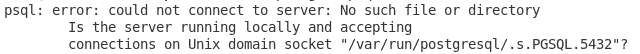
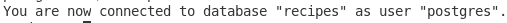
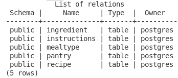

# Postgresql 简介:第 2 部分

> 原文：<https://towardsdatascience.com/introduction-to-postgresql-part-2-c25c346925d?source=collection_archive---------40----------------------->

## 让我们开始这个派对吧


Geran de Klerk 在 [Unsplash](https://unsplash.com?utm_source=medium&utm_medium=referral) 上拍摄的照片

[在第 1 部分](/introduction-to-postgresql-part-1-6ca9f25b02e1)中，我们讨论了什么是 Postgresql，它的预期用途，以及如何安装它。一旦安装了 Postgresql，我们就可以创建数据库了。为了打开 Postgresql，我们实际上使用了用户“Postgres”。这有点像你的默认管理员帐户。我们使用这个是因为我们没有创建任何当前用户，但这是我们稍后要做的事情。对于这一部分，我们需要创建我们的表。在最后一部分，我谈到了创建我的“食谱”数据库。同样，您可以使用任何适合您自己项目的数据库。

当你准备好你的数据库时，在你面前画一个 ERD(实体关系图)也无妨。它不仅有助于您完成数据库设计，还有助于可视化表之间的关系。我的 ERD 已经准备好了，让我们回到 Postgresql 命令行版本，开始使用这些表。

# **创建表格**

提醒一下，首先我们将运行以下命令进入 Postgresql 命令行界面:

```
sudo -u postgres psql
```

同样，“postgres”是用户，直到我们设置另一个用户。我们将在以后做那件事。如果您收到这样的错误，服务可能没有运行:



尝试启动 Postgresql 时出错。

要解决这个问题，我们只需启动服务，然后登录:

```
sudo service postgresql start
```

在第一部分的最后，我们创建了“食谱”数据库(不区分大小写)。在创建第一个表之前，我们需要连接到那个数据库。在 Postgresql 命令行界面中，这是通过使用“\c”实现的，如下所示:

```
\c recipes
```



连接到食谱数据库。

现在我们可以创建我们的第一个表。查看 ERD 或创建表时，请记住需要创建的顺序。需要在关系中的任何子表之前创建父表。

我的第一个表将只包含两列，其中一列只是主键。根据经验，通常不需要这些表。因为它只有一个表，所以我们可以只使用子表中的一列来代替。但是，我将在稍后的一个简短的 API 调用中使用这个表，所以为了只返回所需的数据，为了简单起见，我将创建这个表。但是需要注意的是，在常规实践中只有两列，所以不需要这个表。

这是第一张表:

```
CREATE TABLE MealType(
     MealTypeID SERIAL PRIMARY KEY,
     MealName VARCHAR NOT NULL
);
```


确认 MealType 已成功创建。

您可能注意到了，语法非常类似于 MySQL。但是，主键的设置略有不同。在 MySQL 中，我们使用一个“INT NOT NULL AUTO_INCREMENT”，或者使用一个“IDENTITY”列，并像往常一样添加您的主键。在 Postgres 中，通过简单地使用一个“SERIAL”值来增加值来声明我们的密钥似乎非常简单。

让我们用一个十进制值和另一个缺省值设置下一个表。它也将是父表。DECIMAL 类型是标准的 SQL 数据类型，因此声明它与其他 SQL 类型(如 MySQL)没有什么不同。在我们为默认值声明了数据类型之后，只需使用关键字 default 和您想要的值。

```
CREATE TABLE Pantry(
     PantryID SERIAL PRIMARY KEY,
     Title VARCHAR NOT NULL,
     TotalAmt DECIMAL (5, 2) NOT NULL,
     TotalAmtUnit VARCHAR DEFAULT 'LBS' NOT NULL
);
```


确认茶水间已成功创建。

我需要的下一个表是食谱表。该表将有一个外键。为此，创建一个外键约束，就像在 MySQL 中一样。添加列后，添加外键，声明该键将是哪一列，然后是关键字引用，最后是表和该表的主键。

```
CREATE TABLE Recipe(
     RecipeID SERIAL PRIMARY KEY,
     MealTypeID INT NOT NULL,
     Title VARCHAR NOT NULL,
     FOREIGN KEY(MealTypeID) REFERENCES MealType(MealTypeID)
);
```


确认配方已成功创建。

我们的下一个表将包含每个食谱的说明，所以我们也需要一个外键。这张桌子没什么特别的:

```
CREATE TABLE Instructions(
     InstructionID SERIAL PRIMARY KEY,
     RecipeID INT NOT NULL,
     StepNum INT NOT NULL,
     Description VARCHAR NOT NULL,
     FOREIGN KEY(RecipeID) REFERENCES Recipe(RecipeID)
);
```


确认说明已成功创建。

最后一张桌子是配料的。该表将有两个外键。一个是菜谱桌，另一个是配餐桌。这将是关联表(创建食谱和配餐项目之间的关联)。我想要实现的未来元素需要这个连接。一旦前端开始运行，我希望能够知道我是否有足够的配料来烹饪或烘焙食谱。要做到这一点，我需要知道我有多少配料，还有多少还留在食品柜里。如果储藏室里有足够的食物，食谱就可以用了，我必须决定如何处理没有所有必需食材的食谱。

```
CREATE TABLE Ingredient(
     IngredientID SERIAL PRIMARY KEY,
     RecipeID INT NOT NULL,
     MeasurementAmt DECIMAL(5, 2) NOT NULL,
     MeasurementUnit VARCHAR NOT NULL,
     Title VARCHAR NOT NULL,
     PantryID INT NOT NULL,
     FOREIGN KEY(RecipeID) REFERENCES Recipe(RecipeID),
     FOREIGN KEY(PantryID) REFERENCES Pantry(PantryID)
);
```


确认配料已成功创建。

现在我们已经定义并创建了表，我们需要确保可以在数据库中找到它们。要查看我们的表列表，我们需要 MySQL 的 SHOW TABLES 的等价物。在 Postgresql 中，我们使用以下内容:

```
\dt
```



显示所有表格。

创建好所有的表格后，我们就可以开始插入测试数据了。但是为了保持简短和易于理解，我们将在下一部分开始插入那些测试记录。您创建的表可能比我创建的数据库更小或更大。也许您需要不同类型的字段，包括非标准的 SQL 数据类型，如文档类型或网络地址类型。就我的目的而言，我目前不需要这些类型。如果我们想到要添加什么，我们可以以后再做。

**结论**

在这一部分中，我们学习了如何创建表。在很大程度上，语法与 MySQL 非常相似。但是，还是有一些不同，比如在创建自动递增主键字段时。在 Postgresql 中，我们使用串行数据类型。我们还学习了如何声明主键和外键。当比较语法时，这些也很像 MySQL。我们还学习了如何连接到食谱数据库。一旦创建了所有的表，我们还学习了如何显示我们创建的所有表。因为我们使用所有者“postgres”创建了它们，这是我们之前登录时使用的。我们还没有一个特定的用户创建，但我们会在以后做的。

对于下一部分，我们可以插入我们的测试数据，也许更新和删除记录。下次见，干杯！

***用我的*** [***每周简讯***](https://crafty-leader-2062.ck.page/8f8bcfb181) ***免费阅读我的所有文章，谢谢！***

***想阅读介质上的所有文章？成为中等*** [***成员***](https://miketechgame.medium.com/membership) ***今天！***

查看我最近的文章:

[](/introduction-to-postgresql-part-1-6ca9f25b02e1) [## Postgresql 简介:第 1 部分

### 让我们从头开始

towardsdatascience.com](/introduction-to-postgresql-part-1-6ca9f25b02e1) [](/sqlite-vs-tinydb-7d6a6a42cb97) [## SQLite vs TinyDB

towardsdatascience.com](/sqlite-vs-tinydb-7d6a6a42cb97) [](https://python.plainenglish.io/python-virtual-environments-what-you-need-to-know-95487982c586) [## 关于 Python 虚拟环境你需要知道什么

### 如果你没有使用它们，你应该…

python .平原英语. io](https://python.plainenglish.io/python-virtual-environments-what-you-need-to-know-95487982c586) [](https://python.plainenglish.io/tinydb-b646e3270fd7) [## 使用 TinyDB 的简要指南

### 纯 Python 项目的内置数据库

python .平原英语. io](https://python.plainenglish.io/tinydb-b646e3270fd7) [](https://python.plainenglish.io/python-database-dumping-9a8658994e5a) [## Python 数据库转储

### 备份您的数据人员！

python .平原英语. io](https://python.plainenglish.io/python-database-dumping-9a8658994e5a) 

参考资料:

[](https://stackoverflow.com/questions/10335561/use-database-name-command-in-postgresql) [## PostgreSQL 中的“使用数据库名称”命令

### 感谢贡献一个堆栈溢出的答案！请务必回答问题。提供详细信息并分享…

stackoverflow.com](https://stackoverflow.com/questions/10335561/use-database-name-command-in-postgresql)  [## 使用 PostgreSQL 序列创建自动递增列

### 摘要:在本教程中，您将了解 PostgreSQL 串行伪类型以及如何使用串行伪类型…

www.postgresqltutorial.com](https://www.postgresqltutorial.com/postgresql-serial/) [](https://www.postgresqltutorial.com/postgresql-show-tables/) [## PostgreSQL 显示表

### 摘要:在本教程中，您将学习如何使用 psql 工具和 pg_catalog 模式在 PostgreSQL 中显示表。如果…

www.postgresqltutorial.com](https://www.postgresqltutorial.com/postgresql-show-tables/) [](https://kb.objectrocket.com/postgresql/how-to-use-the-postgresql-double-precision-type-1435) [## 如何使用 PostgreSQL 双精度类型

### 当您需要存储具有大量十进制数字的数值时，您需要确保利用…

kb.objectrocket.com](https://kb.objectrocket.com/postgresql/how-to-use-the-postgresql-double-precision-type-1435) [](https://www.geeksforgeeks.org/postgresql-numeric-data-type/) [## PostgreSQL -数字数据类型- GeeksforGeeks

### PostgreSQL 支持 NUMERIC 类型来存储具有大量数字的数字。通常数字类型是…

www.geeksforgeeks.org](https://www.geeksforgeeks.org/postgresql-numeric-data-type/) [](https://dba.stackexchange.com/questions/212249/how-to-use-default-value-of-data-type-as-column-default) [## 如何使用数据类型的默认值作为列默认值？

### 感谢给数据库管理员栈交换贡献一个答案！请务必回答问题…

dba.stackexchange.com](https://dba.stackexchange.com/questions/212249/how-to-use-default-value-of-data-type-as-column-default)  [## PostgreSQL 外键

### 摘要:在本教程中，您将了解 PostgreSQL 外键以及如何使用…

www.postgresqltutorial.com](https://www.postgresqltutorial.com/postgresql-foreign-key/) [](https://www.postgresqltutorial.com/postgresql-describe-table/) [## PostgreSQL 描述表

### 摘要:在本教程中，您将学习如何使用 psql 工具和 information_schema 来描述…

www.postgresqltutorial.com](https://www.postgresqltutorial.com/postgresql-describe-table/)