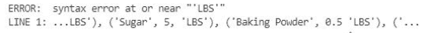
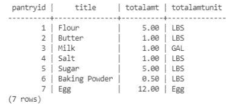

# Postgresql 简介:第 3 部分

> 原文：<https://towardsdatascience.com/introduction-to-postgresql-part-3-83f64fa68ed?source=collection_archive---------30----------------------->

## 插入、更新、删除的时间…


马修·斯皮特里在 [Unsplash](https://unsplash.com?utm_source=medium&utm_medium=referral) 上的照片

在[第二部分](/introduction-to-postgresql-part-2-c25c346925d?source=your_stories_page-------------------------------------)中，我们学习了如何在 Postgres 中创建表格。我们还研究了如何连接到数据库，所以如果您需要复习，请参阅第 2 部分。对于这一部分，我们将看看如何插入、更新和删除。一旦我们学会了做所有这三件事，我们的数据库将为我们以后可能想要创建的任何 API 或前端做好准备。

正如我们在上一部分中注意到的，Postgresql 在语法上与 MySQL 非常相似。随着我们今天了解得越来越多，我发现这些相似之处仍在继续，只是有一些不同。总的来说，如果你了解 MySQL，那么转换到 Postgresql 会比其他 SQL 转换简单得多。因此，知道我们的目标是什么，让我们直接进入代码。

# **插入**

显然，您需要启动 Postgresql，跳转到它的界面，然后连接到数据库。如果您有任何问题，可以回顾本教程的前几部分，了解如何启动 Postgres 服务以及如何登录。一旦进入，我们需要连接到数据库。我们已经在第 2 部分学到了这一点，但是作为一个简短的复习，您可以使用下面的命令:

```
\c recipes
```

接下来，我们可以看看我们的表。同样，我们在第 2 部分中讨论了这一点，但是如果您已经有一段时间没有查看数据库了，那么在尝试插入数据之前，最好先回顾一下您创建了哪些表。

```
\dt
```

对于我的数据库，我们将添加到 MealType 表的第一个表。要插入，我们指定要插入的列，然后列出值:

```
NSERT INTO MealType(MealName) VALUES (‘Breakfast’);
```


插入餐饮类型。

为了确保数据在那里，我们可以简单地从表中选择所有:

```
SELECT * FROM MealType;
```


查询 MealType 表。

在开始使用这些数据之前，我们还需要表中的一些记录。然而，由于还要添加四条记录，创建多个 INSERT 语句可能会变得很乏味。然而，使用 Postgres，我们可以简单地用逗号分隔一系列值，以便一次插入多条记录:

```
INSERT INTO MealType(MealName) VALUES (‘Lunch’),
     (‘Appetizer’),
     (‘Entree’),
     (‘Dessert’);
```


插入了多种膳食类型。

并再次选择以确保主键的序列值正常工作。


显示所有的餐饮类型。

检查我们的桌子，我们接下来要添加餐具室的桌子。但是，如果我们忘记了列名怎么办？在 MySQL 中，我们会使用 DESCRIBE 语句。Postgresql 也有一个这样的语句，它将以下命令与您的表名一起使用:

```
\d pantry;
```


餐具室桌子的描述。

现在我们知道了列是什么，以及需要什么，我们可以开始添加更多的数据。我们可以一次添加多个记录，但只会添加创建第一个食谱所需的食品柜项目。

简单地说，我在写出下面几行时犯了一个语法错误。它是一个丢失的逗号。通常，有一个通用的语法错误语句。然而，Postgresql 给我留下了这样一个错误消息:



语法错误消息。

如你所见，它非常具体，甚至指出了问题所在。一旦修复，我们可以在我们的记录中添加:

```
INSERT INTO Pantry(Title, TotalAmt, TotalAmtUnit) VALUES (‘Flour’, 5, ‘LBS’),
     (‘Butter’, 1, ‘LBS’),
     (‘Milk’, 1, ‘GAL’),
     (‘Salt’, 1, ‘LBS’),
     (‘Sugar’, 5, ‘LBS’),
     (‘Baking Powder’, 5, ‘LBS’),
     (‘Egg’, 12, ‘Egg’);
```


插入多个食品柜项目。



查询餐具室表。

我要添加的下一个表是 Recipe 表，它有一个来自 MealType 表的外键。我们需要查看 MealType 记录来确定外键的 ID。在这种情况下，我们正在制作的食谱是针对早餐的，因此我们将需要 ID 1，即“早餐”。接下来，我们准备插入我们的价值观。

```
INSERT INTO Recipe(MealTypeID, Title) VALUES (1, ‘Pancakes’);
```


插入配方表。


成功插入新配方。

接下来，我将添加到我的说明表中。这将有一个来自食谱表的外键。因为我们只向表中添加了一个配方，所以我们知道 ID 必须是 1。

```
INSERT INTO Instructions(RecipeID, StepNum, Description) VALUES (1, 1, ‘Melt butter and allow to cool. Add milk and one egg. Mix thoroughly.’),
     (1, 2, ‘Mix dry ingredient together in a separate bowl.’),
     (1, 3, ‘Preheat non-stick pan to medium, or use no-stick spray on pan.’),
     (1, 4, ‘Pour wet ingredients into dry ingredients. Mix until just combined. Do not overmix.’)
     (1, 5, ‘Pour ¼ cup fulls of pancake batter into heated pan. Flip once bubbles pop or until golden brown. Serve hot.’);
```


插入所有配方说明。


指令已成功插入。

你可以看到我已经打错字了，但是没关系。一旦我们开始更新记录，这些问题就可以得到纠正。现在，我只剩下一张桌子了。然而，该表是一个关联表，这意味着它至少连接了我们的两个表。在这种情况下，配料表连接食谱和餐具室。出于这个原因，我们将需要查看这两者，以找到我们的外键值应该是什么。同样，我们可以假设 Recipe 为 1，因为该表中没有其他记录。但是对于 Pantry，我们需要查看记录，这样我们就可以关联每种配料需要哪些键。


插入的成分。


成功插入配方配料。

# **更新**

插入记录后，我们可以看看如何更新记录。在设置说明的时候，我用了“成分”而不是“配料”。然而，这很容易解决。我们可以用一个简单的更新来改变文本。在我们的更新中，我们将首先声明表，然后将值设置为我们想要的列，最后，还添加了一个 WHERE 子句，以确保我们不会更新表中的所有记录。该语句的语法类似于 MySQL 中的语法。

```
UPDATE Instructions
SET Description = ‘Mix dry ingredients together in a separate bowl.’
WHERE InstructionID = 2;
```


更新了说明表。

为了检查我们的更改，我们可以将 WHERE 子句添加到 SELECT 语句中:

```
SELECT *
FROM Instructions
WHERE InstructionID = 2;
```


显示更新的记录。

对于更新，像任何其他 SQL 一样，您不必使用主键来更新。只需去掉 WHERE 子句，就可以更新表中的所有内容。我们不会这样做，因为我们必须将多个字段改回来。然而，我们可以使用成分表中的任何其他字段。如果你记得的话，我在成分表中为我们的测量单位将“tsp”和“tbsp”都设置为小写。但是如果我只想把单个的“T”换成大写的“T”呢？为此，我们可以只使用替换功能。注意，我知道我没有其他的 t 作为值，所以更新是安全的。如果您有可能因此而更改的其他记录，您可能还需要定义 ID。

```
UPDATE Ingredient
SET MeasurementUnit = REPLACE(MeasurementUnit, ‘t’, ‘T’);
```


更新的成分表。

“7”这个数字让我很担心。我认为应该只有“3”，因为这是应该更新的记录数。因此，我查看了所有记录，看起来所有记录都与预期完全一致:


升级成分表的结果。

# **删除**

首先，我将向 MealType 添加一个随机条目，以便我们可以删除它。这将是一个副本:


MealType 表中有重复记录。

如您所见，有两个“早餐”条目。因为这是一个重复，虽然它不会被认为是一个数据库，而有单独的 id，我们将想要删除它。同样，语法将类似于 MySQL。首先，启动 DELETE 并选择哪个表，然后使用 WHERE 子句确定要删除的记录:

```
DELETE FROM MealType
WHERE MealTypeID = 6;
```


已删除记录。


重复记录已删除。

删除时，序列号不会重置。这意味着您插入的下一条记录将是“7”，尽管表中只有 6 条记录。这很好，因为 ID 只是为了唯一性。

对于下一个删除测试，我想转储一个表中的所有记录。但是，它将是一个父表。现在，这种删除应该会失败，因为有子记录附加到父记录。我们没有指定级联应该打开，所以它不应该自动级联。然而，安全总比后悔好。为了确保我们不会丢失所有的工作，我们将执行第一次数据库转储。我在以前的文章中已经这样做了，但是因为这不是 Postgres 特有的，所以我们将再看一看。再次使用我们的 Postgres 用户，我们将执行 pg_dump。另外，请注意这不会发生在 Postgresql 终端内部，而是发生在常规的 bash 终端中。

```
sudo -u postgres pg_dump recipes > recipes.sql
```


转储文件已创建。

现在我们可以尝试从配方表中删除:

```
DELETE FROM Recipe;
```


级联删除错误。

看起来我们得到了一个错误，因为级联没有自动打开。如果 CASCADE 打开，它将删除与父记录相关联的所有子记录。但是现在，我们已经学习了足够多的关于插入、更新和删除的知识，可以让您在个人 Postgresql 数据库上有一个良好的开端。

# **结论**

在这一部分中，我们讨论了如何在 Postgresql 数据库中插入、更新和删除记录。在插入过程中，我们了解到只需一条语句就可以添加多条记录。通过更新，我们了解到不仅可以更改整个值，还可以在 SET 语句中使用 REPLACE right 之类的函数。在删除过程中，我们了解到，尽管最好还是小心为上，但在更新或删除事件时，表不会自动设置为级联。相反，用户可以选择何时级联什么。如果它不是自动的，我们就不会意外地同时删除所有的食谱、配料和说明。

目前，这将是我们在实际数据库方面所做的全部工作。以后可能还会回来加个前端。在此之前，我需要为此构建一个 API。它可能会使用 FastAPI。但在此之前，我希望本教程是有教育意义的，令人愉快的。干杯！

***用我的*** [***每周简讯***](https://crafty-leader-2062.ck.page/8f8bcfb181) ***免费阅读我的所有文章，谢谢！***

***想阅读介质上的所有文章？成为中等*** [***成员***](https://miketechgame.medium.com/membership) ***今天！***

查看我最近的文章:

[](https://python.plainenglish.io/hosting-your-own-pypi-a55f2a6eca4d) [## 托管您自己的 PyPi

### 是的，有可能。

python .平原英语. io](https://python.plainenglish.io/hosting-your-own-pypi-a55f2a6eca4d) [](/open-source-reporting-tools-worth-a-look-a49a91d93f9a) [## 值得一看的开源报告工具

### 探索微软 SSRS 的替代方案

towardsdatascience.com](/open-source-reporting-tools-worth-a-look-a49a91d93f9a) [](https://python.plainenglish.io/middleware-in-fastapi-what-is-it-fa028349489d) [## FastAPI 中的中间件——它是什么？

### 解释其中的奥秘…

python .平原英语. io](https://python.plainenglish.io/middleware-in-fastapi-what-is-it-fa028349489d) [](/introduction-to-postgresql-part-2-c25c346925d) [## Postgresql 简介:第 2 部分

### 让我们开始这个派对吧

towardsdatascience.com](/introduction-to-postgresql-part-2-c25c346925d) [](/introduction-to-postgresql-part-1-6ca9f25b02e1) [## Postgresql 简介:第 1 部分

### 让我们从头开始

towardsdatascience.com](/introduction-to-postgresql-part-1-6ca9f25b02e1) 

参考资料:

[](https://www.postgresqltutorial.com/postgresql-insert-multiple-rows/) [## PostgreSQL 插入多行

### 摘要:在本教程中，您将学习如何使用一条 PostgreSQL INSERT 语句将多行插入到…

www.postgresqltutorial.com](https://www.postgresqltutorial.com/postgresql-insert-multiple-rows/) [](https://stackoverflow.com/questions/109325/postgresql-describe-table) [## PostgreSQL“描述表”

### 有很多方法来描述 PostgreSQL 中的表，简单的答案是用法，如果你在 Postgres shell 中[…

stackoverflow.com](https://stackoverflow.com/questions/109325/postgresql-describe-table) [](https://stackoverflow.com/questions/27152413/postgresql-update-substring-replacement) [## PostgreSQL 更新子字符串替换

### 我在一个测试数据库中有几行的值前面有美元符号。我想更新…中的值

stackoverflow.com](https://stackoverflow.com/questions/27152413/postgresql-update-substring-replacement)  [## PostgreSQL -如何将数据库转储到 SQL 脚本- pg_dump 实用程序

### 位于 PostgreSQL 安装的 bin 目录中的 pg_dump 实用程序可用于导出数据库定义和数据…

www.sqlines.com](http://www.sqlines.com/postgresql/how-to/pg_dump_database_file) [](https://www.tutorialspoint.com/mysql/mysql-delete-query.htm) [## MySQL -删除查询

### 如果您想从任何 MySQL 表中删除一条记录，那么您可以使用 SQL 命令 DELETE FROM。你可以用这个…

www.tutorialspoint.com](https://www.tutorialspoint.com/mysql/mysql-delete-query.htm)