# 概率分类导论:机器学习的视角

> 原文：<https://towardsdatascience.com/introduction-to-probabilistic-classification-a-machine-learning-perspective-b4776b469453?source=collection_archive---------0----------------------->

## 从预测标签到预测概率的指南

资料来源:纳赛尔·塔米米在 Unsplash 上。

您能够训练和评估分类模型，包括线性和非线性模型结构。干得好！现在，你想要类别概率而不是类别标签。不读了。这是你正在寻找的文章。本文将带您了解不同的评估指标、其优缺点以及针对多个 ML 模型的最佳模型训练。

# 给猫和狗分类

设想创建一个模型，其唯一目的是对猫和狗进行分类。分类模型不会是完美的，因此会错误地对某些观察结果进行分类。有些猫会被归类为狗，反之亦然。这就是生活。在这个例子中，模型对 100 只猫和狗进行分类。[混淆矩阵](https://en.wikipedia.org/wiki/Confusion_matrix)是显示预测准确性的常用可视化工具，图 1 显示了该示例的混淆矩阵。

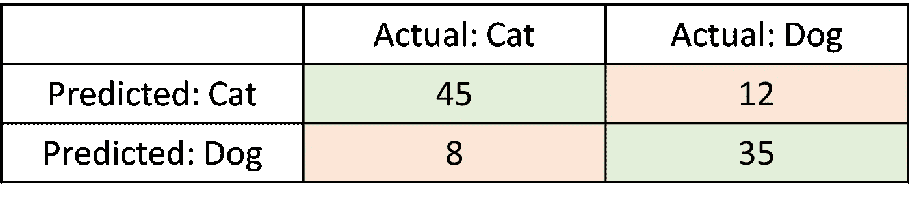

图 1:100 只猫狗分类的混淆矩阵。来源:作者。

让我们把注意力集中在 12 个观察结果上，模型预测的是一只猫，而实际上它是一只狗。如果模型预测有 51%的概率是猫，而结果是一只狗，那肯定是可能的。但是，如果模型预测 95%的概率是猫，结果是狗呢？这似乎不太可能。

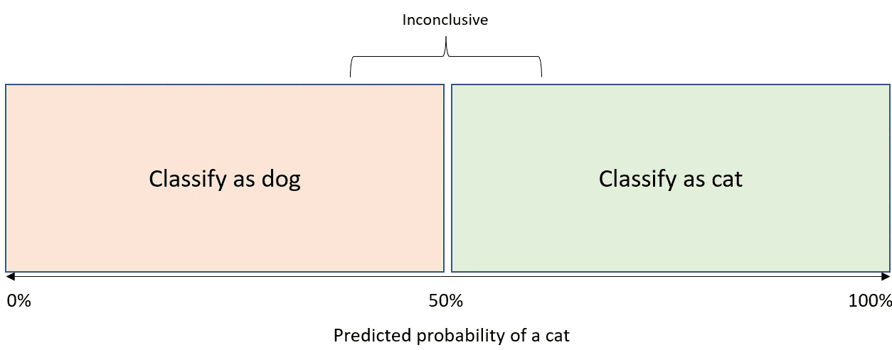

图 cat 的预测概率和分类阈值。来源:作者。

分类器使用预测的概率和阈值对观察值进行分类。图 2 显示了阈值为 50%的分类。使用 50%的阈值似乎是直观的，但是对于调整阈值没有限制。所以，最后唯一重要的是观察的顺序。改变目标来预测概率而不是标签需要不同的方法。为此，我们进入*概率分类*领域。

# 评估指标 1:对数损失

让我们从猫和狗推广到 0 和 1 的类标签。类别概率是 0 到 1 之间的任何实数。模型目标是将预测概率与类别标签相匹配，即最大化等式中给出的[可能性](https://en.wikipedia.org/wiki/Likelihood_function)。1，在给定预测概率的情况下观察类别标签。

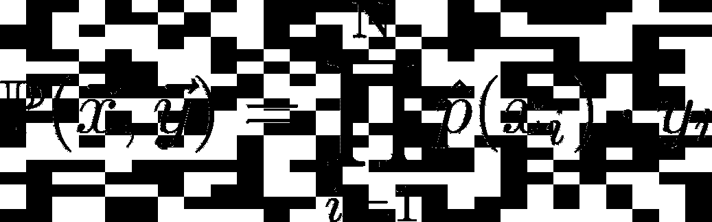

等式 1:类别标签的可能性 **y** 和基于特征的预测概率 **x** 。

这种可能性的一个主要缺点是，如果观察次数增加，个体概率的乘积会变得越来越小。因此，有了足够的数据，任何计算机的数值精度都有可能下溢。其次，参数的乘积很难区分。这就是为什么对数的可能性是首选，通常被称为对数似然。对数是其自变量的单调递增函数。因此，*函数的对数最大化等价于函数本身的最大化*。

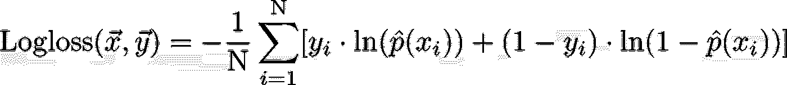

等式 2:类别标签的对数损失 **y** 和基于特征的预测概率 **x** 。

尽管如此，对数似然性仍然随观察次数而变化，因此平均对数似然性是解释观察到的变化的更好的度量。然而，在实践中，大多数人最小化负的平均对数似然，而不是最大化平均对数似然，因为优化器通常最小化函数。数据科学家通常将这一指标称为对数损失，如等式 1 所示。2.关于 Logloss 及其与分类模型评估中通常使用的评估指标的关系的更详细的讨论，我建议您参考本文[。](/intuition-behind-log-loss-score-4e0c9979680a)

# 评估标准 2: Brier 评分

Logloss 旁边的 [*欧石南得分*](https://en.wikipedia.org/wiki/Brier_score) ，如 Eq 中给出。3，通常用作预测概率的评估指标。本质上，它是对预测概率和类别标签的二次损失。注意回归模型评估中使用的[均方误差(MSE)](https://en.wikipedia.org/wiki/Mean_squared_error) 之间的相似性。

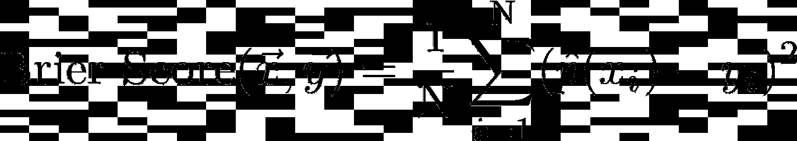

等式 3:类别标签的 Brier 分数 **y** 和基于特征的预测概率 **x** 。

然而，与 MSE 的一个显著区别是 Brier 的最低分数不是 0。Brier 分数是标签和概率的平方损失(T21)，因此根据定义不为 0。简而言之，如果底层过程是非确定性的，则最小值不为 0，这是首先使用概率分类的原因。为了解决这个问题，通常在相对的基础上用其他概率分类器来评估概率，例如使用 Brier Skill 分数。

# **带有虚拟数据的示例**

在本节中，我将展示一个使用虚拟数据从分类到概率估计的步骤示例。这个例子将展示多个 ML 模型，从逻辑回归到随机森林。让我们首先使用 [Sklearn](https://scikit-learn.org/stable/) 创建虚拟数据。虚拟数据集包含信息性特征和冗余特征，并且引入了每个类的多个聚类。

使用 ML 模型结构对虚拟数据进行分类:

*   [逻辑回归](https://en.wikipedia.org/wiki/Logistic_regression) (LR)，
*   [支持向量机](https://nl.wikipedia.org/wiki/Support_vector_machine) (SVM)、
*   [决策树](https://en.wikipedia.org/wiki/Decision_tree#:~:text=A%20decision%20tree%20is%20a,only%20contains%20conditional%20control%20statements.) (DT)，
*   [随机森林](https://en.wikipedia.org/wiki/Random_forest#:~:text=Random%20forests%20or%20random%20decision,decision%20trees%20at%20training%20time.&text=Random%20forests%20generally%20outperform%20decision,lower%20than%20gradient%20boosted%20trees.) (RF)。

使用 [ROC-AUC 分数](https://developers.google.com/machine-learning/crash-course/classification/roc-and-auc)评估 ML 模型的正确分类能力。图 3 显示，所有的最大似然模型在分类虚拟数据方面做得相当好，即 ROC-AUC > 0.65，而 RBF SVM 和 RF 表现最好。

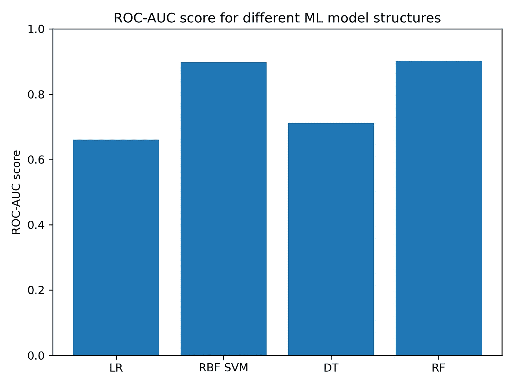

图 3:不同 ML 模型结构的样本外数据的 ROC-AUC 得分。来源:作者。

但是，请注意，模型的目标是预测概率。ML 模型能够准确地对观察结果进行分类是件好事，但是模型预测分类概率的能力有多强呢？有两种评估预测概率的方法:

*   定量地用 Brier 评分和 Logloss
*   用校准图定性。

# 概率的定量评估

首先，使用 Brier 评分和 Logloss 对 ML 模型进行定量评估。图 4 显示 RBF SVM 和 RF 在基于 Brier 评分(左)和 Logloss(右)的概率估计中表现最佳。注意，DT 的 Logloss 相对较高，要了解其原因，请参考本文。

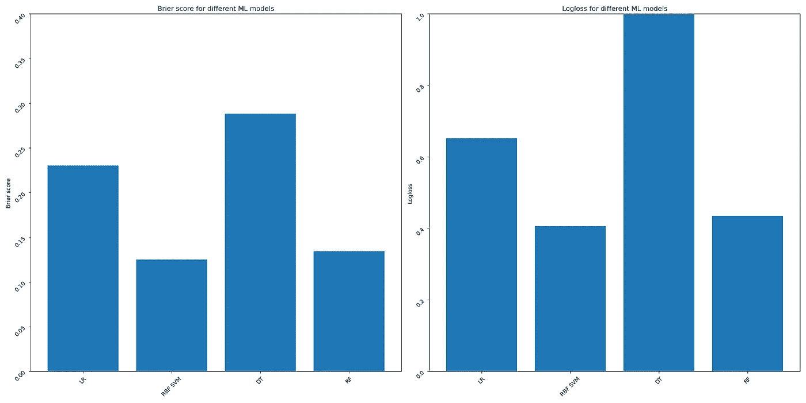

图 4:不同 ML 模型结构的样本外数据的 Brier 得分(左)和 Logloss(右)。来源:作者。

# 概率的定性评估

其次，使用[校准图](https://scikit-learn.org/stable/modules/calibration.html)对 ML 模型进行定性评估。校准图的目的是显示和评估预测的概率是否与实际的阳性分数相匹配。该图将预测的概率存储在统一的存储桶中，并将预测的平均值与阳性分数进行比较。图 5 显示了我们示例的校准图。您可以看到 LR 和 RBF SVM 得到了很好的校准，即平均预测概率与阳性分数非常匹配。然而，检查 LR 的预测概率的分布表明，预测概率比 RBF SVM 更集中。接下来，你会看到 DT 校准不当，预测概率的分布似乎是错误的。

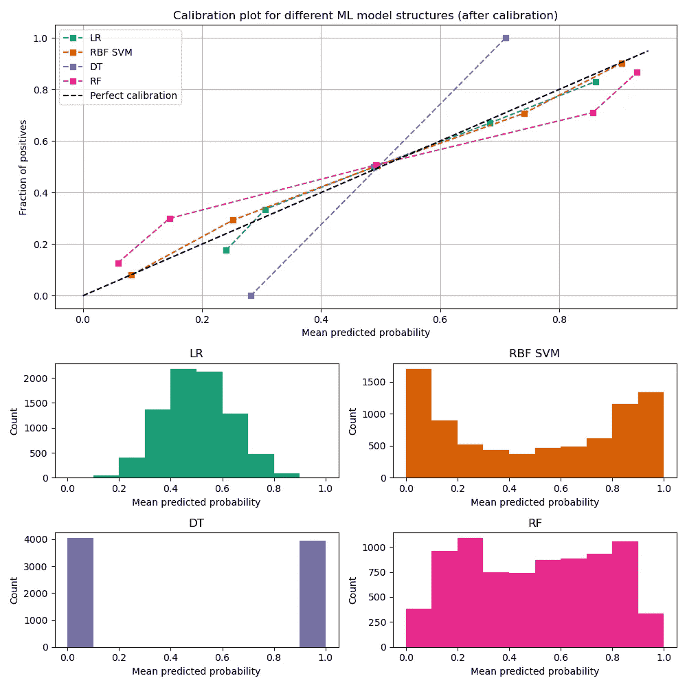

图 5:不同 ML 模型的校准图(上图)和概率分布图(下图)。来源:作者。

## **为什么预测概率与后验概率不匹配？**

Niculescu-Mizil 和 Caruano 在他们 2005 年的论文 [*“用监督学习预测好的概率”*](https://www.cs.cornell.edu/~alexn/papers/calibration.icml05.crc.rev3.pdf) 中解释了为什么一些 ML 模型观察到与后验概率相比扭曲的预测概率。让我们从解释根本原因开始。当分类模型没有被训练来降低对数损失时，预测概率与后验概率不匹配。对此的解决方案是将模型训练后的预测概率映射到后验概率，这被称为[训练后校准](https://scikit-learn.org/stable/modules/calibration.html)。常用的概率校准技术有:

*   普拉特标度(普拉特，1999 年)
*   等渗回归(Zadrozny，2001 年)

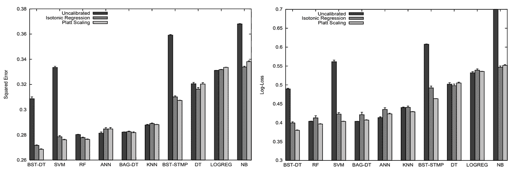

图 6:用普拉特标度和保序回归进行训练后概率校准后的模型性能。资料来源:(Niculescu 等人，2005 年)

## 校准决策树和随机森林

ML 模型使用 Platt 标度和保序回归进行校准，这两种方法在 Sklearn 中都很容易编码。注意，LR 没有被校准，因为该模型结构被训练以减少对数损失，因此默认情况下具有校准的概率。

唯一可调的参数是概率校准的交叉验证数。Niculescu (2005)表明，小的校准集大小可能会降低性能，并且对于增强和打包的决策树和支持向量机来说，性能改善是最积极的。我们的示例在测试数据集中包含 8，000 个观察值。对于 5 重交叉验证，为校准集大小保留 1，600 个观察值。

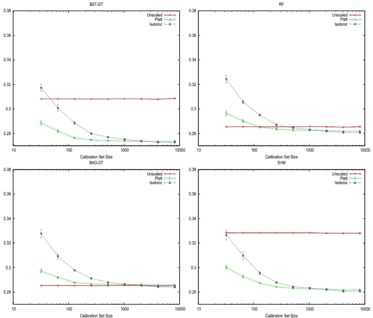

图 7:不同 ML 模型和不同校准集大小的 Platt 标度和保序回归的 Brier 评分。资料来源:(Niculescu 等人，2005 年)

# 概率校准后的模型评估

让我们看看概率校准是否改善了 Brier 分数、Logloss 和校准图。图 7 显示了概率校准后的 Brier 评分和对数损失。因为数据集包含足够数量的观察值，所以保序回归具有与普拉特缩放相当的性能。考虑到保序回归的非参数性质，我必须警告校准集规模较小的情况。但是，如果你打算在小数据量上做概率分类，我建议你使用先验信息，探索[贝叶斯分类](https://en.wikipedia.org/wiki/Bayesian_probability)的领域。

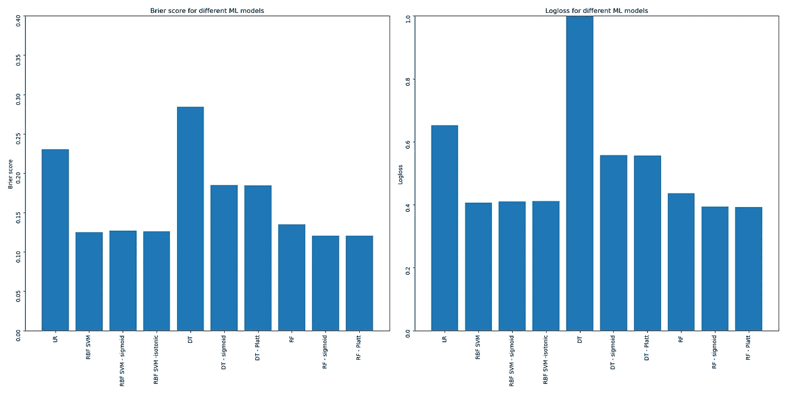

图 7:对样本外数据进行训练后校准后的 Brier 得分(左)和 Logloss(右)。来源:作者。

图 8 显示了训练后校准后的校准图。你会看到 SVM、DT 和 RF 的预测概率有所提高。其次，预测概率的分布完全覆盖[0，1]的范围，并提供准确的平均预测概率。

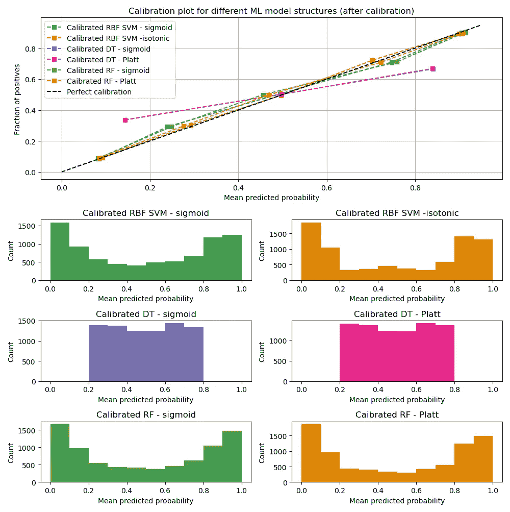

图 8:ML 模型训练后校准后的校准图(上图)和概率图(下图)。来源:作者。

## 概率校准会影响分类能力吗？

校准不会改变预测概率的排序。校准仅改变预测的概率以更好地匹配观察到的阳性分数。图 9 显示，在概率校准后，通过 ROC-AUC 分数测量的模型的分类能力相等或更好。

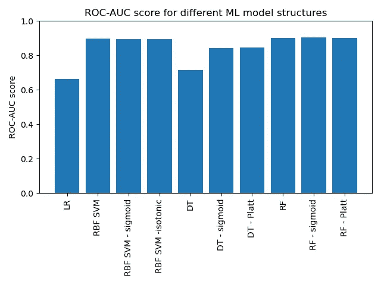

图 9:不同 ML 模型结构的训练后校准后的 ROC-AUC 得分。来源:作者。

## 预测概率？校准模型！

虚拟示例清楚地表明，训练后校准对于精确估计所讨论的 ML 模型的类概率是至关重要的。

## 额外资源

下面的教程/讲座对我个人理解概率分类非常有帮助。我已经根据(个人)重要性对这些资源进行了排名，我强烈建议查看这些资源。

**学术界**

1.  斯坦福大学电气工程教授桑杰·拉尔。
2.  研究科学家 Andreas Müller，计算机科学@ [哥伦比亚](https://www.youtube.com/watch?v=w3OPq0V8fr8&t=85s&ab_channel=AndreasMueller)。

**行业**

1.  数据科学家贝基·塔克，@ [网飞](https://dataisblue.io/python/data_science/2020/02/16/calibrating-random-forest.html)。
2.  数据科学家 Gordon Chen，@ [甲骨文](https://www.youtube.com/watch?v=RXMu96RJj_s)。

## 参考

[1]普拉特，J. (1999 年)。支持向量机的概率输出以及与正则似然方法的比较。*大间距分类器的进展*(第 61-74 页)。

[2]b . Zadrozny 和 c . Elkan(2001 年)。从决策树和朴素贝叶斯分类器获得校准的概率估计。 *ICML* (第 609–616 页)。

[3]尼古列斯库-米齐尔和卡鲁阿纳(2005 年)。用监督学习预测好的概率。*过程。第 22 届机器学习国际会议*(ICML 05)。

如果你热衷于阅读更多，请看下面我的文章:

</multi-armed-bandits-applied-to-order-allocation-among-execution-algorithms-fff21dedc927>  <https://medium.com/@larsterbraak/cost-decomposition-for-a-vwap-execution-algorithm-buy-side-perspective-1126f9eebf40>  <https://medium.com/@larsterbraak/beyond-traditional-return-modelling-embracing-thick-tails-67f457dfbf6b> 