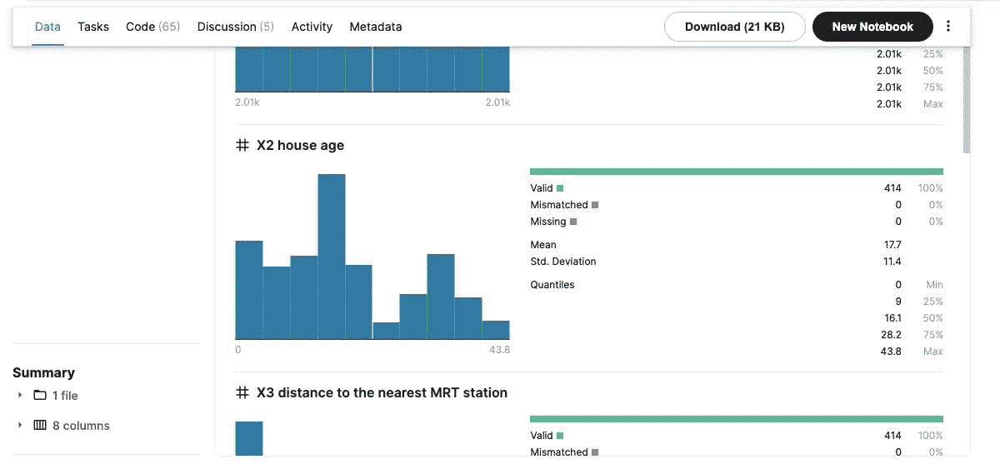

# Pyspark ML Lib 简介:构建您的第一个线性回归模型

> 原文：<https://towardsdatascience.com/introduction-to-pyspark-ml-lib-build-your-first-linear-regression-model-68631cdcf08a?source=collection_archive---------45----------------------->

## 按比例创建您的第一个 ML 模型


*照片由* [*吉纳萨*](https://unsplash.com/@genessapana?utm_source=unsplash&utm_medium=referral&utm_content=creditCopyText) *上* [*下*](https://unsplash.com/s/photos/spark?utm_source=unsplash&utm_medium=referral&utm_content=creditCopyText)

随着公司产生越来越多样化和以用户为中心的数字商品和解决方案，应用于构建个性化、建议和未来分析的机器学习变得越来越重要。Apache Spark 机器学习库(MLlib)使数据工程师能够专注于特定的数据挑战和算法，而不是处理不同数据集的复杂性。

对一个相关因素和一个或多个随机因素之间的关系进行建模的线性技术称为线性回归。它是最基本和最广泛使用的预测建模之一。

# 什么是 Spark MLlib？


*照片由* [*马里乌斯·马萨拉尔*](https://unsplash.com/@marius?utm_source=unsplash&utm_medium=referral&utm_content=creditCopyText) *上* [*下*](https://unsplash.com/s/photos/machine-learning?utm_source=unsplash&utm_medium=referral&utm_content=creditCopyText)

Spark MLlib 是 Spark 最吸引人的功能之一，因为它具有大规模处理的能力，这正是机器学习模型所需要的。但是，有一些机器学习模型无法正确实现，这是一个缺点。

MLlib 是一个全面的机器学习包，包括分类、回归、聚类、合作过滤和基本的优化原语，以及其他流行的学习方法和工具。

# 什么是线性回归模型？

通过将一条线与给定的信息相匹配，回归方法说明了变量之间的联系。在这个系统中使用直线，而在非线性系统中使用曲线路径。

还可以开始使用回归来预测依赖于自变量特征的因变量的特征。使用简单的线性回归估计两个定性参数之间的联系。

# 为什么对 ml 使用 spark Mllib

由于速度快，Spark 对于数据科学家来说是一个强大的集中式平台。这也是一个简单易用的工具，可以帮助他们快速获得想要的结果。这使得数据科学家能够在更大的规模上修复深度学习的复杂性以及模式计算、广播和交互式请求处理。

r、Python 和 Java 只是 Spark 中可用的几种语言。2015 年 [Spark 研究](https://databricks.com/blog/2015/09/24/spark-survey-results-2015-are-now-available.html)，采访了 Spark 社区，揭示了 Python 和 R 的主要快速增长。特别是，58%的参与者说他们使用 Python，18%的参与者说他们目前正在使用 R API。

# 对更全面的教程感兴趣:

看看这段 youtube 视频:

Pyspark ML Lib 简介:通过 [Anuj Syal](https://www.youtube.com/channel/UCO8XsgcjqArk_mAd1VGBMfg?sub_confirmation=1) 构建您的第一个线性回归模型

# 使用 Spark Mllib 创建您的第一个线性回归模型

*   第一步:Pyspark 环境设置对于本地机器上的 pyspark 环境，我的首选是使用 docker 运行`jupyter/pyspark-notebook image`。然而，如果你对广泛的安装指南感兴趣，看看我的[博客文章](https://anujsyal.com/pyspark-installation-guide)或 [youtube 视频](https://www.youtube.com/watch?v=Ql_jfk3UnHE)
*   步骤 2:创建 spark 会话

```
from pyspark.sql import SparkSession spark = SparkSession.builder.master("local")
.appName("linear_regression_model").getOrCreate()
```

对于数据集，我使用来自 Kaggle 的一个简单的[房地产数据集，它包含具有连续特征的房地产的简单数据，如`distance from mrt station`、`coordinates`、`size`等](https://www.kaggle.com/quantbruce/real-estate-price-prediction)

下载后，将数据集读入 spark 数据框

```
real_estate = spark.read.option("inferSchema","true").csv("real_estate.csv",header=True)
```

我们可以使用 spark 中的一些内置函数来探索数据的不同属性/列。

PrintSchema()查看具有数据类型的列

```
real_estate.printSchema()
Out:
root
 |-- No: integer (nullable = true)
 |-- X1 transaction date: double (nullable = true)
 |-- X2 house age: double (nullable = true)
 |-- X3 distance to the nearest MRT station: double (nullable = true)
 |-- X4 number of convenience stores: integer (nullable = true)
 |-- X5 latitude: double (nullable = true)
 |-- X6 longitude: double (nullable = true)
 |-- Y house price of unit area: double (nullable = true)
```

Show()检查几行并理解数据

```
real_estate.show(2)
Out:
+---+-------------------+------------+--------------------------------------+-------------------------------+-----------+------------+--------------------------+
| No|X1 transaction date|X2 house age|X3 distance to the nearest MRT station|X4 number of convenience stores|X5 latitude|X6 longitude|Y house price of unit area|
+---+-------------------+------------+--------------------------------------+-------------------------------+-----------+------------+--------------------------+
|  1|           2012.917|        32.0|                              84.87882|                             10|   24.98298|   121.54024|                      37.9|
|  2|           2012.917|        19.5|                              306.5947|                              9|   24.98034|   121.53951|                      42.2|
+---+-------------------+------------+--------------------------------------+-------------------------------+-----------+------------+--------------------------+
only showing top 2 rows
```

describe()查看列的统计信息

```
real_estate.describe().show()
Out:
+-------+-----------------+-------------------+------------------+--------------------------------------+-------------------------------+--------------------+--------------------+--------------------------+
|summary|               No|X1 transaction date|      X2 house age|X3 distance to the nearest MRT station|X4 number of convenience stores|         X5 latitude|        X6 longitude|Y house price of unit area|
+-------+-----------------+-------------------+------------------+--------------------------------------+-------------------------------+--------------------+--------------------+--------------------------+
|  count|              414|                414|               414|                                   414|                            414|                 414|                 414|                       414|
|   mean|            207.5| 2013.1489710144933| 17.71256038647343|                    1083.8856889130436|              4.094202898550725|  24.969030072463745|  121.53336108695667|         37.98019323671498|
| stddev|119.6557562342907| 0.2819672402629999|11.392484533242524|                     1262.109595407851|             2.9455618056636177|0.012410196590450208|0.015347183004592374|        13.606487697735316|
|    min|                1|           2012.667|               0.0|                              23.38284|                              0|            24.93207|           121.47353|                       7.6|
|    max|              414|           2013.583|              43.8|                              6488.021|                             10|            25.01459|           121.56627|                     117.5|
+-------+-----------------+-------------------+------------------+--------------------------------------+-------------------------------+--------------------+--------------------+--------------------------+
```

Kaggle 还提供了这些属性的详细信息，如计数、平均值、标准差。这将允许您决定将哪些参数用作模型的特征



作者数据属性的屏幕截图

*   步骤 4: VectorAssembler 将数据转换为特征列

决定使用 VectorAssembler 格式化数据框的列后

```
from pyspark.ml.feature import VectorAssemblerassembler = VectorAssembler(inputCols=[ 
 'X1 transaction date',
 'X2 house age',
 'X3 distance to the nearest MRT station',
 'X4 number of convenience stores',
 'X5 latitude',
 'X6 longitude'],
 outputCol='features')data_set = assembler.transform(real_estate)
data_set.select(['features','Y house price of unit area']).show(2)Out:
+--------------------+--------------------------+
|            features|Y house price of unit area|
+--------------------+--------------------------+
|[2012.917,32.0,84...|                      37.9|
|[2012.917,19.5,30...|                      42.2|
+--------------------+--------------------------+
only showing top 2 rows
```

*   步骤 5:分成训练集和测试集

```
train_data,test_data = final_data.randomSplit([0.7,0.3])
```

*   步骤 6:训练你的模型(用训练数据拟合你的模型)

```
from pyspark.ml.regression import LinearRegressionlr = LinearRegression(labelCol='Y house price of unit area')
lrModel = lr.fit(train_data)
```

*   第六步:用相关性进行描述性分析

用测试集验证后检查系数:

```
test_stats = lrModel.evaluate(test_data)
print(f"RMSE: {test_stats.rootMeanSquaredError}")
print(f"R2: {test_stats.r2}")
print(f"R2: {test_stats.meanSquaredError}")

Out:
RMSE: 7.553238336636628
R2: 0.6493363975473592
R2: 57.051409370037256
```

测试数据的均方根误差(RMSE )= 7 . 54860 . 68686868661

# 结论

Spark 不仅是理解我们信息的更好方法；也快了很多。Spark 使我们能够以首选语言处理各种各样的数据挑战，从而改变了数据分析和研究。Spark MLlib 使新数据科学家能够轻松地使用他们的模型，专家可以根据需要进行微调。

分布式网络可能是数据工程师的主题，而机器学习方法和算法可能是数据科学家的主题。Spark 通过允许数据科学家专注于对他们至关重要的数据挑战，同时公开利用 Spark 单一系统的性能、便利性和集成性，极大地改进和革新了机器学习。

*最初发表于*[*【https://anujsyal.com】*](https://anujsyal.com/introduction-to-pyspark-ml-lib-build-your-first-linear-regression-model)*。*